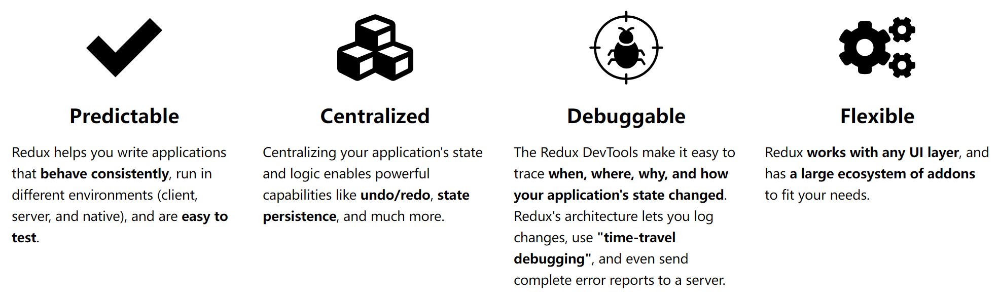

# [0047. redux 是什么](https://github.com/Tdahuyou/react/tree/main/0047.%20redux%20%E6%98%AF%E4%BB%80%E4%B9%88)

<!-- region:toc -->
- [1. 🔗 redux 官方文档和 github 仓库](#1--redux-官方文档和-github-仓库)
- [2. 🔗 redux 作者 - Dan Abramov、Andrew Clark](#2--redux-作者---dan-abramovandrew-clark)
- [3. 📒 redux 概述](#3--redux-概述)
- [4. 📒 官方对 redux 的介绍](#4--官方对-redux-的介绍)
- [5. 📒 redux 核心概念](#5--redux-核心概念)
- [6. 🤔 为什么 Reducer 必须是纯函数（Pure Functions）？](#6--为什么-reducer-必须是纯函数pure-functions)
- [7. 🤔 Action 创建函数（Action Creators）是什么？](#7--action-创建函数action-creators是什么)
- [8. 📒 redux 常用工具及生态系统](#8--redux-常用工具及生态系统)
<!-- endregion:toc -->

## 1. 🔗 redux 官方文档和 github 仓库

- https://redux.js.org/
- https://github.com/reduxjs/redux

## 2. 🔗 redux 作者 - Dan Abramov、Andrew Clark

- Redux 是由 Dan Abramov 与 Andrew Clark 于 2015 年创建的。
- Dan Abramov
  - https://github.com/gaearon
  - 
- Andrew Clark
  - https://github.com/acdlite
  - 

## 3. 📒 redux 概述

- Redux 是一个用于 **应用程序状态管理** 的开源 JavaScript 库，尤其适用于单页应用程序（SPA）。
- Redux 经常与 React 搭配运用，但其也 **可以独立使用**。
- Redux 是由 Facebook 的 **Flux** 演变而来的，并受到了函数式编程语言 Elm 的启发。
- **Redux 的主要目的是提供一个可预测的状态容器，使得应用的状态管理和调试变得更加容易。**
- **React 中的 redux 类似于 vue 中的 vuex、pinia，是 React 生态中的一个重要组成部分。**

## 4. 📒 官方对 redux 的介绍

- 
- https://redux.js.org/introduction/getting-started
- 其中前 3 句比较重要，介绍了 redux 是什么，以及 redux 的核心特点，后 3 句主要是推荐我们去用 TRK。
- 1️⃣ Redux is a JS library for predictable and maintainable global state management.
  - Redux 是一个用于可预测和可维护的全局状态管理的 JavaScript 库。
  - 可预测和可维护：调试阶段若发现某个状态变化异常，debug 起来就会很方便，因为状态变化是通过 actions 来派发的，可以借助 [redux-devtools-extension](https://chromewebstore.google.com/detail/redux-devtools/lmhkpmbekcpmknklioeibfkpmmfibljd) 来查看状态变化，从而快速定位问题。
  - 全局：我们可以将整个应用程序的所用状态合并到一颗状态树中统一管理。
- 2️⃣ It helps you write applications that behave consistently, run in different environments (client, server, and native), and are easy to test. On top of that, it provides a great developer experience, such as live code editing combined with a time traveling debugger.
  - 它帮助你编写行为一致的应用程序，可以在不同环境中运行（客户端、服务器和原生应用），并且易于测试。除此之外，它还提供了出色的开发者体验，例如实时代码编辑和带有时间旅行调试功能的调试器。
  - **🤔 时间旅行是什么？**
    - 时间旅行并非时间能回退，代码能够倒着执行，准确一点儿的说法应该是“重放”。在程序执行的过程中，当你想要切换到之前的某个时间点的状态的时候，实际上是把代码重头执行了一遍，派发这段时间内的 actions，将程序的状态跳转到你想要的时间点。
    - 通过记录每次状态变化的“快照”，并将这些快照存储在一个历史记录中。当需要回溯时，可以从历史记录中恢复某个特定的状态。在 Redux 中，通过中间件（如 Redux DevTools）捕获每次 dispatch 的 Action 和对应的状态变化，从而实现状态的回放和重置。
    - **时间旅行实现的核心原理：**
      - 状态的变化是由派发 actions 实现的，而 actions 是有序的，我们可以在历史记录（记录了 actions 的列表）中决定要跳到哪一步。
      - Redux 的纯函数特性（Reducer 是纯函数），确保相同输入总是产生相同输出。
- 3️⃣ You can use Redux together with React, or with any other view library. It is tiny (2kB, including dependencies), but has a large ecosystem of addons available.
  - 你可以将 Redux 与 React 或任何其他视图库一起使用。它非常小巧（2kB，包括依赖项），但拥有庞大的插件生态系统。
  - **🤔 Redux 只能在 React 中使用吗？**
    - 不，Redux 是一个通用的状态管理库，可以在任何视图库中使用，比如 Vue、Angular 等前端框架，你也可以不依赖任何框架，直接单独使用 Redux。
    - 由此可见 redux 的定位和边界是很清晰的，它就是用来管理状态的，和具体的框架并没有直接关联，不要误以为 redux 只能在 react 中使用。
- 4️⃣ Redux Toolkit is our official recommended approach for writing Redux logic. It wraps around the Redux core, and contains packages and functions that we think are essential for building a Redux app. Redux Toolkit builds in our suggested best practices, simplifies most Redux tasks, prevents common mistakes, and makes it easier to write Redux applications.
  - Redux Toolkit (RTK) 是我们官方推荐的编写 Redux 逻辑的方法。它包装了 Redux 核心，并包含我们认为构建 Redux 应用程序所必需的包和函数。Redux Toolkit 内置了我们建议的最佳实践，简化了大多数 Redux 任务，防止常见错误，并使编写 Redux 应用程序变得更加容易。
- 5️⃣ RTK includes utilities that help simplify many common use cases, including store setup, creating reducers and writing immutable update logic, and even creating entire "slices" of state at once.
  - RTK 包含了许多实用工具，可以帮助简化许多常见用例，包括商店设置、创建 reducer 和编写不可变更新逻辑，甚至可以一次性创建整个“状态切片”（state slices）。
- 6️⃣ Whether you're a brand new Redux user setting up your first project, or an experienced user who wants to simplify an existing application, Redux Toolkit can help you make your Redux code better.
  - 无论是你作为全新的 Redux 用户设置第一个项目，还是作为有经验的用户希望简化现有的应用程序，Redux Toolkit 都可以帮助你编写更好的 Redux 代码。

---

- 
- https://redux.js.org/
- **可预测 (Predictable)**
  - Redux helps you write applications that behave consistently, run in different environments (client, server, and native), and are easy to test.
  - Redux 帮助你编写行为一致的应用程序，可以在不同的环境中运行（客户端、服务器和原生应用），并且易于测试。
- **集中化 (Centralized)**
  - Centralizing your application's state and logic enables powerful capabilities like undo/redo, state persistence, and much more.
  - 将应用程序的状态和逻辑集中化可以实现强大的功能，如撤销/重做、状态持久化等。
- **可调试 (Debuggable)**
  - The Redux DevTools make it easy to trace when, where, why, and how your application's state changed. Redux's architecture lets you log changes, use "time-travel debugging", and even send complete error reports to a server.
  - Redux DevTools 使你能够轻松追踪应用程序状态变化的时间、地点、原因和方式。Redux 的架构允许你记录更改，使用“时间旅行调试”，甚至将完整的错误报告发送到服务器。
- **灵活 (Flexible)**
  - Redux works with any UI layer, and has a large ecosystem of addons to fit your needs.
  - Redux 可以与任何 UI 层配合使用，并且拥有大量的插件生态系统来满足你的需求。

## 5. 📒 redux 核心概念

- **单一数据源**
  - 整个应用的状态存储在一个单一的对象树中，称为 store。
  - 这使得状态管理变得集中和可预测。
- **State 是只读的**
  - 唯一改变 state 的方法是通过 dispatch 一个 action。
  - 这意味着你不能直接修改 state，必须通过定义好的 action 来触发状态更新。
- **Reducers**
  - 使用 Reducer 纯函数来处理状态，它接收当前的 state 和一个 action，然后返回新的 state。
- **Actions**
  - Actions 是描述发生了什么的对象。
  - 它们是唯一可以发送到 store 的信息。
  - Action 对象通常包含一个 type 字段和一些附加的数据 payload。
  - Action 对象通常由 Action 创建函数（Action Creators）来生成。
- **Store**
  - Store 是保存应用状态的地方。
  - 你可以通过 **createStore** 函数创建一个 store，并传入 reducer 函数和仓库状态的默认值（可选）。
  - Store 提供了几个重要的方法，如 **getState**、**dispatch** 和 **subscribe**。
- **Middleware**
  - Middleware 是在 action 被 dispatch 到 reducer 之前或之后执行的一些函数。
  - 它们可以用来进行日志记录、错误报告、异步操作等。

## 6. 🤔 为什么 Reducer 必须是纯函数（Pure Functions）？

- 这玩意儿如果不是纯函数，redux 的“时间旅行”就没法实现了。
- **🤔 纯函数是什么？**
  - 满足以下俩条件的函数就是纯函数：
  - 1️⃣ 相同的输入总是产生相同的输出。
  - 2️⃣ 并且对外界不会造成影响，比如：
    - 不会改变外界的变量。
    - 不会影响外界的行为，比如操作 localStorage、改变 DOM 或发起网络请求等。
- **🤔 为什么纯函数重要？**
  - 1️⃣ **可预测性**：
  - 因为纯函数的结果只依赖于输入，所以它的行为是完全可预测的。
  - 2️⃣ **易于测试和调试**：
    - 纯函数没有副作用，因此可以独立测试，无需担心外部环境的影响。
  - 3️⃣ **支持缓存（Memoization）**：
    - 因为相同的输入总是产生相同的输出，可以缓存结果以提高性能。
- **示例**
  - Redux 的 Reducer 必须是纯函数，因为它决定了如何根据当前状态和 Action 计算新的状态。
    ```javascript {4,6,8}
    function counterReducer(state = 0, action) {
      switch (action.type) {
        case 'INCREMENT':
          return state + 1 // 不修改 state，而是返回新的值。
        case 'DECREMENT':
          return state - 1
        default:
          return state
      }
    }
    ```

## 7. 🤔 Action 创建函数（Action Creators）是什么？

- action 是一个普通的对象，用于描述发生了什么。
- action 创建函数就是返回普通对象 action 的函数。
- 来看个简单的示例：

  ```jsx {7-24}
  // actions 的类型
  const INCREASE = 'INCREASE'
  const DECREASE = 'DECREASE'
  const SET = 'SET'

  // actions 的创建函数
  function createIncreaseAction() {
    return {
      type: actionTypes.INCREASE,
    }
  }

  function createDecreaseAction() {
    return {
      type: actionTypes.DECREASE,
    }
  }

  function createSetAction(newNumber) {
    return {
      type: actionTypes.SET,
      payload: newNumber,
    }
  }
  ```

## 8. 📒 redux 常用工具及生态系统

- [React-Redux](https://github.com/reduxjs/react-redux)
  - 将 React 组件与 Redux store 连接起来的官方库。
  - 它提供了 Provider 和 connect 等组件/函数，使得在 React 组件中访问和更新 store 更加方便。
  - 理解语义：
    - 这个库名称中的 `-` 符号，表达的语义是“连接”。
    - `react-redux` 表示将 React 与 Redux 连接起来。
- [Redux DevTools](https://chromewebstore.google.com/detail/redux-devtools/lmhkpmbekcpmknklioeibfkpmmfibljd)
  - 浏览器扩展，可以帮助你在开发过程中查看和调试 Redux store 的状态变化。
- [Redux Toolkit](https://redux-toolkit.js.org/introduction/getting-started)
  - 官方推荐的库，简化了 Redux 的配置和使用，提供了诸如 createSlice、configureStore 等 API，减少了样板代码。
- [Thunk](https://github.com/reduxjs/redux-thunk) 和 [Saga](https://github.com/redux-saga/redux-saga)
  - 处理异步操作的中间件，使得处理异步逻辑更加简洁和可测试。


