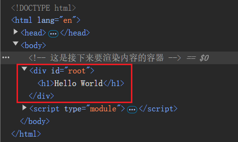

# [0001. 第一个 react v19 程序 - 通过 CDN 引入 react、react-dom 在页面上渲染出 Hello World](https://github.com/Tdahuyou/react/tree/main/0001.%20%E7%AC%AC%E4%B8%80%E4%B8%AA%20react%20v19%20%E7%A8%8B%E5%BA%8F%20-%20%E9%80%9A%E8%BF%87%20CDN%20%E5%BC%95%E5%85%A5%20react%E3%80%81react-dom%20%E5%9C%A8%E9%A1%B5%E9%9D%A2%E4%B8%8A%E6%B8%B2%E6%9F%93%E5%87%BA%20Hello%20World)

<!-- region:toc -->
- [1. 💻 demos.1 - Hello World](#1--demos1---hello-world)
<!-- endregion:toc -->
- 通过 esm 的方式引入 react、react-dom，并使用 ReactDOM.createRoot() 方法将 react 元素渲染到页面上。

## 1. 💻 demos.1 - Hello World

```html
<!DOCTYPE html>
<html lang="en">
  <head>
    <meta charset="UTF-8" />
    <meta name="viewport" content="width=device-width, initial-scale=1.0" />
    <meta http-equiv="X-UA-Compatible" content="ie=edge" />
    <title>Document</title>
  </head>

  <body>
    <!-- 这是接下来要渲染内容的容器 -->
    <div id="root"></div>

    <script type="module">
      // 这是 React 的核心库 react，与宿主环境无关。
      import React from 'https://esm.sh/react@19/?dev'
      // 这是 React 依赖核心库 react-dom，将 react 库的核心功能与网页环境结合起来。
      import ReactDOM from 'https://esm.sh/react-dom@19/client?dev'

      // 创建一个 H1 元素
      const h1 = React.createElement("h1", {}, "Hello World");

      // 将 H1 元素渲染到 root 容器中
      const root = ReactDOM.createRoot(document.getElementById("root"));
      root.render(h1);

      // ❌ 不再兼容的早期写法 - 使用 ReactDOM.render() 方法 // [!code error]
      // ReactDOM.render(h1, document.getElementById("root")); // [!code error]
      // 在目前（2025年1月10日11:14:49）的最新版 react v19 中，render API 已被移除。 // [!code error]
      // 实际上在 v18 中就已经不再支持了。 // [!code error]
      // 在查阅 react 的相关教程时，需要注意 react 的版本，在 v18 版本（含）之后，不要再去用这种旧版的错误写法了。 // [!code error]
    </script>
  </body>
</html>
```

- 最终渲染结果：
  - 
- 经过 react 处理后，最终得到的真实 DOM 结构如下：
  - 
