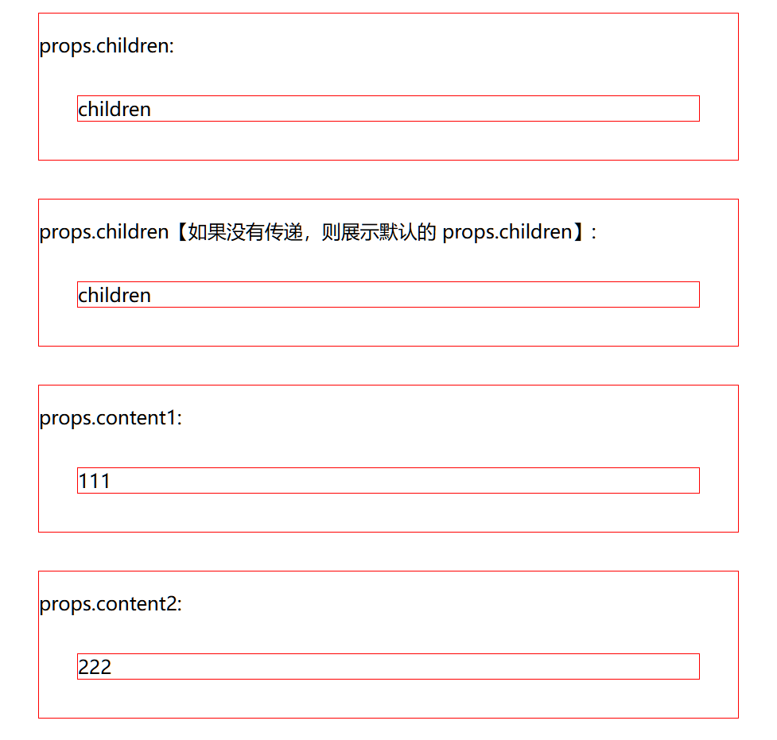
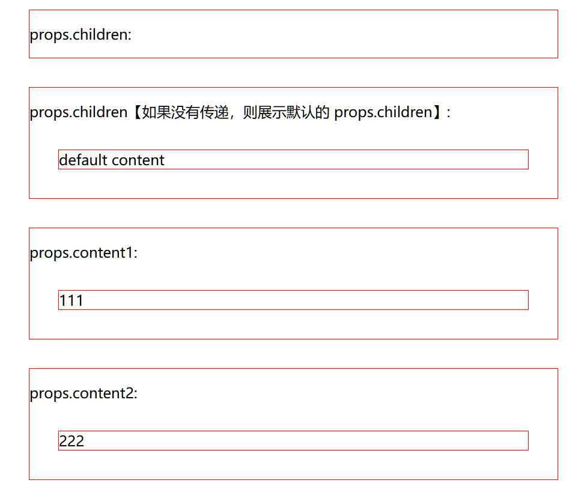

# [0005. 通过 props 和 children 来传递元素内容](https://github.com/Tdahuyou/TNotes.react/tree/main/0005.%20%E9%80%9A%E8%BF%87%20props%20%E5%92%8C%20children%20%E6%9D%A5%E4%BC%A0%E9%80%92%E5%85%83%E7%B4%A0%E5%86%85%E5%AE%B9)

<!-- region:toc -->


- 
- [1. 📒 react 组件中的 props.children 相当于 vue 组件中的 slot 插槽](#1--react-组件中的-propschildren-相当于-vue-组件中的-slot-插槽)
- [2. 📒 传递元素内容](#2--传递元素内容)
- [3. 💻 demos.1 - 传递元素内容的简单示例](#3--demos1---传递元素内容的简单示例)
<!-- endregion:toc -->
- 在 React 中，可以通过 `props.children` 传递默认插槽内容，类似于 Vue 中的默认插槽；也可以通过 `props.propName` 属性传递具名插槽内容，其中 `propName` 是我们自定义的属性名，类似于 Vue 中的具名插槽。
  - `props.children` 可以接收任何可渲染的 React 元素，并且可以通过检查其是否存在来提供默认内容。
  - 除了 `children`，还可以使用其他 `props`（如 `content1` 和 `content2`）来传递特定的内容，并为这些 `props` 定义默认值。

## 1. 📒 react 组件中的 props.children 相当于 vue 组件中的 slot 插槽

- react 组件中的 props.children - 相当于 vue 中的默认插槽
- react 组件中的 props.xxx - 相当于 vue 中的具名插槽

## 2. 📒 传递元素内容

- 这里所说的元素内容，指的是 react 中的元素，也就是通过 React.createElement 创建的元素。
- 使用 jsx 语法糖编写的 html 模板，其实也是通过 React.createElement 创建的元素。
- 我们可以使用类似于 vue 中的默认插槽的写法来传递元素内容。

```jsx
<Comp>
    {/* 这么写，意味着会将其作为 props.children 传递给 Comp 组件 */}
    <h2>test</h2>
</Comp>
// 在 Comp 组件内部，可以通过 props.children 获取到父组件在调用 Comp 时传递的内容 <h2>test</h2>。
```

- 也可以将元素内容作为组件的 props 传递给组件。

```jsx
<Comp content1={<h2>test1</h2>} content2={<h2>test2</h2>} />
// 在 Comp 组件中，可以通过 props.content1 和 props.content2 获取到父组件在调用 Comp 时传递的内容 <h2>test1</h2> 和 <h2>test2</h2>
```

## 3. 💻 demos.1 - 传递元素内容的简单示例

```jsx
import { StrictMode } from 'react'
import { createRoot } from 'react-dom/client'
import PropTypes from 'prop-types';

import './Comp.css';

function Comp(props) {
  console.log(props);
  return (
    <div className='comp'>
      {/*
        props.children 是父组件传递过来的 react 元素内容
        类似于 vue 中的默认插槽
      */}
      <div>
        <p>props.children:</p>
        {props.children}
      </div>
      {/*
        由于传递过来的 react 元素内容，本质上是一个对象类型。
        我们可以通过检查 props.children 是否有值来判断是否传递了内容。
        如果父组件没有传递内容的话，我们可以自定义默认的内容。

        下面这种写法，相当于给 props.children 赋值一个默认值 <div>default content</div>
      */}
      <div>
        <p>props.children【如果没有传递，则展示默认的 props.children】: </p>
        {props.children || <div>default content</div>}
      </div>
      {/*
        传递元素内容，本质上其实就是传递 React.createElement() 的返回值。
        React.createElement() 返回的是一个 JS 对象。

        元素内容（对象）的传递是非常灵活的
        不仅仅可以通过 props.children 来接收传递过来的内容，还可以通过 props.xxx 属性来接收传递过来的内容。
      */}
      <div>
        <p>props.content1:</p>
        {props.content1}
      </div>
      <div>
        <p>props.content2:</p>
        {props.content2}
      </div>
    </div>
  );
}

// 定义 propTypes
Comp.propTypes = {
  children: PropTypes.node, // PropTypes.node 表示可以是任何可以渲染的内容
  content1: PropTypes.node,
  content2: PropTypes.node,
};

// 定义 defaultProps
Comp.defaultProps = {
  content1: <div>111</div>,
  content2: <div>222</div>,
};

function App() {
  return (
    <>
      {/* 这么写，意味着会将其作为 props.children 传递给 Comp 组件 */}
      <Comp>
        <div>children</div>
      </Comp>

      {/* 使用指定的属性名（比如 content1、content2）来传递 */}
      {/* <Comp content1={<div>c1</div>} content2={<div>c2</div>}></Comp> */}


      {/* 使用默认值 */}
      {/* <Comp /> */}
    </>
  );
}

createRoot(document.getElementById('root')).render(
  <StrictMode>
    <App />
  </StrictMode>,
)
```

```jsx
<Comp>
  <div>children</div>
</Comp>
```

- 

```jsx
<Comp content1={<div>c1</div>} content2={<div>c2</div>}></Comp>
```

- 

```jsx
<Comp />
```

- 
