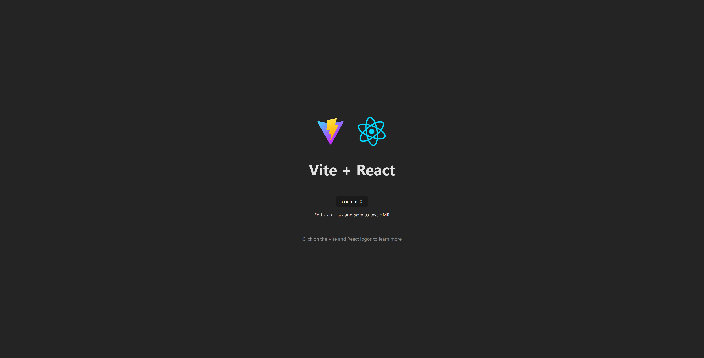

# [0008. npm create vite 使用 vite 快速初始化一个 react 工程](https://github.com/Tdahuyou/TNotes.react/tree/main/0008.%20npm%20create%20vite%20%E4%BD%BF%E7%94%A8%20vite%20%E5%BF%AB%E9%80%9F%E5%88%9D%E5%A7%8B%E5%8C%96%E4%B8%80%E4%B8%AA%20react%20%E5%B7%A5%E7%A8%8B)

<!-- region:toc -->
- [1. 🔍 查阅 vite 官网，了解 npm create vite 相关详情](#1--查阅-vite-官网了解-npm-create-vite-相关详情)
- [2. 📒 使用 pnpm 的实际操作流程](#2--使用-pnpm-的实际操作流程)
- [3. 💻 demos.1 - 使用 vite 创建 react 工程并启动](#3--demos1---使用-vite-创建-react-工程并启动)
<!-- endregion:toc -->
- `npm create vite@latest my-react-app -- --template react` 这是 vite 官方提供的命令，用于创建一个 react 项目。
  - 如果不清楚这条命令的含义，可以参考一下本节中记录的 AI 对此的解释。
- 上面这条命令太长了，不好记，其实只需要记住：`npm create vite` 即可，其他项目参数（比如项目名称、模板等）根据命令提示自行配置。

## 1. 🔍 查阅 vite 官网，了解 npm create vite 相关详情

- https://vitejs.dev/guide/
  - vite 官方文档
- https://github.com/vitejs/vite
  - vite github

## 2. 📒 使用 pnpm 的实际操作流程

1. pnpm create vite
2. 输入项目名称，比如 demo
3. 选择模板，比如 React
4. cd demo
5. pnpm i
6. pnpm run dev

其中，1+2+3 也可以用一个命令来完成，就是 `pnpm create vite@latest my-react-app --template react`。

如果记不住的话，直接运行命令 `pnpm create vite` 然后根据命令行提示来配置即可。

## 3. 💻 demos.1 - 使用 vite 创建 react 工程并启动

```bash
$ pnpm create vite my-react-app --template react
# 也可以使用其他的包管理器来初始化项目
$ npm create vite@latest my-react-app --template react
$ yarn create vite my-react-app --template react
$ bun create vite my-react-app --template react
```

- 实际上拉取的是 https://github.com/vitejs/vite/tree/main/packages/create-vite/template-react 这个位置的模板。
  - 
- 启动用 vite 创建的 react 工程：

```bash
# Done. Now run:
$ cd my-react-app
$ pnpm install
$ pnpm run dev
```

- 成功启动后，使用浏览器打开链接，将看到如下默认页面。
  - 
