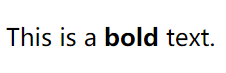
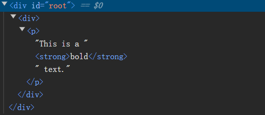
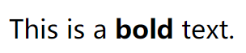

# [0016. dangerouslySetInnerHTML](https://github.com/Tdahuyou/TNotes.react/tree/main/0016.%20dangerouslySetInnerHTML)

<!-- region:toc -->


- 
- [1. 📒 dangerouslySetInnerHTML 简介](#1--dangerouslysetinnerhtml-简介)
- [2. 💻 demos.1 - dangerouslySetInnerHTML 的基本使用](#2--demos1---dangerouslysetinnerhtml-的基本使用)
- [3. 📒 DOMPurify 简介](#3--dompurify-简介)
- [4. 💻 demos.2 - 使用 DOMPurify 净化 html 字符串](#4--demos2---使用-dompurify-净化-html-字符串)
<!-- endregion:toc -->
- 在 JSX 中，使用 dangerouslySetInnerHTML 可以在组件中直接插入 html 标签。
- 可以使用 DOMPurify 库对插入的 html 字符串进行清理和转义，以防止 XSS 攻击。

## 1. 📒 dangerouslySetInnerHTML 简介

- `dangerouslySetInnerHTML` 是 React 中的一个特殊属性，它允许你直接设置一个元素的 `innerHTML`。
- `dangerouslySetInnerHTML` 的值是一个对象，该对象有一个 `__html` 属性，其值是要插入的 HTML 字符串。
- **防止注入攻击**
  - `dangerouslySetInnerHTML` 这个属性的名字中的“危险”一词强调了使用这个属性时需要特别小心，因为它可能会导致跨站脚本（XSS）攻击等安全问题。
  - React 默认情况下会将注入的字符串（可能来自用户输入的内容）作为纯文本处理，而不是解析为 HTML。（即便这个字符串应该是可以成功解析为真实 DOM 的，比如 `<strong>bold</strong>`。）
  - dangerouslySetInnerHTML 将 html 字符串视作真实 DOM 来处理。
- **🤔 什么时候需要用到 `dangerouslySetInnerHTML`？**
  - 在某些情况下，你可能需要将一段 HTML 字符串插入到你的 React 组件中。例如：
    - 从富文本编辑器接收的内容。
    - 从服务器获取的包含 HTML 标签的数据。
    - 动态生成的 HTML 内容。
  - 因此，当你需要插入 HTML 内容（而非被编码后的普通字符串）时，就需要使用 `dangerouslySetInnerHTML`。
- **安全注意事项**
  1. **XSS 攻击**：如果插入的 HTML 内容来自用户输入或不可信来源，可能会包含恶意脚本，导致 XSS 攻击。因此，在使用 `dangerouslySetInnerHTML` 时，必须确保内容是安全的。
  2. **内容转义**：如果你不确定内容是否安全，可以先对内容进行转义处理。可以使用一些库如 `DOMPurify` 来清理和转义潜在的恶意代码。
  3. **避免滥用**：尽量减少 `dangerouslySetInnerHTML` 的使用，只在确实需要的时候使用。大多数情况下，通过 JSX 和 React 组件来构建 UI 是更安全和推荐的方式。
- **总结**
  - `dangerouslySetInnerHTML` 是一个强大的工具，但在使用时必须非常谨慎。始终确保插入的内容是安全的，并尽可能使用专门的库来处理潜在的恶意代码。通过这种方式，你可以充分利用 `dangerouslySetInnerHTML` 的功能，同时保持应用的安全性。

## 2. 💻 demos.1 - dangerouslySetInnerHTML 的基本使用

```jsx
import { StrictMode } from 'react'
import { createRoot } from 'react-dom/client'

const htmlContent = '<p>This is a <strong>bold</strong> text.</p>'

createRoot(document.getElementById('root')).render(
  <StrictMode>
    <div>{htmlContent}</div>
  </StrictMode>
)
```

- 最终渲染结果：
  - 
- 这种写法最终生成的真实 DOM 结构如下：
  - 
  - 此时 htmlContent 会被视作普通的 html 字符串（普通文本），而不是作为 HTML 内容（真实 DOM）被解析。

```jsx
import { StrictMode } from 'react'
import { createRoot } from 'react-dom/client'

const htmlContent = '<p>This is a <strong>bold</strong> text.</p>'

createRoot(document.getElementById('root')).render(
  <StrictMode>
    <div dangerouslySetInnerHTML={{ __html: htmlContent }} />
  </StrictMode>
)
```

- 最终渲染结果：
  - 
- 这种写法最终生成的真实 DOM 结构如下：
  - 

## 3. 📒 DOMPurify 简介

- https://www.npmjs.com/package/dompurify
  - npm
- https://github.com/cure53/DOMPurify
  - github
- DOMPurify 是一个用于防止 XSS (跨站脚本攻击) 的 JavaScript 库。
- 它通过清理不安全的 HTML 内容，确保只有安全的 HTML 元素和属性被保留，从而防止潜在的恶意脚本执行。
- **特点：**
  - 速度很快
  - 可自行配置清理规则

## 4. 💻 demos.2 - 使用 DOMPurify 净化 html 字符串

```jsx
import React from 'react';
import DOMPurify from 'dompurify';

// 创建一个净化函数
const purify = (dirty) => DOMPurify.sanitize(dirty, { USE_PROFILES: { html: true } }); // 使用默认的 HTML 清理配置

function MyComponent() {
  const unsafeHtmlContent = '<p>This is a <strong>bold</strong> text. <script>alert("XSS attack!");</script></p>';
  const safeHtmlContent = purify(unsafeHtmlContent);

  return (
    <div dangerouslySetInnerHTML={{ __html: safeHtmlContent }} />
  );
}

export default MyComponent;
```

- `unsafeHtmlContent` 包含了一个带有恶意脚本的 HTML 字符串。
- 使用 `purify` 函数对 `unsafeHtmlContent` 进行净化，得到 `safeHtmlContent`。
- 使用 `dangerouslySetInnerHTML` 将净化后的内容插入到 `<div>` 中。
- 最终运行结果：
  - 
  - 
  - 
  - 恶意脚本 `<script>alert("XSS attack!");</script>` 被 `DOMPurify` 移除了，从而防止了 XSS 攻击。
