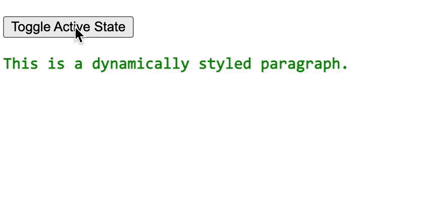

## 1. 评价

- 本文介绍了在 JSX 中书写内联样式 style 的一些注意事项。

## 2. 如何在 JSX 中书写内联样式 style？

- 在 React 中使用 JSX 时，你可以通过 `style` 属性来直接应用内联样式到你的组件。
- 与 HTML 不同的是，在 JSX 中 `style` 属性需要一个 JavaScript 对象而不是 CSS 字符串。

```jsx
// ❌ 在 react 中，下面这种写法是错误的。
<div style="color: red">Hello, World!</div>

// ✅ 正确写法
<div style={{ color: 'red' }}>Hello, World!</div>
```

- 这个对象的键通常采用驼峰命名法（camelCase），因为它们是作为 JavaScript 对象的属性。
- 虽然采用 `-` 连接符（kebab-case）的属性名再包裹一层引号也是可以正常识别的，不过 react 会对此抛出警告。

```jsx
// ⚠️ 警告写法
<div style={{ "background-color": "red" }}>Hello, World!</div>

// ✅ 正确写法
<div style={{ backgroundColor: 'red' }}>Hello, World!</div>
```

---

- 条件渲染：
- 如果你想要根据某些条件动态地改变样式，你可以在定义样式对象时使用表达式来控制样式的值。
- 见 `demos.3`

---

- 注意：
- 虽然内联样式非常方便，但大量使用可能会导致代码难以维护。
- 对于更复杂的样式需求，推荐使用 CSS 类或 CSS-in-JS 库（如 styled-components 或 emotion）来实现。

## 3. demos.1 - ❌ 错误写法 - 在 JSX 中的 style 写成字符串形式

```jsx [1.jsx]
import { StrictMode } from 'react'
import { createRoot } from 'react-dom/client'

createRoot(document.getElementById('root')).render(
  <StrictMode>
    <div style="color: red">Hello, World!</div>
    {/* JSX 中的 style 不能写成普通的字符串形式，否则会报错： */}
    {/* Uncaught Error: The `style` prop expects a mapping from */}
    {/* style properties to values, not a string. For example, */}
    {/* style={{marginRight: spacing + 'em'}} when using JSX. */}
  </StrictMode>
)
```

- 直接将 JSX 中的 style 写成字符串形式插入会报错。

::: swiper


:::

## 4. demos.2 - ✅ 正确写法 - 采用对象的形式来写，属性名使用小驼峰的形式

```jsx [1.jsx]
import { StrictMode } from 'react'
import { createRoot } from 'react-dom/client'
const myStyle = {
  color: 'blue',

  fontSize: '20px', // [!code highlight]
  // 注意：这里使用的是驼峰命名法，对应于 CSS 中的 font-size
  // 如果要写为 font-size，需要加上引号，否则将被视作非法的 key 值，这会导致语法错误。
  // 'font-size': '20px',
  // 这种写法虽然可以正常生效，但是会报警告 Warning: Unsupported style property font-size. Did you mean fontSize?
  // 在 React 中，驼峰命名法是官方推荐的写法。
  // 因此，在 JSX 中书写内联样式 style 时，应该使用驼峰命名法，而不是使用 CSS 的原始写法。

  backgroundColor: '#eee', // [!code highlight]
  padding: '10px',
  border: '1px solid #000',
}

createRoot(document.getElementById('root')).render(
  <StrictMode>
    <div style={myStyle}>Hello, World!</div>
  </StrictMode>
)
```

::: swiper


:::

## 5. demos.3 - 动态样式

```jsx [1.jsx]
import { StrictMode, useState } from 'react'
import { createRoot } from 'react-dom/client'

function MyDynamicComponent({ isActive }) {
  const dynamicStyle = {
    color: isActive ? 'green' : 'red',
    fontWeight: isActive ? 'bold' : 'normal',
  }

  return <p style={dynamicStyle}>This is a dynamically styled paragraph.</p>
}

function App() {
  const [isActive, setIsActive] = useState(true)
  return (
    <>
      <p>
        <button onClick={() => setIsActive(!isActive)}>
          Toggle Active State
        </button>
      </p>
      <MyDynamicComponent isActive={isActive} />
    </>
  )
}

createRoot(document.getElementById('root')).render(
  <StrictMode>
    <App />
  </StrictMode>
)
```

::: swiper



:::

- 注解：
- MyDynamicComponent 组件根据传入的 isActive 属性动态设置样式，当 isActive 为 true 时文字显示为绿色粗体，否则为红色正常字体
- App 组件使用 useState 管理 isActive 状态，并提供按钮来切换状态值
- 点击 "Toggle Active State" 按钮会切换 isActive 的值，从而触发 MyDynamicComponent 组件的样式更新
- 通过这种方式展示了如何根据组件状态动态改变内联样式，实现交互式的 UI 效果

---

- 提示：
- 这部分涉及到组件状态相关的知识点。
- 若还不清楚什么是组件状态，可以等学完组件相关的知识点之后再瞅瞅看。
