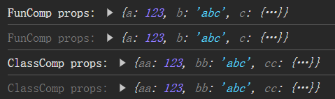

# [0019. 组件属性的传递和接收](https://github.com/Tdahuyou/TNotes.react/tree/main/notes/0019.%20%E7%BB%84%E4%BB%B6%E5%B1%9E%E6%80%A7%E7%9A%84%E4%BC%A0%E9%80%92%E5%92%8C%E6%8E%A5%E6%94%B6)

<!-- region:toc -->

- [1. 📒 props 传递概述](#1--props-传递概述)
- [2. 💻 demos.1 - 组件属性的传递和接收](#2--demos1---组件属性的传递和接收)
- [3. 💻 demos.2 - 不同数据类型的属性传递](#3--demos2---不同数据类型的属性传递)

<!-- endregion:toc -->

## 1. 📒 props 传递概述

- Props 是从父组件传递给子组件的数据。
- 属性是只读的，意味着子组件不能修改接收到的 props。
- 对于函数组件，属性会作为一个对象的属性，传递给函数的参数。
- 对于类组件，属性会作为一个对象的属性，传递给构造函数的参数。

## 2. 💻 demos.1 - 组件属性的传递和接收

```jsx {5,11,19,20}
import { StrictMode, Component } from 'react'
import { createRoot } from 'react-dom/client'

function FuncComp(props) {
  console.log('FunComp props:', props)
  return <div>函数组件</div>
}

class ClassComp extends Component {
  render() {
    console.log('ClassComp props:', this.props)
    return <div>类组件</div>
  }
}

function App() {
  return (
    <>
      <FuncComp a={123} b={'abc'} c={{ foo: 1, bar: 2 }} />
      <ClassComp aa={123} bb={'abc'} cc={{ foo: 1, bar: 2 }} />
    </>
  )
}

createRoot(document.getElementById('root')).render(
  <StrictMode>
    <App />
  </StrictMode>
)
```

- 最终结果：
  - 

## 3. 💻 demos.2 - 不同数据类型的属性传递

::: code-group

```jsx {13,19-24,39-44} [函数组件]
import { StrictMode } from 'react'
import { createRoot } from 'react-dom/client'

// 子组件接收多种类型的属性
function ChildComponent(props) {
  // 【1】在函数组件中，父组件传递过来的属性，会自动注入到函数组件的第一个参数中，可以通过 props 访问这些数据。
  // 【2】注意：单向数据流原则 - 数据属于谁，谁才有权限更改。
  // props.number = 42; // ❌ 这么写是会报错，因为属性 props 是对于 ChildComponent 来说是只读的。
  // 报错：Uncaught TypeError: Cannot assign to read only property 'number' of object '#<Object>' at ChildComponent
  // 注：不要尝试去修改 props 中的任何内容。
  // 如果确实有需要改变 props 的需求，可以考虑重新定义一个变量，将 props 的值拷贝一份到这个变量中，然后修改这个新定义的变量而非直接修改 props。

  const { number, string, boolean, object, jsx, func } = props
  console.log('Received props:', { number, string, boolean, object, jsx, func })

  return (
    <div>
      <h3>Child Component</h3>
      <p>Number: {number}</p>
      <p>String: {string}</p>
      <p>Boolean: {boolean ? 'True' : 'False'}</p>
      <p>Object: {JSON.stringify(object)}</p>
      <p>JSX: {jsx}</p>
      <button onClick={func}>Click Me (Triggers Parent Function)</button>
    </div>
  )
}

// 父组件
function ParentComponent() {
  const handleButtonClick = () => {
    console.log('Button in ChildComponent clicked!')
  }

  return (
    <div>
      <h2>Parent Component</h2>
      <ChildComponent
        number={123}
        string="Hello, world!"
        boolean={true}
        object={{ key: 'value', id: 1 }}
        jsx={<strong>This is JSX content!</strong>}
        func={handleButtonClick}
      />
      {/* 
      【3】属性名通常都会使用小驼峰的形式来命名。
      【4】属性值的类型是非常灵活的，就如同函数的参数一样，可以传递任意类型的数据。
      【5】布尔属性的简写
            如果传递的是布尔类型，并且要传递的值是 true，那么可以只写属性名，而不需要传递值。
            1. <ChildComponent boolean={true} />
            2. <ChildComponent boolean />
            这两种写法是等效的。
      */}
    </div>
  )
}

// 渲染到 DOM
createRoot(document.getElementById('root')).render(
  <StrictMode>
    <ParentComponent />
  </StrictMode>
)
```

```jsx {7,13-18,33-38} [类组件]
import { StrictMode, Component } from 'react'
import { createRoot } from 'react-dom/client'

class ChildComponent extends Component {
  render() {
    // 【1】在类组件中，父组件传递过来的属性，会自动注入到 this.props 中，可以通过 this.props 访问这些数据。
    const { number, string, boolean, object, jsx, func } = this.props
    console.log('Received props:', { number, string, boolean, object, jsx, func })
    
    return (
      <div>
        <h3>Child Component</h3>
        <p>Number: {number}</p>
        <p>String: {string}</p>
        <p>Boolean: {boolean ? 'True' : 'False'}</p>
        <p>Object: {JSON.stringify(object)}</p>
        <p>JSX: {jsx}</p>
        <button onClick={func}>Click Me (Triggers Parent Function)</button>
      </div>
    );
  }
}

function ParentComponent() {
  const handleButtonClick = () => {
    console.log('Button in ChildComponent clicked!')
  }

  return (
    <div>
      <h2>Parent Component</h2>
      <ChildComponent
        number={123}
        string="Hello, world!"
        boolean={true}
        object={{ key: 'value', id: 1 }}
        jsx={<strong>This is JSX content!</strong>}
        func={handleButtonClick}
      />
    </div>
  )
}

// 渲染到 DOM
createRoot(document.getElementById('root')).render(
  <StrictMode>
    <ParentComponent />
  </StrictMode>
)
```

:::

- 
