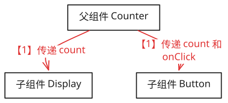
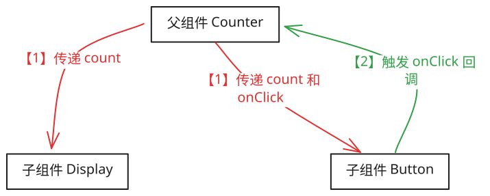
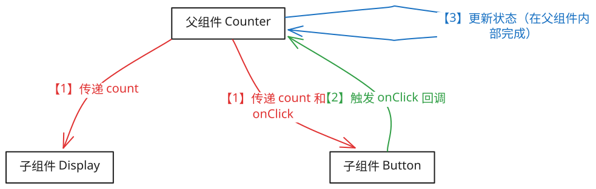
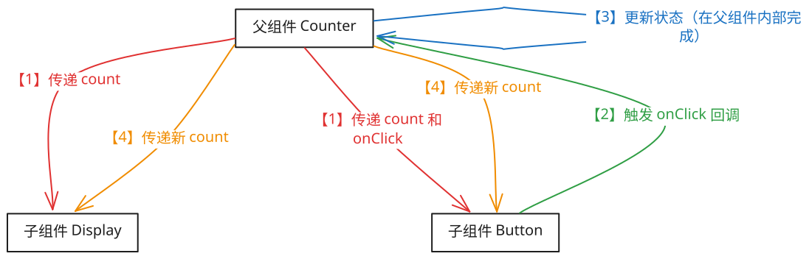

## 1. 本节内容

- 单向数据流

- 需要知道单向数据流是什么，并理解单向数据流这种设计模式的优点。
- 在开发的时候，也要遵循“单向数据流”的原则。

## 2. “单向数据流”是什么？

- 单向数据流是一种在应用程序中管理状态和数据传递的设计模式，特别是在用户界面（UI）框架中。
- 这种模式的核心思想是数据只能沿着一个方向流动：从父组件到子组件。这意味着数据通过属性（props）从顶层组件向下传递到子组件，而不能反向操作。
- 如果需要将数据从子组件传递回父组件，则通常通过回调函数来实现。

## 3. “单向数据流”这种模式都有哪些优点？

| 优点 | 说明 |
| --- | --- |
| 可预测性 | 因为数据只沿一个方向流动，所以更容易追踪数据的变化及其影响，使得应用的行为更加可预测 |
| 易于调试 | 当出现错误时，可以更容易地定位问题，因为你只需要查看数据的流向 |
| 清晰的结构 | 单向数据流鼓励开发人员创建具有明确输入输出的组件，这有助于保持代码的清晰和模块化 |
| 减少副作用 | 限制了数据如何以及何时改变，减少了意外修改状态的可能性 |

## 4. “单向数据流”的核心思想是？

- 数据属于谁，谁才有权修改。
- 比如，某个状态是从父组件传递下来的，那么只有父组件才有权修改该数据，子组件只有读的份儿。

## 5. 使用“单向数据流”的前端框架都有哪些？

- Vue.js、React、……
- 许多现代前端框架和库，如 React 和 Vue.js，都采用了这种设计模式。
- 原因：单向数据流简化了复杂应用的状态管理，提高了代码的可维护性和可测试性。

## 6. React 中的单向数据流都体现在哪些方面？

- 在 React 中，单向数据流主要体现在以下几个方面：
- Props 的传递
  - 父组件可以通过 `props` 向子组件传递数据。
  - 这些数据是只读的，子组件不允许直接修改接收到的 `props`。
- 状态提升
  - 如果两个或多个组件需要共享相同的状态，那么这个状态应该被“提升”到它们共同的最近父组件中。然后，该父组件负责管理状态并通过 `props` 将其传递给子组件。
  - 如果是大量组件都需要访问的状态数据，那么可以考虑将其提升到根组件中，或者将其封装到一个共享的 `context` 中。
- 回调函数
  - 如果子组件需要更新数据或者触发某些行为，它可以通过 `props` 接收来自父组件的回调函数，并在适当的时候调用这些函数来通知父组件。
  - props 是属于父组件传递下来的，子组件虽然没有权直接修改数据，但可以在需要修改数据的时候，通过回调函数或者事件的形式来通知父组件，至于父组件如何处理数据，由父组件内部来确定。

## 7. 单向数据流示例

- 假设有一个计数器应用，其中包含一个按钮和一个显示计数值的标签。在这种情况下，你可能会有以下组件结构：

::: code-group

```jsx [函数组件]
import React, { useState } from 'react'

function Counter() {
  const [count, setCount] = useState(0)

  const incrementCount = () => {
    setCount((prevCount) => prevCount + 1)
  }

  return (
    <div>
      <Display count={count} />
      <Button onClick={incrementCount} count={count}>
        Increment
      </Button>
    </div>
  )
}

// 显示组件 - 接收 count 作为 prop
function Display({ count }) {
  return <p>Count: {count}</p>
}

// 按钮组件 - 接收 onClick 回调 和 count 作为 prop
function Button({ onClick, children, count }) {
  return (
    <div>
      <button onClick={onClick}>{children}</button>
      <p>Current count in Button: {count}</p>
    </div>
  )
}
```

```jsx [类组件]
class Counter extends React.Component {
  constructor(props) {
    super(props)
    this.state = { count: 0 }
    this.incrementCount = this.incrementCount.bind(this)
  }

  incrementCount() {
    this.setState((prevState) => ({
      count: prevState.count + 1,
    }))
  }

  render() {
    return (
      <div>
        <Display count={this.state.count} />
        <Button onClick={this.incrementCount} count={this.state.count}>
          Increment
        </Button>
      </div>
    )
  }
}

// 显示组件 - 接收 count 作为 prop
function Display({ count }) {
  return <p>Count: {count}</p>
}

// 按钮组件 - 接收 onClick 回调 和 count 作为 prop
function Button({ onClick, children, count }) {
  return (
    <div>
      <button onClick={onClick}>{children}</button>
      <p>Current count in Button: {count}</p>
    </div>
  )
}
```

:::

- 【1】数据下行：父组件 → 子组件（通过 props 传递 count）
- 【2】事件上行：子组件 → 父组件（通过回调触发状态更新）
- 【3】状态更新：父组件内部更新状态
- 【4】重新渲染：更新后的状态再次通过 props 流向子组件

::: swiper









:::
