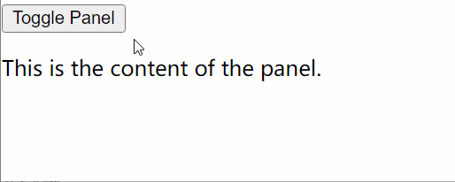

# [0025. 布尔属性](https://github.com/tnotesjs/TNotes.react/tree/main/notes/0025.%20%E5%B8%83%E5%B0%94%E5%B1%9E%E6%80%A7)

<!-- region:toc -->

- [1. 🫧 评价](#1--评价)
- [2. 🤔 「布尔属性」是什么？？](#2--布尔属性是什么)
- [3. 🤔 「布尔属性」有什么特点？](#3--布尔属性有什么特点)
- [4. 🤔 在 HTML 中常见的「布尔属性」都有哪些？](#4--在-html-中常见的布尔属性都有哪些)
- [5. 🤔 自定义的「布尔属性」的命名建议是？](#5--自定义的布尔属性的命名建议是)
- [6. 💻 demos.1 - 布尔属性在 React 中的应用示例](#6--demos1---布尔属性在-react-中的应用示例)
- [7. ⌛️ 布尔属性名称的由来【历史】](#7-️-布尔属性名称的由来历史)
- [8. 🔗 引用](#8--引用)

<!-- endregion:toc -->

## 1. 🫧 评价

- 布尔属性

## 2. 🤔 「布尔属性」是什么？？

- 在 HTML 中，布尔属性（Boolean attributes）是一种特殊的属性类型，它们的存在与否决定了属性的值是 `true` 还是 `false`。
- 如果一个布尔属性被设置在元素上，无论其值是什么，该属性都被视为 `true`。
- 如果该属性不存在，则它的值被视为 `false`。

## 3. 🤔 「布尔属性」有什么特点？

- 不需要指定值：当布尔属性出现在元素上时，它默认为 `true`。
- 忽略属性值：即使你给布尔属性指定了任何值（如 `checked="false"`），浏览器仍然会将其视为 `true`。
- 只有存在或不存在两种状态：布尔属性要么存在并表示 `true`，要么不存在并表示 `false`。

## 4. 🤔 在 HTML 中常见的「布尔属性」都有哪些？

| 布尔属性 | 描述 |
| --- | --- |
| `disabled` | 用于表单控件（如 `<input>` 或 `<button>`），用来禁用控件，使其不可交互。 |
| `readonly` | 用于输入框（如 `<input type="text">` 或 `<textarea>`），防止用户修改内容。 |
| `checked` | 用于复选框（`<input type="checkbox">`）和单选按钮（`<input type="radio">`），表示是否被选中。 |
| `selected` | 用于下拉列表中的选项（`<option>`），表示该项是否被预先选择。 |
| `required` | 用于表单字段（如 `<input>`、`<textarea>` 和 `<select>`），表示该字段必须填写才能提交表单。 |
| `open` | 用于某些元素（如 `
`），表示该元素是否展开显示。 |
| …… | …… |

## 5. 🤔 自定义的「布尔属性」的命名建议是？

- 自定义的布尔属性在命名上，通常会采用 is、has、can…… 等词汇开头
- 表示“是否 xxx？”、“有 xxx？”、“能 xxx？”……
- 表示一个开关状态，两者选其一。

## 6. 💻 demos.1 - 布尔属性在 React 中的应用示例

::: code-group

<<< ./demos/1/assets/1.jsx {11-14} [1. 简写]

<<< ./demos/1/assets/2.jsx {11,17,26,33} [2. 在表单中的使用]

<<< ./demos/1/assets/3.jsx {14} [3. 条件渲染]

:::

- 最终渲染结果：

::: swiper

:::

## 7. ⌛️ 布尔属性名称的由来【历史】

- 布尔属性的名称来源于数学和计算机科学中的布尔逻辑，这是以 19 世纪英国数学家乔治·布尔（George Boole）的名字命名的。布尔逻辑是一种代数系统，用于处理逻辑命题，它只有两个值：真（`true`）和假（`false`）。在编程中，布尔类型（boolean type）就是基于这种逻辑，用来表示二元状态的数据类型。
- 在 HTML 中，布尔属性的存在与否直接反映了这种二元状态。当一个布尔属性出现在元素上时，它的存在即代表了 `true` 的状态；而如果该属性没有出现在元素上，则意味着它的值为 `false`。这样的设计简化了标记语言的语法，并且使得这些属性的语义更加清晰明了。
- 示例
  - `<input type="checkbox" checked>` 中的 `checked` 属性就是一个布尔属性。
  - 它的存在表明这个复选框默认是被选中的，而不需要额外指定 `checked="true"` 或者 `checked="checked"` 这样的值。
  - 同样地，如果去掉了 `checked` 属性，那么复选框就默认为未选中状态。
- 这种设计符合布尔逻辑的基本原则，即一种属性要么具有某种特性（`true`），要么不具有（`false`），没有中间状态。因此，这些属性被称为“布尔属性”。
- 它们在 Web 开发中提供了一种简洁的方式来表达特定的状态或行为，特别是在表单控件和其他交互元素中。

## 8. 🔗 引用

- [wiki - 布尔 (数据类型)][1]

[1]: https://zh.wikipedia.org/wiki/%E5%B8%83%E6%9E%97_(%E8%B3%87%E6%96%99%E9%A1%9E%E5%9E%8B)
