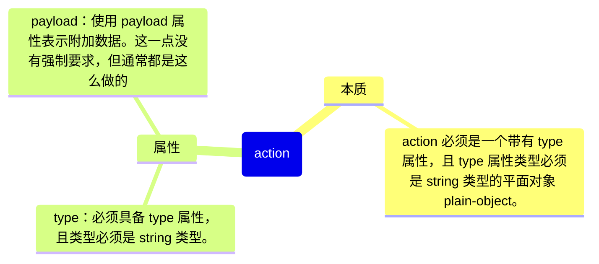

# [0030. redux 中的 action](https://github.com/Tdahuyou/react/tree/main/0030.%20redux%20%E4%B8%AD%E7%9A%84%20action)

<!-- region:toc -->
- [1. 🔗 links](#1--links)
- [2. 💻 脱离 react 单独使用 redux 来管理状态数据](#2--脱离-react-单独使用-redux-来管理状态数据)
- [3. 📒 action 是什么？有什么用？](#3--action-是什么有什么用)
- [4. 📒 redux 部分源码 - 判断 action 是否合法的逻辑](#4--redux-部分源码---判断-action-是否合法的逻辑)
- [5. 💻 action 必须是一个平面对象](#5--action-必须是一个平面对象)
- [6. 💻 action 的 type 属性必须是 string 类型](#6--action-的-type-属性必须是-string-类型)
- [7. 📒 type 的硬编码问题](#7--type-的硬编码问题)
- [8. 📒 action 的创建函数](#8--action-的创建函数)
- [9. 📒 `bindActionCreators`](#9--bindactioncreators)
- [10. 💻 action 的创建函数以及工具方法 `bindActionCreators`](#10--action-的创建函数以及工具方法-bindactioncreators)
- [11. 🤖 如何验证一个对象是否是 plain-object？](#11--如何验证一个对象是否是-plain-object)
- [12. 🤖 为什么 type 必须是 string 类型，符号类型不行](#12--为什么-type-必须是-string-类型符号类型不行)
<!-- endregion:toc -->
- 理解 action 的本质
- 编写 action 时的一些常见写法
- action 的创建函数
- 学会使用 `bindActionCreators` 来简化 action 的分发流程
- 学习 redux 的源码，比如：关于 action 的判断逻辑 `isAction` 的实现、关于 `bindActionCreators` 的实现源码。

## 1. 🔗 links

- https://redux.js.org/api/utils
  - redux 官方文档 - Utility Functions
  - 这部分提到了一个合法的 action 必须是一个平面对象，并且带有一个 string 类型的 type 字段。
- https://github.com/reduxjs/redux
  - 搜索：`src/utils/isPlainObject.ts`
    - redux 仓库中的一个工具方法 isPlainObject 的源码。
    - isPlainObject 是用来判断一个对象是否是一个平面对象的工具方法。
  - 搜索：`src/utils/isAction.ts`
    - redux 仓库中的一个工具方法 isAction 的源码。
    - isAction 是用来判断 action 是否合法的工具方法。
  - 搜索：`src/bindActionCreators.ts`
    - 查看 redux 提供的 API `bindActionCreators` 的实现源码。

## 2. 💻 脱离 react 单独使用 redux 来管理状态数据

```js
/**
 * main.js
 *
 * 这是使用 vite 搭建的一个 Vanilla 原始工程。
 * 没有依赖任何第三方框架，只使用了原生的 JavaScript。
 * 然后通过 pnpm i redux 来了解 redux 的基本使用。
 *
 * redux 和 react 没有直接关联，完全可以脱离 react 单独 redux 来管理状态数据。
 * 从输出结果来看，会发现 redux 依旧是可以正常工作的。
 */
import * as redux from 'redux'

function countReducer(state, action) {
  if (action.type === 'increase') {
    return state + 1
  } else if (action.type === 'decrease') {
    return state - 1
  }
  return state
}

// 存到 window 对象上，以便测试
window.store = redux.createStore(countReducer, 10) // for test

const action = {
  type: 'increase',
}

console.log('打印 window.store.getState() 获取仓库当前状态 =>', window.store.getState())

console.log('执行 window.store.dispatch({ type: "increase" }) => 向仓库分发 action，改变仓库状态。')
window.store.dispatch(action)

console.log('打印 window.store.getState() 获取仓库当前状态 =>', window.store.getState())
```

- 最终输出结果：
  - 
- 通过这个 demo，能够发现 redux 和 react 没有直接关联，完全可以脱离 react 单独 redux 来管理状态数据。
- 本节主要讲解的是 redux 内部的 action 的相关内容，同样的，这里介绍的 action 和 react 也是没有直接关联的。

## 3. 📒 action 是什么？有什么用？

- 从数据类型层面来看，action 就是一个普通的平面对象 plain-object。
  - action 的 `__proto__` 指向 `Object.prototype`。
  - **如果是使用自己定义的类来 new 一个 action 出来，这个 action 是没法使用的。**
- action 是用来 **描述事件** 的
  - 比如 `action.type` 用于记录事件的类型，即，发生了什么事儿。
  - 比如 `action.payload` 用于记录事件发生时携带的一些参数，以便定义在 reducer 中的逻辑来处理事件，改变状态。



## 4. 📒 redux 部分源码 - 判断 action 是否合法的逻辑

```ts
// version: v5.0.1
// from: https://github.com/reduxjs/redux/blob/master/src/utils/isPlainObject.ts
// 工具函数 isPlainObject 的源码
/**
 * @param obj The object to inspect.
 * @returns True if the argument appears to be a plain object.
 */
export default function isPlainObject(obj: any): obj is object {
  if (typeof obj !== 'object' || obj === null) return false

  let proto = obj
  while (Object.getPrototypeOf(proto) !== null) {
    proto = Object.getPrototypeOf(proto)
  }

  return (
    Object.getPrototypeOf(obj) === proto || Object.getPrototypeOf(obj) === null
  )
}
```

```ts
// version: v5.0.1
// from: https://github.com/reduxjs/redux/blob/master/src/utils/isAction.ts
// 工具函数 isAction 的源码
import type { Action } from '../types/actions'
import isPlainObject from './isPlainObject'

export default function isAction(action: unknown): action is Action<string> {
  return (
    isPlainObject(action) &&
    'type' in action &&
    typeof (action as Record<'type', unknown>).type === 'string'
  )
}
```

```js
// redux 判断一个对象是否是有效的 action 对象，一共有 3 个条件。
function isAction(action: unknown): action is Action<string> {
  return (
    isPlainObject(action) && // 1. 必须是一个平面对象
    'type' in action && // 2. 必须带有 type 属性
    typeof (action as Record<'type', unknown>).type === 'string' // 3. type 属性的值必须是字符串类型
  )
}
```

## 5. 💻 action 必须是一个平面对象

```js
import * as redux from 'redux'

function countReducer(state, action) {
  if (action.type === 'increase') {
    return state + 1
  } else if (action.type === 'decrease') {
    return state - 1
  }
  return state
}

// 存到 window 对象上，以便测试
window.store = redux.createStore(countReducer, 10) // for test


// ✅ 正确的 action 创建方式
const action = {
  type: 'increase',
}
console.log(action.__proto__ === Object.prototype) // => true 表示 action 是一个普通的平面对象

// ❌ 错误的 action 创建方式
// class MyAction {
//   constructor(type) {
//     this.type = type
//   }
// }
// const action = new MyAction('increase')
// console.log(action.__proto__ === Object.prototype) // => false
// console.log(action.__proto__ === MyAction.prototype)// => true 表示 action 是一个自定义的类 MyAction 的实例对象，而不是一个普通对象

console.log('打印 window.store.getState() 获取仓库当前状态 =>', window.store.getState())

console.log('执行 window.store.dispatch({ type: "increase" }) => 向仓库分发 action，改变仓库状态。')
window.store.dispatch(action)
// 如果使用错误的方式来创建 action 会抛出以下错误：
// createStore.ts:201 Uncaught Error: Actions must be plain objects. Instead, the actual type was: 'object'.

console.log('打印 window.store.getState() 获取仓库当前状态 =>', window.store.getState())

// 如果使用正确的方式来创建 action，将会打印以下日志：
// 打印 window.store.getState() 获取仓库当前状态 => 10
// 执行 window.store.dispatch({ type: "increase" }) => 向仓库分发 action，改变仓库状态。
// 打印 window.store.getState() 获取仓库当前状态 => 11
```

## 6. 💻 action 的 type 属性必须是 string 类型

```js
import * as redux from 'redux'

const INCREASE = Symbol('INCREASE')
const DECREASE = Symbol('DECREASE')

function countReducer(state, action) {
  if (action.type === INCREASE) {
    return state + 1
  } else if (action.type === DECREASE) {
    return state - 1
  }
  return state
}

const store = redux.createStore(countReducer, 10)

const action = {
  type: INCREASE,
}

store.dispatch(action)
// 报错：
// createStore.ts:207 Uncaught TypeError: Cannot convert a Symbol value to a string
```


## 7. 📒 type 的硬编码问题

- 在大型项目，由于操作类型非常多，为了避免硬编码（hard code），会将 action 的类型存放到一个或一些单独的文件中(样板代码)。
- 举一反三
  - 不仅仅限于 action 的 type 属性，在大型项目中，将类似 type 这样的常量存放到一个或一些单独的文件中，是一种基操，你在很多大型的开源项目中都能看到类似的做法。
  - 你可以去一些开源库中搜一搜类似 constants 这样的关键字，它表示常量的意思，也就是用来存放一些我们写死的值。
  - 在命名上，你可以将 type 的值设置为跟变量名或者 key 名称相同的字符串，统一规范。

```js
// 比如在开源项目 scratch-gui 中，就可以找到类似的模块。
// version: v4.0.41
// from: https://github.com/scratchfoundation/scratch-gui/blob/develop/src/lib/drag-constants.js
export default {
    SOUND: 'SOUND',
    COSTUME: 'COSTUME',
    SPRITE: 'SPRITE',
    CODE: 'CODE',

    BACKPACK_SOUND: 'BACKPACK_SOUND',
    BACKPACK_COSTUME: 'BACKPACK_COSTUME',
    BACKPACK_SPRITE: 'BACKPACK_SPRITE',
    BACKPACK_CODE: 'BACKPACK_CODE'
};
```

## 8. 📒 action 的创建函数

- 为了方便传递 action，通常会使用 action 创建函数（action creator）来创建 action。
- action 的创建函数应为无副作用的 **纯函数**。
- **纯函数**
  - 不能以任何形式改动参数
  - 不可以有异步
  - 不可以对外部环境中的数据造成影响

## 9. 📒 `bindActionCreators`

- 为了方便利用 action 创建函数来分发（触发）action，redux 提供了一个函数 `bindActionCreators`，该函数用于增强 action 创建函数的功能，使它不仅可以创建 action，并且创建后会自动完成分发。

## 10. 💻 action 的创建函数以及工具方法 `bindActionCreators`

```js
/**
 * action/action-type.js
 */
export const INCREASE = "INCREASE"
export const DECREASE = "DECREASE"
export const SET = "SET"
```

```js
/**
 * action/number-action.js
 */
import * as actionTypes from './action-type'

export function createIncreaseAction() {
  return {
    type: actionTypes.INCREASE,
  }
}

export function createDecreaseAction() {
  return {
    type: actionTypes.DECREASE,
  }
}

export function createSetAction(newNumber) {
  return {
    type: actionTypes.SET,
    payload: newNumber,
  }
}
```

```js
/**
 * reducer/index.js
 */
import * as actionTypes from '../action/action-type'

export default (state, action) => {
  if (action.type === actionTypes.INCREASE) {
    return state + 1
  } else if (action.type === actionTypes.DECREASE) {
    return state - 1
  } else if (action.type === actionTypes.SET) {
    return action.payload
  }
  return state
}
```

```js
/**
 * main.js
 *
 * bindActionCreators 作用是将 action 创建函数（action creators）跟 dispatch 方法进行绑定。
 * 目的是为了简化代码，绑定后就可以直接调用返回的对象身上的函数来分发 action 了。
 *
 * bindActionCreators 的参数
 *   第一个参数：是 action 创建函数合并的对象
 *   第二个参数：是仓库的 dispatch 函数
 *
 * bindActionCreators 的返回值：是一个对象，对象中的每个属性名与 action 创建函数名一致，属性值是 action 创建函数经过 bindActionCreators 处理后的函数。
 */
import { createStore, bindActionCreators } from 'redux'
import reducer from './reducer'
import * as numberActions from './action/number-action'


const store = createStore(reducer, 10)

console.log('store.getState() =>', store.getState())

// 得到一个新的对象，新对象中的属性名与第一个参数的属性名一致
const boundActions = bindActionCreators(numberActions, store.dispatch)

// 得到一个 increase action 并直接分发
boundActions.createIncreaseAction() // 向仓库分发 action
// 等效写法：
// store.dispatch(numberActions.createIncreaseAction())

console.log('store.getState() =>', store.getState())

boundActions.createSetAction(3)

console.log('store.getState() =>', store.getState())

/*
最终打印结果：
store.getState() => 10
store.getState() => 11
store.getState() => 3
*/
```

- 可以说 `bindActionCreators` 是用来增强 `action` 创建函数的功能的，使它不仅可以创建 action，并且创建后会自动完成分发。

```js
const boundActions = bindActionCreators(numberActions, store.dispatch)
boundActions.createIncreaseAction()

// 等效写法：
const {
  createIncreaseAction,
  createDecreaseAction,
  createSetAction,
  // ...
} = bindActionCreators({
  createIncreaseAction: numberActions.createIncreaseAction,
  createDecreaseAction: numberActions.createDecreaseAction,
  createSetAction: numberActions.createSetAction,
  // ...
}, store.dispatch)
createIncreaseAction()
```

- 查看 `bindActionCreators` 的实现源码：
  - version: 5.0.1
  - from: https://github.com/reduxjs/redux/blob/master/src/bindActionCreators.ts

```ts
import type { Dispatch } from './types/store'
import type {
  ActionCreator,
  ActionCreatorsMapObject,
  Action
} from './types/actions'
import { kindOf } from './utils/kindOf'

function bindActionCreator<A extends Action>(
  actionCreator: ActionCreator<A>,
  dispatch: Dispatch<A>
) {
  return function (this: any, ...args: any[]) {
    return dispatch(actionCreator.apply(this, args))
  }
}

/**
 * Turns an object whose values are action creators, into an object with the
 * same keys, but with every function wrapped into a `dispatch` call so they
 * may be invoked directly. This is just a convenience method, as you can call
 * `store.dispatch(MyActionCreators.doSomething())` yourself just fine.
 *
 * For convenience, you can also pass an action creator as the first argument,
 * and get a dispatch wrapped function in return.
 *
 * @param actionCreators An object whose values are action
 * creator functions. One handy way to obtain it is to use `import * as`
 * syntax. You may also pass a single function.
 *
 * @param dispatch The `dispatch` function available on your Redux
 * store.
 *
 * @returns The object mimicking the original object, but with
 * every action creator wrapped into the `dispatch` call. If you passed a
 * function as `actionCreators`, the return value will also be a single
 * function.
 */
export default function bindActionCreators<A, C extends ActionCreator<A>>(
  actionCreator: C,
  dispatch: Dispatch
): C

export default function bindActionCreators<
  A extends ActionCreator<any>,
  B extends ActionCreator<any>
>(actionCreator: A, dispatch: Dispatch): B

export default function bindActionCreators<
  A,
  M extends ActionCreatorsMapObject<A>
>(actionCreators: M, dispatch: Dispatch): M
export default function bindActionCreators<
  M extends ActionCreatorsMapObject,
  N extends ActionCreatorsMapObject
>(actionCreators: M, dispatch: Dispatch): N

export default function bindActionCreators(
  actionCreators: ActionCreator<any> | ActionCreatorsMapObject,
  dispatch: Dispatch
) {
  if (typeof actionCreators === 'function') {
    return bindActionCreator(actionCreators, dispatch)
  }

  if (typeof actionCreators !== 'object' || actionCreators === null) {
    throw new Error(
      `bindActionCreators expected an object or a function, but instead received: '${kindOf(
        actionCreators
      )}'. ` +
        `Did you write "import ActionCreators from" instead of "import * as ActionCreators from"?`
    )
  }

  const boundActionCreators: ActionCreatorsMapObject = {}
  for (const key in actionCreators) {
    const actionCreator = actionCreators[key]
    if (typeof actionCreator === 'function') {
      boundActionCreators[key] = bindActionCreator(actionCreator, dispatch)
    }
  }
  return boundActionCreators
}
```

- 以下是去除 ts 类型信息后得到的等效 js

```js
function bindActionCreator(actionCreator, dispatch) {
    return function (...args) {
        return dispatch(actionCreator.apply(this, args));
    };
}

export default function bindActionCreators(actionCreators, dispatch) {
    if (typeof actionCreators === 'function') {
        return bindActionCreator(actionCreators, dispatch);
    }
    if (typeof actionCreators !== 'object' || actionCreators === null) {
        throw new Error(`bindActionCreators expected an object or a function, but instead received: '${kindOf(actionCreators)}'. ` +
            `Did you write "import ActionCreators from" instead of "import * as ActionCreators from"?`);
    }
    const boundActionCreators = {};
    for (const key in actionCreators) {
        const actionCreator = actionCreators[key];
        if (typeof actionCreator === 'function') {
            boundActionCreators[key] = bindActionCreator(actionCreator, dispatch);
        }
    }
    return boundActionCreators;
}
```

- 再去掉一部分类型校验逻辑，就只剩下几行代码了：

```js
function bindActionCreator(actionCreator, dispatch) {
    return function (...args) {
        return dispatch(actionCreator.apply(this, args));
    };
}

function bindActionCreators(actionCreators, dispatch) {
    const boundActionCreators = {};
    for (const key in actionCreators) {
        const actionCreator = actionCreators[key];
        if (typeof actionCreator === 'function') {
            boundActionCreators[key] = bindActionCreator(actionCreator, dispatch);
        }
    }
    return boundActionCreators;
}
```

## 11. 🤖 如何验证一个对象是否是 plain-object？

“plain object”，即通过对象字面量或 `new Object()` 创建的对象，而不是通过构造函数（如 `Array`, `Date`, `Map` 等）创建的实例。一个 plain object 只包含自己的属性，没有额外的方法和原型链上的其他属性。

要验证一个对象是否是 plain object，可以使用以下方法：

1. **检查对象的原型**：确保对象的原型是 `Object.prototype`。
2. **使用 `Object.getPrototypeOf` 或 `Object.prototype.isPrototypeOf` 方法**：这些方法可以帮助我们检查对象的原型链。

以下是一个示例函数 `isPlainObject`，用于验证一个对象是否是 plain object：

```javascript
function isPlainObject(obj) {
    // 检查输入是否为对象且不为 null
    if (typeof obj !== 'object' || obj === null) {
        return false;
    }

    // 获取对象的原型
    const proto = Object.getPrototypeOf(obj);

    // 检查原型是否是 Object.prototype
    return proto === Object.prototype || proto === null;
}

// 测试示例
const plainObj = { a: 1, b: 2, c: 3 };
const arrayObj = [1, 2, 3];
const dateObj = new Date();
const functionObj = function() {};
const nullValue = null;
const undefinedValue = undefined;

console.log(isPlainObject(plainObj));       // 输出: true
console.log(isPlainObject(arrayObj));       // 输出: false
console.log(isPlainObject(dateObj));        // 输出: false
console.log(isPlainObject(functionObj));    // 输出: false
console.log(isPlainObject(nullValue));      // 输出: false
console.log(isPlainObject(undefinedValue)); // 输出: false
```

在这个函数中：

1. 我们首先检查传入的 `obj` 是否是对象并且不是 `null`。
2. 使用 `Object.getPrototypeOf` 获取对象的原型。
3. 检查原型是否是 `Object.prototype` 或 `null`。如果是，则该对象是 plain object。

这种方法可以有效地判断一个对象是否是通过对象字面量或 `new Object()` 创建的 plain object。

如果你需要更严格的检查，还可以使用 `lodash` 库中的 `_.isPlainObject` 函数，它提供了更全面的检查：

```javascript
const _ = require('lodash');

const plainObj = { a: 1, b: 2, c: 3 };
const arrayObj = [1, 2, 3];
const dateObj = new Date();
const functionObj = function() {};

console.log(_.isPlainObject(plainObj));     // 输出: true
console.log(_.isPlainObject(arrayObj));     // 输出: false
console.log(_.isPlainObject(dateObj));      // 输出: false
console.log(_.isPlainObject(functionObj));  // 输出: false
```

`lodash` 的 `_.isPlainObject` 函数会进行更复杂的检查，包括处理一些特殊情况，例如 `arguments` 对象等。如果你已经在项目中使用了 `lodash`，那么直接使用 `_.isPlainObject` 会更加方便和可靠。

## 12. 🤖 为什么 type 必须是 string 类型，符号类型不行

```
isAction
Returns true if the parameter is a valid Redux action object (a plain object with a string type field).

这是 redux 官方对 isAction 工具方法的描述
我想要知道为什么 action 对象的 type 属性不能是符号类型，一定得是 string 类型，符号不是更好吗？
```

在 Redux 中，`type` 属性被定义为一个字符串，这是因为 Redux 的设计者选择了字符串作为 `type` 的标准格式。虽然从技术上讲，使用符号（Symbol）来作为 `type` 也是可行的，并且在某些场景下可能提供更好的类型安全性和避免命名冲突，但是有以下几个原因导致 Redux 默认并推荐使用字符串：

1. **序列化**：字符串可以很容易地被序列化成 JSON 格式，这对于存储状态、日志记录或通过网络传输数据是非常重要的。而符号则不能直接被序列化，这使得它们在网络请求和持久化存储方面不够友好。
2. **可读性**：字符串比符号更直观易懂，特别是在调试时。开发者可以直接看到 action 的类型名称，而不需要去查找符号所对应的描述。
3. **工具支持**：许多围绕 Redux 构建的工具和库都假设 `type` 是一个字符串。例如，Redux DevTools 扩展就是基于这种假设工作的。如果使用了非字符串类型的 `type`，这些工具可能无法正常工作或需要额外配置才能支持。
4. **社区惯例**：Redux 社区已经习惯了使用字符串作为 `type`，并且有大量的示例代码、教程和文档都是基于这个约定。改变这一惯例可能会造成混乱。
5. **跨环境兼容性**：JavaScript 符号是 ES6 引入的一个新特性，并不是所有 JavaScript 环境都支持。尽管现在大部分现代浏览器和 Node.js 版本都已经支持符号，但在一些旧环境中仍然可能存在兼容性问题。
6. **简单性**：字符串足够简单且强大，能够满足大多数应用的需求。对于简单的应用程序来说，没有必要引入符号这样的复杂性。

当然，如果你确实有需求，并且清楚上述限制，你可以在你的 Redux 应用中自定义 action 类型为符号。不过你需要确保所有的中间件、store 配置以及与之交互的其他部分都能正确处理这种情况。此外，你还需要自己实现或者调整相关的工具以适应符号类型的使用。
