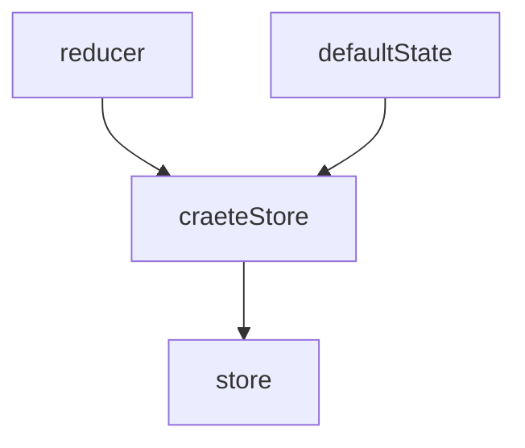
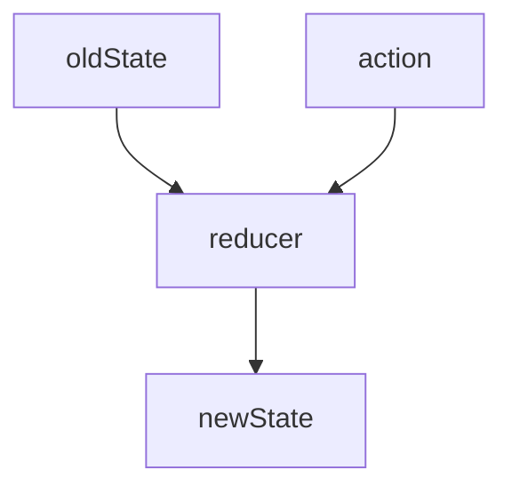
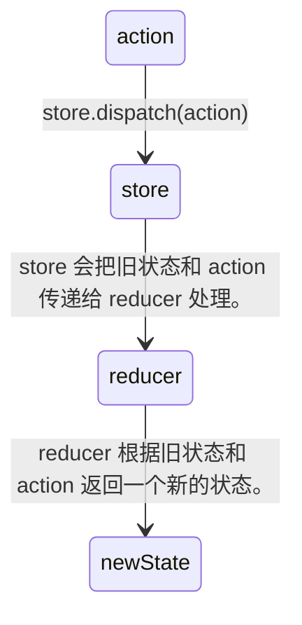

# [0031. 在 redux 中，store、reducer、action 三者之间的关系](https://github.com/Tdahuyou/TNotes.react/tree/main/0031.%20%E5%9C%A8%20redux%20%E4%B8%AD%EF%BC%8Cstore%E3%80%81reducer%E3%80%81action%20%E4%B8%89%E8%80%85%E4%B9%8B%E9%97%B4%E7%9A%84%E5%85%B3%E7%B3%BB)

<!-- region:toc -->

- 
- [1. 📒 store](#1--store)
- [2. 📒 reducer](#2--reducer)
- [3. 📒 action](#3--action)
<!-- endregion:toc -->
- 了解 redux 中的 3 个核心组成部分 store、reducer、action，并清楚它们之间的关系。

## 1. 📒 store

- craeteStore 是用来创建仓库的方法，它接收两个参数 reducer、defaultState，返回一个仓库对象 store。
  - reducer 是封装了一系列处理 action 逻辑的纯函数，它会根据传入的 action 匹配不同的分支来改变仓库状态。
  - defaultState 这是仓库的默认值，该参数是可选的，在创建仓库的时候，可以通过 craeteStore 的第二个仓库来给仓库指定默认值。

## 2. 📒 reducer

- reducer 是用来改变状态的，它需要接收两个参数 oldState、action，返回新的状态。
  - oldState 表示旧的状态值。
  - action 用于描述需要执行什么操作的平面对象 plain-object。

## 3. 📒 action

- action 用于描述需要执行什么操作的平面对象 plain-object。
- 通过分发 action 来改变仓库的状态。
- 分发 action 的写法：store.dispatch(action)

