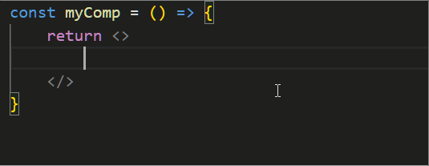

## 1. 本节内容

这一篇笔记主要介绍如何配置 VSCode，让 Emmet 语法支持 JSX。

::: tip 💡 JAX 简介

JSX 是在 React 中用于描述页面结构的 JS 扩展语法。

:::

## 2. 如何在 VSCode 中配置 Emmet 语法支持？

### 2.1. 做法 1：通过设置面板来配置

1. 打开 VSCode 设置
2. 搜索 `emmet.includeLanguages`
3. 加上 `"javascript": "javascriptreact"` 键值对


### 2.2. 做法 2：通过配置文件 `.vscode/settings.json` 来配置

在项目的根目录创建 `.vscode/settings.json` 文件，添加如下内容：

```json
{
  "emmet.includeLanguages": {
    "javascript": "javascriptreact"
  }
}
```

## 3. 实验：在 vscode 中，让 Emmet 语法支持 JSX

实验源码：`demos/1`

效果展示：



测试输入：`div>span`


按下回车，将会快速生成：`<div><span></span></div>`


测试输入：`.foo`

按下回车，将会快速生成：`<div className="foo"></div>`

## 4. 引用

- [Medium - Enable Emmet support for JSX in Visual Studio Code | React][1]
- [stackoverflow - Configure Emmet for JSX in VSCode][2]

[1]: https://eshwaren.medium.com/enable-emmet-support-for-jsx-in-visual-studio-code-react-f1f5dfe8809c
[2]: https://stackoverflow.com/questions/56311467/configure-emmet-for-jsx-in-vscode
