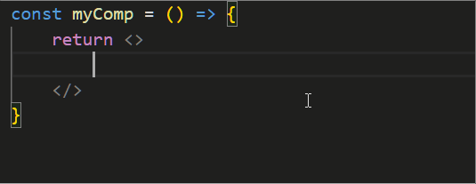
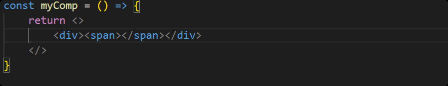

# [0035. 在 vscode 中，让 Emmet 语法支持 JSX](https://github.com/Tdahuyou/TNotes.react/tree/main/0035.%20%E5%9C%A8%20vscode%20%E4%B8%AD%EF%BC%8C%E8%AE%A9%20Emmet%20%E8%AF%AD%E6%B3%95%E6%94%AF%E6%8C%81%20JSX)

<!-- region:toc -->


- 
- [1. 🔗 参考资料](#1--参考资料)
- [2. 📒 具体配置流程](#2--具体配置流程)
  - [2.1. 做法 1：通过设置面板来配置](#21-做法-1通过设置面板来配置)
  - [2.2. 做法 2：通过配置文件 `.vscode/settings.json` 来配置](#22-做法-2通过配置文件-vscodesettingsjson-来配置)
- [3. 💻 demos.1 - 在 vscode 中，让 Emmet 语法支持 JSX](#3--demos1---在-vscode-中让-emmet-语法支持-jsx)
<!-- endregion:toc -->
- 介绍如何配置 VSCode，让 Emmet 语法支持 JSX。
- JSX 是在 React 中用于描述页面结构的 JS 扩展语法。

## 1. 🔗 参考资料

- https://eshwaren.medium.com/enable-emmet-support-for-jsx-in-visual-studio-code-react-f1f5dfe8809c
  - Medium - Enable Emmet support for JSX in Visual Studio Code | React
- https://stackoverflow.com/questions/56311467/configure-emmet-for-jsx-in-vscode
  - Configure Emmet for JSX in VSCode

## 2. 📒 具体配置流程

### 2.1. 做法 1：通过设置面板来配置

1. 打开 VSCode 设置
2. 搜索 `emmet.includeLanguages`
3. 加上 `"javascript": "javascriptreact"` 键值对


### 2.2. 做法 2：通过配置文件 `.vscode/settings.json` 来配置

在项目的根目录创建 `.vscode/settings.json` 文件，添加如下内容：

```json
{
    "emmet.includeLanguages": {
        "javascript": "javascriptreact"
    }
}
```

## 3. 💻 demos.1 - 在 vscode 中，让 Emmet 语法支持 JSX

- 
- 输入：`div>span`
  - 
- 按下回车，将会快速生成：`<div><span></span></div>`
  - 
- 输入：`.foo`
- 按下回车，将会快速生成：`<div className="foo"></div>`
