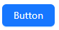

# [0036. 快速搭建一个基于 vite、antd 的 react 项目](https://github.com/tnotesjs/TNotes.react/tree/main/notes/0036.%20%E5%BF%AB%E9%80%9F%E6%90%AD%E5%BB%BA%E4%B8%80%E4%B8%AA%E5%9F%BA%E4%BA%8E%20vite%E3%80%81antd%20%E7%9A%84%20react%20%E9%A1%B9%E7%9B%AE)

<!-- region:toc -->

- [1. antd 官方文档 - 在 vite 中使用 antd](#1-antd-官方文档---在-vite-中使用-antd)
- [2. 使用 pnpm 实现安装和初始化的流程](#2-使用-pnpm-实现安装和初始化的流程)
- [3. demos.1 - 测试按钮组件的使用](#3-demos1---测试按钮组件的使用)

<!-- endregion:toc -->

## 1. antd 官方文档 - 在 vite 中使用 antd

- https://ant-design.antgroup.com/docs/react/use-with-vite-cn

## 2. 使用 pnpm 实现安装和初始化的流程

```bash
# 1. 快速创建一个 vite 项目
$ pnpm create vite
# 创建项目所需的参数，根据命令行提示来配置即可。

# 2. 安装 antd
pnpm install antd --save
```

## 3. demos.1 - 测试按钮组件的使用

- 可根据实际需求，删除掉一些默认的样式或者 icon，比如 `src/App.css`、`src/index.css` 等。
- 修改 `src/App.js`，引入 antd 的按钮组件。

```js
import React from 'react'
import { Button } from 'antd'

const App = () => (
  <div className="App">
    <Button type="primary">Button</Button>
  </div>
)

export default App
```

- 如果你能看到页面上已经有了 antd 的蓝色按钮组件，接下来就可以继续选用其他组件开发应用了。
- 
