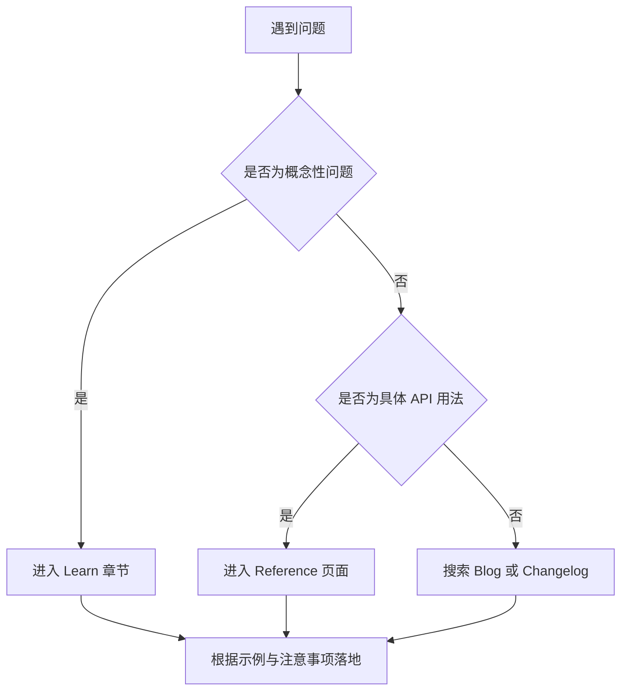

# [0040. React 官方文档](https://github.com/tnotesjs/TNotes.react/tree/main/notes/0040.%20React%20%E5%AE%98%E6%96%B9%E6%96%87%E6%A1%A3)

<!-- region:toc -->

- [1. 🎯 本节内容](#1--本节内容)
- [2. 🫧 评价](#2--评价)
- [3. 🤔 react 官网链接是？](#3--react-官网链接是)
- [4. 🤔 react 官方文档结构是什么样的？](#4--react-官方文档结构是什么样的)
  - [4.1. 区域 1 - `Logo`](#41-区域-1---logo)
  - [4.2. 区域 2 - `React Versions - ChangeLog` 版本更新日志](#42-区域-2---react-versions---changelog-版本更新日志)
  - [4.3. 区域 3 - `Search` 搜索区](#43-区域-3---search-搜索区)
  - [4.4. 区域 4 - `Learn` 教程区](#44-区域-4---learn-教程区)
  - [4.5. 区域 5 - `Reference` 参考区](#45-区域-5---reference-参考区)
  - [4.6. 区域 6 - `Community` React 开发者社区](#46-区域-6---community-react-开发者社区)
  - [4.7. 区域 7 - `Blog` React 博客](#47-区域-7---blog-react-博客)
  - [4.8. 区域 8 - `Theme` 主题切换](#48-区域-8---theme-主题切换)
  - [4.9. 区域 9 - `Language` 语言切换](#49-区域-9---language-语言切换)
  - [4.10. 区域 10 - `GitHub` 仓库链接](#410-区域-10---github-仓库链接)
- [5. 🤔 react.dev 中经常访问栏目有哪些？](#5--reactdev-中经常访问栏目有哪些)
- [6. 🤔 什么是 React 的"心智模型"？](#6--什么是-react-的心智模型)
  - [6.1. 核心理念](#61-核心理念)
  - [6.2. 思维转变示例](#62-思维转变示例)
  - [6.3. 为什么要先建立心智模型](#63-为什么要先建立心智模型)
  - [6.4. 心智模型的实际应用场景](#64-心智模型的实际应用场景)
- [7. 🤔 如果遇到 React 相关问题，应该如何查询官方文档呢？](#7--如果遇到-react-相关问题应该如何查询官方文档呢)
- [8. 🤔 如何选择对应版本的文档与特性？](#8--如何选择对应版本的文档与特性)
- [9. 🤔 如何高效检索 API 与最佳实践？](#9--如何高效检索-api-与最佳实践)
- [10. 🔗 引用](#10--引用)

<!-- endregion:toc -->

## 1. 🎯 本节内容

- React 官方文档结构介绍
- React 官方文档基本使用说明

## 2. 🫧 评价

本节介绍 React 官方文档 `react.dev` 的结构与高效使用方法，帮助在真实项目中更快找到权威答案与可落地示例。

- 熟悉 react 官方文档的大体结构是非常有必要的，在学习 react 的过程中会经常查阅官方文档
- 优先从 `Learn` 理解设计理念，再到 `Reference` 精确定位 API，建立完整知识体系
- 以当前项目的 `react` 版本为基准选择文档与范式，避免示例不兼容导致的问题
- 善用站内检索与固定链接模式快速定位到 `reference` 页面，提高查阅效率
- `react.dev` 已完全替代旧站 `reactjs.org`，所有内容以现代化范式呈现，适合函数组件与 Hooks 学习

## 3. 🤔 react 官网链接是？

https://react.dev/ -> 这是 react 官网链接

::: warning ⚠️ 注意

- https://reactjs.org/ -> 这是 react 旧官网链接
- 现在（25.11）测试的效果是：访问旧站，会自动跳转到新站 https://react.dev/

:::

## 4. 🤔 react 官方文档结构是什么样的？

官网首页截图如下：


### 4.1. 区域 1 - `Logo`

点击 logo 会跳转到 react 首页。

首页提供了 React 的简介信息，包括：

- React 的主要特点
- React 都能用来做什么事儿
- React 有多么受欢迎

### 4.2. 区域 2 - `React Versions - ChangeLog` 版本更新日志

点击 logo 旁边的版本号，可查看 react 的历史版本。

这里边包含了一系列的 react 版本。从 `v0.3.0 (May 2013)` 开始一直到目前的最新版。


用于了解每个版本的变更和新特性。

🤔 什么时候我们可能会查阅这部分内容呢？

当你用到的 react 版本和官方最新版不一致的时候。

比如你在看某人的 react 视频教程或者 react 相关书籍等其他 react 学习资料，但是你发现你所看的 react 资料的版本（比如是 react v18）和当前 `2025 年 1 月 17 日` 官网的最新版（react v19）不一致，那么你可能需要查阅旧版本的文档。在这里边你可以切换到之前的任意版本，确保版本的一致性。

### 4.3. 区域 3 - `Search` 搜索区

也可通过 `cmd/ctrl K` 来快速唤起搜索框，搜索官方文档中的相关内容。

### 4.4. 区域 4 - `Learn` 教程区

这里边包括一系列逐步指导的教程，帮助初学者从零开始构建 React 应用程序。该教程中介绍的内容涵盖了日常开发中会用到的 `80%` 的知识点。 `80%` 不是乱说的，是官方的原话：


实际上在开发 react 项目时，最常用到的知识点确实也就是官方文档提到的这么一些点了。

- How to create and nest components
- How to add markup and styles
- How to display data
- How to render conditions and lists
- How to respond to events and update the screen
- How to share data between components

在上手 react 项目之前，掌握这些要点是必要的。

### 4.5. 区域 5 - `Reference` 参考区

用于查阅的详细的 API 文档。

### 4.6. 区域 6 - `Community` React 开发者社区

提供了一些在线论坛的链接。

在这里边儿可以跟其他开发者交流 react 的相关问题，也可以获取到一些学习资料啥的。

### 4.7. 区域 7 - `Blog` React 博客

官方用于发布一些重要通知。

### 4.8. 区域 8 - `Theme` 主题切换

亮色/暗色

### 4.9. 区域 9 - `Language` 语言切换

英文/中文/……

### 4.10. 区域 10 - `GitHub` 仓库链接

https://github.com/facebook/react/releases

## 5. 🤔 react.dev 中经常访问栏目有哪些？

- `Learn` 学习路径与概念讲解，强调心智模型与最佳实践
- `Reference` API 参考，按包与模块组织，例如 `react`、`react-dom`、`react-dom/client`
- `Blog` 发布版本解读与新能力说明
- `Community` 与生态资源导航
- `Changelog` 与迁移说明，用于版本升级时查阅

## 6. 🤔 什么是 React 的"心智模型"？

心智模型（Mental Model）是指人们对某个系统或概念在头脑中形成的理解框架和思维方式。

在 React 文档的语境中，心智模型指的是用 React 的方式思考 UI 构建，而不是传统的 DOM 操作方式。

### 6.1. 核心理念

- 声明式编程：描述"要什么"，而不是"怎么做"
- 组件化思维：把 UI 拆分成可复用的独立部分
- 数据驱动视图：UI = f(state)，界面是状态的函数
- 单向数据流：数据从父组件流向子组件

### 6.2. 思维转变示例

```tsx
// ❌ 传统思维（命令式）手动操作 DOM
const button = document.getElementById('btn')
button.addEventListener('click', () => {
  const counter = document.getElementById('counter')
  counter.textContent = parseInt(counter.textContent) + 1
})

// ✅ React 心智模型（声明式）描述状态与 UI 的关系
function Counter() {
  const [count, setCount] = useState(0)

  return (
    <div>
      <p>当前计数：{count}</p>
      <button onClick={() => setCount(count + 1)}>增加</button>
    </div>
  )
}
```

### 6.3. 为什么要先建立心智模型

- 避免用传统 jQuery 的思维写 React 代码
- 理解 React 的设计哲学，而不只是记忆 API
- 写出更符合 React 范式的代码
- 更容易理解 Hooks、生命周期等高级概念

React 官方文档的 `Learn` 章节重点培养开发者的心智模型，帮助建立正确的思维方式，这比直接学习 API 更重要。

### 6.4. 心智模型的实际应用场景

在实际开发中，拥有正确的心智模型能帮助你：

- 快速判断某个需求该用状态管理还是派生计算
- 理解何时该提升状态、何时该使用 Context
- 选择合适的数据流方案而不是盲目引入复杂工具
- 通过理解原理来调试问题，而不是靠记忆和猜测

## 7. 🤔 如果遇到 React 相关问题，应该如何查询官方文档呢？

你需要根据你的问题类型来定位，下面是一个简化版的决策流程：



## 8. 🤔 如何选择对应版本的文档与特性？

- 以团队项目实际使用的 `react` 与 `react-dom` 版本为准对齐文档
- 遇到与版本相关的章节，优先查看页面顶部的版本提示与变更说明
- 查阅 `Blog` 与 `Changelog` 了解历史版本变更，确认当前版本支持的特性范围
- 新特性例如编译器与新的 `use` 家族能力，需确认是否已在当前版本可用

注意：

- 在查阅官方文档时，请确保你项目中用到的 `react` 版本与文档版本一致。
- 在未升级到对应版本前，不要直接照搬新特性的示例，否则会出现不可用或行为差异。

## 9. 🤔 如何高效检索 API 与最佳实践？

- 站内搜索框直接输入 API 名称，例如 `useEffect`、`createRoot`
- 熟悉固定链接模式，`/reference/{包名}/{API}`，例如 `/reference/react/useEffect`
- 对于操作类问题搜索参考页面的 `注意事项` 与 `常见问题` 小节，通常包含边界与陷阱
- 配合外部检索使用 `site:react.dev 关键词`，可快速定位到官方页面
  - 这种搜索方式可以精确定位到官方文档，比如输入 `site:react.dev useEffect`
  - 
  - 

## 10. 🔗 引用

- [React 官方文档][1]
- [React 历史版本][2]
- [API 参考入口][3]
- [学习路径 Learn][4]
- [博客 Blog][5]

[1]: https://react.dev/
[2]: https://github.com/facebook/react/releases
[3]: https://react.dev/reference
[4]: https://react.dev/learn
[5]: https://react.dev/blog
