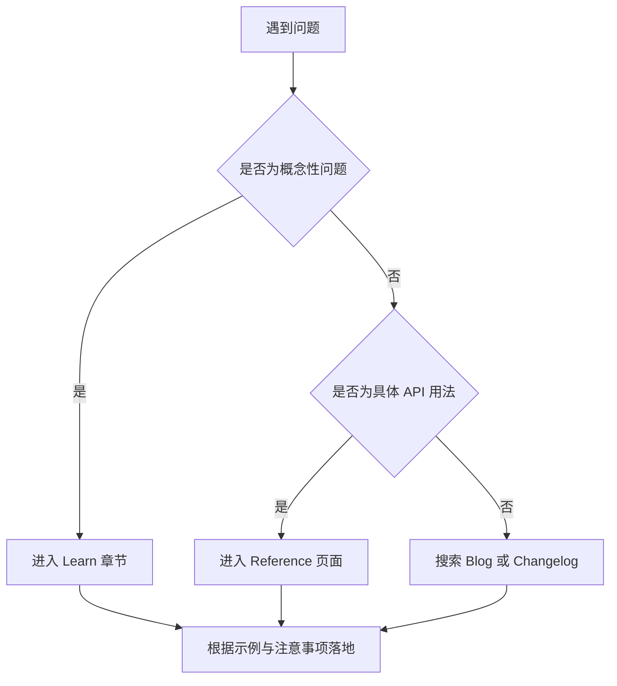

# [0040. React 官方文档](https://github.com/tnotesjs/TNotes.react/tree/main/notes/0040.%20React%20%E5%AE%98%E6%96%B9%E6%96%87%E6%A1%A3)

<!-- region:toc -->

- [1. 本节内容](#1-本节内容)
- [2. react 官网地址是？](#2-react-官网地址是)
- [3. react 官方文档结构是什么样的？](#3-react-官方文档结构是什么样的)
  - [3.1. 区域 1 - `Logo`](#31-区域-1---logo)
  - [3.2. 区域 2 - `React Versions - ChangeLog` 版本更新日志](#32-区域-2---react-versions---changelog-版本更新日志)
    - [什么时候需要查阅这部分内容？](#什么时候需要查阅这部分内容)
  - [3.3. 区域 3 - `Search` 搜索区](#33-区域-3---search-搜索区)
  - [3.4. 区域 4 - `Learn` 教程区（重要）](#34-区域-4---learn-教程区重要)
  - [3.5. 区域 5 - `Reference` 参考区（重要）](#35-区域-5---reference-参考区重要)
  - [3.6. 区域 6 - `Community` React 开发者社区（不重要）](#36-区域-6---community-react-开发者社区不重要)
  - [3.7. 区域 7 - `Blog` React 博客](#37-区域-7---blog-react-博客)
  - [3.8. 区域 8 - `Theme` 主题切换](#38-区域-8---theme-主题切换)
  - [3.9. 区域 9 - `Language` 语言切换](#39-区域-9---language-语言切换)
  - [3.10. 区域 10 - `GitHub` 仓库链接](#310-区域-10---github-仓库链接)
- [4. 官方文档中经常访问栏目有哪些？](#4-官方文档中经常访问栏目有哪些)
- [5. 如果遇到 React 相关问题，应该如何查询官方文档呢？](#5-如果遇到-react-相关问题应该如何查询官方文档呢)
- [6. 如何选对版本？](#6-如何选对版本)
- [7. 如何高效检索 API 与最佳实践？](#7-如何高效检索-api-与最佳实践)
- [8. 引用](#8-引用)

<!-- endregion:toc -->

## 1. 本节内容

- React 官方文档结构介绍
- React 官方文档基本使用说明

本节介绍 React 官方文档 `react.dev` 的结构与高效使用方法，帮助在真实项目中更快找到权威答案与可落地示例。

一些目标及学习上的建议：

- 熟悉 react 官方文档的大体结构是非常有必要的，在学习 react 的过程中会经常查阅官方文档
- 优先从 `Learn` 理解设计理念，再到 `Reference` 精确定位 API，建立完整知识体系
- 以当前项目的 `react` 版本为基准选择文档与范式，避免示例不兼容导致的问题
- 善用站内检索与固定链接模式快速定位到 `Reference` 页面，提高查阅效率

实战中遇到的很多问题，现阶段 `26.08` 来看，大部分都可以直接丢给 AI，让他结合官方文档来回答你的问题，找出关键证据，然后我们再按需去实验验证。

## 2. react 官网地址是？

- 英文原版：https://react.dev/
- 简体中文翻译版：https://zh-hans.react.dev/

## 3. react 官方文档结构是什么样的？

官网首页截图如下：

### 3.1. 区域 1 - `Logo`

点击 logo 会跳转到 react 首页。

首页提供了 React 的简介信息，包括：

- React 的主要特点
- React 都能用来做什么事儿
- React 有多么受欢迎

### 3.2. 区域 2 - `React Versions - ChangeLog` 版本更新日志

点击 logo 旁边的版本号，可查看 react 的历史版本。

这里边包含了一系列的 react 版本。从 `v0.3.0 (May 2013)` 开始一直到目前的最新版。

用于了解每个版本的变更和新特性。

#### 什么时候需要查阅这部分内容？

当你用到的 react 版本和官方最新版不一致的时候。

比如你在看某人的 react 视频教程或者 react 相关书籍等其他 react 学习资料，但是你发现你所看的 react 资料的版本（比如是 react v18）和当前 `25.01.17` 官网的最新版（react v19）不一致，那么你可能需要查阅旧版本的文档。在这里边你可以切换到之前的任意版本，确保版本的一致性。

### 3.3. 区域 3 - `Search` 搜索区

也可通过 `cmd/ctrl K` 来快速唤起搜索框，搜索官方文档中的相关内容。

### 3.4. 区域 4 - `Learn` 教程区（重要）

这里边包括一系列逐步指导的教程，帮助初学者从零开始构建 React 应用程序。该教程中介绍的内容涵盖了日常开发中会用到的 `80%` 的知识点。 `80%` 不是乱说的，是官方的原话：

实际上在开发 react 项目时，最常用到的知识点确实也就是官方文档提到的这么一些点了。

- 如何创建和嵌套组件
- 如何添加标签和样式
- 如何显示数据
- 如何渲染条件和列表
- 如何对事件做出响应并更新界面
- 如何在组件间共享数据

在正式上手 react 项目之前，掌握这些基础知识点是非常有必要的。

### 3.5. 区域 5 - `Reference` 参考区（重要）

用于查阅的详细的 API 文档。

如果你的需求是查询 React API，那么就直接到这里边儿找。

### 3.6. 区域 6 - `Community` React 开发者社区（不重要）

提供了一些在线论坛的链接。

在这里边儿可以跟其他开发者交流 react 的相关问题，也可以获取到一些学习资料啥的。

个人基本不咋看这一部分。

### 3.7. 区域 7 - `Blog` React 博客

官方用于发布一些重要通知。

这是 React 团队更新的官方来源。任何重要的内容，包括发布说明或弃用通知，都会首先在这里发布。

### 3.8. 区域 8 - `Theme` 主题切换

亮色/暗色

### 3.9. 区域 9 - `Language` 语言切换

英文/中文/……

::: tip 💡 TIP

React 官方中文文档是一个独立的仓库：[github - reactjs/zh-hans.react.dev][6]，你可以在这个仓库里边儿获取官方文档的原始内容。

:::

### 3.10. 区域 10 - `GitHub` 仓库链接

https://github.com/facebook/react/releases

## 4. 官方文档中经常访问栏目有哪些？

就个人日常开发来看，经常访问的栏目如下：

- `Learn` 学习路径与概念讲解，强调心智模型与最佳实践
- `Reference` API 参考，按包与模块组织，例如 `react`、`react-dom`、`react-dom/client`
- `Blog` 发布版本解读与新能力说明

## 5. 如果遇到 React 相关问题，应该如何查询官方文档呢？

::: tip 推荐做法

推荐使用 AI 来快速搜索。

直接将官方文档的链接甩过去，结合你的问题，让 AI 依据官方文档找证据。

:::

你需要根据你的问题类型来定位，下面是一个简化版的决策流程：

```mermaid
flowchart TD
  A[遇到问题] --> B{是否为概念性问题}
  B -- 是 --> L[进入 Learn 章节]
  B -- 否 --> C{是否为具体 API 用法}
  C -- 是 --> R[进入 Reference 页面]
  C -- 否 --> D[搜索 Blog 或 Changelog]
  R --> E[根据示例与注意事项落地]
  L --> E
  D --> E
```

## 6. 如何选对版本？

如果手动介入，可以通过以下步骤来搜索：

- 以团队项目实际使用的 `react` 与 `react-dom` 版本为准对齐文档，可以到项目中的包体描述文件 `package.json` 中查看版本信息。
- 遇到与版本相关的章节，优先查看页面顶部的版本提示与变更说明。
- 查阅官方博客 `Blog` 与更新日志 `Changelog` 了解历史版本变更，确认当前版本支持的特性范围。
- 新特性例如编译器与新的 `use` 家族能力，需确认是否已在当前版本可用。

注意：

- 在查阅官方文档时，请确保你项目中用到的 `react` 版本与文档版本一致。
- 在未升级到对应版本前，不要直接照搬新特性的示例，否则会出现不可用或行为差异。

## 7. 如何高效检索 API 与最佳实践？

下面是一些手动搜索的做法：

- 站内搜索框直接输入 API 名称，例如 `useEffect`、`createRoot`
- 熟悉固定链接模式，`/reference/{包名}/{API}`，例如 `/reference/react/useEffect`
- 对于操作类问题搜索参考页面的 `注意事项` 与 `常见问题` 小节，通常包含边界与陷阱
- 配合外部检索使用 `site:react.dev 关键词`，可快速定位到官方页面
  - 这种搜索方式可以精确定位到官方文档，比如输入 `site:react.dev useEffect`
  - 
  - 

## 8. 引用

- [React 官方文档][1]
- [React 历史版本][2]
- [API 参考入口][3]
- [学习路径 Learn][4]
- [博客 Blog][5]
- [github - reactjs/zh-hans.react.dev][6]

[1]: https://react.dev/
[2]: https://github.com/facebook/react/releases
[3]: https://react.dev/reference
[4]: https://react.dev/learn
[5]: https://react.dev/blog
[6]: https://github.com/reactjs/zh-hans.react.dev
