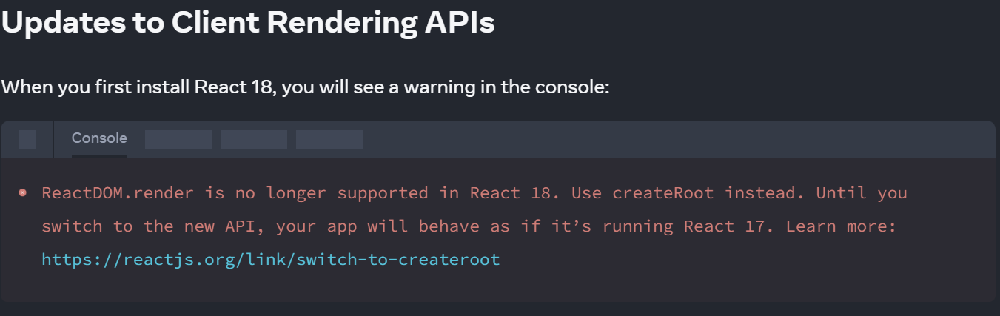

# [0043. ReactDOM.render](https://github.com/Tdahuyou/react/tree/main/0043.%20ReactDOM.render)

<!-- region:toc -->
- [1. ⚠️ 兼容性问题 - 从 v18 开始，不再支持 ReactDOM.render 这个 API](#1-️-兼容性问题---从-v18-开始不再支持-reactdomrender-这个-api)
- [2. 📒 ReactDOM.render 的基本语法](#2--reactdomrender-的基本语法)
- [3. 📒 ReactDOM.render 的作用 - 渲染 react 组件到 DOM 中](#3--reactdomrender-的作用---渲染-react-组件到-dom-中)
- [4. 💻 demos.1 - ReactDOM.render 的基本使用示例](#4--demos1---reactdomrender-的基本使用示例)
- [5. 📒 ReactDOM.render 的替代品：ReactDOM.createRoot](#5--reactdomrender-的替代品reactdomcreateroot)
- [6. 💻 demos.2 - ReactDOM.createRoot 的基本使用示例](#6--demos2---reactdomcreateroot-的基本使用示例)
- [7. 🤔 为什么弃用 ReactDOM.render？](#7--为什么弃用-reactdomrender)
<!-- endregion:toc -->
- **`ReactDOM.render` 是 React 17 及之前版本的核心 API**，用于将 React 元素渲染到 DOM 中。
- **在 React 18 中，它被废弃，推荐使用 `ReactDOM.createRoot`**，以支持更现代化的并发渲染特性。
- 如果你正在使用 React 18 或更高版本，请迁移到新的 API，以利用 React 的性能优化和新特性。

## 1. ⚠️ 兼容性问题 - 从 v18 开始，不再支持 ReactDOM.render 这个 API

- 在 React 17 及以前的版本中，`ReactDOM.render` 是一个常用的 API，但随着 React 18 的推出，`ReactDOM.render` 被替代为 `ReactDOM.createRoot`，并逐渐被废弃。
- 🔍 查看官方文档对此的描述
  - https://react.dev/blog/2022/03/08/react-18-upgrade-guide#updates-to-client-rendering-apis
  - 

```js
// Before v18
import { render } from 'react-dom';
const container = document.getElementById('app');
render(<App tab="home" />, container);

// After v18
import { createRoot } from 'react-dom/client';
const container = document.getElementById('app');
const root = createRoot(container); // createRoot(container!) if you use TypeScript
root.render(<App tab="home" />);
```

## 2. 📒 ReactDOM.render 的基本语法

```javascript
ReactDOM.render(element, container[, callback])
```

- **`element`**：需要渲染的 React 元素，通常是由 `React.createElement` 创建的元素或 JSX。
- **`container`**：渲染的目标 DOM 容器。
- **`callback`** *(可选)*：渲染完成后执行的回调函数。

## 3. 📒 ReactDOM.render 的作用 - 渲染 react 组件到 DOM 中

```javascript
import React from "react";
import ReactDOM from "react-dom";

function App() {
  return <h1>Hello, React!</h1>;
}

ReactDOM.render(<App />, document.getElementById("root"));
// 将 App 组件渲染到 id 为 "root" 的 DOM 容器中。
```

## 4. 💻 demos.1 - ReactDOM.render 的基本使用示例

```html
<!DOCTYPE html>
<html lang="en">

<head>
  <meta charset="UTF-8">
  <meta name="viewport" content="width=device-width, initial-scale=1.0">
  <meta http-equiv="X-UA-Compatible" content="ie=edge">
  <title>Document</title>
</head>

<body>
  <!-- 接下来要渲染内容的容器 -->
  <div id="root"></div>

  <!-- React 的核心库 react，与宿主环境无关。 -->
  <script crossorigin src="https://unpkg.com/react@17/umd/react.development.js"></script>

  <!-- React 依赖核心库 react-dom，将 react 库的核心功能与页面结合，依赖于浏览器环境。 -->
  <script crossorigin src="https://unpkg.com/react-dom@17/umd/react-dom.development.js"></script>

  <script>
    // 创建一个 H1 元素
    const h1 = React.createElement("h1", {}, "Hello World");

    // 将 H1 元素渲染到 root 容器中
    ReactDOM.render(h1, document.getElementById("root"));
  </script>
</body>

</html>
```

- 最终渲染结果如下图所示：
  - 

## 5. 📒 ReactDOM.render 的替代品：ReactDOM.createRoot

- 在 **React 18** 中，`ReactDOM.render` 被标记为过时，取而代之的是新的 **Concurrent Mode** 渲染 API：

```javascript
import React from "react";
import ReactDOM from "react-dom/client";

function App() {
  return <h1>Hello, React 18!</h1>;
}

const root = ReactDOM.createRoot(document.getElementById("root"));
root.render(<App />);
```

## 6. 💻 demos.2 - ReactDOM.createRoot 的基本使用示例

```html
<!DOCTYPE html>
<html lang="en">

<head>
  <meta charset="UTF-8">
  <meta name="viewport" content="width=device-width, initial-scale=1.0">
  <meta http-equiv="X-UA-Compatible" content="ie=edge">
  <title>Document</title>
</head>

<body>
  <div id="root"></div>

  <script type="module">
    import React from 'https://esm.sh/react@19/?dev'
    import ReactDOM from 'https://esm.sh/react-dom@19/client?dev'

    // 创建一个 H1 元素
    const h1 = React.createElement("h1", {}, "Hello World");

    // 将 H1 元素渲染到 root 容器中
    const root = ReactDOM.createRoot(document.getElementById("root"));
    root.render(h1);
  </script>
</body>

</html>
```

- 最终渲染结果和 demos.1 是完全一样的。
  - 

## 7. 🤔 为什么弃用 ReactDOM.render？

- **支持并发渲染（Concurrent Rendering）**
   - React 18 引入了并发模式，提高了渲染性能和响应性。`ReactDOM.render` 无法支持此模式。
- **改进的 API 设计**
   - `ReactDOM.createRoot` 更加灵活，未来可以更好地支持新特性。
- **提高渲染稳定性**
   - 新 API 提供了更强的控制能力，使 React 在渲染过程中可以处理更多复杂的场景。
