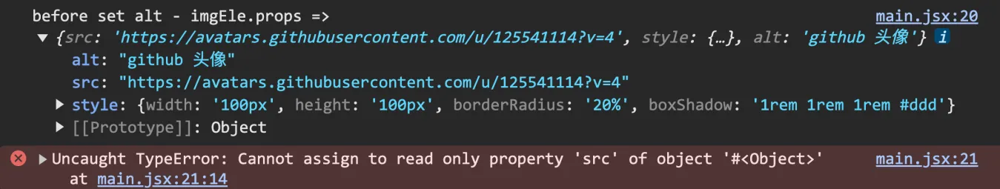

# [0044. react element 是只读的](https://github.com/Tdahuyou/TNotes.react/tree/main/notes/0044.%20react%20element%20%E6%98%AF%E5%8F%AA%E8%AF%BB%E7%9A%84)

<!-- region:toc -->

- [1. 💻 demos.1 - react element 是只读的](#1--demos1---react-element-是只读的)

<!-- endregion:toc -->
- 永远不要尝试去修改 React Element 的属性，正确的做法是通过渲染新的 React Element 或使用 React 的状态管理机制（state 或 props）来更新 UI。

## 1. 💻 demos.1 - react element 是只读的

::: code-group

```jsx [渲染头像]
import { StrictMode } from 'react'
import { createRoot } from 'react-dom/client'

const githubAvatar = 'https://avatars.githubusercontent.com/u/125541114?v=4'

const imgEle = (
  
)

createRoot(document.getElementById('root')).render(
  <StrictMode>{imgEle}</StrictMode>
)
```

```jsx [❌ 尝试修改 element.src 替换图片]
import { StrictMode } from 'react'
import { createRoot } from 'react-dom/client'

const githubAvatar = 'https://avatars.githubusercontent.com/u/125541114?v=4'

const imgEle = (
  
)

// 不要尝试修改 react element 对象身上的任何属性，否则会报错，你可以将这个对象视作是只读的。
console.log('before set alt - imgEle.props =>', imgEle.props)

imgEle.props.src = '...' // [!code error]
// ❌ 报错：Uncaught TypeError: Cannot assign to read only property 'alt' of object '#<Object>'

console.log('after set alt - imgEle.props =>', imgEle.props) // 不会执行，因为前一行就报错了。

createRoot(document.getElementById('root')).render(
  <StrictMode>{imgEle}</StrictMode>
)
```

:::

- 最终渲染结果：
  - 
- `imgEle.props.src = '...'` ❌
  - 当执行到这条语句的时候，我们可能是想要替换图片的 src，换成其他的图片，但是这种写法是错误的。
  - 如果执行到这条语句，则会抛出错误提示：`Uncaught TypeError: Cannot assign to read only property 'src' of object '#<Object>'`，提醒我们不能给只读的属性赋值。
  - 
- 再来看一个计数器的示例：

::: code-group

```jsx [❌ 错误做法]
import { StrictMode } from 'react'
import { createRoot } from 'react-dom/client'

// 实现一个计数器
let num = 0

setInterval(() => {
  // ❌ 错误做法：直接修改 react element —— counter 的属性值。
  const counter = <span>{num}</span>
  console.log(counter)

  counter.props.children++ // [!code error]
  // ❌ 报错：Uncaught TypeError: Cannot assign to read only property 'children' of object '#<Object>'

  createRoot(document.getElementById('root')).render(
    <StrictMode>计数器：{counter}</StrictMode>
  )
}, 1000)
```

```jsx [✅ 正确做法]
import { StrictMode } from 'react'
import { createRoot } from 'react-dom/client'

// 实现一个计数器
let num = 0

setInterval(() => {
  // ✅ 正确做法：可以在更新 num 的值之后，重新创建一个新的 react element —— counter，然后渲染新的 counter。
  num++
  const counter = <span>{num}</span>
  createRoot(document.getElementById('root')).render(
    <StrictMode>计数器：{counter}</StrictMode>
  )
}, 1000)
```

:::

- 最终渲染结果：
  - 
- 虽然上述提到的正确做法可以让计数器 demo 正常工作，但是，上述写法其实还是存在一些问题的。
  - 
    - 每次重新 `render`，都会打印这条消息。
  - 在程序的运行过程中，会出现这样一条警告信息，警告信息表明你正在尝试在一个已经被 `createRoot` 初始化的容器上调用 `createRoot`。React 不允许对同一个容器多次调用 `createRoot`，而是应该保留对根实例的引用，并在需要更新时调用其 `render` 方法。
- 修改建议：
  - 创建一次根实例并保存引用：将 `createRoot` 的调用移出定时器外部，并保存返回的根实例。
  - 使用状态管理：推荐使用 React 的状态管理功能（如 `useState`）来处理组件内部的状态变化，而不是使用全局变量。
- 下面是改进后的计数器 demo 的代码示例：

```jsx
import React, { useState, useEffect } from 'react'
import { StrictMode } from 'react'
import { createRoot } from 'react-dom/client'

function Counter() {
  const [num, setNum] = useState(0)

  useEffect(() => {
    const intervalId = setInterval(() => {
      setNum((prevNum) => prevNum + 1)
    }, 1000)

    return () => clearInterval(intervalId) // 清除定时器以避免内存泄漏
  }, [])

  return (
    <>
      计数器：<span>{num}</span>
    </>
  )
}

createRoot(document.getElementById('root')).render(
  <StrictMode>
    <Counter />
  </StrictMode>
)
```

- 改进点：
  - 状态管理：使用 `useState` 来管理计数器的状态。
  - 副作用处理：使用 `useEffect` 来设置和清除定时器，确保组件卸载时清理定时器。
  - 单次初始化：只调用一次 `createRoot` 并保存其引用，避免重复初始化。
- 这样可以避免警告，并且代码更加符合 React 的最佳实践。
