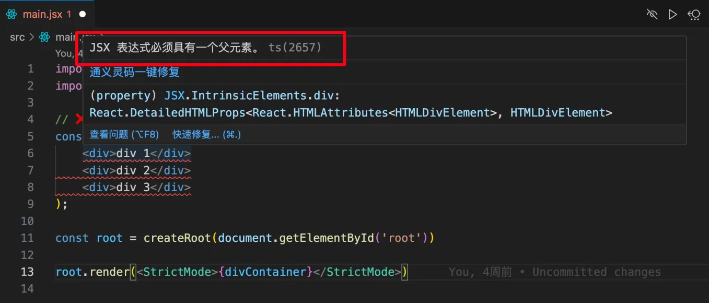
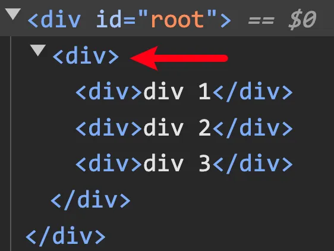
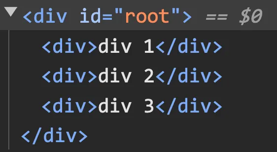

# [0045. jsx 必须单根](https://github.com/Tdahuyou/TNotes.react/tree/main/notes/0045.%20jsx%20%E5%BF%85%E9%A1%BB%E5%8D%95%E6%A0%B9)

<!-- region:toc -->

- [1. 💻 demos.1 - jsx 必须单根](#1--demos1---jsx-必须单根)

<!-- endregion:toc -->

## 1. 💻 demos.1 - jsx 必须单根

::: code-group

```jsx [❌ 错误写法]
import { StrictMode } from 'react'
import { createRoot } from 'react-dom/client'

// ❌ 下面这种写法会报错 - JSX 必须得有一个根节点
const divContainer = (
    <div>div 1</div>
    <div>div 2</div>
    <div>div 3</div>
);

const root = createRoot(document.getElementById('root'))

root.render(<StrictMode>{divContainer}</StrictMode>)
```

```jsx{6,10} [✅ 解1]
import { StrictMode } from 'react'
import { createRoot } from 'react-dom/client'

// ✅ 解决办法1：在外层包裹一个 div 元素作为根节点。
const divContainer = (
  <div>
    <div>div 1</div>
    <div>div 2</div>
    <div>div 3</div>
  </div>
)
// 这种做法虽然在此 demo 中能够避免报错，并且能够正常渲染出 div 1、div 2、div 3，但是在实际的开发中，却未必能够顺利解决你的需求。
// 因为这种法子破坏了元素结构，在外层多套了一个实际的元素 div。
// 如果你既想成功渲染 3 个 div，又不想破坏元素结构，那么可以考虑使用 React.Fragment。

const root = createRoot(document.getElementById('root'))

root.render(<StrictMode>{divContainer}</StrictMode>)
```

```jsx{4-10,16-30} [✅ 解2]
import { StrictMode, createElement } from 'react'
import { createRoot } from 'react-dom/client'

// const divContainer = (
//   <div>
//     <div>div 1</div>
//     <div>div 2</div>
//     <div>div 3</div>
//   </div>
// )

// JSX 和 createElement
// 始终记住，JSX 实际上是 createElement 的简写形式，是它的语法糖。
// 我们书写的 JSX 表达式，最终都会被 babel 处理，然后得到 createElement 式的写法。
// 比如，上述的 divContainer 经过 babel 解析之后，得到的编译结果类似下面这种写法。
const divContainer = createElement(
  'div',
  {},
  createElement(
    'div',
    {},
    'div 1',
    createElement(
      'div',
      {},
      'div 2',
      createElement('div', {}, 'div 3')
    )
  )
)
// 从编译结果来看，babel 编译后是一个树形结构，最外层的 createElement 的第一个元素是这个树的根节点。
// 不难理解如果存在多个根节点，那么最终生成的结构就不再是一棵树了，在 JSX 转为 createElement 的时候就会出现问题。
// 如果理解了这一点，其实就不难理解 —— 为什么 JSX 必须得是单根了。

const root = createRoot(document.getElementById('root'))

root.render(<StrictMode>{divContainer}</StrictMode>)
```

```jsx{17,21,26,27} [✅ 解3]
import { StrictMode, Fragment } from 'react'
import { createRoot } from 'react-dom/client'

// ✅ 解决办法1：在外层包裹一个 div 元素作为根节点。
// const divContainer = (
//   <div>
//     <div>div 1</div>
//     <div>div 2</div>
//     <div>div 3</div>
//   </div>
// )

// ✅ 解决办法3：使用 <React.Fragment> 来包裹多个根节点。
// <React.Fragment> 并不会被渲染出来，并不会破坏 html 结构。
// <React.Fragment> 是一个特殊的 react 内置组件，专门用于解决 jsx 中多个根节点的书写问题。
const divContainer = (
  <Fragment>
    <div>div 1</div>
    <div>div 2</div>
    <div>div 3</div>
  </Fragment>
)
// 从数据结构层面来看，React.Fragment 是一个 symbol 类型。
console.log(Fragment, typeof Fragment) // Symbol(react.fragment) 'symbol'
// 由此也可以得出一个结论：
// 🤔 React 组件一定都是对象类型，这句话对吗？
// 不对，比如 Fragment 这个内置组件，它就是 symbol 类型。

const root = createRoot(document.getElementById('root'))

root.render(<StrictMode>{divContainer}</StrictMode>)
```

```jsx{14,18} [✅ 解4]
import { StrictMode } from 'react'
import { createRoot } from 'react-dom/client'

// const divContainer = (
//   <Fragment>
//     <div>div 1</div>
//     <div>div 2</div>
//     <div>div 3</div>
//   </Fragment>
// )

// 语法糖 - <React.Fragment> 可以简写为 <>
const divContainer = (
  <>
    <div>div 1</div>
    <div>div 2</div>
    <div>div 3</div>
  </>
)
// <React.Fragment> 是一个比较常用的组件，JSX 对此做了一些特殊处理，如果想要使用 <React.Fragment> 的话：
// 反锁：不必每次都导入 import React from 'react'; 再使用。
// 简便：可以直接使用缩写的形式 <>...</>，这么写就相当于写了 import React from 'react'; <React.Fragment>...</React.Fragment>。

const root = createRoot(document.getElementById('root'))

root.render(<StrictMode>{divContainer}</StrictMode>)
```

:::

- ❌ 错误写法
  - 
  - 
- ✅ 解1
  - 虽然上述提到的解决办法能够正常在页面上渲染出 3 个 div，但是却破坏的元素的结构，多出的这一层 div 很可能并非我们想要的。
  - 
- ✅ 解2
  - 其实就是将 `解1` 中的 jsx 的写法改为 `createElement` 式的写法，它们是等效的。
  - 知道 jsx 是语法糖，掌握好 jsx 的写法即可，实际开发中很少会采用 `createElement` 式的写法来描述 UI。
- ✅ 解3
  - 采用 `Fragment`。
  - 使用 `Fragment` 渲染出来的结构如下：
  - 
  - 会发现这种写法并不会破坏元素结构，这往往是我们开发时更常用的。
- ✅ 解4
  - 是解法 3 的简写形式。
  - 有关 Fragment 组件的更多信息可查阅笔记 `react.0014`。
