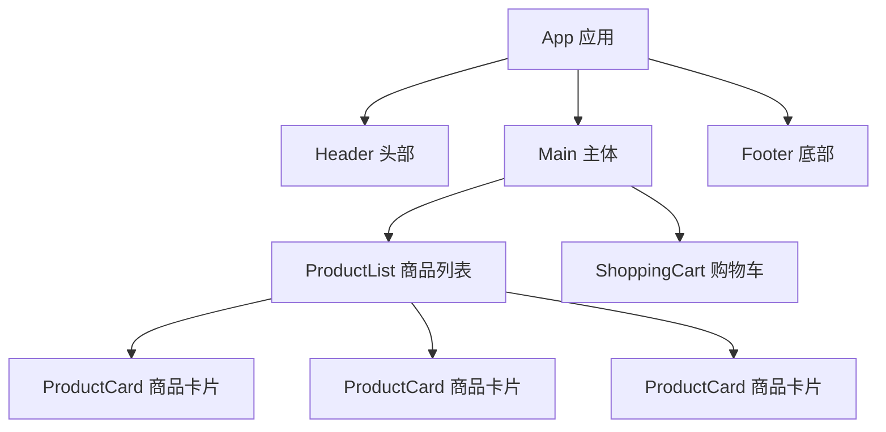
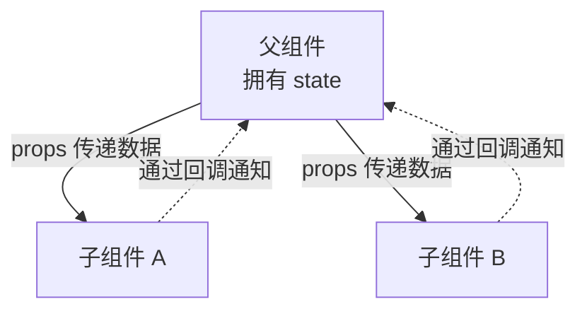
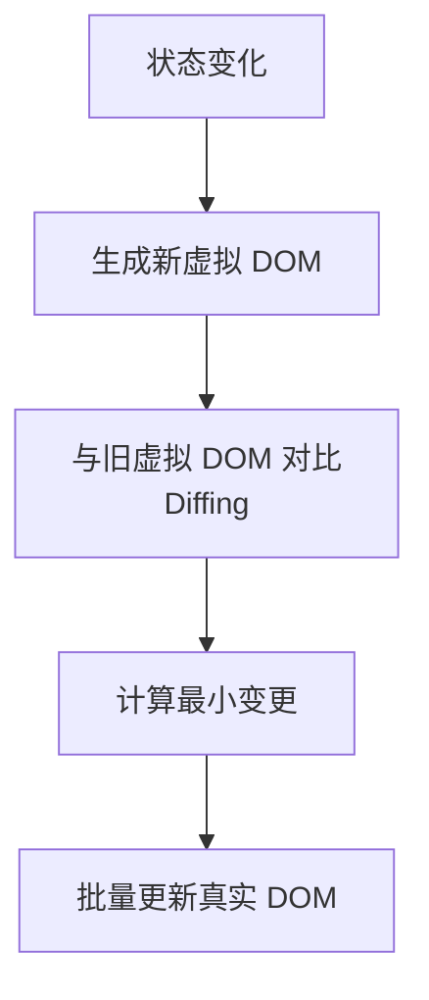
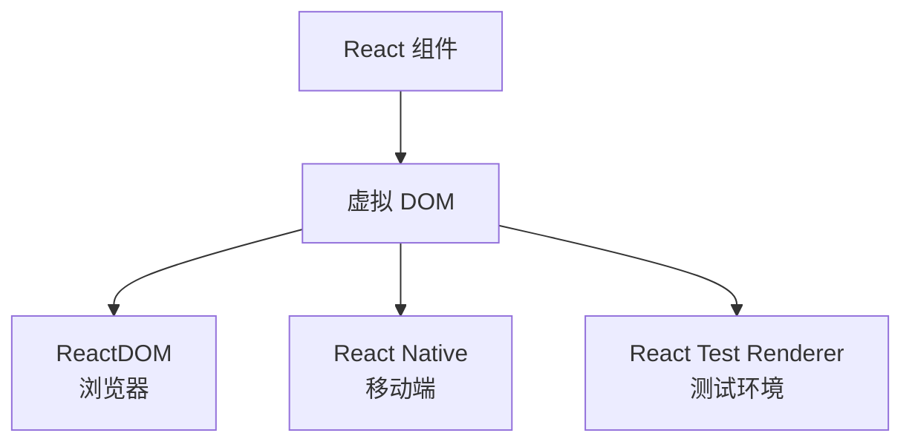

# [0068. React 设计理念](https://github.com/tnotesjs/TNotes.react/tree/main/notes/0068.%20React%20%E8%AE%BE%E8%AE%A1%E7%90%86%E5%BF%B5)

<!-- region:toc -->

- [1. 🎯 本节内容](#1--本节内容)
- [2. 🫧 评价](#2--评价)
- [3. 🤔 如何理解"设计理念"？](#3--如何理解设计理念)
- [4. 🤔 为什么 React 是"声明式"的，而不是"命令式"的？](#4--为什么-react-是声明式的而不是命令式的)
- [5. 🤔 为什么 React 要"组件化"？](#5--为什么-react-要组件化)
- [6. 🤔 为什么 React 要坚持"单向数据流"？](#6--为什么-react-要坚持单向数据流)
- [7. 🤔 为什么说"UI 是状态的函数"？](#7--为什么说ui-是状态的函数)
- [8. 🤔 为什么 React 要强调"纯函数"？](#8--为什么-react-要强调纯函数)
- [9. 🤔 为什么 React 需要"虚拟 DOM"？](#9--为什么-react-需要虚拟-dom)
- [10. 🤔 React 的设计哲学可以用一句话总结吗？](#10--react-的设计哲学可以用一句话总结吗)
- [11. 🔗 引用](#11--引用)

<!-- endregion:toc -->

## 1. 🎯 本节内容

- React 的核心设计理念
- 声明式编程思想
- 组件化架构
- 单向数据流
- 状态驱动 UI
- 纯函数与可预测性
- 虚拟 DOM 机制

## 2. 🫧 评价

本笔记深入探讨了 React 的核心设计理念，帮助理解 React 为什么这样工作。

- 理解设计理念比记住 API 更重要，它能帮助你在遇到问题时找到正确的解决方向
- React 的设计哲学一脉相承，从初版到现在，核心理念几乎没有变化
- 在实际开发中，时刻思考这些理念，能让你写出更优雅、更易维护的代码
- 当你真正理解"为什么"，就能更好地掌握"怎么做"

## 3. 🤔 如何理解"设计理念"？

- 设计理念是指 React 项目遵循的核心原则
  - 这些原则贯穿 React 的整个发展历史
  - 从 React 初版到现在，核心理念几乎没有变化
  - 所有功能和 API 的设计都围绕这些理念展开
- 理解设计理念的重要性
  - 帮助你理解 React 为什么这样设计
  - 在遇到问题时能找到符合 React 思想的解决方案
  - 避免写出"反模式"的代码
  - 让你真正"懂" React，而不是机械地使用

## 4. 🤔 为什么 React 是"声明式"的，而不是"命令式"的？

声明式与命令式的核心区别：

- 命令式（How）：告诉计算机"怎么做"，关注实现步骤
- 声明式（What）：告诉计算机"要什么"，关注最终状态

用一个生活化的例子来理解：

假设你要让一个灯泡亮起来：

- 命令式写法
  - 步骤 1：找到灯泡
  - 步骤 2：检查是否通电
  - 步骤 3：如果没亮就打开开关
  - 步骤 4：验证是否已亮
  - 这种方式需要关注每一步操作，容易出错且难以维护
- 声明式写法
  - "灯泡应该是亮的"
  - 你只描述最终状态，React 会自动处理"怎么实现"

在 React 中的实际应用：

::: code-group

```jsx [声明式（React）✅]
function Greeting({ isLoggedIn }) {
  return isLoggedIn ? <h1>欢迎回来</h1> : <h1>请登录</h1>
}

// 你只需要描述 UI 应该是什么样子
// React 会自动处理 DOM 更新
```

```js [命令式（原生 JS）⚠️]
// 需要手动操作 DOM
const greeting = document.getElementById('greeting')

if (isLoggedIn) {
  greeting.textContent = '欢迎回来'
  greeting.className = 'logged-in'
} else {
  greeting.textContent = '请登录'
  greeting.className = 'logged-out'
}

// 还需要考虑：
// - 元素是否存在
// - 是否需要创建新元素
// - 如何清理旧的事件监听
// - 如何避免内存泄漏
```

:::

声明式的优势：

| 维度     | 声明式       | 命令式         |
| -------- | ------------ | -------------- |
| 关注点   | 描述"是什么" | 描述"怎么做"   |
| 代码量   | 更少         | 更多           |
| 可读性   | 更好         | 较差           |
| 可维护性 | 更容易       | 较困难         |
| 出错概率 | 更低         | 更高           |
| 性能控制 | 由框架优化   | 开发者手动优化 |

React 选择声明式的原因：

- 让开发者站在更高的抽象层思考问题
- 底层依旧是命令式执行，只是开发者不需要关心细节
- React 作为"助手"，帮你处理复杂的 DOM 操作
- 开发者体验更好，代码更易维护

关于性能的思考：

理论上，精心优化的命令式代码可以达到最优性能，但实际开发中：

- 手动优化命令式代码容易出错
- React 的声明式 + 虚拟 DOM 机制已经足够高效
- React 团队持续优化性能，让声明式代码越来越接近最优解
- 对于绝大多数应用，React 的性能已经足够好

## 5. 🤔 为什么 React 要"组件化"？

组件化的核心思想：

- 将复杂的 UI 拆分成独立、可复用的小单元
- 每个组件都是一个独立的功能单元
- 组件可以组合成更复杂的界面

电商页面的组件化拆分示例：



代码实现：

```jsx
function App() {
  return (
    <div>
      <Header title="我的商店" />
      <Main>
        <ProductList products={products} />
        <ShoppingCart items={cartItems} />
      </Main>
      <Footer />
    </div>
  )
}

function ProductList({ products }) {
  return (
    <div className="product-list">
      {products.map((product) => (
        <ProductCard key={product.id} product={product} />
      ))}
    </div>
  )
}
```

组件化的优势：

| 优势 | 说明 | 实际应用 |
| --- | --- | --- |
| 代码复用 | 同一个组件可以在多处使用 | `<Button>` 可以用在表单、对话框、导航栏等 |
| 职责分离 | 每个组件只关注自己的功能 | `<ProductCard>` 只负责展示商品信息 |
| 团队协作 | 多人可以同时开发不同组件 | A 开发 `<Header>`，B 开发 `<ProductList>` |
| 易于测试 | 组件可以独立测试 | 可以单独测试 `<ShoppingCart>` 的加减功能 |
| 易于维护 | 修改某个组件不影响其他部分 | 修改 `<Footer>` 不会影响 `<Header>` |
| 关注点分离 | UI、逻辑、样式可以分离 | 组件内部管理自己的状态和样式 |

组件化的实践原则：

- 单一职责原则
  - 每个组件只做一件事
  - 如果组件变得复杂，考虑拆分
- 合理的抽象层次
  - 不要过度拆分（会增加复杂度）
  - 不要拆分不足（会降低复用性）
- 明确的组件边界
  - 通过 props 传递数据
  - 通过回调传递行为

核心理念：

> UI = 组件的组合

## 6. 🤔 为什么 React 要坚持"单向数据流"？

单向数据流的定义：

- 数据只能从父组件流向子组件
- 通过 props 向下传递数据
- 子组件不能直接修改 props
- 如需修改，需通过回调函数通知父组件

数据流向示意图：



代码示例：

```jsx
// 父组件
function App() {
  const [count, setCount] = useState(0)

  return (
    <div>
      <Display count={count} />
      <Controls
        onIncrement={() => setCount(count + 1)}
        onDecrement={() => setCount(count - 1)}
      />
    </div>
  )
}

// 子组件 1：只展示数据
function Display({ count }) {
  return <h2>当前计数：{count}</h2>
}

// 子组件 2：通过回调修改数据
function Controls({ onIncrement, onDecrement }) {
  return (
    <div>
      <button onClick={onIncrement}>+1</button>
      <button onClick={onDecrement}>-1</button>
    </div>
  )
}
```

单向数据流的优势：

| 优势         | 说明                             |
| ------------ | -------------------------------- |
| 可预测性     | 数据流向清晰，容易追踪数据变化   |
| 易于调试     | 出现问题时，可以快速定位数据来源 |
| 避免混乱     | 防止多个组件同时修改同一数据     |
| 状态集中管理 | 数据源头明确，便于管理           |
| 便于理解     | 数据流向一目了然，新人容易上手   |

与双向数据绑定的对比：

```jsx
// ❌ 双向绑定（Vue 风格，React 不支持）
<input v-model="username" />

// ✅ 单向数据流（React 风格）
<input
  value={username}
  onChange={(e) => setUsername(e.target.value)}
/>
```

React 的做法虽然代码稍多，但优势在于：

- 数据变化路径明确
- 便于添加验证逻辑
- 更容易实现复杂的交互逻辑

实际应用场景：

```jsx
function TodoApp() {
  const [todos, setTodos] = useState([])

  // 数据在顶层管理
  const addTodo = (text) => {
    setTodos([...todos, { id: Date.now(), text }])
  }

  const toggleTodo = (id) => {
    setTodos(
      todos.map((todo) =>
        todo.id === id ? { ...todo, done: !todo.done } : todo
      )
    )
  }

  // 通过 props 向下传递数据和方法
  return (
    <div>
      <TodoInput onAdd={addTodo} />
      <TodoList todos={todos} onToggle={toggleTodo} />
    </div>
  )
}
```

生活化类比：

- 父母给孩子零花钱（props）
- 孩子不能自己印钱
- 孩子需要更多钱时，只能请求父母
- 是否给钱，由父母决定

## 7. 🤔 为什么说"UI 是状态的函数"？

React 的核心数学公式：

> UI = f(state)

这个公式的含义：

- UI（用户界面）是状态的函数
- 给定相同的 state，总会得到相同的 UI
- state 变化，UI 自动更新

代码示例：

```jsx
function Counter() {
  const [count, setCount] = useState(0)

  // UI 完全由 count 决定
  return (
    <div>
      <p>你点击了 {count} 次</p>
      <button onClick={() => setCount(count + 1)}>+1</button>
    </div>
  )
}
```

当 `count` 从 0 变成 1：

- 你不需要手动修改 `<p>` 标签的文本
- React 自动重新执行 `Counter` 函数
- 生成新的 UI 并更新到页面

更复杂的例子：

```jsx
function UserStatus({ user }) {
  // UI 完全由 user 状态决定
  if (!user) {
    return <div>加载中...</div>
  }

  if (user.isOnline) {
    return <div className="online">🟢 {user.name} 在线</div>
  }

  return <div className="offline">⚫ {user.name} 离线</div>
}
```

这种设计的优势：

| 优势       | 说明                                       |
| ---------- | ------------------------------------------ |
| 可预测性   | 相同的 state 总是得到相同的 UI             |
| 易于调试   | 只需检查 state，就能知道 UI 应该是什么样子 |
| 易于测试   | 测试组件就是测试"输入 state → 输出 UI"     |
| 时间旅行   | 可以保存 state 历史，实现撤销/重做功能     |
| 关注点分离 | 开发者只关心数据，React 负责更新 UI        |

开发者的心智模型转变：

```jsx
// ❌ 命令式思维（手动更新 DOM）
button.addEventListener('click', () => {
  count++
  document.getElementById('count').textContent = count
  if (count > 10) {
    button.disabled = true
  }
})

// ✅ 声明式思维（描述 UI 应该是什么样子）
function Counter() {
  const [count, setCount] = useState(0)

  return (
    <div>
      <p id="count">{count}</p>
      <button onClick={() => setCount(count + 1)} disabled={count > 10}>
        +1
      </button>
    </div>
  )
}
```

核心收益：

- 开发者只需关心"状态是什么"
- 不必操心"DOM 怎么变"
- React 帮你处理所有的更新逻辑

## 8. 🤔 为什么 React 要强调"纯函数"？

纯函数的定义：

- 相同的输入，总是得到相同的输出
- 不产生副作用（不修改外部变量、不发送请求等）
- 不依赖外部可变状态

在 React 中的体现：

> 相同的 props + state ➜ 相同的 UI

代码对比：

::: code-group

```jsx [✅ 纯函数组件（推荐）]
function Greeting({ name }) {
  // 输入固定，输出固定
  return <h1>你好，{name}</h1>
}

function Product({ price }) {
  // 计算派生值，不修改原数据
  const discountPrice = price * 0.8
  return (
    <div>
      原价：{price}，折扣价：{discountPrice}
    </div>
  )
}
```

```jsx [❌ 非纯函数（不推荐）]
let renderCount = 0

function BadComponent({ name }) {
  // ❌ 修改外部变量
  renderCount++

  // ❌ 在渲染期间产生副作用
  console.log('组件渲染了')

  // ❌ 直接操作 DOM
  document.title = `你好，${name}`

  // ❌ 发送网络请求
  fetch('/api/log')

  return <h1>你好，{name}</h1>
}
```

:::

纯函数的优势：

| 优势     | 说明                                       |
| -------- | ------------------------------------------ |
| 可预测性 | 输入确定，输出就确定，便于推理             |
| 易于测试 | 测试就是验证输入输出，不需要 mock 复杂环境 |
| 易于调试 | 不依赖外部状态，问题定位更简单             |
| 并发安全 | React 可以安全地多次调用、暂停、恢复渲染   |
| 优化潜力 | React 可以跳过纯组件的重复渲染             |

副作用应该放在哪里？

```jsx
function UserProfile({ userId }) {
  const [user, setUser] = useState(null)

  // ✅ 副作用放在 useEffect 中
  useEffect(() => {
    fetch(`/api/users/${userId}`)
      .then((res) => res.json())
      .then((data) => setUser(data))
  }, [userId])

  // ❌ 不要在这里发送请求
  // fetch(`/api/users/${userId}`)

  if (!user) return <div>加载中...</div>
  return <div>{user.name}</div>
}
```

React 为什么需要纯函数？

- React 18 引入的并发渲染
  - React 可能会多次调用组件函数
  - 可能会暂停渲染，稍后继续
  - 如果组件不纯，可能导致意外的副作用
- 性能优化
  - React 可以跳过纯组件的重复渲染
  - `React.memo` 等优化手段依赖纯函数
- 服务端渲染
  - 纯函数可以在服务端安全地执行
  - 不会产生浏览器特有的副作用

实践建议：

- 组件函数体内只做计算和返回 JSX
- 副作用统一放在 `useEffect` 中
- 不要在渲染期间修改 props 或 state
- 避免在组件内部访问全局可变变量

## 9. 🤔 为什么 React 需要"虚拟 DOM"？

虚拟 DOM 解决的核心问题：

- 如何在保持声明式编程的同时，提供高性能的 DOM 更新

虚拟 DOM 的工作流程：



详细步骤：

1. React 在内存中维护一个虚拟的 UI 树（用 JS 对象表示）
2. 当状态变化时，生成新的虚拟树
3. React 比较新旧树的差异（Diffing 算法）
4. 只把真正变化的部分更新到真实 DOM

为什么需要虚拟 DOM？

| 原因         | 说明                                      |
| ------------ | ----------------------------------------- |
| DOM 操作昂贵 | 直接操作 DOM 性能开销大，尤其是频繁更新时 |
| 批量更新     | 虚拟 DOM 可以收集多个变更，一次性更新     |
| 跨平台能力   | 虚拟 DOM 是平台无关的，可以渲染到不同目标 |
| 声明式开发   | 开发者不需要关心如何更新 DOM，只需描述 UI |

虚拟 DOM 的优势：

```jsx
// 假设有这样的状态变化
function TodoList() {
  const [todos, setTodos] = useState([
    { id: 1, text: '学习 React' },
    { id: 2, text: '学习 Vue' },
  ])

  // 添加一个新任务
  const addTodo = () => {
    setTodos([...todos, { id: 3, text: '学习 Angular' }])
  }

  return (
    <div>
      {todos.map((todo) => (
        <div key={todo.id}>{todo.text}</div>
      ))}
      <button onClick={addTodo}>添加</button>
    </div>
  )
}
```

当点击添加按钮时：

- 原生 DOM 操作（低效）
  - 删除整个列表
  - 重新创建所有元素
  - 重新添加到页面
- 虚拟 DOM 优化（高效）
  - 对比前后两个虚拟树
  - 发现只是新增了一个元素
  - 只创建并插入这一个新元素

虚拟 DOM 不是万能的：

虚拟 DOM 本身也有开销（创建对象、对比差异），但相比直接操作 DOM：

- 对于大量 DOM 更新，虚拟 DOM 更高效
- 对于少量精确的 DOM 操作，原生可能更快
- React 的优势在于开发体验和可维护性的平衡

虚拟 DOM 的跨平台能力：



核心价值：

- 虚拟 DOM 是 React 的"幕后英雄"
- 让"写起来简单、跑得也快"成为可能
- 开发者享受声明式开发，React 负责性能优化

## 10. 🤔 React 的设计哲学可以用一句话总结吗？

React 的核心哲学：

> 用声明式、组件化的方式，通过状态驱动 UI，实现可预测、可维护、高性能的用户界面

这句话包含了 React 的核心设计理念：

- 声明式：描述"是什么"，而不是"怎么做"
- 组件化：UI 是组件的组合
- 状态驱动：UI = f(state)
- 可预测：纯函数，相同输入得到相同输出
- 可维护：清晰的数据流和组件边界
- 高性能：虚拟 DOM 优化更新

开发时的检查清单：

当你写 React 代码时，问自己这些问题：

- 我是在描述 UI 的目标状态，还是在命令 DOM？（声明式）
- 这个界面能否拆成更小的组件？（组件化）
- 数据是不是只从父组件往下传？（单向数据流）
- UI 是否只是状态的映射？（状态驱动）
- 我的组件有没有副作用？（纯函数）

当这些问题都能清晰回答时，你就真正理解了 React 的设计哲学。

## 11. 🔗 引用

- [React 官方文档 - 核心概念][1]
- [React 设计原则][2]
- [React 哲学][3]
- [声明式编程 vs 命令式编程][4]

[1]: https://zh-hans.react.dev/learn
[2]: https://legacy.reactjs.org/docs/design-principles.html
[3]: https://zh-hans.react.dev/learn/thinking-in-react
[4]: https://www.freecodecamp.org/chinese/news/imperative-vs-declarative-programming/
