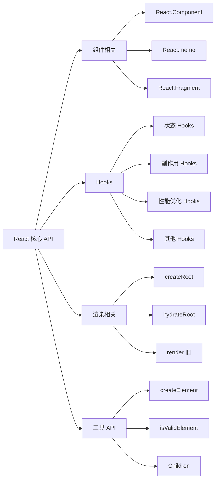

# [0076. React 核心 API 概览](https://github.com/tnotesjs/TNotes.react/tree/main/notes/0076.%20React%20%E6%A0%B8%E5%BF%83%20API%20%E6%A6%82%E8%A7%88)

<!-- region:toc -->

- [1. 🎯 本节内容](#1--本节内容)
- [2. 🫧 评价](#2--评价)
- [3. 🤔 React 的核心 API 分为哪几类？](#3--react-的核心-api-分为哪几类)
- [4. 🤔 组件相关的 API 有哪些？](#4--组件相关的-api-有哪些)
- [5. 🤔 Hooks API 都有哪些？](#5--hooks-api-都有哪些)
- [6. 🤔 渲染相关的 API 有哪些？](#6--渲染相关的-api-有哪些)
- [7. 🤔 其他常用 API 有哪些？](#7--其他常用-api-有哪些)
- [8. 🔗 引用](#8--引用)

<!-- endregion:toc -->

## 1. 🎯 本节内容

- React 核心 API 分类
- 组件相关 API
- Hooks API
- 渲染相关 API
- 其他常用 API

## 2. 🫧 评价

本笔记概览了 React 的核心 API，帮助开发者快速了解 React 提供的主要能力。

- React 的 API 设计简洁，核心 API 数量不多，但功能强大
- Hooks 是 React 16.8 引入的重要特性，极大地简化了组件开发
- 掌握核心 API 是深入学习 React 的基础
- 不需要一次性记住所有 API，在实际使用中逐步熟悉即可

## 3. 🤔 React 的核心 API 分为哪几类？

React API 主要分为以下几类：



API 分类表：

| 分类     | 用途                         | 常用程度   |
| -------- | ---------------------------- | ---------- |
| 组件相关 | 定义和优化组件               | ⭐⭐⭐⭐⭐ |
| Hooks    | 在函数组件中使用状态和副作用 | ⭐⭐⭐⭐⭐ |
| 渲染相关 | 将 React 组件渲染到 DOM      | ⭐⭐⭐⭐⭐ |
| 工具 API | 辅助开发的工具函数           | ⭐⭐⭐     |

## 4. 🤔 组件相关的 API 有哪些？

主要的组件 API：

| API                   | 说明         | 使用场景                         |
| --------------------- | ------------ | -------------------------------- |
| `React.Component`     | 类组件基类   | 定义类组件（逐渐被函数组件取代） |
| `React.PureComponent` | 纯类组件基类 | 性能优化的类组件                 |
| `React.memo`          | 高阶组件     | 优化函数组件性能                 |
| `React.Fragment`      | 片段组件     | 包裹多个子元素，不产生额外 DOM   |
| `React.forwardRef`    | 转发 ref     | 将 ref 转发到子组件              |
| `React.lazy`          | 懒加载组件   | 代码分割，按需加载               |
| `React.Suspense`      | 悬挂组件     | 配合 lazy 使用，显示加载状态     |

示例代码：

```jsx
// React.memo - 性能优化
const MyComponent = React.memo(function MyComponent({ name }) {
  return <div>{name}</div>
})

// React.Fragment - 包裹多个元素
function App() {
  return (
    <React.Fragment>
      <h1>标题</h1>
      <p>内容</p>
    </React.Fragment>
    // 或简写为
    // <>
    //   <h1>标题</h1>
    //   <p>内容</p>
    // </>
  )
}

// React.lazy + Suspense - 懒加载
const LazyComponent = React.lazy(() => import('./HeavyComponent'))

function App() {
  return (
    <React.Suspense fallback={<div>加载中...</div>}>
      <LazyComponent />
    </React.Suspense>
  )
}

// React.forwardRef - 转发 ref
const FancyButton = React.forwardRef((props, ref) => (
  <button ref={ref} className="fancy-button">
    {props.children}
  </button>
))
```

## 5. 🤔 Hooks API 都有哪些？

Hooks 分类表：

| 分类     | Hooks                  | 说明                       |
| -------- | ---------------------- | -------------------------- |
| 状态管理 | `useState`             | 管理组件状态               |
|          | `useReducer`           | 复杂状态管理               |
| 副作用   | `useEffect`            | 处理副作用                 |
|          | `useLayoutEffect`      | 同步副作用                 |
|          | `useInsertionEffect`   | 在 DOM 变更前注入样式      |
| 性能优化 | `useMemo`              | 缓存计算结果               |
|          | `useCallback`          | 缓存回调函数               |
| 引用     | `useRef`               | 引用 DOM 或保存可变值      |
|          | `useImperativeHandle`  | 自定义暴露给父组件的实例值 |
| 上下文   | `useContext`           | 读取 Context 值            |
| 其他     | `useId`                | 生成唯一 ID                |
|          | `useTransition`        | 标记非紧急更新             |
|          | `useDeferredValue`     | 延迟更新值                 |
|          | `useSyncExternalStore` | 订阅外部 store             |
|          | `useDebugValue`        | 调试自定义 Hook            |

基础 Hooks 示例：

```jsx
import { useState, useEffect, useRef, useContext } from 'react'

function Example() {
  // useState - 状态管理
  const [count, setCount] = useState(0)

  // useEffect - 副作用
  useEffect(() => {
    document.title = `点击了 ${count} 次`
    return () => {
      // 清理函数
    }
  }, [count])

  // useRef - 引用 DOM
  const inputRef = useRef(null)

  // useContext - 读取上下文
  const theme = useContext(ThemeContext)

  return (
    <div>
      <input ref={inputRef} />
      <p>Count: {count}</p>
      <button onClick={() => setCount(count + 1)}>+1</button>
    </div>
  )
}
```

性能优化 Hooks 示例：

```jsx
import { useMemo, useCallback } from 'react'

function ExpensiveComponent({ data }) {
  // useMemo - 缓存计算结果
  const processedData = useMemo(() => {
    return data.map((item) => item * 2)
  }, [data])

  // useCallback - 缓存回调函数
  const handleClick = useCallback(() => {
    console.log('clicked')
  }, [])

  return <div onClick={handleClick}>{processedData}</div>
}
```

## 6. 🤔 渲染相关的 API 有哪些？

渲染 API 对比：

| API           | 版本        | 说明                    | 使用场景       |
| ------------- | ----------- | ----------------------- | -------------- |
| `createRoot`  | React 18+   | 创建 root，启用并发特性 | 新项目推荐使用 |
| `hydrateRoot` | React 18+   | 服务端渲染的客户端激活  | SSR 项目       |
| `render`      | React 16-17 | 旧版渲染方法            | 旧项目维护     |

React 18 新渲染 API：

```jsx
// React 18+ 推荐写法
import { createRoot } from 'react-dom/client'

const root = createRoot(document.getElementById('root'))
root.render(
  <React.StrictMode>
    <App />
  </React.StrictMode>
)

// 服务端渲染
import { hydrateRoot } from 'react-dom/client'

hydrateRoot(document.getElementById('root'), <App />)
```

React 17 及以前的写法：

```jsx
// React 17 及以前的写法（不推荐）
import ReactDOM from 'react-dom'

ReactDOM.render(
  <React.StrictMode>
    <App />
  </React.StrictMode>,
  document.getElementById('root')
)
```

## 7. 🤔 其他常用 API 有哪些？

工具类 API：

| API | 说明 | 使用场景 |
| --- | --- | --- |
| `createElement` | 创建 React 元素 | JSX 编译的目标，通常不直接使用 |
| `isValidElement` | 判断是否为有效的 React 元素 | 类型检查 |
| `cloneElement` | 克隆元素 | 修改 props 后克隆 |
| `Children` | 操作 children | 遍历、映射 children |
| `createContext` | 创建 Context | 跨组件传递数据 |
| `startTransition` | 标记非紧急更新 | 性能优化 |

示例代码：

```jsx
// createElement - 不使用 JSX
const element = React.createElement(
  'h1',
  { className: 'greeting' },
  'Hello, world!'
)

// isValidElement - 类型检查
if (React.isValidElement(element)) {
  console.log('这是一个有效的 React 元素')
}

// cloneElement - 克隆并修改
const cloned = React.cloneElement(element, { className: 'new-class' })

// Children - 操作 children
function Parent({ children }) {
  return React.Children.map(children, (child, index) => {
    return React.cloneElement(child, { key: index })
  })
}

// createContext - 创建上下文
const ThemeContext = React.createContext('light')

// startTransition - 标记非紧急更新
import { startTransition } from 'react'

function handleClick() {
  startTransition(() => {
    setQuery(input) // 非紧急更新
  })
}
```

## 8. 🔗 引用

- [React API Reference][1]
- [Hooks API Reference][2]
- [React 18 新特性][3]
- [Legacy React APIs][4]

[1]: https://react.dev/reference/react
[2]: https://react.dev/reference/react/hooks
[3]: https://react.dev/blog/2022/03/29/react-v18
[4]: https://react.dev/reference/react/legacy
