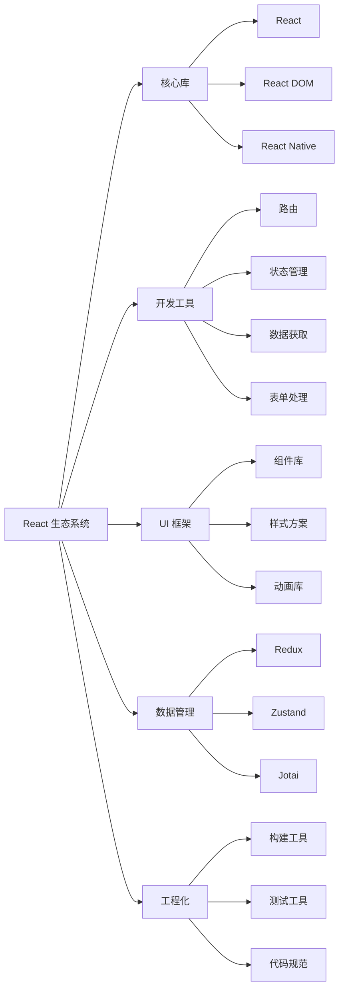

# [0077. React 生态系统介绍](https://github.com/tnotesjs/TNotes.react/tree/main/notes/0077.%20React%20%E7%94%9F%E6%80%81%E7%B3%BB%E7%BB%9F%E4%BB%8B%E7%BB%8D)

<!-- region:toc -->

- [1. 🎯 本节内容](#1--本节内容)
- [2. 🫧 评价](#2--评价)
- [3. 🤔 React 生态系统包含哪些部分？](#3--react-生态系统包含哪些部分)
- [4. 🤔 状态管理库有哪些选择？](#4--状态管理库有哪些选择)
- [5. 🤔 路由库有哪些选择？](#5--路由库有哪些选择)
- [6. 🤔 UI 组件库有哪些选择？](#6--ui-组件库有哪些选择)
- [7. 🤔 构建工具有哪些选择？](#7--构建工具有哪些选择)
- [8. 🤔 数据获取库有哪些选择？](#8--数据获取库有哪些选择)
- [9. 🤔 表单处理库有哪些选择？](#9--表单处理库有哪些选择)
- [10. 🤔 测试工具有哪些选择？](#10--测试工具有哪些选择)
- [11. 🤔 其他常用工具有哪些？](#11--其他常用工具有哪些)
- [12. 🔗 引用](#12--引用)

<!-- endregion:toc -->

## 1. 🎯 本节内容

- React 生态系统概览
- 状态管理解决方案
- 路由解决方案
- UI 组件库
- 构建工具
- 数据获取库
- 表单处理库
- 测试工具
- 其他常用工具

## 2. 🫧 评价

本笔记介绍了 React 生态系统中的主要工具和库，帮助开发者快速了解可用的解决方案。

- React 生态系统非常丰富，几乎每个需求都有多种解决方案可选
- 选择工具时应考虑项目需求、团队经验、社区活跃度等因素
- 不要盲目追求新工具，选择成熟稳定的方案更重要
- 建议从官方推荐的工具开始，遇到问题再寻找替代方案

## 3. 🤔 React 生态系统包含哪些部分？

React 生态系统全景图：



生态系统分类：

| 分类      | 说明             | 必需性             |
| --------- | ---------------- | ------------------ |
| 状态管理  | 管理应用全局状态 | 中大型项目必需     |
| 路由      | 实现单页应用路由 | 多页面应用必需     |
| UI 组件库 | 提供预制组件     | 可选，提升开发效率 |
| 构建工具  | 打包和优化代码   | 必需               |
| 数据获取  | 处理 API 请求    | 必需               |
| 表单处理  | 简化表单开发     | 可选，复杂表单推荐 |
| 测试工具  | 保证代码质量     | 推荐               |

## 4. 🤔 状态管理库有哪些选择？

主流状态管理库对比：

| 库名          | 复杂度 | 包大小    | 学习曲线 | 适用场景       |
| ------------- | ------ | --------- | -------- | -------------- |
| Context API   | 低     | 0（内置） | 平缓     | 简单状态共享   |
| Redux Toolkit | 中     | ~15KB     | 中等     | 中大型应用     |
| Zustand       | 低     | ~1KB      | 平缓     | 中小型应用     |
| Jotai         | 低     | ~3KB      | 平缓     | 原子化状态管理 |
| Recoil        | 中     | ~20KB     | 中等     | 复杂状态依赖   |
| MobX          | 中     | ~16KB     | 中等     | 响应式状态管理 |

代码示例：

::: code-group

```jsx [Context API]
const ThemeContext = React.createContext('light')

function App() {
  return (
    <ThemeContext.Provider value="dark">
      <Toolbar />
    </ThemeContext.Provider>
  )
}
```

```jsx [Redux Toolkit]
import { configureStore, createSlice } from '@reduxjs/toolkit'

const counterSlice = createSlice({
  name: 'counter',
  initialState: { value: 0 },
  reducers: {
    increment: (state) => {
      state.value += 1
    },
  },
})

const store = configureStore({
  reducer: { counter: counterSlice.reducer },
})
```

```jsx [Zustand]
import create from 'zustand'

const useStore = create((set) => ({
  count: 0,
  increment: () => set((state) => ({ count: state.count + 1 })),
}))

function Counter() {
  const { count, increment } = useStore()
  return <button onClick={increment}>{count}</button>
}
```

:::

选择建议：

- 简单项目：Context API
- 中小型项目：Zustand
- 大型项目：Redux Toolkit
- 原子化需求：Jotai
- 响应式偏好：MobX

## 5. 🤔 路由库有哪些选择？

主流路由库对比：

| 库名            | 版本 | 包大小 | 特点               |
| --------------- | ---- | ------ | ------------------ |
| React Router    | v6   | ~12KB  | 最流行，功能完整   |
| TanStack Router | v1   | ~30KB  | 类型安全，功能强大 |
| Wouter          | -    | ~1.5KB | 轻量级             |
| Next.js Router  | -    | 内置   | 框架内置           |

React Router 示例：

```jsx
import { BrowserRouter, Routes, Route, Link } from 'react-router-dom'

function App() {
  return (
    <BrowserRouter>
      <nav>
        <Link to="/">首页</Link>
        <Link to="/about">关于</Link>
      </nav>

      <Routes>
        <Route path="/" element={<Home />} />
        <Route path="/about" element={<About />} />
        <Route path="/users/:id" element={<User />} />
      </Routes>
    </BrowserRouter>
  )
}
```

选择建议：

- 通用项目：React Router
- 类型安全：TanStack Router
- 轻量需求：Wouter
- Next.js 项目：使用内置路由

## 6. 🤔 UI 组件库有哪些选择？

主流 UI 组件库对比：

| 库名        | 风格            | 包大小 | 定制性 | 适用场景       |
| ----------- | --------------- | ------ | ------ | -------------- |
| Ant Design  | 企业级          | 大     | 中     | 后台管理系统   |
| Material-UI | Material Design | 大     | 高     | 通用 Web 应用  |
| Chakra UI   | 现代简洁        | 中     | 高     | 现代 Web 应用  |
| shadcn/ui   | 无样式组件      | 小     | 极高   | 高度定制项目   |
| Mantine     | 功能丰富        | 中     | 高     | 通用项目       |
| Radix UI    | 无样式          | 小     | 极高   | 自定义设计系统 |

使用示例：

```jsx
// Ant Design
import { Button, Table, Form } from 'antd'

function App() {
  return (
    <div>
      <Button type="primary">提交</Button>
      <Table dataSource={data} columns={columns} />
    </div>
  )
}

// Chakra UI
import { Button, Box, Text } from '@chakra-ui/react'

function App() {
  return (
    <Box p={4}>
      <Text fontSize="xl">Hello</Text>
      <Button colorScheme="blue">Click me</Button>
    </Box>
  )
}
```

选择建议：

- 后台系统：Ant Design
- Material 风格：Material-UI
- 现代设计：Chakra UI 或 Mantine
- 高度定制：shadcn/ui 或 Radix UI

## 7. 🤔 构建工具有哪些选择？

主流构建工具对比：

| 工具             | 启动速度 | 构建速度 | 配置复杂度   | 生态     |
| ---------------- | -------- | -------- | ------------ | -------- |
| Vite             | ⚡⚡⚡   | ⚡⚡⚡   | 低           | 丰富     |
| Create React App | ⚡       | ⚡       | 低（零配置） | 成熟     |
| Next.js          | ⚡⚡     | ⚡⚡     | 低           | 丰富     |
| Webpack          | ⚡       | ⚡       | 高           | 非常丰富 |
| Parcel           | ⚡⚡     | ⚡⚡     | 极低         | 中等     |

使用场景：

```bash
# Vite - 推荐新项目使用
npm create vite@latest my-app -- --template react

# Create React App - 简单项目
npx create-react-app my-app

# Next.js - SSR / SSG 项目
npx create-next-app@latest my-app
```

选择建议：

- 新项目：Vite（速度快，体验好）
- SSR 需求：Next.js
- 简单项目：Create React App
- 复杂配置：Webpack

## 8. 🤔 数据获取库有哪些选择？

主流数据获取库对比：

| 库名           | 包大小    | 特点                   | 学习曲线 |
| -------------- | --------- | ---------------------- | -------- |
| TanStack Query | ~12KB     | 功能强大，缓存机制完善 | 中等     |
| SWR            | ~5KB      | 轻量，自动重新验证     | 平缓     |
| RTK Query      | 内置      | Redux 生态，强大       | 中等     |
| Axios          | ~5KB      | 经典 HTTP 客户端       | 平缓     |
| Fetch API      | 0（原生） | 原生支持               | 平缓     |

TanStack Query 示例：

```jsx
import { useQuery } from '@tanstack/react-query'

function UserProfile() {
  const { data, isLoading, error } = useQuery({
    queryKey: ['user'],
    queryFn: () => fetch('/api/user').then((res) => res.json()),
  })

  if (isLoading) return <div>加载中...</div>
  if (error) return <div>错误：{error.message}</div>

  return <div>用户名：{data.name}</div>
}
```

SWR 示例：

```jsx
import useSWR from 'swr'

function Profile() {
  const { data, error } = useSWR('/api/user', fetcher)

  if (error) return <div>加载失败</div>
  if (!data) return <div>加载中...</div>

  return <div>你好，{data.name}！</div>
}
```

选择建议：

- 推荐首选：TanStack Query（功能最完善）
- 轻量选择：SWR
- Redux 项目：RTK Query
- 简单需求：Axios 或 Fetch

## 9. 🤔 表单处理库有哪些选择？

主流表单库对比：

| 库名            | 包大小 | 性能 | 验证           | 学习曲线 |
| --------------- | ------ | ---- | -------------- | -------- |
| React Hook Form | ~9KB   | 优秀 | 内置 + Yup/Zod | 平缓     |
| Formik          | ~15KB  | 良好 | 内置 + Yup     | 中等     |
| Final Form      | ~5KB   | 优秀 | 灵活           | 中等     |

React Hook Form 示例：

```jsx
import { useForm } from 'react-hook-form'

function MyForm() {
  const {
    register,
    handleSubmit,
    formState: { errors },
  } = useForm()

  const onSubmit = (data) => {
    console.log(data)
  }

  return (
    <form onSubmit={handleSubmit(onSubmit)}>
      <input {...register('name', { required: true })} />
      {errors.name && <span>此字段必填</span>}

      <input
        {...register('email', {
          pattern: /^\S+@\S+$/i,
        })}
      />

      <button type="submit">提交</button>
    </form>
  )
}
```

选择建议：

- 推荐首选：React Hook Form（性能好，API 简洁）
- 复杂表单：Formik
- 轻量需求：Final Form

## 10. 🤔 测试工具有哪些选择？

测试工具链：

| 工具                  | 类型     | 用途                      |
| --------------------- | -------- | ------------------------- |
| Jest                  | 测试框架 | 单元测试、快照测试        |
| Vitest                | 测试框架 | 现代测试框架（Vite 生态） |
| React Testing Library | 测试工具 | 组件测试                  |
| Cypress               | E2E 测试 | 端到端测试                |
| Playwright            | E2E 测试 | 端到端测试                |

React Testing Library 示例：

```jsx
import { render, screen, fireEvent } from '@testing-library/react'
import Counter from './Counter'

test('计数器功能测试', () => {
  render(<Counter />)

  const button = screen.getByText('+1')
  const count = screen.getByText(/count:/i)

  fireEvent.click(button)

  expect(count).toHaveTextContent('Count: 1')
})
```

选择建议：

- 单元测试：Jest + React Testing Library
- Vite 项目：Vitest + React Testing Library
- E2E 测试：Playwright（推荐）或 Cypress

## 11. 🤔 其他常用工具有哪些？

其他重要工具：

| 分类     | 工具              | 说明             |
| -------- | ----------------- | ---------------- |
| 样式方案 | Tailwind CSS      | 原子化 CSS       |
|          | styled-components | CSS-in-JS        |
|          | CSS Modules       | 模块化 CSS       |
| 动画库   | Framer Motion     | 声明式动画       |
|          | React Spring      | 基于物理的动画   |
| 拖拽库   | react-dnd         | 拖拽功能         |
|          | dnd-kit           | 现代拖拽库       |
| 图表库   | Recharts          | 声明式图表       |
|          | echarts-for-react | ECharts 封装     |
| 日期处理 | date-fns          | 轻量日期库       |
|          | dayjs             | Moment.js 替代品 |
| 国际化   | react-i18next     | i18n 解决方案    |
|          | react-intl        | Format.js 生态   |

## 12. 🔗 引用

- [React 生态系统导航][1]
- [Awesome React][2]
- [State of JS 2023][3]
- [React 资源大全][4]

[1]: https://react.dev/community
[2]: https://github.com/enaqx/awesome-react
[3]: https://2023.stateofjs.com/zh-Hans/
[4]: https://github.com/brillout/awesome-react-components
