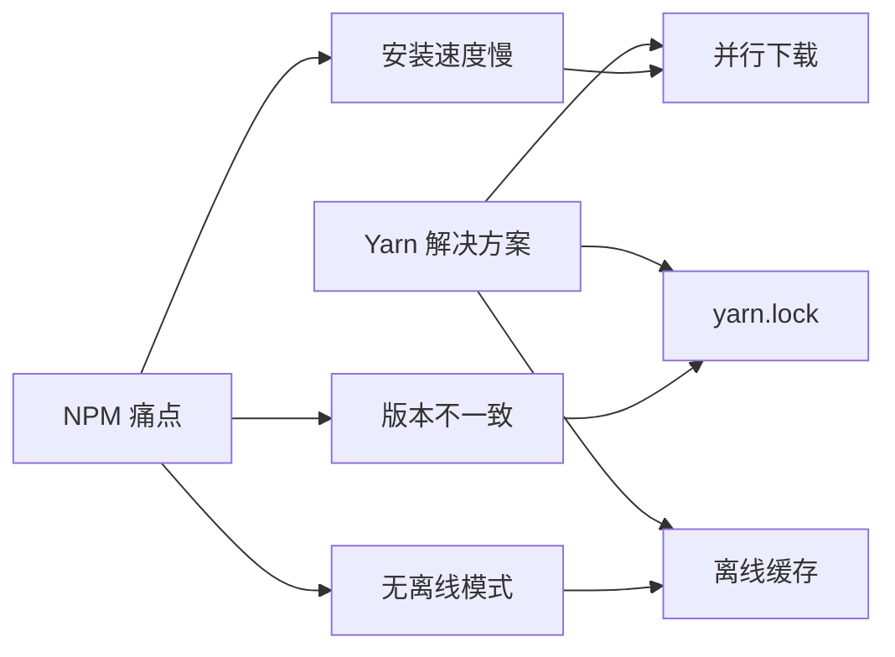
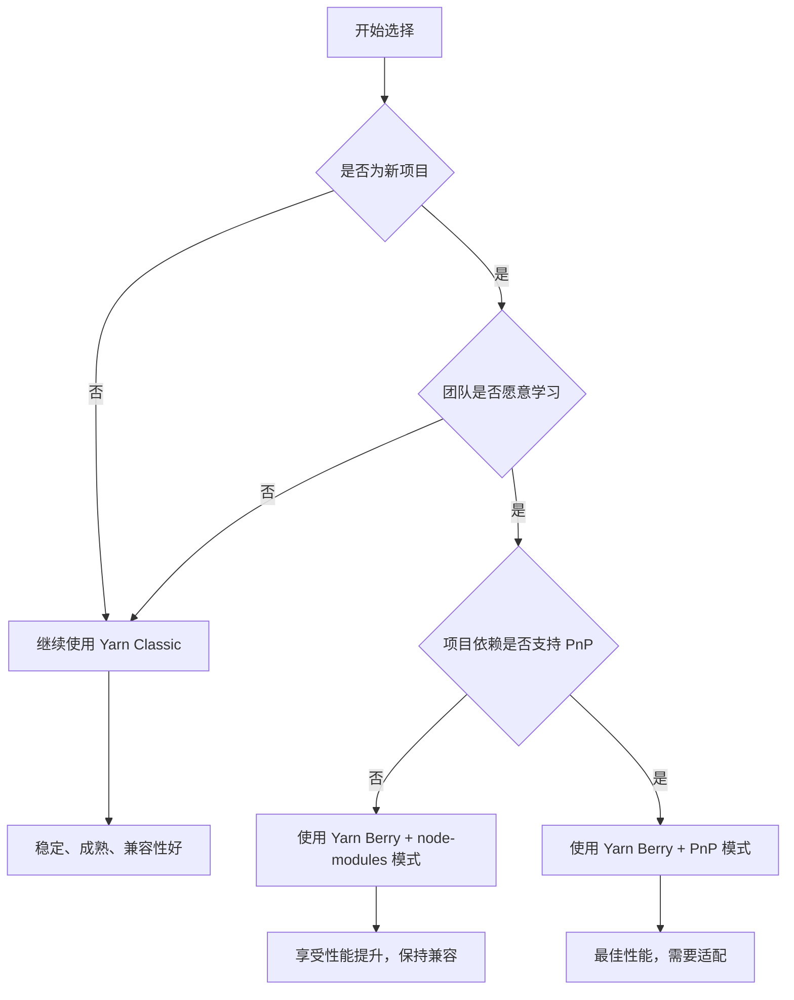

# [0143. YARN 包管理器](https://github.com/tnotesjs/TNotes.react/tree/main/notes/0143.%20YARN%20%E5%8C%85%E7%AE%A1%E7%90%86%E5%99%A8)

<!-- region:toc -->

- [1. 🎯 本节内容](#1--本节内容)
- [2. 🫧 评价](#2--评价)
- [3. 🤔 Yarn 是什么？](#3--yarn-是什么)
  - [3.1. 核心特性](#31-核心特性)
  - [3.2. Yarn 的发展历程](#32-yarn-的发展历程)
  - [3.3. 适用场景](#33-适用场景)
- [4. 🆚 Yarn Classic vs Yarn Berry](#4--yarn-classic-vs-yarn-berry)
  - [4.1. 核心差异](#41-核心差异)
  - [4.2. Plug'n'Play (PnP) 模式](#42-plugnplay-pnp-模式)
  - [4.3. 如何选择版本](#43-如何选择版本)
- [5. 🤔 如何安装和配置 Yarn？](#5--如何安装和配置-yarn)
  - [5.1. 安装 Yarn](#51-安装-yarn)
  - [5.2. 初始化项目](#52-初始化项目)
  - [5.3. 全局配置](#53-全局配置)
  - [5.4. 项目级配置](#54-项目级配置)
  - [5.5. 实际应用场景](#55-实际应用场景)
- [6. 🤔 Yarn 常用命令有哪些？](#6--yarn-常用命令有哪些)
  - [6.1. 依赖安装](#61-依赖安装)
  - [6.2. 依赖移除与更新](#62-依赖移除与更新)
  - [6.3. 脚本执行](#63-脚本执行)
  - [6.4. 依赖信息查询](#64-依赖信息查询)
  - [6.5. 缓存管理](#65-缓存管理)
  - [6.6. 工作区命令（Monorepo）](#66-工作区命令monorepo)
  - [6.7. 实际应用场景](#67-实际应用场景)
- [7. 🤔 如何从 NPM 迁移到 Yarn？](#7--如何从-npm-迁移到-yarn)
  - [7.1. 迁移步骤](#71-迁移步骤)
  - [7.2. 迁移检查清单](#72-迁移检查清单)
  - [7.3. 常见问题处理](#73-常见问题处理)
- [8. 🤔 Yarn Workspaces 如何使用？](#8--yarn-workspaces-如何使用)
  - [8.1. 配置 Workspaces](#81-配置-workspaces)
  - [8.2. 工作区命令](#82-工作区命令)
  - [8.3. 依赖提升与扁平化](#83-依赖提升与扁平化)
  - [8.4. 实际应用场景](#84-实际应用场景)
- [9. 🔗 引用](#9--引用)

<!-- endregion:toc -->

## 1. 🎯 本节内容

- Yarn 的核心特性与设计理念
- Yarn Classic 与 Yarn Berry 的区别
- Plug'n'Play (PnP) 模式的工作原理
- Yarn 的安装、配置与常用命令
- 从 NPM 迁移到 Yarn 的完整流程
- Yarn Workspaces 在 Monorepo 项目中的应用
- 离线模式与缓存机制
- 锁文件机制与依赖版本管理

## 2. 🫧 评价

Yarn 是 Facebook 推出的包管理工具，主要解决 NPM 早期的性能和一致性问题，在业界获得了广泛应用。

- Yarn 提供了更快的并行安装速度和完善的离线模式，适合需要稳定性和缓存优化的项目
- `yarn.lock` 锁文件机制确保了依赖版本的一致性，避免了"在我机器上能跑"的问题
- Yarn Workspaces 原生支持 Monorepo 项目，配置简单，文档丰富
- Yarn Berry（v2+）引入了 Plug'n'Play 模式，性能更优但需要生态适配
- 对于现有 Yarn 项目建议继续使用，新项目可考虑 PNPM 以获得更好的性能和磁盘空间利用率

## 3. 🤔 Yarn 是什么？

Yarn 是 Facebook 在 2016 年推出的包管理工具，旨在解决 NPM 早期版本的性能问题和依赖版本不一致的问题。

### 3.1. 核心特性

- 并行安装：同时下载多个依赖包，显著提升安装速度
- 离线模式：本地缓存已下载的包，无网络也能安装
- 锁文件机制：`yarn.lock` 确保依赖版本一致
- 扁平化结构：减少 `node_modules` 嵌套层级
- 工作区支持：原生支持 Monorepo 项目



### 3.2. Yarn 的发展历程

- 2016 年：Yarn Classic (v1) 发布，快速获得业界认可
- 2020 年：Yarn Berry (v2) 发布，引入 Plug'n'Play 模式
- 2021 年：Yarn Classic 进入维护模式，官方推荐使用 Yarn Berry
- 当前：Yarn Classic 仍广泛使用，Yarn Berry 逐步推广

```bash
# Yarn 版本演进
Yarn Classic (1.x)
├── 优势：稳定、成熟、兼容性好
├── 劣势：性能提升空间有限
└── 状态：维护模式（安全更新）

Yarn Berry (2.x+)
├── 优势：更快、PnP 模式、插件系统
├── 劣势：需要生态适配、学习成本高
└── 状态：官方推荐
```

### 3.3. 适用场景

选择 Yarn 当你需要：

- 稳定的包管理器，生态成熟
- 离线安装能力（网络不稳定环境）
- 已有 Yarn 项目需要维护
- 团队熟悉 Yarn 工作流程
- 不想投入成本学习新工具

⚠️ 不适合的场景：

- 追求极致磁盘空间节省（PNPM 更优）
- 需要严格的依赖隔离（PNPM 更优）
- 新项目且团队愿意尝试新工具

## 4. 🆚 Yarn Classic vs Yarn Berry

Yarn 有两个主要版本，需要特别注意它们之间的差异。

### 4.1. 核心差异

| 特性         | Yarn Classic (1.x) | Yarn Berry (2.x+) |
| ------------ | ------------------ | ----------------- |
| 发布时间     | 2016 年            | 2020 年           |
| node_modules | 传统方式           | Plug'n'Play (PnP) |
| 安装位置     | 全局或项目         | 项目内（.yarn）   |
| 兼容性       | 完全兼容           | 需要适配          |
| 性能         | 快                 | 更快              |
| 插件系统     | 无                 | 强大的插件系统    |
| 推荐程度     | 维护模式           | 官方推荐          |

### 4.2. Plug'n'Play (PnP) 模式

Yarn Berry 的核心创新是 PnP 模式，完全改变了依赖的加载方式。

```bash
# 传统 node_modules 方式（Yarn Classic）
node_modules/
├── package-a/
├── package-b/
└── package-c/

# PnP 模式（Yarn Berry）
.yarn/
├── cache/  # 压缩包缓存
│   ├── package-a-npm-1.0.0.zip
│   ├── package-b-npm-2.0.0.zip
│   └── package-c-npm-3.0.0.zip
└── unplugged/  # 需要原生编译的包
    └── some-native-module/

.pnp.cjs  # 依赖解析映射文件（核心）
```

::: code-group

```javascript [PnP 工作原理]
// ❌ 传统方式：Node.js 递归查找 node_modules
// 性能开销大，依赖不明确
require('lodash')
// Node.js 查找路径：
// ./node_modules/lodash
// ../node_modules/lodash
// ../../node_modules/lodash
// ... 一直到根目录

// ✅ PnP 模式：直接从映射表查找
// 性能优，依赖明确
require('lodash')
// .pnp.cjs 直接告诉 Node.js：
// lodash@4.17.21 位于 .yarn/cache/lodash-npm-4.17.21.zip
```

```bash [PnP 的优势]
# 1. 安装速度快
# - 不需要创建 node_modules 目录
# - 不需要复制大量文件
# - 只需下载 zip 包

# 2. 磁盘空间节省
# - 依赖以 zip 格式存储
# - 跨项目共享缓存

# 3. 依赖解析快
# - 不需要文件系统查找
# - 直接从映射表获取路径

# 4. 严格的依赖管理
# - 只能访问声明的依赖
# - 杜绝幽灵依赖
```

```bash [PnP 的问题]
# ❌ 某些工具不支持 PnP
Error: Cannot find module 'some-package'

# ✅ 解决方案 1：启用 node-modules 模式
# .yarnrc.yml
nodeLinker: node-modules

# ✅ 解决方案 2：使用兼容插件
yarn plugin import typescript
yarn plugin import workspace-tools

# ✅ 解决方案 3：配置 .pnp.cjs
# 手动添加兼容性补丁
```

:::

### 4.3. 如何选择版本



推荐策略：

- 现有项目：继续使用 Yarn Classic，无需迁移
- 新项目（保守）：使用 Yarn Berry + `node-modules` 模式
- 新项目（激进）：使用 Yarn Berry + PnP 模式
- 追求极致性能：考虑 PNPM

## 5. 🤔 如何安装和配置 Yarn？

### 5.1. 安装 Yarn

::: code-group

```bash [NPM 全局安装（推荐新手）]
# 安装 Yarn Classic
npm install -g yarn

# 验证安装
yarn --version
# 输出：1.22.19

# ✅ 优势：简单直接
# ⚠️ 缺点：版本固定，全局污染
```

```bash [Corepack（Node.js 16.10+）]
# 启用 Corepack
corepack enable

# 准备 Yarn
corepack prepare yarn@stable --activate

# 验证安装
yarn --version
# 输出：4.x.x (Yarn Berry)

# ✅ 优势：自动管理版本，团队协作版本一致
```

```bash [Homebrew（macOS）]
# 安装 Yarn Classic
brew install yarn

# 验证安装
yarn --version
# 输出：1.22.19

# ✅ 优势：与系统包管理器集成
```

```bash [官方脚本]
# 安装 Yarn Classic
curl -o- -L https://yarnpkg.com/install.sh | bash

# 验证安装
yarn --version

# ✅ 优势：官方推荐，支持多平台
```

:::

### 5.2. 初始化项目

```bash
# 创建新项目
yarn init

# 快速初始化（跳过交互）
yarn init -y

# 生成的 package.json
{
  "name": "my-project",
  "version": "1.0.0",
  "main": "index.js",
  "license": "MIT"
}

# 安装依赖
yarn add react react-dom

# 目录结构
my-project/
├── node_modules/
├── package.json
└── yarn.lock
```

### 5.3. 全局配置

::: code-group

```bash [Yarn Classic 配置]
# 查看当前配置
yarn config list

# 设置淘宝镜像
yarn config set registry https://registry.npmmirror.com

# 设置全局安装目录
yarn config set global-folder /path/to/global

# 设置缓存目录
yarn config set cache-folder /path/to/cache

# 启用离线模式
yarn config set yarn-offline-mirror ./npm-packages-offline-cache

# 删除配置
yarn config delete registry
```

```bash [Yarn Berry 配置]
# Yarn Berry 使用 .yarnrc.yml

# 查看配置
yarn config

# 设置镜像
yarn config set npmRegistryServer https://registry.npmmirror.com

# 设置缓存目录
yarn config set cacheFolder /path/to/cache

# 启用全局缓存
yarn config set enableGlobalCache true

# 设置 node-modules 模式（兼容旧工具）
yarn config set nodeLinker node-modules
```

:::

### 5.4. 项目级配置

::: code-group

```ini [Yarn Classic - .yarnrc]
# .yarnrc（项目根目录）
registry "https://registry.npmmirror.com"
yarn-offline-mirror "./npm-packages-offline-cache"
yarn-offline-mirror-pruning true
```

```yaml [Yarn Berry - .yarnrc.yml]
# .yarnrc.yml（项目根目录）
nodeLinker: node-modules # 使用传统 node_modules
# nodeLinker: pnp  # 使用 PnP 模式

npmRegistryServer: https://registry.npmmirror.com

enableGlobalCache: false # 项目级缓存

yarnPath: .yarn/releases/yarn-4.0.2.cjs # 锁定 Yarn 版本

plugins:
  - path: .yarn/plugins/@yarnpkg/plugin-typescript.cjs
    spec: '@yarnpkg/plugin-typescript'
```

:::

### 5.5. 实际应用场景

::: code-group

```bash [个人开发环境]
# 配置全局镜像
yarn config set registry https://registry.npmmirror.com

# 自定义缓存位置
yarn config set cache-folder /Volumes/SSD/.yarn-cache

# 查看缓存目录
yarn cache dir
```

```bash [团队协作环境]
# package.json
{
  "packageManager": "yarn@1.22.19",  # 锁定 Yarn 版本
  "engines": {
    "node": ">=16.0.0",
    "yarn": ">=1.22.0"
  }
}

# .yarnrc
registry "https://registry.npmmirror.com"
yarn-offline-mirror "./npm-packages-offline-cache"
```

```bash [CI/CD 环境]
# .github/workflows/ci.yml
- name: Setup Node.js
  uses: actions/setup-node@v3
  with:
    node-version: 18
    cache: 'yarn'

- name: Install dependencies
  run: yarn install --frozen-lockfile

# --frozen-lockfile：确保使用精确的锁文件版本
# 等同于 NPM 的 npm ci
```

:::

## 6. 🤔 Yarn 常用命令有哪些？

### 6.1. 依赖安装

```bash
# 安装所有依赖
yarn install
# 或简写
yarn

# 添加依赖
yarn add react react-dom
yarn add -D typescript  # 开发依赖
yarn add -O lodash  # 可选依赖
yarn add -P express  # 生产依赖（默认）

# 添加全局依赖
yarn global add create-react-app

# 指定版本
yarn add react@18.2.0
yarn add react@^18.0.0  # 兼容版本
yarn add react@latest  # 最新版本

# 从特定源安装
yarn add lodash --registry=https://registry.npmmirror.com
```

### 6.2. 依赖移除与更新

```bash
# 移除依赖
yarn remove lodash

# 移除全局依赖
yarn global remove create-react-app

# 更新依赖
yarn upgrade react  # 更新到允许的最新版本
yarn upgrade react@latest  # 更新到最新版本
yarn upgrade  # 更新所有依赖

# 交互式更新
yarn upgrade-interactive
yarn upgrade-interactive --latest  # 包括跨大版本更新
```

### 6.3. 脚本执行

```bash
# 运行 package.json 中的脚本
yarn run dev
# 或简写（内置命令可省略 run）
yarn dev

# 查看所有可用脚本
yarn run

# 执行 node_modules/.bin 中的命令
yarn run webpack

# Yarn Berry 支持 dlx（类似 npx）
yarn dlx create-react-app my-app
```

### 6.4. 依赖信息查询

```bash
# 查看依赖树
yarn list
yarn list --depth=0  # 只显示顶层依赖

# 查看特定包信息
yarn info react
yarn info react@18.2.0

# 查看包的所有版本
yarn info react versions

# 检查过期依赖
yarn outdated

# 为什么安装了某个包
yarn why lodash
```

### 6.5. 缓存管理

```bash
# 查看缓存目录
yarn cache dir

# 列出缓存的包
yarn cache list

# 清理缓存
yarn cache clean
yarn cache clean lodash  # 清理特定包

# 查看缓存大小
du -sh $(yarn cache dir)
```

### 6.6. 工作区命令（Monorepo）

```bash
# 在所有工作区执行命令
yarn workspaces run test

# 在特定工作区执行命令
yarn workspace my-package add lodash

# 列出所有工作区
yarn workspaces info

# 查看工作区依赖
yarn workspaces info --json
```

### 6.7. 实际应用场景

::: code-group

```bash [常规项目]
# 克隆项目后的首次安装
git clone https://github.com/user/project.git
cd project
yarn install

# 添加新依赖并保存
yarn add axios
# 自动更新 package.json 和 yarn.lock

# 在CI环境中安装（跳过生成锁文件）
yarn install --frozen-lockfile
```

```bash [Monorepo项目]
# 根目录 package.json
{
  "private": true,
  "workspaces": [
    "packages/*"
  ]
}

# 为特定包添加依赖
yarn workspace @myorg/utils add lodash

# 在所有包中运行构建
yarn workspaces run build

# 在特定包中运行测试
yarn workspace @myorg/utils run test
```

```bash [离线模式]
# 启用离线镜像
yarn config set yarn-offline-mirror ./npm-packages-offline-cache
yarn config set yarn-offline-mirror-pruning true

# 首次安装（下载到离线镜像）
yarn install

# 后续离线安装
yarn install --offline

# ✅ 适用场景：
# - 网络不稳定环境
# - 需要离线安装的生产环境
# - 团队共享离线包缓存
```

:::

## 7. 🤔 如何从 NPM 迁移到 Yarn？

### 7.1. 迁移步骤

```bash
# 步骤 1：安装 Yarn
npm install -g yarn

# 步骤 2：删除 NPM 相关文件
rm -rf node_modules package-lock.json

# 步骤 3：使用 Yarn 安装依赖
yarn install

# 步骤 4：验证项目运行
yarn run dev
yarn run build
yarn run test

# 步骤 5：提交 yarn.lock
git add yarn.lock
git rm package-lock.json
git commit -m "chore: migrate from npm to yarn"
```

### 7.2. 迁移检查清单

```markdown
# 迁移前检查

- [ ] 备份当前的 package.json 和 package-lock.json
- [ ] 记录当前项目的 Node.js 版本
- [ ] 记录所有全局安装的 NPM 工具
- [ ] 确认 CI/CD 配置需要更新
- [ ] 确认团队成员都了解 Yarn 使用方式

# 迁移后验证

- [ ] 所有依赖正确安装
- [ ] 项目能正常启动和构建
- [ ] 所有脚本命令正常运行
- [ ] 单元测试通过
- [ ] 集成测试通过
- [ ] 生产环境构建成功
- [ ] CI/CD 流程正常
```

### 7.3. 常见问题处理

::: code-group

```bash [问题1：脚本钩子差异]
# ❌ NPM 脚本与 Yarn 脚本行为不同
# NPM: 自动运行 pre/post 脚本
# Yarn: 某些钩子行为不同

# ✅ 解决方案：显式调用脚本
# package.json
{
  "scripts": {
    "preinstall": "node scripts/preinstall.js",
    "install": "node scripts/install.js",
    "postinstall": "node scripts/postinstall.js"
  }
}
```

```bash [问题2：离线模式配置]
# ❌ 首次安装失败
Error: Couldn't find package "xxx" in offline mirror

# ✅ 解决方案：先在线安装一次
yarn install  # 下载到缓存

# 配置离线镜像
yarn config set yarn-offline-mirror ./npm-packages-offline-cache

# 后续可离线安装
yarn install --offline
```

```bash [问题3：全局包迁移]
# 查看 NPM 全局包
npm list -g --depth=0

# 使用 Yarn 重新安装全局包
yarn global add create-react-app
yarn global add typescript
yarn global add eslint

# 卸载 NPM 全局包（可选）
npm uninstall -g create-react-app
```

:::

## 8. 🤔 Yarn Workspaces 如何使用？

Yarn Workspaces 是 Yarn 原生支持的 Monorepo 解决方案，配置简单且功能完善。

### 8.1. 配置 Workspaces

```json
// package.json（根目录）
{
  "name": "my-monorepo",
  "private": true,
  "workspaces": ["packages/*", "apps/*"],
  "scripts": {
    "build": "yarn workspaces run build",
    "test": "yarn workspaces run test",
    "dev": "yarn workspaces run dev"
  }
}
```

```bash
# 目录结构
my-monorepo/
├── package.json
├── yarn.lock
├── packages/
│   ├── utils/
│   │   └── package.json
│   └── ui/
│       └── package.json
└── apps/
    └── web/
        └── package.json
```

### 8.2. 工作区命令

```bash
# 在所有工作区执行命令
yarn workspaces run build
yarn workspaces run test

# 在特定工作区执行命令
yarn workspace @myorg/utils add lodash
yarn workspace @myorg/utils run test

# 列出所有工作区
yarn workspaces info

# 为 web 应用添加依赖
yarn workspace web add @myorg/utils

# web/package.json 自动生成
{
  "dependencies": {
    "@myorg/utils": "1.0.0"  # 自动链接到本地包
  }
}
```

### 8.3. 依赖提升与扁平化

Yarn Workspaces 会自动提升共同依赖到根目录，减少重复安装。

```bash
# 依赖提升示例
my-monorepo/
├── node_modules/  # 共同依赖提升到这里
│   ├── react/  # 所有包共享
│   └── lodash/
├── packages/
│   ├── utils/
│   │   ├── node_modules/  # 只有 utils 特有的依赖
│   │   └── package.json
│   └── ui/
│       ├── node_modules/  # 只有 ui 特有的依赖
│       └── package.json
└── apps/
    └── web/
        └── package.json
```

⚠️ 注意幽灵依赖问题：

```javascript
// ❌ 可能出现的幽灵依赖
// @myorg/utils/package.json 只声明了 react
{
  "dependencies": {
    "react": "^18.2.0"
  }
}

// 但可以访问到 web 依赖的 lodash
import lodash from 'lodash'  // 幽灵依赖，应避免

// ✅ 解决方案：显式声明所有依赖
{
  "dependencies": {
    "react": "^18.2.0",
    "lodash": "^4.17.21"  # 必须手动添加
  }
}
```

### 8.4. 实际应用场景

::: code-group

```bash [基础Monorepo]
# package.json
{
  "private": true,
  "workspaces": [
    "packages/*",
    "apps/*"
  ]
}

# 为 web 应用添加本地包依赖
yarn workspace web add @myorg/utils

# 为 utils 添加外部依赖
yarn workspace @myorg/utils add lodash

# 在所有包中运行测试
yarn workspaces run test
```

```bash [带类型声明的Monorepo]
# packages/utils/package.json
{
  "name": "@myorg/utils",
  "version": "1.0.0",
  "main": "dist/index.js",
  "types": "dist/index.d.ts",
  "scripts": {
    "build": "tsc",
    "dev": "tsc --watch"
  },
  "devDependencies": {
    "typescript": "^5.0.0"
  }
}

# apps/web/package.json
{
  "name": "web",
  "dependencies": {
    "@myorg/utils": "1.0.0"  # 自动链接
  }
}

# 在 web 中使用 utils
import { helper } from '@myorg/utils'  # TypeScript 类型完整
```

```bash [CI/CD场景]
# .github/workflows/ci.yml
name: Monorepo CI

on: [push, pull_request]

jobs:
  test:
    runs-on: ubuntu-latest
    steps:
      - uses: actions/checkout@v3

      - name: Setup Node.js
        uses: actions/setup-node@v3
        with:
          node-version: 18
          cache: 'yarn'

      - name: Install dependencies
        run: yarn install --frozen-lockfile

      - name: Run tests
        run: yarn workspaces run test

      - name: Build
        run: yarn workspaces run build
```

:::

## 9. 🔗 引用

- [Yarn 官方文档][1]
- [Yarn Classic 文档][2]
- [Yarn Berry 文档][3]
- [Yarn Workspaces 文档][4]
- [Plug'n'Play 详解][5]
- [Yarn 迁移指南][6]

[1]: https://yarnpkg.com
[2]: https://classic.yarnpkg.com
[3]: https://yarnpkg.com/getting-started
[4]: https://classic.yarnpkg.com/en/docs/workspaces
[5]: https://yarnpkg.com/features/pnp
[6]: https://yarnpkg.com/getting-started/migration
