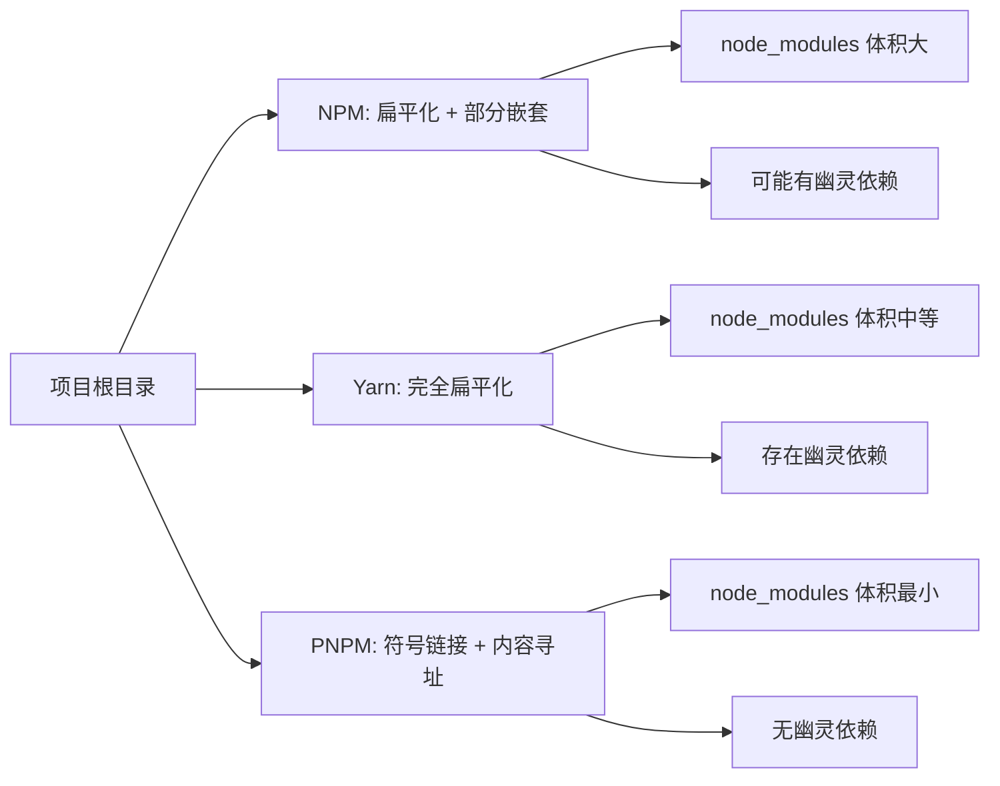
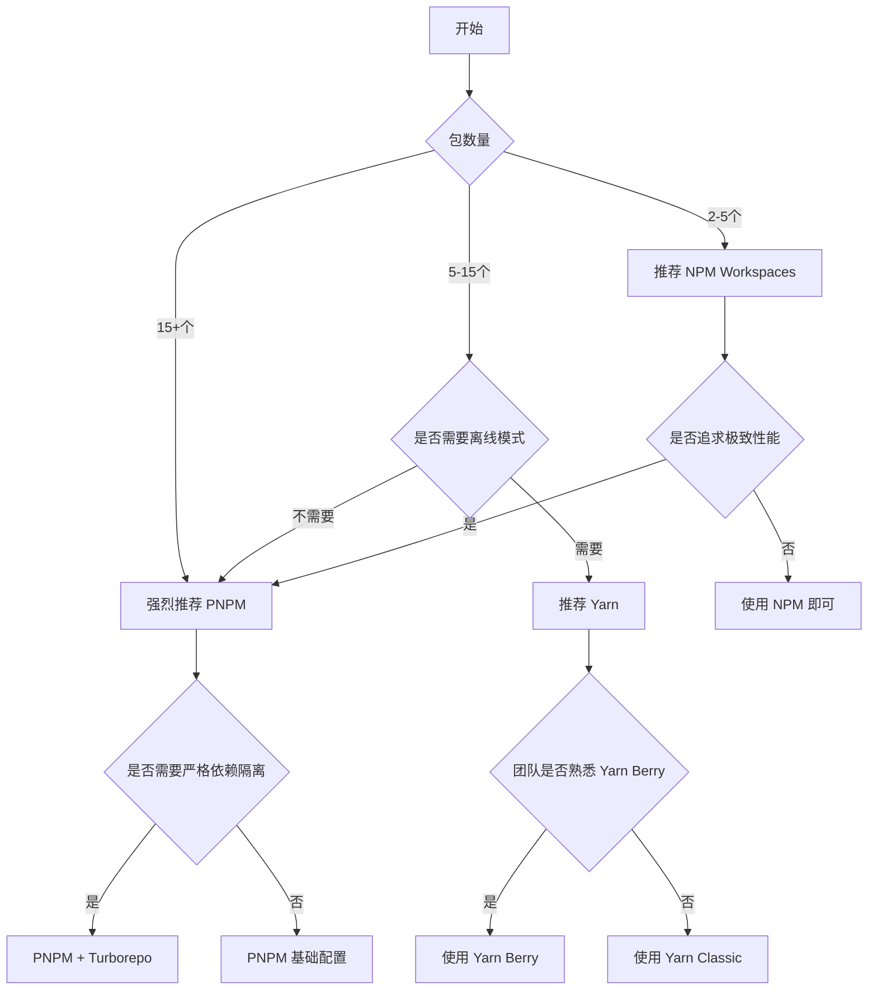

# [0145. NPM vs. Yarn vs. PNPM](https://github.com/tnotesjs/TNotes.react/tree/main/notes/0145.%20NPM%20vs.%20Yarn%20vs.%20PNPM)

<!-- region:toc -->

- [1. 🎯 本节内容](#1--本节内容)
- [2. 🫧 评价](#2--评价)
- [3. 🤔 为什么需要 Yarn 和 PNPM？](#3--为什么需要-yarn-和-pnpm)
  - [3.1. NPM 的痛点](#31-npm-的痛点)
  - [3.2. Yarn 的优势](#32-yarn-的优势)
  - [3.3. PNPM 的突破](#33-pnpm-的突破)
  - [3.4. 实际应用场景对比](#34-实际应用场景对比)
  - [3.5. 性能对比数据](#35-性能对比数据)
  - [3.6. 选型建议](#36-选型建议)
- [4. 🆚 NPM vs Yarn vs PNPM 对比](#4--npm-vs-yarn-vs-pnpm-对比)
  - [4.1. 核心特性对比](#41-核心特性对比)
  - [4.2. 锁文件对比](#42-锁文件对比)
  - [4.3. 依赖结构对比](#43-依赖结构对比)
  - [4.4. 工作区（Workspace）支持](#44-工作区workspace支持)
  - [4.5. Yarn Classic vs Yarn Berry](#45-yarn-classic-vs-yarn-berry)
- [5. 🤔 Yarn 如何安装与配置？](#5--yarn-如何安装与配置)
  - [5.1. 安装 Yarn](#51-安装-yarn)
  - [5.2. 初始化项目](#52-初始化项目)
  - [5.3. 配置 Yarn](#53-配置-yarn)
  - [5.4. 项目级配置文件](#54-项目级配置文件)
  - [5.5. 实际应用场景](#55-实际应用场景)
- [6. 🤔 PNPM 如何安装与配置？](#6--pnpm-如何安装与配置)
  - [6.1. 安装 PNPM](#61-安装-pnpm)
  - [6.2. 初始化项目](#62-初始化项目)
  - [6.3. 配置 PNPM](#63-配置-pnpm)
  - [6.4. 项目级配置文件](#64-项目级配置文件)
  - [6.5. PNPM 存储结构说明](#65-pnpm-存储结构说明)
  - [6.6. 实际应用场景](#66-实际应用场景)
- [7. 🤔 Yarn 常用命令有哪些？](#7--yarn-常用命令有哪些)
  - [7.1. 依赖安装](#71-依赖安装)
  - [7.2. 依赖移除与更新](#72-依赖移除与更新)
  - [7.3. 脚本执行](#73-脚本执行)
  - [7.4. 依赖信息查询](#74-依赖信息查询)
  - [7.5. 缓存管理](#75-缓存管理)
  - [7.6. 工作区命令（Monorepo）](#76-工作区命令monorepo)
  - [7.7. 实际应用场景](#77-实际应用场景)
- [8. 🤔 PNPM 常用命令有哪些？](#8--pnpm-常用命令有哪些)
  - [8.1. 依赖安装](#81-依赖安装)
  - [8.2. 依赖移除与更新](#82-依赖移除与更新)
  - [8.3. 脚本执行](#83-脚本执行)
  - [8.4. 依赖信息查询](#84-依赖信息查询)
  - [8.5. 存储管理](#85-存储管理)
  - [8.6. 工作区命令（Monorepo）](#86-工作区命令monorepo)
  - [8.7. 其他实用命令](#87-其他实用命令)
  - [8.8. 实际应用场景](#88-实际应用场景)
- [9. 🤔 如何迁移现有项目的包管理器？](#9--如何迁移现有项目的包管理器)
  - [9.1. 从 NPM 迁移到 Yarn](#91-从-npm-迁移到-yarn)
  - [9.2. 从 NPM 迁移到 PNPM](#92-从-npm-迁移到-pnpm)
  - [9.3. 从 Yarn 迁移到 PNPM](#93-从-yarn-迁移到-pnpm)
  - [9.4. 迁移检查清单](#94-迁移检查清单)
  - [9.5. 常见问题处理](#95-常见问题处理)
  - [9.6. 团队协作注意事项](#96-团队协作注意事项)
- [10. 🤔 Monorepo 场景下如何选择？](#10--monorepo-场景下如何选择)
  - [10.1. Monorepo 包管理器对比](#101-monorepo-包管理器对比)
  - [10.2. NPM Workspaces 配置](#102-npm-workspaces-配置)
  - [10.3. Yarn Workspaces 配置](#103-yarn-workspaces-配置)
  - [10.4. PNPM Workspaces 配置（推荐）](#104-pnpm-workspaces-配置推荐)
  - [10.5. 实际应用场景](#105-实际应用场景)
  - [10.6. 配合构建工具](#106-配合构建工具)
  - [10.7. 选型决策树](#107-选型决策树)
- [11. 🔗 引用](#11--引用)

<!-- endregion:toc -->

## 1. 🎯 本节内容

- Yarn 与 PNPM 的核心特性
- 三种包管理器的优缺点对比
- Yarn Classic 与 Yarn Berry 的区别
- PNPM 的硬链接与符号链接机制
- 包管理器的安装与配置方法
- 常用命令与最佳实践
- 项目迁移策略
- Monorepo 场景的选型建议

## 2. 🫧 评价

本节介绍 NPM 之外的两个主流包管理工具 Yarn 和 PNPM，帮助开发者根据项目需求选择合适的包管理方案。

- Yarn 提供了更快的安装速度和离线模式，适合需要稳定性和缓存优化的项目
- PNPM 通过独特的存储机制节省磁盘空间，在 Monorepo 项目中表现优秀
- 选择包管理器需要考虑团队熟悉度、项目规模和特殊需求
- 建议在新项目中优先考虑 PNPM，它解决了 NPM 和 Yarn 的诸多痛点
- 迁移包管理器需谨慎，确保团队成员都了解新工具的使用方式

## 3. 🤔 为什么需要 Yarn 和 PNPM？

NPM 作为 Node.js 的默认包管理器已经服务了多年，但在实际使用中暴露出一些问题，促使社区开发了 Yarn 和 PNPM 这两个替代方案。

### 3.1. NPM 的痛点

- 安装速度慢：串行安装依赖，大型项目耗时较长
- 磁盘空间占用大：每个项目都会复制一份完整的依赖
- 依赖版本不确定：早期版本缺少锁文件机制
- `node_modules` 结构混乱：嵌套依赖导致目录层级过深
- 幽灵依赖问题：可以访问到未声明的依赖包

```bash
# ❌ NPM 早期问题示例
# 项目 A 和项目 B 都依赖 lodash@4.17.21
# 结果磁盘上存在两份完全相同的文件

项目A/node_modules/lodash/  # 占用 1.5MB
项目B/node_modules/lodash/  # 又占用 1.5MB
```

### 3.2. Yarn 的优势

Facebook 在 2016 年推出 Yarn，主要解决以下问题：

- 并行安装：同时下载多个依赖包，显著提升速度
- 离线模式：本地缓存已下载的包，无网络也能安装
- 锁文件机制：`yarn.lock` 确保依赖版本一致
- 扁平化结构：减少 `node_modules` 嵌套层级
- 工作区支持：原生支持 Monorepo 项目

```bash
# ✅ Yarn 并行安装示例
yarn install

# 输出显示并行下载
[1/4] Resolving packages...
[2/4] Fetching packages...  # 同时下载多个包
[3/4] Linking dependencies...
[4/4] Building fresh packages...
```

### 3.3. PNPM 的突破

PNPM 在 2017 年发布，通过创新的存储机制彻底改变了依赖管理方式：

- 内容寻址存储：全局只保存一份文件，通过硬链接共享
- 严格的依赖隔离：只能访问声明的依赖，杜绝幽灵依赖
- 磁盘空间节省：多个项目共享同一份依赖文件
- 安装速度快：结合缓存和硬链接，速度优于 NPM 和 Yarn
- 天生支持 Monorepo：workspace 功能强大

```bash
# ✅ PNPM 存储机制示例
# 全局存储中只有一份 lodash@4.17.21

~/.pnpm-store/v3/files/
└── ab/cd1234.../lodash@4.17.21  # 唯一副本

项目A/node_modules/.pnpm/lodash@4.17.21/  # 硬链接指向全局存储
项目B/node_modules/.pnpm/lodash@4.17.21/  # 硬链接指向同一位置

# 磁盘实际只占用 1.5MB，而不是 3MB
```

### 3.4. 实际应用场景对比

```javascript
// ❌ NPM 典型问题：幽灵依赖
// package.json 只声明了 react
{
  "dependencies": {
    "react": "^18.2.0"
  }
}

// 但代码中可以直接使用 react 的依赖
import PropTypes from 'prop-types'  // 未声明但能用

// ✅ PNPM 严格模式：杜绝幽灵依赖
// 上述代码会报错
Error: Cannot find module 'prop-types'

// 必须显式声明
{
  "dependencies": {
    "react": "^18.2.0",
    "prop-types": "^15.8.1"  // 必须手动添加
  }
}
```

### 3.5. 性能对比数据

以一个中型 React 项目为例（约 1000 个依赖包）：

| 指标       | NPM 7 | Yarn 1 | PNPM 8 |
| ---------- | ----- | ------ | ------ |
| 首次安装   | 45s   | 32s    | 28s    |
| 缓存后安装 | 18s   | 12s    | 8s     |
| 磁盘占用   | 450MB | 420MB  | 180MB  |
| 锁文件大小 | 1.2MB | 800KB  | 600KB  |

⚠️ 实际性能受网络环境、硬件配置和项目规模影响，数据仅供参考。

### 3.6. 选型建议

- 选择 Yarn 当你需要：
  - 稳定的包管理器，生态成熟
  - 离线安装能力
  - 已有 Yarn 项目需要维护
  - 团队熟悉 Yarn 工作流程
- 选择 PNPM 当你需要：
  - 节省磁盘空间（多项目开发）
  - 严格的依赖管理（避免幽灵依赖）
  - Monorepo 架构项目
  - 追求最快的安装速度
  - 新项目且团队愿意学习
- 继续使用 NPM 当你需要：
  - 最小化学习成本
  - 项目规模小，性能要求不高
  - 依赖 NPM 独有功能（如 npm scripts 的特定行为）
  - 公司规定或团队统一标准

## 4. 🆚 NPM vs Yarn vs PNPM 对比

### 4.1. 核心特性对比

| 特性          | NPM      | Yarn     | PNPM     |
| ------------- | -------- | -------- | -------- |
| 安装速度      | 慢       | 快       | 最快     |
| 磁盘占用      | 大       | 中等     | 最小     |
| 依赖隔离      | 弱       | 弱       | 强       |
| 离线模式      | 部分支持 | 完全支持 | 完全支持 |
| Monorepo 支持 | 基础     | 良好     | 优秀     |
| 生态成熟度    | 最高     | 高       | 中等     |
| 学习成本      | 无       | 低       | 中等     |

### 4.2. 锁文件对比

| 工具 | 锁文件名            | 格式   | 特点                 |
| ---- | ------------------- | ------ | -------------------- |
| NPM  | `package-lock.json` | JSON   | 文件较大，可读性一般 |
| Yarn | `yarn.lock`         | 自定义 | 简洁，易读           |
| PNPM | `pnpm-lock.yaml`    | YAML   | 紧凑，层级清晰       |

### 4.3. 依赖结构对比



### 4.4. 工作区（Workspace）支持

| 工具 | 语法                  | 成熟度 | 特点                   |
| ---- | --------------------- | ------ | ---------------------- |
| NPM  | `workspaces` 字段     | 基础   | 7.x 后支持，功能有限   |
| Yarn | `workspaces` 字段     | 良好   | 功能完善，文档丰富     |
| PNPM | `pnpm-workspace.yaml` | 优秀   | 性能最佳，支持过滤执行 |

### 4.5. Yarn Classic vs Yarn Berry

Yarn 有两个主要版本，需要特别注意：

| 特性         | Yarn Classic (1.x) | Yarn Berry (2.x+) |
| ------------ | ------------------ | ----------------- |
| 发布时间     | 2016 年            | 2020 年           |
| node_modules | 传统方式           | Plug'n'Play (PnP) |
| 安装位置     | 全局或项目         | 项目内（.yarn）   |
| 兼容性       | 完全兼容           | 需要适配          |
| 性能         | 快                 | 更快              |
| 推荐程度     | 维护模式           | 官方推荐          |

```bash
# ❌ Yarn Berry PnP 模式可能遇到的问题
# 某些工具不支持 PnP，需要降级或配置
Error: Cannot find module 'some-package'

# ✅ 解决方案：启用 node-modules 模式
# .yarnrc.yml
nodeLinker: node-modules
```

⚠️ Yarn Berry 是重大更新，迁移需要评估项目兼容性。

## 5. 🤔 Yarn 如何安装与配置？

### 5.1. 安装 Yarn

```bash
# 方式 1：通过 NPM 全局安装（推荐新手）
npm install -g yarn

# 方式 2：通过 Corepack 启用（Node.js 16.10+）
corepack enable
corepack prepare yarn@stable --activate

# 方式 3：通过 Homebrew 安装（macOS）
brew install yarn

# 验证安装
yarn --version
# 输出：1.22.19 或 4.x.x
```

### 5.2. 初始化项目

```bash
# 创建新项目
yarn init

# 快速初始化（跳过交互）
yarn init -y

# 生成的 package.json
{
  "name": "my-project",
  "version": "1.0.0",
  "main": "index.js",
  "license": "MIT"
}
```

### 5.3. 配置 Yarn

```bash
# 查看当前配置
yarn config list

# 设置淘宝镜像
yarn config set registry https://registry.npmmirror.com

# 设置全局安装目录
yarn config set global-folder /path/to/global

# 设置缓存目录
yarn config set cache-folder /path/to/cache

# 启用离线模式
yarn config set yarn-offline-mirror ./npm-packages-offline-cache

# 删除配置
yarn config delete registry
```

### 5.4. 项目级配置文件

```yaml
# .yarnrc.yml（Yarn Berry 配置）
nodeLinker: node-modules
yarnPath: .yarn/releases/yarn-4.0.2.cjs
# npmRegistryServer: https://registry.npmmirror.com
# enableGlobalCache: false
```

```ini
# .yarnrc（Yarn Classic 配置）
registry "https://registry.npmmirror.com"
yarn-offline-mirror "./npm-packages-offline-cache"
```

### 5.5. 实际应用场景

```bash
# ✅ 团队协作场景：锁定 Yarn 版本
# package.json
{
  "packageManager": "yarn@1.22.19"
}

# 其他成员运行任何 yarn 命令时会自动使用指定版本

# ⚠️ 注意：需要 Node.js 16.10+ 和启用 Corepack
corepack enable
```

## 6. 🤔 PNPM 如何安装与配置？

### 6.1. 安装 PNPM

```bash
# 方式 1：通过 NPM 全局安装
npm install -g pnpm

# 方式 2：通过官方脚本安装（推荐）
curl -fsSL https://get.pnpm.io/install.sh | sh -

# 方式 3：通过 Corepack 启用（Node.js 16.13+）
corepack enable
corepack prepare pnpm@latest --activate

# 方式 4：通过 Homebrew 安装（macOS）
brew install pnpm

# 验证安装
pnpm --version
# 输出：8.x.x
```

### 6.2. 初始化项目

```bash
# 创建新项目
pnpm init

# 生成的 package.json
{
  "name": "my-project",
  "version": "1.0.0",
  "description": "",
  "main": "index.js",
  "scripts": {
    "test": "echo \"Error: no test specified\" && exit 1"
  },
  "keywords": [],
  "author": "",
  "license": "ISC"
}
```

### 6.3. 配置 PNPM

```bash
# 查看当前配置
pnpm config list

# 设置淘宝镜像
pnpm config set registry https://registry.npmmirror.com

# 设置全局存储目录
pnpm config set store-dir /path/to/pnpm-store

# 设置全局 bin 目录
pnpm config set global-bin-dir /path/to/bin

# 启用严格模式（推荐）
pnpm config set strict-peer-dependencies true

# 删除配置
pnpm config delete registry
```

### 6.4. 项目级配置文件

```yaml
# .npmrc（项目根目录）
registry=https://registry.npmmirror.com shamefully-hoist=false strict-peer-dependencies=true auto-install-peers=true
```

```yaml
# pnpm-workspace.yaml（Monorepo 配置）
packages:
  - 'packages/*'
  - 'apps/*'
  - '!**/test/**'
```

### 6.5. PNPM 存储结构说明

```bash
# PNPM 全局存储位置
~/.pnpm-store/
└── v3/
    └── files/
        └── 00/
            └── 1a2b3c4d...  # 基于内容哈希的文件

# 项目中的 node_modules
node_modules/
├── .pnpm/  # 实际包内容（硬链接到全局存储）
│   ├── react@18.2.0/
│   └── lodash@4.17.21/
└── react -> .pnpm/react@18.2.0/node_modules/react  # 符号链接
```

### 6.6. 实际应用场景

```bash
# ✅ 清理全局存储中未使用的包
pnpm store prune

# ✅ 验证存储完整性
pnpm store status

# ⚠️ 某些工具不支持符号链接时的解决方案
# .npmrc
node-linker=hoisted  # 使用传统的扁平化结构
```

## 7. 🤔 Yarn 常用命令有哪些？

### 7.1. 依赖安装

```bash
# 安装所有依赖
yarn install
# 或简写
yarn

# 添加依赖
yarn add react react-dom
yarn add -D typescript  # 开发依赖
yarn add -O lodash  # 可选依赖
yarn add -P express  # 生产依赖（默认）

# 添加全局依赖
yarn global add create-react-app

# 指定版本
yarn add react@18.2.0
yarn add react@^18.0.0  # 兼容版本
yarn add react@latest  # 最新版本
```

### 7.2. 依赖移除与更新

```bash
# 移除依赖
yarn remove lodash

# 移除全局依赖
yarn global remove create-react-app

# 更新依赖
yarn upgrade react  # 更新到允许的最新版本
yarn upgrade react@latest  # 更新到最新版本
yarn upgrade  # 更新所有依赖

# 交互式更新
yarn upgrade-interactive
yarn upgrade-interactive --latest  # 包括跨大版本更新
```

### 7.3. 脚本执行

```bash
# 运行 package.json 中的脚本
yarn run dev
# 或简写（内置命令可省略 run）
yarn dev

# 查看所有可用脚本
yarn run

# 执行 node_modules/.bin 中的命令
yarn run webpack
# 或使用 dlx（类似 npx）
yarn dlx create-react-app my-app
```

### 7.4. 依赖信息查询

```bash
# 查看依赖树
yarn list
yarn list --depth=0  # 只显示顶层依赖

# 查看特定包信息
yarn info react
yarn info react@18.2.0

# 查看包的所有版本
yarn info react versions

# 检查过期依赖
yarn outdated

# 为什么安装了某个包
yarn why lodash
```

### 7.5. 缓存管理

```bash
# 查看缓存目录
yarn cache dir

# 列出缓存的包
yarn cache list

# 清理缓存
yarn cache clean
yarn cache clean lodash  # 清理特定包
```

### 7.6. 工作区命令（Monorepo）

```bash
# 在所有工作区执行命令
yarn workspaces run test

# 在特定工作区执行命令
yarn workspace my-package add lodash

# 列出所有工作区
yarn workspaces info
```

### 7.7. 实际应用场景

::: code-group

```bash [常规项目]
# 克隆项目后的首次安装
git clone https://github.com/user/project.git
cd project
yarn install

# 添加新依赖并保存
yarn add axios
# 自动更新 package.json 和 yarn.lock

# 在CI环境中安装（跳过生成锁文件）
yarn install --frozen-lockfile
```

```bash [Monorepo项目]
# 根目录 package.json
{
  "private": true,
  "workspaces": [
    "packages/*"
  ]
}

# 为特定包添加依赖
yarn workspace @myorg/utils add lodash

# 在所有包中运行构建
yarn workspaces run build
```

:::

## 8. 🤔 PNPM 常用命令有哪些？

### 8.1. 依赖安装

```bash
# 安装所有依赖
pnpm install
# 或简写
pnpm i

# 添加依赖
pnpm add react react-dom
pnpm add -D typescript  # 开发依赖
pnpm add -O lodash  # 可选依赖
pnpm add -P express  # 生产依赖（默认）

# 添加全局依赖
pnpm add -g create-react-app

# 指定版本
pnpm add react@18.2.0
pnpm add react@^18.0.0
pnpm add react@latest
```

### 8.2. 依赖移除与更新

```bash
# 移除依赖
pnpm remove lodash
# 或简写
pnpm rm lodash

# 移除全局依赖
pnpm remove -g create-react-app

# 更新依赖
pnpm update react  # 更新到允许的最新版本
pnpm update react@latest  # 更新到最新版本
pnpm update  # 更新所有依赖

# 交互式更新
pnpm update -i
pnpm update -i --latest  # 包括跨大版本更新
```

### 8.3. 脚本执行

```bash
# 运行 package.json 中的脚本
pnpm run dev
# 或简写
pnpm dev

# 列出所有可用脚本
pnpm run

# 执行 node_modules/.bin 中的命令
pnpm exec webpack

# 类似 npx（无需安装即可执行）
pnpm dlx create-react-app my-app
```

### 8.4. 依赖信息查询

```bash
# 查看依赖树
pnpm list
pnpm list --depth=0  # 只显示顶层依赖
pnpm list --depth=1  # 显示一级子依赖

# 查看特定包信息
pnpm view react
pnpm view react@18.2.0

# 查看包的所有版本
pnpm view react versions

# 检查过期依赖
pnpm outdated

# 为什么安装了某个包
pnpm why lodash
```

### 8.5. 存储管理

```bash
# 查看存储位置
pnpm store path

# 查看存储状态
pnpm store status

# 清理未使用的包
pnpm store prune

# 添加包到存储（预缓存）
pnpm store add react react-dom
```

### 8.6. 工作区命令（Monorepo）

```bash
# 在所有工作区执行命令
pnpm -r run test  # -r 代表 --recursive

# 在特定工作区执行命令
pnpm --filter my-package add lodash

# 使用过滤器执行
pnpm --filter "./packages/*" run build
pnpm --filter "!@myorg/admin" run test  # 排除特定包

# 列出所有工作区
pnpm ls -r --depth -1
```

### 8.7. 其他实用命令

```bash
# 检查项目问题
pnpm audit

# 修复安全漏洞
pnpm audit --fix

# 发布包
pnpm publish

# 链接本地包
pnpm link ../my-package

# 导入 package-lock.json 或 yarn.lock
pnpm import
```

### 8.8. 实际应用场景

::: code-group

```bash [常规项目]
# 克隆项目后的首次安装
git clone https://github.com/user/project.git
cd project
pnpm install

# 添加新依赖
pnpm add axios

# CI 环境安装（跳过可选依赖）
pnpm install --prod --frozen-lockfile
```

```bash [Monorepo项目]
# pnpm-workspace.yaml
packages:
  - 'packages/*'
  - 'apps/*'

# 为特定包添加依赖
pnpm --filter @myorg/utils add lodash

# 在所有包中运行构建
pnpm -r run build

# 只构建被改动的包及其依赖者
pnpm --filter=[origin/main] run build
```

```bash [性能优化]
# 使用存储服务器加速团队安装
pnpm server start

# 在另一台机器上使用
pnpm config set store-server http://localhost:5813

# 预缓存常用包
pnpm store add react react-dom lodash axios
```

:::

## 9. 🤔 如何迁移现有项目的包管理器？

### 9.1. 从 NPM 迁移到 Yarn

```bash
# 步骤 1：安装 Yarn
npm install -g yarn

# 步骤 2：删除 NPM 相关文件
rm -rf node_modules package-lock.json

# 步骤 3：使用 Yarn 安装依赖
yarn install

# 步骤 4：验证项目运行
yarn run dev

# 步骤 5：提交 yarn.lock
git add yarn.lock
git commit -m "chore: migrate from npm to yarn"
```

### 9.2. 从 NPM 迁移到 PNPM

```bash
# 步骤 1：安装 PNPM
npm install -g pnpm

# 步骤 2：删除 NPM 相关文件
rm -rf node_modules package-lock.json

# 步骤 3：导入 package-lock.json（可选）
pnpm import  # 如果保留了 package-lock.json

# 步骤 4：使用 PNPM 安装依赖
pnpm install

# 步骤 5：验证项目运行
pnpm run dev

# 步骤 6：提交 pnpm-lock.yaml
git add pnpm-lock.yaml
git commit -m "chore: migrate from npm to pnpm"
```

### 9.3. 从 Yarn 迁移到 PNPM

```bash
# 步骤 1：安装 PNPM
npm install -g pnpm

# 步骤 2：删除 Yarn 相关文件
rm -rf node_modules yarn.lock .yarn/ .yarnrc.yml

# 步骤 3：使用 PNPM 安装依赖
pnpm install

# 步骤 4：验证项目运行
pnpm run dev

# 步骤 5：提交 pnpm-lock.yaml
git add pnpm-lock.yaml .npmrc
git commit -m "chore: migrate from yarn to pnpm"
```

### 9.4. 迁移检查清单

```markdown
# 迁移前检查

- [ ] 备份当前的 package.json 和锁文件
- [ ] 记录当前项目的 Node.js 版本
- [ ] 记录所有全局安装的工具
- [ ] 确认 CI/CD 配置需要更新

# 迁移后验证

- [ ] 所有依赖正确安装
- [ ] 项目能正常启动和构建
- [ ] 所有脚本命令正常运行
- [ ] 单元测试通过
- [ ] 生产环境构建成功
- [ ] CI/CD 流程正常
```

### 9.5. 常见问题处理

```bash
# ❌ 问题 1：某些包在 PNPM 下找不到
Error: Cannot find module 'xxx'

# ✅ 解决方案：添加到 dependencies
pnpm add xxx

# 或使用 hoisting
# .npmrc
shamefully-hoist=true

# ❌ 问题 2：预构建脚本失败
Error: lifecycle script `prepare` failed

# ✅ 解决方案：禁用脚本
pnpm install --ignore-scripts

# 然后手动运行需要的脚本
pnpm rebuild

# ❌ 问题 3：peer dependencies 冲突
WARN  Issues with peer dependencies found

# ✅ 解决方案：自动安装 peer dependencies
# .npmrc
auto-install-peers=true

# 或手动安装
pnpm add peer-dependency-name
```

### 9.6. 团队协作注意事项

```bash
# ✅ 团队迁移最佳实践

# 1. 在 README 中添加说明
echo "## 包管理器

本项目使用 PNPM 作为包管理工具。

\`\`\`bash
# 安装 PNPM
npm install -g pnpm

# 安装依赖
pnpm install

# 运行项目
pnpm run dev
\`\`\`" >> README.md

# 2. 添加 .npmrc 配置
echo "engine-strict=true" > .npmrc

# 3. 在 package.json 中指定包管理器
# package.json
{
  "engines": {
    "node": ">=16.0.0",
    "pnpm": ">=8.0.0"
  },
  "packageManager": "pnpm@8.10.0"
}

# 4. 更新 CI 配置
# .github/workflows/ci.yml
- name: Install PNPM
  uses: pnpm/action-setup@v2
  with:
    version: 8

- name: Install dependencies
  run: pnpm install --frozen-lockfile
```

## 10. 🤔 Monorepo 场景下如何选择？

### 10.1. Monorepo 包管理器对比

| 特性       | NPM Workspaces | Yarn Workspaces | PNPM Workspaces |
| ---------- | -------------- | --------------- | --------------- |
| 配置复杂度 | 简单           | 简单            | 中等            |
| 性能       | 一般           | 好              | 最佳            |
| 磁盘占用   | 大             | 中等            | 最小            |
| 依赖提升   | 自动           | 自动            | 可控            |
| 过滤执行   | 基础           | 基础            | 强大            |
| 发布流程   | 需要额外工具   | 需要额外工具    | 内置支持        |

### 10.2. NPM Workspaces 配置

```json
// package.json
{
  "name": "my-monorepo",
  "private": true,
  "workspaces": ["packages/*", "apps/*"],
  "scripts": {
    "build": "npm run build --workspaces",
    "test": "npm run test --workspaces"
  }
}
```

```bash
# NPM Workspaces 命令
npm install lodash -w packages/utils  # 为特定包安装依赖
npm run build --workspaces  # 在所有工作区运行构建
npm run test --workspace=packages/utils  # 在特定工作区运行测试
```

### 10.3. Yarn Workspaces 配置

```json
// package.json
{
  "name": "my-monorepo",
  "private": true,
  "workspaces": ["packages/*", "apps/*"],
  "scripts": {
    "build": "yarn workspaces run build",
    "test": "yarn workspaces run test"
  }
}
```

```bash
# Yarn Workspaces 命令
yarn workspace @myorg/utils add lodash  # 为特定包安装依赖
yarn workspaces run build  # 在所有工作区运行构建
yarn workspace @myorg/utils run test  # 在特定工作区运行测试
```

### 10.4. PNPM Workspaces 配置（推荐）

```yaml
# pnpm-workspace.yaml
packages:
  - 'packages/*'
  - 'apps/*'
  - '!**/test/**'
```

```json
// package.json
{
  "name": "my-monorepo",
  "private": true,
  "scripts": {
    "build": "pnpm -r run build",
    "build:filter": "pnpm --filter './packages/*' run build",
    "test": "pnpm -r run test",
    "dev": "pnpm --parallel -r run dev"
  }
}
```

```bash
# PNPM Workspaces 命令（功能最强大）

# 为特定包安装依赖
pnpm --filter @myorg/utils add lodash

# 在所有工作区运行构建
pnpm -r run build

# 使用过滤器
pnpm --filter "./packages/*" run build  # 只构建 packages 下的包
pnpm --filter "!@myorg/admin" run test  # 排除特定包

# 并行执行
pnpm --parallel -r run dev  # 所有包并行运行 dev

# 依赖拓扑排序
pnpm -r --workspace-concurrency=1 run build  # 按依赖顺序构建

# 只构建改动的包
pnpm --filter=[origin/main] run build
```

### 10.5. 实际应用场景

::: code-group

```bash [小型Monorepo（NPM）]
# 适用场景：2-5 个包，依赖关系简单

my-monorepo/
├── package.json
├── packages/
│   ├── utils/
│   └── ui/
└── apps/
    └── web/

# 优点：
# - 配置简单，学习成本低
# - Node.js 内置，无需额外安装

# 缺点：
# - 功能有限，不适合大型项目
# - 性能一般
```

```bash [中型Monorepo（Yarn）]
# 适用场景：5-15 个包，需要离线模式

my-monorepo/
├── package.json
├── yarn.lock
├── packages/
│   ├── core/
│   ├── utils/
│   └── ui/
└── apps/
    ├── web/
    └── mobile/

# 优点：
# - 生态成熟，文档丰富
# - 离线模式支持
# - 社区方案多

# 缺点：
# - Yarn Berry 迁移成本高
# - 磁盘占用较大
```

```bash [大型Monorepo（PNPM）]
# 适用场景：15+ 个包，严格依赖管理

my-monorepo/
├── package.json
├── pnpm-workspace.yaml
├── pnpm-lock.yaml
├── .npmrc
├── packages/
│   ├── core/
│   ├── utils/
│   ├── hooks/
│   └── components/
└── apps/
    ├── admin/
    ├── web/
    └── mobile/

# 优点：
# - 性能最佳
# - 磁盘占用最小
# - 严格的依赖隔离
# - 强大的过滤功能

# 缺点：
# - 学习曲线较陡
# - 某些工具可能不兼容
```

:::

### 10.6. 配合构建工具

```bash
# 推荐搭配 Turborepo（性能优化）
npm install -g turbo

# turbo.json
{
  "pipeline": {
    "build": {
      "dependsOn": ["^build"],  # 依赖包先构建
      "outputs": ["dist/**"]
    },
    "test": {
      "dependsOn": ["build"]
    }
  }
}

# 使用
turbo run build  # 自动并行 + 缓存
turbo run test --filter=@myorg/utils
```

### 10.7. 选型决策树



## 11. 🔗 引用

- [Yarn 官方文档][1]
- [PNPM 官方文档][2]
- [NPM Workspaces 文档][3]
- [Yarn Workspaces 文档][4]
- [PNPM Workspaces 文档][5]
- [包管理器性能对比][6]

[1]: https://yarnpkg.com
[2]: https://pnpm.io
[3]: https://docs.npmjs.com/cli/v8/using-npm/workspaces
[4]: https://classic.yarnpkg.com/en/docs/workspaces
[5]: https://pnpm.io/workspaces
[6]: https://pnpm.io/benchmarks
