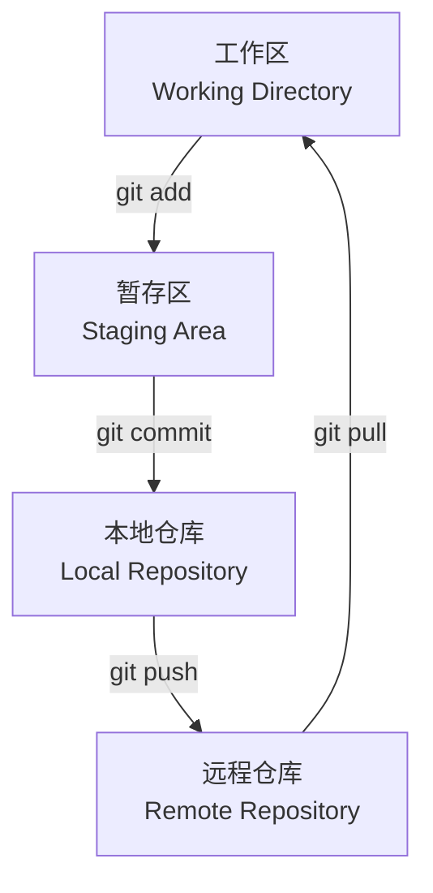

# [0146. Git 版本控制基础](https://github.com/tnotesjs/TNotes.react/tree/main/notes/0146.%20Git%20%E7%89%88%E6%9C%AC%E6%8E%A7%E5%88%B6%E5%9F%BA%E7%A1%80)

<!-- region:toc -->

- [1. 本节内容](#1-本节内容)
- [2. 为什么 React 项目需要版本控制？](#2-为什么-react-项目需要版本控制)
- [3. Git 的基本工作流程是什么？](#3-git-的基本工作流程是什么)
- [4. 如何初始化一个 Git 仓库？](#4-如何初始化一个-git-仓库)
- [5. 如何暂存和提交代码？](#5-如何暂存和提交代码)
- [6. 其他常见的 git 命令操作都有哪些？](#6-其他常见的-git-命令操作都有哪些)
  - [6.1. 查看提交历史](#61-查看提交历史)
  - [6.2. 创建和切换分支](#62-创建和切换分支)
  - [6.3. 合并分支](#63-合并分支)
  - [6.4. 连接远程仓库](#64-连接远程仓库)
  - [6.5. 推送和拉取代码](#65-推送和拉取代码)
- [7. .gitignore 文件的作用是什么？](#7-gitignore-文件的作用是什么)
- [8. React 项目的完整 Git 工作流示例](#8-react-项目的完整-git-工作流示例)
- [9. 项目开发过程中的一些常见工作场景](#9-项目开发过程中的一些常见工作场景)
  - [9.1. 功能模块开发过程中插入其它任务](#91-功能模块开发过程中插入其它任务)
  - [9.2. 撤销最后一次提交（保留修改）](#92-撤销最后一次提交保留修改)
  - [9.3. 撤销最后一次提交（丢弃修改）⚠️ 危险操作](#93-撤销最后一次提交丢弃修改️-危险操作)
  - [9.4. 修改最后一次提交信息](#94-修改最后一次提交信息)
  - [9.5. 查看某个提交的详细内容](#95-查看某个提交的详细内容)
  - [9.6. 比较工作区和暂存区的差异](#96-比较工作区和暂存区的差异)
  - [9.7. 比较暂存区和本地仓库的差异](#97-比较暂存区和本地仓库的差异)
- [10. 引用](#10-引用)

<!-- endregion:toc -->

## 1. 本节内容

- Git 版本控制的重要性
- Git 基本工作流程
- 常用 Git 命令
- 分支管理
- 远程仓库操作
- React 项目中的 Git 实践

本笔记介绍了 Git 版本控制的基础知识，对于 React 开发者来说，掌握 Git 是团队协作的必备技能。

- 版本控制不是可选项，而是现代前端开发的标配，建议从项目第一行代码开始就使用 Git
- 在实际开发中，分支策略（如 Git Flow）能够让多人协作更加顺畅
- 养成频繁提交、编写清晰提交信息的习惯，能够帮助团队追踪问题和代码变更
- 对于 React 项目，务必正确配置 `.gitignore`，避免将 `node_modules` 等目录提交到仓库

::: tip

在 tnotesjs 组织中有一个 [TNotes.git-notes][6] 知识库，这里边儿会纪录有关 Git 的更多详细说明。

:::

## 2. 为什么 React 项目需要版本控制？

- 代码历史追踪
  - 记录每次修改的内容、时间和作者
  - 可以随时回退到之前的任何版本
  - 方便查找 bug 是在哪次提交中引入的
- 团队协作
  - 多人可以同时开发不同功能
  - 通过分支隔离不同的开发任务
  - 冲突解决机制保证代码的完整性
- 备份与恢复
  - 代码存储在远程仓库，避免本地丢失
  - 误删文件可以轻松恢复
- 持续集成与部署
  - 配合 CI/CD 工具实现自动化构建和部署
  - 基于特定分支或标签触发部署流程

## 3. Git 的基本工作流程是什么？

Git 的工作流程可以简化为以下几个阶段：


```mermaid
graph TB
    A[工作区<br/>Working Directory] -->|git add| B[暂存区<br/>Staging Area]
    B -->|git commit| C[本地仓库<br/>Local Repository]
    C -->|git push| D[远程仓库<br/>Remote Repository]
    D -->|git pull| A
```

- 工作区（Working Directory）
  - 你实际编辑代码的目录
  - 包含项目的所有文件和文件夹
- 暂存区（Staging Area / Index）
  - 临时存储即将提交的修改
  - 使用 `git add` 将修改添加到暂存区
- 本地仓库（Local Repository）
  - 存储项目完整的历史记录
  - 使用 `git commit` 将暂存区的内容提交到本地仓库
- 远程仓库（Remote Repository）
  - 托管在 GitHub、GitLab 等平台
  - 使用 `git push` 推送到远程，使用 `git pull` 拉取更新

## 4. 如何初始化一个 Git 仓库？

在 React 项目根目录下执行：

```bash
# 初始化 Git 仓库
git init

# 查看当前状态
git status
```

执行 `git init` 后，Git 会在项目根目录创建一个隐藏的 `.git` 文件夹，用于存储版本控制信息。

如果使用 `create-react-app` 或 `vite` 创建项目，通常会自动初始化 Git 仓库。

## 5. 如何暂存和提交代码？

```bash
# 查看文件状态
git status

# 添加单个文件到暂存区
git add src/App.jsx

# 添加所有修改到暂存区
git add .

# 提交到本地仓库
git commit -m "feat: 添加用户登录功能"

# 添加并提交（合并操作）
git commit -am "fix: 修复按钮点击 bug"
```

提交信息规范建议：

- `feat: 新功能`
- `fix: 修复 bug`
- `docs: 文档更新`
- `style: 代码格式调整`
- `refactor: 重构代码`
- `test: 测试相关`
- `chore: 构建或辅助工具变动`

如果团队开发规范明确了具体的 commit message 规范要求，按照团队开发规范要求来走即可。

## 6. 其他常见的 git 命令操作都有哪些？

### 6.1. 查看提交历史

```bash
# 查看完整提交历史
git log

# 查看简洁版本（推荐）
git log --oneline

# 查看最近 5 条提交
git log -5

# 查看图形化分支历史
git log --oneline --graph --all

# 查看某个文件的修改历史
git log src/App.jsx
```

### 6.2. 创建和切换分支

```bash
# 查看所有分支
git branch

# 创建新分支
git branch feature-login

# 切换到指定分支
git checkout feature-login

# 创建并切换到新分支（推荐）
git checkout -b feature-login

# Git 2.23+ 新命令（更直观）
git switch feature-login
git switch -c feature-login
```

分支命名建议：

- `main` / `master` - 主分支
- `develop` - 开发分支
- `feature/功能名` - 功能分支
- `bugfix/问题描述` - 修复分支
- `hotfix/紧急修复` - 紧急修复分支

### 6.3. 合并分支

```bash
# 切换到目标分支（如 main）
git checkout main

# 合并指定分支到当前分支
git merge feature-login

# 如果有冲突，需要手动解决后提交
git add .
git commit -m "merge: 合并 feature-login 分支"

# 删除已合并的分支
git branch -d feature-login

# 强制删除分支（即使未合并）
git branch -D feature-login
```

### 6.4. 连接远程仓库

```bash
# 查看远程仓库
git remote -v

# 添加远程仓库
git remote add origin https://github.com/username/repo.git

# 或使用 SSH
git remote add origin git@github.com:username/repo.git

# 修改远程仓库地址
git remote set-url origin https://github.com/username/new-repo.git

# 删除远程仓库
git remote remove origin
```

也可以直接修改 `.git/config` 配置文件。

### 6.5. 推送和拉取代码

```bash
# 推送到远程仓库
git push origin main

# 首次推送，设置上游分支
git push -u origin main

# 之后可以简写为
git push

# 拉取远程更新
git pull origin main

# 拉取并变基（保持提交历史整洁）
git pull --rebase origin main

# 获取远程更新但不合并
git fetch origin
```

## 7. .gitignore 文件的作用是什么？

`.gitignore` 用于指定 Git 应该忽略的文件和目录，避免将不必要的文件提交到仓库。

React 项目典型的 `.gitignore` 配置：

```bash
# 依赖目录
node_modules/
/.pnp
.pnp.js

# 构建产物
/build
/dist
.cache

# 环境变量
.env
.env.local
.env.development.local
.env.test.local
.env.production.local

# 日志
npm-debug.log*
yarn-debug.log*
yarn-error.log*
pnpm-debug.log*

# 编辑器
.vscode/
.idea/
*.swp
*.swo
*~

# 操作系统
.DS_Store
Thumbs.db

# 测试覆盖率
/coverage
```

## 8. React 项目的完整 Git 工作流示例

假设你正在开发一个 React 项目，以下是一个完整的工作流示例：

```bash
# 1. 创建 React 项目
npm create vite@latest my-react-app -- --template react
cd my-react-app

# 2. 初始化 Git（vite 已自动初始化）
git status

# 3. 首次提交
git add .
git commit -m "chore: 初始化项目"

# 4. 连接远程仓库
git remote add origin https://github.com/username/my-react-app.git
git push -u origin main

# 5. 创建功能分支
git checkout -b feature-user-profile

# 6. 开发功能
# ... 编写代码 ...

# 7. 暂存并提交
git add src/components/UserProfile.jsx
# git add . # 或者一次性提交本次的所有修改
git commit -m "feat: 添加用户资料组件"

# 8. 推送功能分支
git push -u origin feature-user-profile

# 9. 在 GitHub 上创建 Pull Request

# 10. 代码审查通过后，合并到 main
git checkout main
git pull origin main
git merge feature-user-profile

# 11. 推送合并结果
git push origin main

# 12. 删除功能分支
git branch -d feature-user-profile
git push origin --delete feature-user-profile
```

## 9. 项目开发过程中的一些常见工作场景

### 9.1. 功能模块开发过程中插入其它任务

```bash
git stash # 临时保存当前工作（未完成）
git checkout main # 切换到主分支
# ... 处理其他事情 ...

# 处理完毕后，切换回 feature-user-profile 分支
git checkout feature-user-profile
# 恢复临时保存的工作，继续处理
git stash pop
```

### 9.2. 撤销最后一次提交（保留修改）

```bash
git reset --soft HEAD~1
```

### 9.3. 撤销最后一次提交（丢弃修改）⚠️ 危险操作

```bash
git reset --hard HEAD~1
```

### 9.4. 修改最后一次提交信息

```bash
git commit --amend -m "feat: 添加用户资料组件（支持头像上传）"
```

### 9.5. 查看某个提交的详细内容

```bash
git show <commit-hash>
```

### 9.6. 比较工作区和暂存区的差异

```bash
git diff
```

### 9.7. 比较暂存区和本地仓库的差异

```bash
git diff --staged
```

## 10. 引用

- [Git 官方文档][1]
- [GitHub Docs - Git 基础][2]
- [Pro Git 电子书（中文版）][3]
- [Git 可视化学习工具][4]
- [常用 Git 命令清单][5]
- [TNotes.git-notes][6]

[1]: https://git-scm.com/doc
[2]: https://docs.github.com/zh/get-started/using-git/about-git
[3]: https://git-scm.com/book/zh/v2
[4]: https://learngitbranching.js.org/?locale=zh_CN
[5]: https://www.ruanyifeng.com/blog/2015/12/git-cheat-sheet.html
[6]: https://tnotesjs.github.io/TNotes.git-notes/
