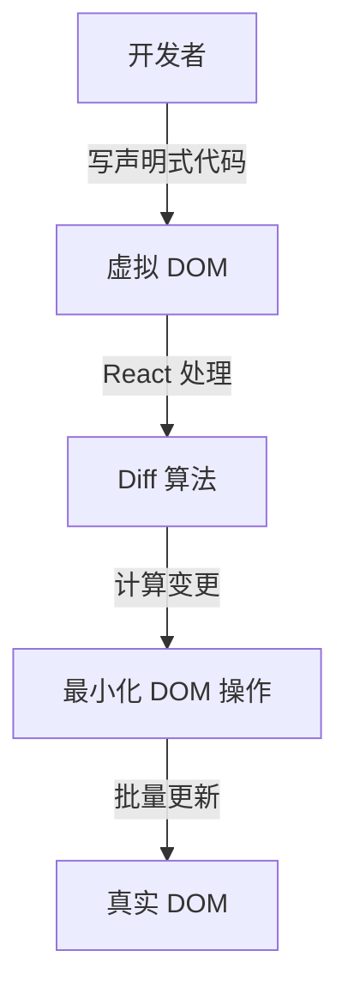
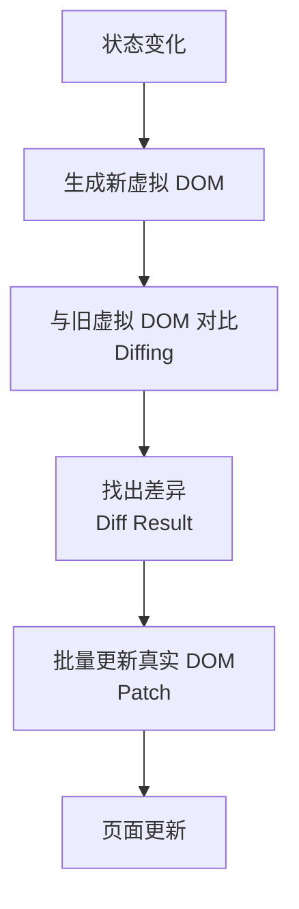
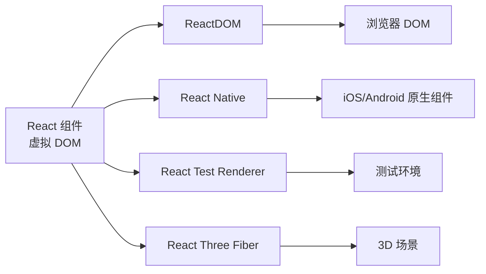

# [0148. 【AI】虚拟 DOM 概念与优势](https://github.com/tnotesjs/TNotes.react/tree/main/notes/0148.%20%E3%80%90AI%E3%80%91%E8%99%9A%E6%8B%9F%20DOM%20%E6%A6%82%E5%BF%B5%E4%B8%8E%E4%BC%98%E5%8A%BF)

<!-- region:toc -->

- [1. 本节内容](#1-本节内容)
- [2. 虚拟 DOM 是什么？](#2-虚拟-dom-是什么)
- [3. 为什么需要虚拟 DOM？](#3-为什么需要虚拟-dom)
- [4. 虚拟 DOM 的工作原理是什么？](#4-虚拟-dom-的工作原理是什么)
- [5. 虚拟 DOM 有哪些优势？](#5-虚拟-dom-有哪些优势)
- [6. 虚拟 DOM 的性能真的更好吗？](#6-虚拟-dom-的性能真的更好吗)
- [7. 由 JSX 生成的虚拟 DOM 结构长什么样？](#7-由-jsx-生成的虚拟-dom-结构长什么样)
- [8. Diff 算法是如何工作的？（极简版）](#8-diff-算法是如何工作的极简版)
- [9. 虚拟 DOM 一定能提高性能吗？Svelte 框架没有使用虚拟 DOM，但是它的效率好像还更高嘞，这是为什么呢？](#9-虚拟-dom-一定能提高性能吗svelte-框架没有使用虚拟-dom但是它的效率好像还更高嘞这是为什么呢)
  - [9.1. 虚拟 DOM 一定能提高性能吗？](#91-虚拟-dom-一定能提高性能吗)
  - [9.2. Svelte 为什么效率更高？（从响应式粒度的角度分析）](#92-svelte-为什么效率更高从响应式粒度的角度分析)
    - [React / Vue（组件级粒度 + 虚拟 DOM）](#react--vue组件级粒度--虚拟-dom)
    - [Svelte（节点级细粒度 + 编译时映射）](#svelte节点级细粒度--编译时映射)
- [10. 常见“错误”描述：虚拟 DOM 提高了性能](#10-常见错误描述虚拟-dom-提高了性能)
- [11. “React 对于更新的监听是组件级别而非组件内部的节点级别，因此当监听到组件变更时需要虚拟 DOM diff 来定位变更的真实 DOM”，这句话有源码层面的证据吗？](#11-react-对于更新的监听是组件级别而非组件内部的节点级别因此当监听到组件变更时需要虚拟-dom-diff-来定位变更的真实-dom这句话有源码层面的证据吗)
  - [11.1. 更新调度以 Fiber（组件）为单位，而非 DOM 节点](#111-更新调度以-fiber组件为单位而非-dom-节点)
  - [11.2. `beginWork` 中的 bailout：组件粒度的“是否需要更新”判断](#112-beginwork-中的-bailout组件粒度的是否需要更新判断)
  - [11.3. 组件重新渲染后，必须通过 reconcile（Diff 算法）定位变更](#113-组件重新渲染后必须通过-reconcilediff-算法定位变更)
  - [11.4. 总结：完整的执行链路](#114-总结完整的执行链路)
- [12. 总结](#12-总结)
- [13. 引用](#13-引用)

<!-- endregion:toc -->

## 1. 本节内容

- 虚拟 DOM 的概念
- 虚拟 DOM 的必要性
- 虚拟 DOM 的工作原理
- Diff 算法
- 虚拟 DOM 的优势与局限
- 实际示例

DOM 这个玩意儿真实存在，但它在我们实际开发中几乎是无感的，它是框架内部实现“states 变更 -> 真实 DOM 变更”的一个中间产物。

## 2. 虚拟 DOM 是什么？

虚拟 DOM 的定义：

- 虚拟 DOM（Virtual DOM）是真实 DOM 的 JavaScript 对象表示
- 它是一个轻量级的 JavaScript 对象树
- 包含了描述 UI 结构所需的所有信息
- 存储在内存中，不直接渲染到页面

虚拟 DOM 的本质：

```jsx
// JSX 代码
<div className="container">
  <h1>Hello World</h1>
  <p>This is a paragraph</p>
</div>

// 对应的虚拟 DOM（简化版）
{
  type: 'div',
  props: {
    className: 'container',
    children: [
      {
        type: 'h1',
        props: {
          children: 'Hello World'
        }
      },
      {
        type: 'p',
        props: {
          children: 'This is a paragraph'
        }
      }
    ]
  }
}
```

虚拟 DOM 就是一个描述真实 DOM 的 JavaScript 对象。

## 3. 为什么需要虚拟 DOM？

直接操作 DOM 的问题：

| 问题       | 说明                                          |
| ---------- | --------------------------------------------- |
| 性能开销大 | DOM 操作会触发重排（reflow）和重绘（repaint） |
| 代码繁琐   | 需要手动查找、创建、更新、删除 DOM 元素       |
| 容易出错   | 复杂的 DOM 操作逻辑容易产生 bug               |
| 难以优化   | 手动优化 DOM 操作需要大量经验                 |
| 跨平台困难 | DOM 是浏览器特有的，难以移植到其他平台        |

虚拟 DOM 的解决方案：



虚拟 DOM 的核心价值：

- 提供声明式编程体验
- 自动优化 DOM 更新
- 实现跨平台渲染
- 提高开发效率

## 4. 虚拟 DOM 的工作原理是什么？

虚拟 DOM 的完整流程：



详细步骤：

1. 初始渲染
   - 创建虚拟 DOM 树
   - 根据虚拟 DOM 创建真实 DOM
   - 渲染到页面
2. 状态更新
   - 生成新的虚拟 DOM 树
   - 保留旧的虚拟 DOM 树
3. Diff 算法
   - 比较新旧两棵虚拟 DOM 树
   - 找出差异部分
   - 生成更新指令
4. 批量更新
   - 收集所有变更
   - 一次性更新真实 DOM
   - 触发页面重绘

Diff 算法的核心策略：

| 策略           | 说明                  |
| -------------- | --------------------- |
| Tree Diff      | 只对比同一层级的节点  |
| Component Diff | 相同类型的组件才对比  |
| Element Diff   | 使用 key 优化列表对比 |

示例：

```jsx
// 旧虚拟 DOM
<ul>
  <li key="1">Item 1</li>
  <li key="2">Item 2</li>
</ul>

// 新虚拟 DOM
<ul>
  <li key="1">Item 1</li>
  <li key="2">Item 2 (updated)</li>
  <li key="3">Item 3</li>
</ul>

// Diff 结果
// 1. Item 1 不变（跳过）
// 2. Item 2 文本改变（更新文本）
// 3. 新增 Item 3（插入新节点）
```

## 5. 虚拟 DOM 有哪些优势？

虚拟 DOM 的优势：

| 优势 | 说明 | 示例 |
| --- | --- | --- |
| 性能优化 | 批量更新，减少 DOM 操作次数 | 多次 setState 只触发一次渲染 |
| 声明式编程 | 开发者只需描述 UI，不用关心 DOM 操作 | 写 JSX，React 处理更新 |
| 跨平台能力 | 可渲染到不同平台 | React Native、React 360 |
| 易于调试 | 可以追踪虚拟 DOM 的变化 | React DevTools |
| 易于测试 | 不依赖浏览器环境 | 服务端渲染、单元测试 |
| 时间旅行 | 可以保存虚拟 DOM 快照 | Redux DevTools 的时间旅行 |

跨平台能力示意：



## 6. 虚拟 DOM 的性能真的更好吗？

性能对比分析：

| 场景           | 原生 DOM              | 虚拟 DOM            |
| -------------- | --------------------- | ------------------- |
| 精确的单次更新 | ⭐⭐⭐⭐⭐ 最快       | ⭐⭐⭐⭐ 有额外开销 |
| 大量 DOM 更新  | ⭐⭐ 可能触发多次重排 | ⭐⭐⭐⭐ 批量优化   |
| 复杂交互应用   | ⭐⭐ 代码复杂，难优化 | ⭐⭐⭐⭐⭐ 自动优化 |
| 开发效率       | ⭐⭐ 需要手写优化     | ⭐⭐⭐⭐⭐ 自动处理 |

虚拟 DOM 的开销：

- 创建虚拟 DOM 对象的内存开销
- 对比新旧虚拟 DOM 的计算开销
- 但通常远小于直接操作 DOM 的开销

性能对比示例：

```jsx
// 场景：更新 10000 个列表项

// ❌ 原生 DOM（糟糕的写法）
for (let i = 0; i < 10000; i++) {
  const li = document.createElement("li");
  li.textContent = i;
  list.appendChild(li); // 每次都触发重排
}

// ✅ 原生 DOM（优化后）
const fragment = document.createDocumentFragment();
for (let i = 0; i < 10000; i++) {
  const li = document.createElement("li");
  li.textContent = i;
  fragment.appendChild(li);
}
list.appendChild(fragment); // 只触发一次重排

// ✅ React 虚拟 DOM
function List({ items }) {
  return (
    <ul>
      {items.map((item, i) => (
        <li key={i}>{item}</li>
      ))}
    </ul>
  );
}
// React 自动批量更新，性能接近优化后的原生 DOM
```

结论：

- 虚拟 DOM 不是为了性能而生
- 它是为了提供更好的开发体验
- 同时保持可接受的性能
- 对于大多数应用，性能已经足够好

## 7. 由 JSX 生成的虚拟 DOM 结构长什么样？

```jsx
// 原始 JSX
function App() {
  return (
    <div id="app" className="container">
      <h1>React 虚拟 DOM</h1>
      <p>这是一个示例</p>
      <button onClick={() => console.log('clicked')}>点击</button>
    </div>
  )
}

// 编译后的 React.createElement 调用
function App() {
  return React.createElement(
    'div',
    { id: 'app', className: 'container' },
    React.createElement('h1', null, 'React 虚拟 DOM'),
    React.createElement('p', null, '这是一个示例'),
    React.createElement(
      'button',
      { onClick: () => console.log('clicked') },
      '点击'
    )
  )
}

// 生成的虚拟 DOM 对象（简化版）
{
  type: 'div',
  props: {
    id: 'app',
    className: 'container',
    children: [
      {
        type: 'h1',
        props: {
          children: 'React 虚拟 DOM'
        }
      },
      {
        type: 'p',
        props: {
          children: '这是一个示例'
        }
      },
      {
        type: 'button',
        props: {
          onClick: [Function],
          children: '点击'
        }
      }
    ]
  }
}

// 最终生成的真实 DOM
<div id="app" class="container">
  <h1>React 虚拟 DOM</h1>
  <p>这是一个示例</p>
  <button>点击</button>
</div>
```

## 8. Diff 算法是如何工作的？（极简版）

列表更新的 Diff 过程：

```jsx
// 初始状态
const oldVDOM = [
  { key: "1", text: "Apple" },
  { key: "2", text: "Banana" },
  { key: "3", text: "Cherry" },
];

// 更新后状态
const newVDOM = [
  { key: "1", text: "Apple" },
  { key: "3", text: "Cherry (updated)" },
  { key: "4", text: "Date" },
];

// Diff 算法分析
// 1. key='1' 的 Apple：内容相同，不更新 ✅
// 2. key='2' 的 Banana：在新列表中不存在，删除 ❌
// 3. key='3' 的 Cherry：文本改变，更新文本 🔄
// 4. key='4' 的 Date：新元素，插入 ➕

// 最终 DOM 操作
// 1. 跳过 Apple（不操作）
// 2. 删除 Banana 节点
// 3. 更新 Cherry 的文本内容
// 4. 插入 Date 节点
```

有 key 和无 key 的对比：

```jsx
// ❌ 没有 key
<ul>
  {items.map(item => (
    <li>{item.text}</li>
  ))}
</ul>
// React 无法准确追踪元素，可能导致不必要的重新渲染

// ✅ 有 key
<ul>
  {items.map(item => (
    <li key={item.id}>{item.text}</li>
  ))}
</ul>
// React 可以准确追踪每个元素，只更新变化的部分
```

## 9. 虚拟 DOM 一定能提高性能吗？Svelte 框架没有使用虚拟 DOM，但是它的效率好像还更高嘞，这是为什么呢？

### 9.1. 虚拟 DOM 一定能提高性能吗？

答案是：不一定。

Svelte 作者 Rich Harris 曾提出过著名的观点："Virtual DOM is pure overhead" => 虚拟 DOM 纯粹是性能开销。

虚拟 DOM 永远比不上经过极致优化的原生原生 DOM 操作。因为无论如何，生成虚拟对象和 Diff 对比都需要消耗 CPU 和内存。

### 9.2. Svelte 为什么效率更高？（从响应式粒度的角度分析）

这本质上是框架“响应式更新粒度”设计的差异：

#### React / Vue（组件级粒度 + 虚拟 DOM）

当状态发生改变时，React 只能粗略地知道“是组件树中的哪一个组件的状态更新了”，但它并不知道这个组件内部的哪一个具体的 DOM 节点需要更新。

为了找出这个具体的节点，框架不得不引入虚拟 DOM 树。通过生成新的虚拟 DOM 并与旧虚拟 DOM 进行 Diff 对比，框架才能“盲人摸象”般地找出真正发生变化的节点，最后再去操作真实 DOM。在这里，虚拟 DOM 是一种为了弥补粗粒度响应式而不得不采用的“找茬”工具。

#### Svelte（节点级细粒度 + 编译时映射）

Svelte 在设计时采用了更细的粒度。作为一个编译器，它在编译阶段静态分析了代码，建立起了精确的 `State -> DOM` 的映射关系。当数据变化时，Svelte 确切地知道是哪一个具体的 DOM 节点依赖了这个数据。因此，它可以直接生成一段精准修改该 DOM 节点的原生 JavaScript 代码（例如直接 `p.textContent = newData`），直接完成更新。

既然框架已经精确知道该更新谁了，自然就完全不需要创建虚拟 DOM 和执行 Diff 算法了，省去了大量的运行时开销，性能自然更高。

## 10. 常见“错误”描述：虚拟 DOM 提高了性能

我们在一些文档中经常会看到说“虚拟 DOM”提高了性能，这句话实际上是有前提的。

在 Vue、React 这类框架的设计层面来看，虚拟 DOM 确实优化了性能，通过简化后的轻量 JS 对象描述真实 DOM，做 diff 时也直接使用虚拟 DOM 来完成，最终定位到需要更新的真实 DOM 完成视图的更新。

Vue、React 框架设计的时候，对于更新粒度只精确到了组件级别，当有内容发生变更时，框架只能定位到是组件树上的哪个组件有更新，但是不知道这个组件内的哪个具体的节点更新了，所以才需要虚拟 DOM。

如果某个框架能够明确知道当 states 更新后，具体需要更新哪个元素，那其实就没有必要走创建虚拟 DOM 和后续 diff 流程了。比如 Svelte 在设计时，粒度更细，它能够精确实现 states -> DOM 的映射，数据变化之后，它知道需要更新哪个节点，就直接操作 DOM 完成了更新，省去了创建虚拟 DOM 和 diff 的流程，性能更好。

## 11. “React 对于更新的监听是组件级别而非组件内部的节点级别，因此当监听到组件变更时需要虚拟 DOM diff 来定位变更的真实 DOM”，这句话有源码层面的证据吗？

::: tip 💡 FROM

deepwiki：https://deepwiki.com/react/react

:::

这句话的核心有两个断言，React 源码（主要在 `react-reconciler` 包中）提供了完整的链路证据：

### 11.1. 更新调度以 Fiber（组件）为单位，而非 DOM 节点

无论是 Class 组件的 `setState` 还是函数组件的 `useState` dispatch，更新任务都会被挂载到触发更新的那个 fiber 节点的 `updateQueue` 上，然后调用 `scheduleUpdateOnFiber(root, fiber, lane)`。

`scheduleUpdateOnFiber` 接收的是 `fiber`（代表一个组件），而不是具体的 DOM 节点。它的作用只是在 root 上标记有待处理的更新，然后调度整棵树的重新渲染。

::: details 🔍 查看源码证据

Class 组件 `setState` 触发更新（ReactFiberClassComponent.js）：

```javascript
enqueueSetState(inst: any, payload: any, callback) {
  const fiber = getInstance(inst);
  const lane = requestUpdateLane(fiber);
  // ...创建 update 并入队
  const root = enqueueUpdate(fiber, update, lane);
  if (root !== null) {
    scheduleUpdateOnFiber(root, fiber, lane); // 核心调度方法
  }
}
```

函数组件 `useState` dispatch 触发更新（ReactFiberHooks.js）：

```javascript
const root = enqueueConcurrentHookUpdate(fiber, queue, update, lane);
if (root !== null) {
  scheduleUpdateOnFiber(root, fiber, lane); // 核心调度方法
}
```

:::

### 11.2. `beginWork` 中的 bailout：组件粒度的“是否需要更新”判断

在协调阶段的入口 `beginWork` 中，React 会检查当前 fiber（组件）的 props、context、以及是否有被调度的 update。如果没有任何变化，会直接调用 `bailoutOnAlreadyFinishedWork` 跳过当前组件及子树，不会执行 render，也不会进行 diff。

这说明 React 的“监听”粒度确实是 Fiber（组件）级别——它只知道“这个组件有更新任务（pending update）”，但根本不知道“组件内部具体的哪个 DOM 节点会变”。

::: details 🔍 查看源码证据

执行 bailout 判断逻辑（ReactFiberBeginWork.js）：

```javascript
if (current !== null) {
  const oldProps = current.memoizedProps;
  const newProps = workInProgress.pendingProps;

  if (oldProps !== newProps || hasLegacyContextChanged() || ...) {
    didReceiveUpdate = true; // 标记组件有更新
  } else {
    // 检查是否有 pending update，如果没有，直接 bailout 跳过
    const hasScheduledUpdateOrContext = checkScheduledUpdateOrContext(current, renderLanes);
    if (!hasScheduledUpdateOrContext && ...) {
      didReceiveUpdate = false;
      return attemptEarlyBailoutIfNoScheduledUpdate(current, workInProgress, renderLanes);
    }
  }
}
```

:::

### 11.3. 组件重新渲染后，必须通过 reconcile（Diff 算法）定位变更

当组件被判定确实需要更新时（`didReceiveUpdate = true`），React 会重新执行整个组件的 render 函数得到新的虚拟 DOM 树（`nextChildren`），然后调用 `reconcileChildren` 对新旧子 Fiber 树进行 Diff 对比。

对比完成后，React 会给发生实质变化的节点打上 Flags（如 `Placement` 插入、`Update` 更新属性、`ChildDeletion` 删除）。最终在 Commit 阶段的 `commitMutationEffects` 方法中，才会遍历这些带有 Flags 的 Fiber 节点去操作真实的 DOM。

::: details 🔍 查看源码证据

重新执行 Render 并生成子节点（ReactFiberBeginWork.js）：

```javascript
// 函数组件重新执行
nextChildren = renderWithHooks(
  current,
  workInProgress,
  Component,
  nextProps,
  context,
  renderLanes,
);
// 或者 Class 组件重新执行
nextChildren = instance.render();

// 将新生成的子树送入 reconcile (Diff 过程)
reconcileChildren(current, workInProgress, nextChildren, renderLanes);
```

Diff 并打上 Flags（ReactFiberBeginWork.js）：

```javascript
workInProgress.child = reconcileChildFibers(
  workInProgress,
  current.child,
  nextChildren, // 新的 Virtual DOM 树
  renderLanes,
);
```

:::

### 11.4. 总结：完整的执行链路

通过源码链路可以看出，React 从未监听具体的 DOM 变化，而是强依赖组件重渲染加上 Virtual DOM 的 Diff 机制来寻找差异：

```text
setState / dispatch
      ↓
scheduleUpdateOnFiber(root, fiber, lane)   ← 以 Fiber（组件）为调度单位
      ↓
beginWork → 检查该 Fiber 组件是否有变化
      ↓ (有变化，即 didReceiveUpdate = true)
renderWithHooks / instance.render()        ← 重新执行整个组件的代码
      ↓
reconcileChildren (Virtual DOM Diff 核心)  ← 对比新旧虚拟子树，标记 Flags（Placement/Update/Deletion）
      ↓
commitMutationEffects                      ← 按计算出的 Flags 最终去操作真实 DOM
```

## 12. 总结

本笔记深入讲解了虚拟 DOM 的概念和工作原理，帮助理解 React 的核心机制。

- 虚拟 DOM 不是为了性能而生，而是为了在保持声明式编程的同时提供可接受的性能
- 理解虚拟 DOM 有助于写出更高效的 React 代码
- 虚拟 DOM 的核心价值在于抽象和跨平台能力，而不仅仅是性能优化
- 在实际开发中，不要过度担心虚拟 DOM 的性能，React 的优化已经足够好

## 13. 引用

- [React 虚拟 DOM 官方文档][1]
- [虚拟 DOM 深入解析][2]
- [Diff 算法详解][3]
- [虚拟 DOM 性能分析][4]

[1]: https://legacy.reactjs.org/docs/faq-internals.html
[2]: https://github.com/Matt-Esch/virtual-dom
[3]: https://calendar.perfplanet.com/2013/diff/
[4]: https://svelte.dev/blog/virtual-dom-is-pure-overhead
