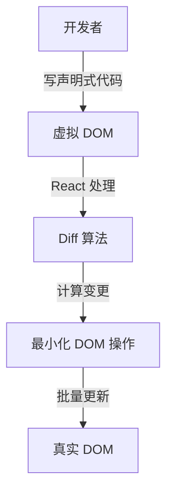
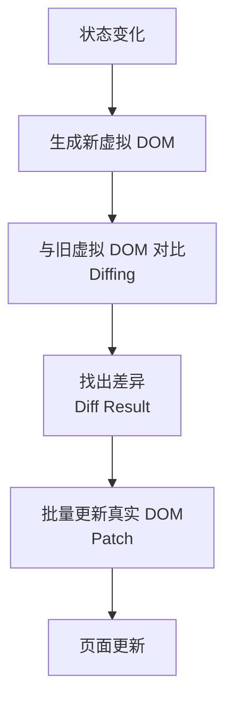
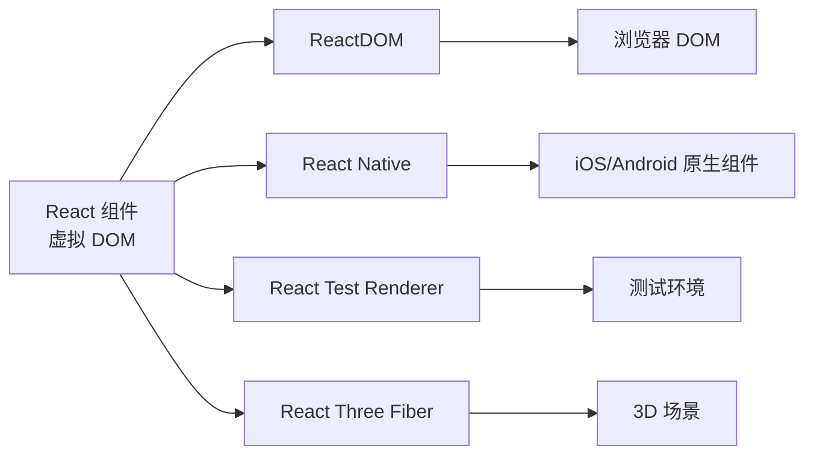

# [0148. 虚拟 DOM 概念与优势](https://github.com/tnotesjs/TNotes.react/tree/main/notes/0148.%20%E8%99%9A%E6%8B%9F%20DOM%20%E6%A6%82%E5%BF%B5%E4%B8%8E%E4%BC%98%E5%8A%BF)

<!-- region:toc -->

- [1. 🎯 本节内容](#1--本节内容)
- [2. 🫧 评价](#2--评价)
- [3. 🤔 虚拟 DOM 是什么？](#3--虚拟-dom-是什么)
- [4. 🤔 为什么需要虚拟 DOM？](#4--为什么需要虚拟-dom)
- [5. 🤔 虚拟 DOM 的工作原理是什么？](#5--虚拟-dom-的工作原理是什么)
- [6. 🤔 虚拟 DOM 有哪些优势？](#6--虚拟-dom-有哪些优势)
- [7. 🤔 虚拟 DOM 的性能真的更好吗？](#7--虚拟-dom-的性能真的更好吗)
- [8. 🤔 由 JSX 生成的虚拟 DOM 结构长什么样？](#8--由-jsx-生成的虚拟-dom-结构长什么样)
- [9. 🤔 Diff 算法是如何工作的？（极简版）](#9--diff-算法是如何工作的极简版)
- [10. 🔗 引用](#10--引用)

<!-- endregion:toc -->

## 1. 🎯 本节内容

- 虚拟 DOM 的概念
- 虚拟 DOM 的必要性
- 虚拟 DOM 的工作原理
- Diff 算法
- 虚拟 DOM 的优势与局限
- 实际示例

## 2. 🫧 评价

本笔记深入讲解了虚拟 DOM 的概念和工作原理，帮助理解 React 的核心机制。

- 虚拟 DOM 不是为了性能而生，而是为了在保持声明式编程的同时提供可接受的性能
- 理解虚拟 DOM 有助于写出更高效的 React 代码
- 虚拟 DOM 的核心价值在于抽象和跨平台能力，而不仅仅是性能优化
- 在实际开发中，不要过度担心虚拟 DOM 的性能，React 的优化已经足够好

## 3. 🤔 虚拟 DOM 是什么？

虚拟 DOM 的定义：

- 虚拟 DOM（Virtual DOM）是真实 DOM 的 JavaScript 对象表示
- 它是一个轻量级的 JavaScript 对象树
- 包含了描述 UI 结构所需的所有信息
- 存储在内存中，不直接渲染到页面

虚拟 DOM 的本质：

```jsx
// JSX 代码
<div className="container">
  <h1>Hello World</h1>
  <p>This is a paragraph</p>
</div>

// 对应的虚拟 DOM（简化版）
{
  type: 'div',
  props: {
    className: 'container',
    children: [
      {
        type: 'h1',
        props: {
          children: 'Hello World'
        }
      },
      {
        type: 'p',
        props: {
          children: 'This is a paragraph'
        }
      }
    ]
  }
}
```

虚拟 DOM 就是一个描述真实 DOM 的 JavaScript 对象。

## 4. 🤔 为什么需要虚拟 DOM？

直接操作 DOM 的问题：

| 问题       | 说明                                          |
| ---------- | --------------------------------------------- |
| 性能开销大 | DOM 操作会触发重排（reflow）和重绘（repaint） |
| 代码繁琐   | 需要手动查找、创建、更新、删除 DOM 元素       |
| 容易出错   | 复杂的 DOM 操作逻辑容易产生 bug               |
| 难以优化   | 手动优化 DOM 操作需要大量经验                 |
| 跨平台困难 | DOM 是浏览器特有的，难以移植到其他平台        |

虚拟 DOM 的解决方案：



虚拟 DOM 的核心价值：

- 提供声明式编程体验
- 自动优化 DOM 更新
- 实现跨平台渲染
- 提高开发效率

## 5. 🤔 虚拟 DOM 的工作原理是什么？

虚拟 DOM 的完整流程：



详细步骤：

1. 初始渲染
   - 创建虚拟 DOM 树
   - 根据虚拟 DOM 创建真实 DOM
   - 渲染到页面
2. 状态更新
   - 生成新的虚拟 DOM 树
   - 保留旧的虚拟 DOM 树
3. Diff 算法
   - 比较新旧两棵虚拟 DOM 树
   - 找出差异部分
   - 生成更新指令
4. 批量更新
   - 收集所有变更
   - 一次性更新真实 DOM
   - 触发页面重绘

Diff 算法的核心策略：

| 策略           | 说明                  |
| -------------- | --------------------- |
| Tree Diff      | 只对比同一层级的节点  |
| Component Diff | 相同类型的组件才对比  |
| Element Diff   | 使用 key 优化列表对比 |

示例：

```jsx
// 旧虚拟 DOM
<ul>
  <li key="1">Item 1</li>
  <li key="2">Item 2</li>
</ul>

// 新虚拟 DOM
<ul>
  <li key="1">Item 1</li>
  <li key="2">Item 2 (updated)</li>
  <li key="3">Item 3</li>
</ul>

// Diff 结果
// 1. Item 1 不变（跳过）
// 2. Item 2 文本改变（更新文本）
// 3. 新增 Item 3（插入新节点）
```

## 6. 🤔 虚拟 DOM 有哪些优势？

虚拟 DOM 的优势：

| 优势 | 说明 | 示例 |
| --- | --- | --- |
| 性能优化 | 批量更新，减少 DOM 操作次数 | 多次 setState 只触发一次渲染 |
| 声明式编程 | 开发者只需描述 UI，不用关心 DOM 操作 | 写 JSX，React 处理更新 |
| 跨平台能力 | 可渲染到不同平台 | React Native、React 360 |
| 易于调试 | 可以追踪虚拟 DOM 的变化 | React DevTools |
| 易于测试 | 不依赖浏览器环境 | 服务端渲染、单元测试 |
| 时间旅行 | 可以保存虚拟 DOM 快照 | Redux DevTools 的时间旅行 |

跨平台能力示意：



## 7. 🤔 虚拟 DOM 的性能真的更好吗？

性能对比分析：

| 场景           | 原生 DOM              | 虚拟 DOM            |
| -------------- | --------------------- | ------------------- |
| 精确的单次更新 | ⭐⭐⭐⭐⭐ 最快       | ⭐⭐⭐⭐ 有额外开销 |
| 大量 DOM 更新  | ⭐⭐ 可能触发多次重排 | ⭐⭐⭐⭐ 批量优化   |
| 复杂交互应用   | ⭐⭐ 代码复杂，难优化 | ⭐⭐⭐⭐⭐ 自动优化 |
| 开发效率       | ⭐⭐ 需要手写优化     | ⭐⭐⭐⭐⭐ 自动处理 |

虚拟 DOM 的开销：

- 创建虚拟 DOM 对象的内存开销
- 对比新旧虚拟 DOM 的计算开销
- 但通常远小于直接操作 DOM 的开销

性能对比示例：

```jsx
// 场景：更新 10000 个列表项

// ❌ 原生 DOM（糟糕的写法）
for (let i = 0; i < 10000; i++) {
  const li = document.createElement('li')
  li.textContent = i
  list.appendChild(li) // 每次都触发重排
}

// ✅ 原生 DOM（优化后）
const fragment = document.createDocumentFragment()
for (let i = 0; i < 10000; i++) {
  const li = document.createElement('li')
  li.textContent = i
  fragment.appendChild(li)
}
list.appendChild(fragment) // 只触发一次重排

// ✅ React 虚拟 DOM
function List({ items }) {
  return (
    <ul>
      {items.map((item, i) => (
        <li key={i}>{item}</li>
      ))}
    </ul>
  )
}
// React 自动批量更新，性能接近优化后的原生 DOM
```

结论：

- 虚拟 DOM 不是为了性能而生
- 它是为了提供更好的开发体验
- 同时保持可接受的性能
- 对于大多数应用，性能已经足够好

## 8. 🤔 由 JSX 生成的虚拟 DOM 结构长什么样？

```jsx
// 原始 JSX
function App() {
  return (
    <div id="app" className="container">
      <h1>React 虚拟 DOM</h1>
      <p>这是一个示例</p>
      <button onClick={() => console.log('clicked')}>点击</button>
    </div>
  )
}

// 编译后的 React.createElement 调用
function App() {
  return React.createElement(
    'div',
    { id: 'app', className: 'container' },
    React.createElement('h1', null, 'React 虚拟 DOM'),
    React.createElement('p', null, '这是一个示例'),
    React.createElement(
      'button',
      { onClick: () => console.log('clicked') },
      '点击'
    )
  )
}

// 生成的虚拟 DOM 对象（简化版）
{
  type: 'div',
  props: {
    id: 'app',
    className: 'container',
    children: [
      {
        type: 'h1',
        props: {
          children: 'React 虚拟 DOM'
        }
      },
      {
        type: 'p',
        props: {
          children: '这是一个示例'
        }
      },
      {
        type: 'button',
        props: {
          onClick: [Function],
          children: '点击'
        }
      }
    ]
  }
}

// 最终生成的真实 DOM
<div id="app" class="container">
  <h1>React 虚拟 DOM</h1>
  <p>这是一个示例</p>
  <button>点击</button>
</div>
```

## 9. 🤔 Diff 算法是如何工作的？（极简版）

列表更新的 Diff 过程：

```jsx
// 初始状态
const oldVDOM = [
  { key: '1', text: 'Apple' },
  { key: '2', text: 'Banana' },
  { key: '3', text: 'Cherry' },
]

// 更新后状态
const newVDOM = [
  { key: '1', text: 'Apple' },
  { key: '3', text: 'Cherry (updated)' },
  { key: '4', text: 'Date' },
]

// Diff 算法分析
// 1. key='1' 的 Apple：内容相同，不更新 ✅
// 2. key='2' 的 Banana：在新列表中不存在，删除 ❌
// 3. key='3' 的 Cherry：文本改变，更新文本 🔄
// 4. key='4' 的 Date：新元素，插入 ➕

// 最终 DOM 操作
// 1. 跳过 Apple（不操作）
// 2. 删除 Banana 节点
// 3. 更新 Cherry 的文本内容
// 4. 插入 Date 节点
```

有 key 和无 key 的对比：

```jsx
// ❌ 没有 key
<ul>
  {items.map(item => (
    <li>{item.text}</li>
  ))}
</ul>
// React 无法准确追踪元素，可能导致不必要的重新渲染

// ✅ 有 key
<ul>
  {items.map(item => (
    <li key={item.id}>{item.text}</li>
  ))}
</ul>
// React 可以准确追踪每个元素，只更新变化的部分
```

## 10. 🔗 引用

- [React 虚拟 DOM 官方文档][1]
- [虚拟 DOM 深入解析][2]
- [Diff 算法详解][3]
- [虚拟 DOM 性能分析][4]

[1]: https://legacy.reactjs.org/docs/faq-internals.html
[2]: https://github.com/Matt-Esch/virtual-dom
[3]: https://calendar.perfplanet.com/2013/diff/
[4]: https://svelte.dev/blog/virtual-dom-is-pure-overhead
