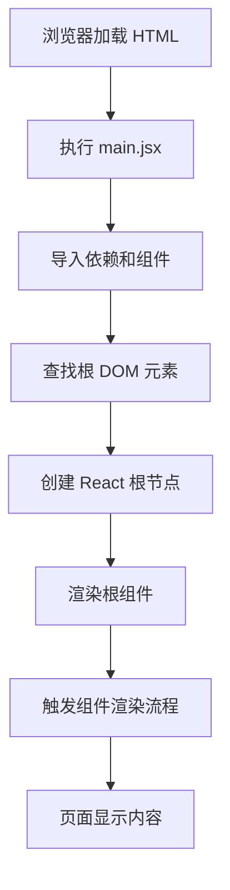

# [0150. main.jsx 或 index.js 入口文件详解](https://github.com/tnotesjs/TNotes.react/tree/main/notes/0150.%20main.jsx%20%E6%88%96%20index.js%20%E5%85%A5%E5%8F%A3%E6%96%87%E4%BB%B6%E8%AF%A6%E8%A7%A3)

<!-- region:toc -->

- [1. 🎯 本节内容](#1--本节内容)
- [2. 🫧 评价](#2--评价)
- [3. 🤔 入口文件的作用是什么？](#3--入口文件的作用是什么)
- [4. 🤔 React 18 和 React 19 的入口文件有什么区别？](#4--react-18-和-react-19-的入口文件有什么区别)
- [5. 🤔 入口文件中都做了哪些事情？](#5--入口文件中都做了哪些事情)
- [6. 🤔 StrictMode 有什么作用？](#6--strictmode-有什么作用)
- [7. 🤔 如何在入口文件中添加全局配置？](#7--如何在入口文件中添加全局配置)
- [8. 🤔 入口文件的常见错误有哪些？](#8--入口文件的常见错误有哪些)
- [9. 🔗 引用](#9--引用)

<!-- endregion:toc -->

## 1. 🎯 本节内容

- 入口文件的职责
- React 不同版本的入口写法
- 渲染流程分析
- StrictMode 的使用
- 全局配置的添加方式
- 常见错误与解决方案

## 2. 🫧 评价

本笔记详细讲解了 React 应用入口文件的写法和最佳实践，帮助理解应用的启动流程。

- 入口文件是应用的起点，理解它有助于掌握 React 的渲染机制
- React 18+ 使用新的 `createRoot` API，性能更好
- StrictMode 能帮助发现潜在问题，建议在开发环境使用
- 合理的全局配置能提升开发效率

## 3. 🤔 入口文件的作用是什么？

入口文件的核心职责：

| 职责       | 说明                    | 示例                              |
| ---------- | ----------------------- | --------------------------------- |
| 查找挂载点 | 找到 HTML 中的根元素    | `document.getElementById('root')` |
| 创建根节点 | 创建 React 根渲染器     | `createRoot(element)`             |
| 渲染根组件 | 将 React 组件渲染到 DOM | `root.render(<App />)`            |
| 全局配置   | 引入全局样式、配置等    | 导入 CSS、配置路由等              |
| 性能监控   | 可选的性能追踪          | `reportWebVitals()`               |

入口文件的执行流程：



## 4. 🤔 React 18 和 React 19 的入口文件有什么区别？

不同版本的入口写法对比：

```jsx
// React 16/17 写法（已废弃）
import React from 'react'
import ReactDOM from 'react-dom'
import App from './App'

// ❌ React 17 的旧写法
ReactDOM.render(
  <React.StrictMode>
    <App />
  </React.StrictMode>,
  document.getElementById('root')
)
```

```jsx
// React 18 写法（推荐）
import { StrictMode } from 'react'
import { createRoot } from 'react-dom/client'
import './index.css'
import App from './App.jsx'

// ✅ React 18 的新写法
createRoot(document.getElementById('root')).render(
  <StrictMode>
    <App />
  </StrictMode>
)
```

```jsx
// React 19 写法（与 React 18 相同）
import { StrictMode } from 'react'
import { createRoot } from 'react-dom/client'
import './index.css'
import App from './App.jsx'

// ✅ React 19 仍使用 createRoot
createRoot(document.getElementById('root')).render(
  <StrictMode>
    <App />
  </StrictMode>
)
```

版本差异对比：

| 特性         | React 16/17       | React 18/19  |
| ------------ | ----------------- | ------------ |
| API          | `ReactDOM.render` | `createRoot` |
| 并发特性     | ❌ 不支持         | ✅ 支持      |
| 自动批处理   | ⚠️ 部分支持       | ✅ 完全支持  |
| Suspense SSR | ❌ 不支持         | ✅ 支持      |
| useId Hook   | ❌ 不支持         | ✅ 支持      |
| 性能         | 较慢              | 更快         |

为什么要使用 `createRoot`：

```jsx
// 旧的 ReactDOM.render
// - 同步渲染，阻塞主线程
// - 不支持并发特性
// - 无法使用 Suspense、useTransition 等新特性

// ❌ 旧写法的问题
ReactDOM.render(<App />, container)
// 渲染过程会阻塞，大型应用可能卡顿

// 新的 createRoot
// - 支持并发渲染
// - 可中断渲染过程
// - 优先级调度
// - 自动批处理

// ✅ 新写法的优势
const root = createRoot(container)
root.render(<App />)
// 渲染可以被中断和恢复，用户体验更好
```

## 5. 🤔 入口文件中都做了哪些事情？

标准入口文件的完整结构：

```jsx
// 1. 导入 React 核心
import { StrictMode } from 'react'
import { createRoot } from 'react-dom/client'

// 2. 导入全局样式
import './index.css'
import './assets/styles/global.css'

// 3. 导入根组件
import App from './App.jsx'

// 4. 导入其他全局配置（可选）
import './i18n/config' // 国际化配置
import './utils/dayjs' // 日期库配置

// 5. 创建根节点并渲染
createRoot(document.getElementById('root')).render(
  <StrictMode>
    <App />
  </StrictMode>
)

// 6. 性能监控（可选）
if (import.meta.env.PROD) {
  import('./reportWebVitals').then(({ default: reportWebVitals }) => {
    reportWebVitals(console.log)
  })
}
```

带有路由和状态管理的完整示例：

```jsx
import { StrictMode } from 'react'
import { createRoot } from 'react-dom/client'
import { BrowserRouter } from 'react-router-dom'
import { Provider } from 'react-redux'
import { store } from './store'
import App from './App.jsx'
import './index.css'

createRoot(document.getElementById('root')).render(
  <StrictMode>
    <Provider store={store}>
      <BrowserRouter>
        <App />
      </BrowserRouter>
    </Provider>
  </StrictMode>
)
```

React Query 的集成示例：

```jsx
import { StrictMode } from 'react'
import { createRoot } from 'react-dom/client'
import { QueryClient, QueryClientProvider } from '@tanstack/react-query'
import { ReactQueryDevtools } from '@tanstack/react-query-devtools'
import App from './App.jsx'
import './index.css'

// 创建 Query Client
const queryClient = new QueryClient({
  defaultOptions: {
    queries: {
      staleTime: 1000 * 60 * 5, // 5 分钟
      cacheTime: 1000 * 60 * 30, // 30 分钟
      retry: 3,
    },
  },
})

createRoot(document.getElementById('root')).render(
  <StrictMode>
    <QueryClientProvider client={queryClient}>
      <App />
      <ReactQueryDevtools initialIsOpen={false} />
    </QueryClientProvider>
  </StrictMode>
)
```

## 6. 🤔 StrictMode 有什么作用？

StrictMode 的功能：

| 功能                 | 说明                   | 影响             |
| -------------------- | ---------------------- | ---------------- |
| 检测不安全的生命周期 | 识别过时的生命周期方法 | 开发环境警告     |
| 检测副作用           | 识别不纯的渲染逻辑     | 开发环境双重调用 |
| 检测过时的 API       | 识别废弃的 React API   | 控制台警告       |
| 检测意外的副作用     | 确保渲染函数的纯净性   | 函数被调用两次   |

StrictMode 的使用示例：

```jsx
import { StrictMode } from 'react'
import { createRoot } from 'react-dom/client'
import App from './App.jsx'

// ✅ 推荐：包裹整个应用
createRoot(document.getElementById('root')).render(
  <StrictMode>
    <App />
  </StrictMode>
)

// ✅ 也可以：只包裹特定组件
function App() {
  return (
    <>
      <Header />
      <StrictMode>
        <MainContent />
      </StrictMode>
      <Footer />
    </>
  )
}
```

StrictMode 会触发的双重调用：

```jsx
function Counter() {
  const [count, setCount] = useState(0)

  // ⚠️ 在 StrictMode 下，这个日志会打印两次
  console.log('Component rendering', count)

  // ⚠️ 副作用函数会被调用两次
  useEffect(() => {
    console.log('Effect running')

    return () => {
      console.log('Cleanup running')
    }
  }, [])

  return <button onClick={() => setCount(count + 1)}>{count}</button>
}

// 开发环境输出（StrictMode）
// Component rendering 0
// Component rendering 0  ← 双重调用
// Effect running
// Cleanup running
// Effect running         ← 双重调用
```

StrictMode 的注意事项：

```jsx
// ❌ 不要在生产环境使用 StrictMode
if (import.meta.env.DEV) {
  root.render(
    <StrictMode>
      <App />
    </StrictMode>
  )
} else {
  root.render(<App />)
}

// ✅ 建议：始终使用 StrictMode
// React 会在生产构建时自动移除 StrictMode 的额外检查
root.render(
  <StrictMode>
    <App />
  </StrictMode>
)
```

## 7. 🤔 如何在入口文件中添加全局配置？

常见的全局配置场景：

```jsx
import { StrictMode } from 'react'
import { createRoot } from 'react-dom/client'
import App from './App.jsx'

// 1. 导入全局样式
import './index.css'
import './assets/styles/reset.css'
import './assets/styles/variables.css'

// 2. 导入并配置国际化
import './i18n/config'

// 3. 配置 axios 拦截器
import './utils/axios'

// 4. 配置日期库
import dayjs from 'dayjs'
import 'dayjs/locale/zh-cn'
import relativeTime from 'dayjs/plugin/relativeTime'

dayjs.locale('zh-cn')
dayjs.extend(relativeTime)

// 5. 配置错误监控
if (import.meta.env.PROD) {
  import('@sentry/react').then((Sentry) => {
    Sentry.init({
      dsn: import.meta.env.VITE_SENTRY_DSN,
      environment: import.meta.env.MODE,
    })
  })
}

// 6. 渲染应用
createRoot(document.getElementById('root')).render(
  <StrictMode>
    <App />
  </StrictMode>
)
```

Axios 全局配置示例：

```javascript
// utils/axios.js
import axios from 'axios'

// 请求拦截器
axios.interceptors.request.use(
  (config) => {
    const token = localStorage.getItem('token')
    if (token) {
      config.headers.Authorization = `Bearer ${token}`
    }
    return config
  },
  (error) => {
    return Promise.reject(error)
  }
)

// 响应拦截器
axios.interceptors.response.use(
  (response) => response.data,
  (error) => {
    if (error.response?.status === 401) {
      // 处理未授权
      window.location.href = '/login'
    }
    return Promise.reject(error)
  }
)

export default axios
```

国际化配置示例：

```javascript
// i18n/config.js
import i18n from 'i18next'
import { initReactI18next } from 'react-i18next'
import zhCN from './locales/zh-CN.json'
import enUS from './locales/en-US.json'

i18n.use(initReactI18next).init({
  resources: {
    'zh-CN': { translation: zhCN },
    'en-US': { translation: enUS },
  },
  lng: localStorage.getItem('language') || 'zh-CN',
  fallbackLng: 'zh-CN',
  interpolation: {
    escapeValue: false,
  },
})

export default i18n
```

## 8. 🤔 入口文件的常见错误有哪些？

常见错误及解决方案：

```jsx
// ❌ 错误 1：找不到根元素
createRoot(document.getElementById('root')).render(<App />)
// 报错：Cannot read property 'render' of null

// ✅ 解决方案：检查 HTML 中是否有对应的元素
const rootElement = document.getElementById('root')
if (!rootElement) {
  throw new Error('Root element not found')
}
createRoot(rootElement).render(<App />)
```

```jsx
// ❌ 错误 2：多次调用 render
const root = createRoot(document.getElementById('root'))
root.render(<App />)
root.render(<App />) // 不必要的重复调用

// ✅ 解决方案：只调用一次 render
const root = createRoot(document.getElementById('root'))
root.render(<App />)
```

```jsx
// ❌ 错误 3：同步导入大量资源
import './i18n/config'
import './utils/analytics'
import './utils/monitoring'
import './styles/theme.css'
// 首屏加载慢

// ✅ 解决方案：非关键资源异步导入
createRoot(document.getElementById('root')).render(<App />)

// 异步加载非关键资源
setTimeout(() => {
  import('./utils/analytics')
  import('./utils/monitoring')
}, 1000)
```

```jsx
// ❌ 错误 4：在 StrictMode 外处理副作用
import { initAnalytics } from './utils/analytics'

initAnalytics() // 可能被调用两次
createRoot(document.getElementById('root')).render(
  <StrictMode>
    <App />
  </StrictMode>
)

// ✅ 解决方案：使用 useEffect 或确保幂等性
function App() {
  useEffect(() => {
    initAnalytics()
  }, [])

  return <div>App</div>
}
```

```jsx
// ❌ 错误 5：忘记导入样式
import { createRoot } from 'react-dom/client'
import App from './App.jsx'
// 样式未生效

// ✅ 解决方案：确保导入全局样式
import './index.css' // 必须在 App 之前导入
import App from './App.jsx'
```

开发环境和生产环境的区分：

```jsx
// 根据环境加载不同配置
if (import.meta.env.DEV) {
  // 开发环境配置
  import('./utils/devTools').then(({ setupDevTools }) => {
    setupDevTools()
  })
}

if (import.meta.env.PROD) {
  // 生产环境配置
  import('./utils/analytics').then(({ initAnalytics }) => {
    initAnalytics()
  })
}

createRoot(document.getElementById('root')).render(
  <StrictMode>
    <App />
  </StrictMode>
)
```

## 9. 🔗 引用

- [React createRoot 文档][1]
- [React StrictMode 文档][2]
- [Vite 环境变量][3]
- [React 18 新特性][4]

[1]: https://react.dev/reference/react-dom/client/createRoot
[2]: https://react.dev/reference/react/StrictMode
[3]: https://vitejs.dev/guide/env-and-mode.html
[4]: https://react.dev/blog/2022/03/29/react-v18
