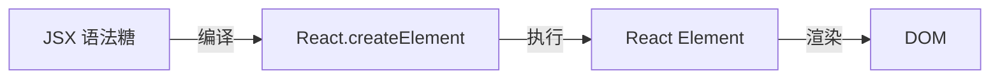
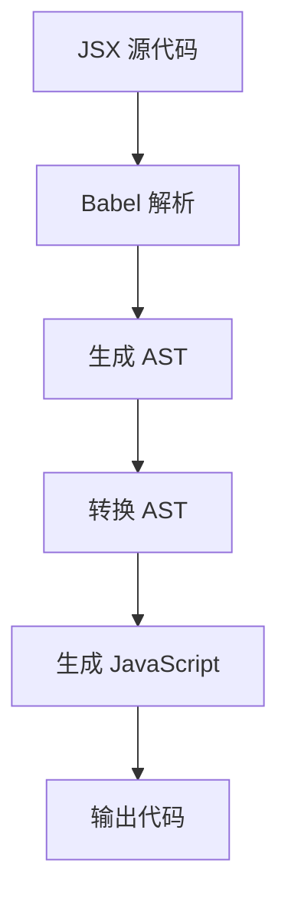

# [0151. JSX 是什么（语法糖与编译原理）](https://github.com/tnotesjs/TNotes.react/tree/main/notes/0151.%20JSX%20%E6%98%AF%E4%BB%80%E4%B9%88%EF%BC%88%E8%AF%AD%E6%B3%95%E7%B3%96%E4%B8%8E%E7%BC%96%E8%AF%91%E5%8E%9F%E7%90%86%EF%BC%89)

<!-- region:toc -->

- [1. 🎯 本节内容](#1--本节内容)
- [2. 🫧 评价](#2--评价)
- [3. 🤔 JSX 是什么？](#3--jsx-是什么)
- [4. 🤔 为什么 JSX 被称为语法糖？](#4--为什么-jsx-被称为语法糖)
- [5. 🤔 JSX 的编译原理是什么？](#5--jsx-的编译原理是什么)
- [6. 🤔 React 17 之前和之后的 JSX 编译有什么区别？](#6--react-17-之前和之后的-jsx-编译有什么区别)
- [7. 🤔 为什么不直接写 JavaScript 而要用 JSX？](#7--为什么不直接写-javascript-而要用-jsx)
- [8. 🔗 引用](#8--引用)

<!-- endregion:toc -->

## 1. 🎯 本节内容

- JSX 的本质与定义
- JSX 作为语法糖的理解
- JSX 的编译过程
- 不同 React 版本的 JSX 转换差异
- JSX 的优势与必要性

## 2. 🫧 评价

本笔记深入讲解了 JSX 的本质、编译原理和版本演进，帮助理解 React 开发的基础机制。

- JSX 不是模板语言，而是 JavaScript 的语法扩展
- 理解 JSX 的编译原理有助于写出更高效的代码
- React 17 的新 JSX 转换简化了代码，无需手动导入 React
- 掌握 JSX 背后的机制能帮助排查问题和优化性能

## 3. 🤔 JSX 是什么？

JSX 的定义：

- JSX 是 JavaScript XML 的缩写
- 它是 JavaScript 的语法扩展
- 允许在 JavaScript 中编写类似 HTML 的标记
- 最终会被编译成普通的 JavaScript 代码

JSX 的特点：

| 特点              | 说明                | 示例                 |
| ----------------- | ------------------- | -------------------- |
| 类 XML 语法       | 使用标签形式描述 UI | `<div>Hello</div>`   |
| JavaScript 表达式 | 可以嵌入 JS 表达式  | `<div>{count}</div>` |
| 编译时转换        | 构建时转换为 JS     | Babel 转换           |
| 类型安全          | 支持 TypeScript     | `.tsx` 文件          |

示例对比：

::: code-group

```jsx [JSX 写法]
function Welcome({ name }) {
  return (
    <div className="greeting">
      <h1>Hello, {name}!</h1>
      <p>Welcome to React</p>
    </div>
  )
}
```

```javascript [等价的 JavaScript]
function Welcome({ name }) {
  return React.createElement(
    'div',
    { className: 'greeting' },
    React.createElement('h1', null, 'Hello, ', name, '!'),
    React.createElement('p', null, 'Welcome to React')
  )
}
```

:::

JSX 不是：

- ❌ 不是模板语言（如 Handlebars、EJS）
- ❌ 不是新的编程语言
- ❌ 不是 HTML（虽然看起来像）
- ❌ 不是必须的（可以直接用 `React.createElement`）

## 4. 🤔 为什么 JSX 被称为语法糖？

语法糖的概念：



语法糖的本质：

- 语法糖是更简洁、更易读的语法形式
- 最终会转换为底层的基础语法
- 不增加新功能，只是提供便捷写法
- JSX 最终都会转换为 `React.createElement` 调用

对比示例：

::: code-group

```jsx [JSX（语法糖）]
// 简洁、直观
const element = (
  <button onClick={handleClick} className="btn">
    Click me
  </button>
)
```

```javascript [等价代码（无语法糖）]
// 冗长、不直观
const element = React.createElement(
  'button',
  {
    onClick: handleClick,
    className: 'btn',
  },
  'Click me'
)
```

:::

复杂嵌套对比：

::: code-group

```jsx [JSX]
const app = (
  <div>
    <Header />
    <main>
      <Article title="Hello" />
      <Sidebar />
    </main>
    <Footer />
  </div>
)
```

```javascript [无 JSX]
const app = React.createElement(
  'div',
  null,
  React.createElement(Header, null),
  React.createElement(
    'main',
    null,
    React.createElement(Article, { title: 'Hello' }),
    React.createElement(Sidebar, null)
  ),
  React.createElement(Footer, null)
)
```

:::

语法糖的优势：

- 提高代码可读性
- 降低学习成本
- 减少代码量
- 更接近 UI 的视觉结构
- 更容易发现错误

## 5. 🤔 JSX 的编译原理是什么？

编译流程：



Babel 的作用：

- Babel 是 JavaScript 编译器
- 通过 `@babel/preset-react` 处理 JSX
- 在构建时进行转换
- 浏览器收到的是纯 JavaScript

编译过程示例：

```jsx
// 1. 原始 JSX
const element = <h1 className="title">Hello</h1>

// 2. Babel 解析成 AST（抽象语法树）
// {
//   type: 'JSXElement',
//   openingElement: {
//     type: 'JSXOpeningElement',
//     name: { type: 'JSXIdentifier', name: 'h1' },
//     attributes: [
//       {
//         type: 'JSXAttribute',
//         name: { type: 'JSXIdentifier', name: 'className' },
//         value: { type: 'StringLiteral', value: 'title' }
//       }
//     ]
//   },
//   children: [{ type: 'JSXText', value: 'Hello' }]
// }

// 3. 转换成 JavaScript 调用
const element = React.createElement('h1', { className: 'title' }, 'Hello')

// 4. 执行后生成 React Element（普通对象）
// {
//   type: 'h1',
//   props: {
//     className: 'title',
//     children: 'Hello'
//   },
//   key: null,
//   ref: null
// }
```

`React.createElement` 的签名：

```typescript
React.createElement(
  type, // 标签名或组件
  props, // 属性对象
  ...children // 子元素
)
```

不同类型的编译：

::: code-group

```jsx [HTML 标签]
;<div id="app">Content</div>

// 编译为
React.createElement('div', { id: 'app' }, 'Content')
```

```jsx [组件]
;<MyComponent prop="value" />

// 编译为
React.createElement(MyComponent, { prop: 'value' })
```

```jsx [Fragment]
;<>
  <div>A</div>
  <div>B</div>
</>

// 编译为
React.createElement(
  React.Fragment,
  null,
  React.createElement('div', null, 'A'),
  React.createElement('div', null, 'B')
)
```

:::

在 Vite 中的配置：

```javascript
// vite.config.js
import { defineConfig } from 'vite'
import react from '@vitejs/plugin-react'

export default defineConfig({
  plugins: [
    react({
      // 使用新的 JSX 转换
      jsxRuntime: 'automatic', // React 17+
      // 或使用经典转换
      // jsxRuntime: 'classic' // React 16
    }),
  ],
})
```

## 6. 🤔 React 17 之前和之后的 JSX 编译有什么区别？

版本对比：

| 特性        | React 16（经典转换）  | React 17+（自动转换） |
| ----------- | --------------------- | --------------------- |
| 导入 React  | 必须 `import React`   | 无需导入              |
| 编译函数    | `React.createElement` | `jsx()` / `jsxs()`    |
| 性能        | 稍慢                  | 更快                  |
| Bundle 大小 | 稍大                  | 更小                  |
| 开发体验    | 容易忘记导入          | 更便捷                |

React 16 的经典转换：

```jsx
// ❌ React 16 - 必须导入 React
import React from 'react' // 必须！

function App() {
  return <div>Hello</div>
}

// 编译为
import React from 'react'

function App() {
  return React.createElement('div', null, 'Hello')
}
```

React 17+ 的自动转换：

```jsx
// ✅ React 17+ - 无需导入 React
function App() {
  return <div>Hello</div>
}

// 编译为（自动注入）
import { jsx as _jsx } from 'react/jsx-runtime'

function App() {
  return _jsx('div', { children: 'Hello' })
}
```

新旧转换对比：

::: code-group

```jsx [React 16]
import React from 'react' // 必须手动导入

function Button({ onClick, children }) {
  return <button onClick={onClick}>{children}</button>
}
```

```jsx [React 17+]
// 无需导入 React

function Button({ onClick, children }) {
  return <button onClick={onClick}>{children}</button>
}
```

:::

新转换的优势：

- 减少样板代码
- 避免忘记导入 React 的错误
- 更小的 bundle 大小
- 更好的性能
- 更符合 ES 模块规范

迁移到新转换：

```bash
# 1. 升级 React 版本
npm install react@^17.0.0 react-dom@^17.0.0

# 2. 更新 Babel 配置（如果使用）
# .babelrc
{
  "presets": [
    ["@babel/preset-react", {
      "runtime": "automatic"
    }]
  ]
}

# 3. 或者在 Vite 中（默认已启用）
# vite.config.js 中 react 插件会自动处理
```

## 7. 🤔 为什么不直接写 JavaScript 而要用 JSX？

直接使用 `React.createElement` 的问题：

```javascript
// ❌ 冗长、难以阅读
function TodoList({ todos }) {
  return React.createElement(
    'ul',
    { className: 'todo-list' },
    todos.map((todo) =>
      React.createElement(
        'li',
        { key: todo.id, className: todo.done ? 'done' : '' },
        React.createElement('input', {
          type: 'checkbox',
          checked: todo.done,
          onChange: () => handleToggle(todo.id),
        }),
        React.createElement('span', null, todo.text),
        React.createElement(
          'button',
          {
            onClick: () => handleDelete(todo.id),
          },
          'Delete'
        )
      )
    )
  )
}
```

使用 JSX 的同样代码：

```jsx
// ✅ 简洁、直观、易维护
function TodoList({ todos }) {
  return (
    <ul className="todo-list">
      {todos.map((todo) => (
        <li key={todo.id} className={todo.done ? 'done' : ''}>
          <input
            type="checkbox"
            checked={todo.done}
            onChange={() => handleToggle(todo.id)}
          />
          <span>{todo.text}</span>
          <button onClick={() => handleDelete(todo.id)}>Delete</button>
        </li>
      ))}
    </ul>
  )
}
```

JSX 的优势总结：

| 优势           | 说明               |
| -------------- | ------------------ |
| 可读性强       | 结构清晰，一目了然 |
| 可维护性好     | 易于修改和重构     |
| 更少的代码     | 减少样板代码       |
| 更好的开发体验 | IDE 支持更好       |
| 更容易发现错误 | 编译时类型检查     |
| 更接近设计稿   | UI 结构直观        |

何时不使用 JSX：

```javascript
// 某些特殊场景可能不用 JSX
// 1. 动态创建大量相同元素
const items = Array.from({ length: 1000 }, (_, i) =>
  React.createElement('div', { key: i }, `Item ${i}`)
)

// 2. 条件非常复杂时
function ComplexRender() {
  if (condition1) {
    return createElement(ComponentA, props1)
  } else if (condition2) {
    return createElement(ComponentB, props2)
  }
  // ...更多条件
}

// 但大多数情况下，JSX 仍然是更好的选择
```

## 8. 🔗 引用

- [React 官方文档 - JSX 简介][1]
- [Babel - JSX 转换][2]
- [React 17 新的 JSX 转换][3]
- [深入理解 JSX][4]

[1]: https://react.dev/learn/writing-markup-with-jsx
[2]: https://babeljs.io/docs/babel-plugin-transform-react-jsx
[3]: https://legacy.reactjs.org/blog/2020/09/22/introducing-the-new-jsx-transform.html
[4]: https://react.dev/learn/javascript-in-jsx-with-curly-braces
