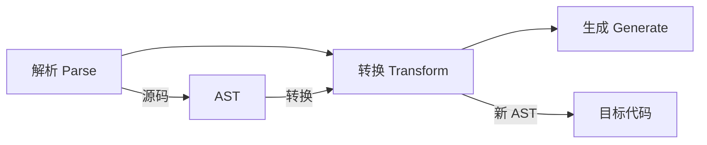

# [0152. JSX 转换过程（Babel 编译）](https://github.com/tnotesjs/TNotes.react/tree/main/notes/0152.%20JSX%20%E8%BD%AC%E6%8D%A2%E8%BF%87%E7%A8%8B%EF%BC%88Babel%20%E7%BC%96%E8%AF%91%EF%BC%89)

<!-- region:toc -->

- [1. 🎯 本节内容](#1--本节内容)
- [2. 🫧 评价](#2--评价)
- [3. 🤔 Babel 是如何转换 JSX 的？](#3--babel-是如何转换-jsx-的)
- [4. 🤔 Babel 的 AST 抽象语法树是什么？](#4--babel-的-ast-抽象语法树是什么)
- [5. 🤔 如何配置 Babel 来转换 JSX？](#5--如何配置-babel-来转换-jsx)
- [6. 🤔 如何在线查看 JSX 的编译结果？](#6--如何在线查看-jsx-的编译结果)
- [7. 🤔 不同构建工具如何处理 JSX？](#7--不同构建工具如何处理-jsx)
- [8. 🔗 引用](#8--引用)

<!-- endregion:toc -->

## 1. 🎯 本节内容

- Babel 转换 JSX 的完整流程
- AST 抽象语法树
- Babel 配置方法
- 在线编译工具
- 不同构建工具的 JSX 处理

## 2. 🫧 评价

本笔记详细讲解了 Babel 转换 JSX 的底层机制，帮助理解构建工具的工作原理。

- 理解 Babel 转换过程有助于排查编译问题
- AST 是编译器的核心概念，了解它能更好地理解代码转换
- 不同构建工具都依赖类似的转换机制
- 在线工具可以快速验证 JSX 的编译结果

## 3. 🤔 Babel 是如何转换 JSX 的？

Babel 转换的三个阶段：



详细转换流程：

| 阶段 | 输入     | 输出       | 工具               |
| ---- | -------- | ---------- | ------------------ |
| 解析 | JSX 源码 | AST        | `@babel/parser`    |
| 转换 | AST      | 新 AST     | `@babel/traverse`  |
| 生成 | 新 AST   | JavaScript | `@babel/generator` |

完整示例：

```jsx
// 1️⃣ 原始 JSX 代码
const element = <div className="box">Hello</div>

// 2️⃣ 解析阶段 - 生成 AST
// {
//   type: 'VariableDeclaration',
//   declarations: [{
//     type: 'VariableDeclarator',
//     id: { type: 'Identifier', name: 'element' },
//     init: {
//       type: 'JSXElement',
//       openingElement: {
//         type: 'JSXOpeningElement',
//         name: { type: 'JSXIdentifier', name: 'div' },
//         attributes: [{
//           type: 'JSXAttribute',
//           name: { type: 'JSXIdentifier', name: 'className' },
//           value: { type: 'StringLiteral', value: 'box' }
//         }]
//       },
//       children: [{
//         type: 'JSXText',
//         value: 'Hello'
//       }]
//     }
//   }]
// }

// 3️⃣ 转换阶段 - 修改 AST
// 将 JSXElement 转换为 CallExpression
// {
//   type: 'VariableDeclaration',
//   declarations: [{
//     init: {
//       type: 'CallExpression',
//       callee: {
//         type: 'MemberExpression',
//         object: { type: 'Identifier', name: 'React' },
//         property: { type: 'Identifier', name: 'createElement' }
//       },
//       arguments: [
//         { type: 'StringLiteral', value: 'div' },
//         {
//           type: 'ObjectExpression',
//           properties: [{
//             key: { type: 'Identifier', name: 'className' },
//             value: { type: 'StringLiteral', value: 'box' }
//           }]
//         },
//         { type: 'StringLiteral', value: 'Hello' }
//       ]
//     }
//   }]
// }

// 4️⃣ 生成阶段 - 输出代码
const element = React.createElement('div', { className: 'box' }, 'Hello')
```

Babel 插件的作用：

```javascript
// Babel 插件负责 AST 转换
// @babel/plugin-transform-react-jsx

module.exports = function (babel) {
  const { types: t } = babel

  return {
    visitor: {
      // 访问 JSX 元素节点
      JSXElement(path) {
        // 将 JSX 转换为 createElement 调用
        const openingElement = path.node.openingElement
        const tagName = openingElement.name.name
        const attributes = openingElement.attributes
        const children = path.node.children

        // 构建 React.createElement 调用
        path.replaceWith(
          t.callExpression(
            t.memberExpression(
              t.identifier('React'),
              t.identifier('createElement')
            ),
            [
              t.stringLiteral(tagName),
              // ... 处理 props 和 children
            ]
          )
        )
      },
    },
  }
}
```

## 4. 🤔 Babel 的 AST 抽象语法树是什么？

AST 的概念：

- AST（Abstract Syntax Tree）是抽象语法树
- 是源代码的树状结构表示
- 编译器通过 AST 理解和转换代码
- 是程序分析和转换的基础

JSX AST 的主要节点类型：

| 节点类型                 | 说明       | 示例                    |
| ------------------------ | ---------- | ----------------------- |
| `JSXElement`             | JSX 元素   | `<div>...</div>`        |
| `JSXOpeningElement`      | 开始标签   | `<div className="box">` |
| `JSXClosingElement`      | 结束标签   | `</div>`                |
| `JSXAttribute`           | 属性       | `className="box"`       |
| `JSXText`                | 文本内容   | `Hello`                 |
| `JSXExpressionContainer` | 表达式容器 | `{count}`               |
| `JSXIdentifier`          | 标签名     | `div`                   |
| `JSXFragment`            | Fragment   | `<>...</>`              |

AST 结构示例：

```jsx
// JSX 代码
<div id="app">
  <h1>{title}</h1>
  <p>Content</p>
</div>

// 对应的 AST 结构（简化版）
{
  type: 'JSXElement',
  openingElement: {
    type: 'JSXOpeningElement',
    name: { type: 'JSXIdentifier', name: 'div' },
    attributes: [
      {
        type: 'JSXAttribute',
        name: { type: 'JSXIdentifier', name: 'id' },
        value: { type: 'StringLiteral', value: 'app' }
      }
    ]
  },
  children: [
    {
      type: 'JSXElement',
      openingElement: {
        name: { type: 'JSXIdentifier', name: 'h1' }
      },
      children: [
        {
          type: 'JSXExpressionContainer',
          expression: { type: 'Identifier', name: 'title' }
        }
      ]
    },
    {
      type: 'JSXElement',
      openingElement: {
        name: { type: 'JSXIdentifier', name: 'p' }
      },
      children: [
        { type: 'JSXText', value: 'Content' }
      ]
    }
  ]
}
```

使用 AST 的场景：

- 代码转换（JSX → JavaScript）
- 代码优化
- 代码分析
- 代码格式化
- 静态类型检查
- ESLint 规则检查

手动操作 AST：

```javascript
// 使用 @babel/parser 和 @babel/traverse
const parser = require('@babel/parser')
const traverse = require('@babel/traverse').default

const code = '<div className="box">Hello</div>'

// 1. 解析成 AST
const ast = parser.parse(code, {
  sourceType: 'module',
  plugins: ['jsx'],
})

// 2. 遍历 AST
traverse(ast, {
  JSXElement(path) {
    console.log('找到 JSX 元素')
    console.log('标签名', path.node.openingElement.name.name)
  },
  JSXAttribute(path) {
    console.log('找到属性', path.node.name.name)
  },
})
```

## 5. 🤔 如何配置 Babel 来转换 JSX？

基础配置：

```json
// .babelrc 或 babel.config.json
{
  "presets": [
    [
      "@babel/preset-react",
      {
        "runtime": "automatic" // React 17+ 新转换
      }
    ]
  ]
}
```

完整配置选项：

```javascript
// babel.config.js
module.exports = {
  presets: [
    [
      '@babel/preset-react',
      {
        // JSX 转换模式
        runtime: 'automatic', // 或 'classic'

        // 开发模式
        development: process.env.NODE_ENV === 'development',

        // 导入来源
        importSource: 'react', // 默认值

        // 是否抛出错误
        throwIfNamespace: true,

        // 是否使用内置插件
        useBuiltIns: false,

        // 是否使用 spread
        useSpread: false,
      },
    ],
  ],
}
```

不同运行时的配置：

::: code-group

```json [自动运行时（React 17+）]
{
  "presets": [
    ["@babel/preset-react", {
      "runtime": "automatic"
    }]
  ]
}

// 编译结果
import { jsx as _jsx } from 'react/jsx-runtime'
_jsx('div', { children: 'Hello' })
```

```json [经典运行时（React 16）]
{
  "presets": [
    ["@babel/preset-react", {
      "runtime": "classic"
    }]
  ]
}

// 编译结果
import React from 'react'
React.createElement('div', null, 'Hello')
```

:::

开发环境优化配置：

```javascript
// babel.config.js
module.exports = function (api) {
  const isDevelopment = api.env('development')

  return {
    presets: [
      [
        '@babel/preset-react',
        {
          runtime: 'automatic',
          development: isDevelopment,
          // 开发时添加调试信息
          importSource: isDevelopment
            ? '@welldone-software/why-did-you-render'
            : 'react',
        },
      ],
    ],
  }
}
```

与 TypeScript 结合：

```json
// tsconfig.json
{
  "compilerOptions": {
    "jsx": "react-jsx", // 使用新的 JSX 转换
    // 或
    "jsx": "react", // 使用经典转换

    "jsxImportSource": "react" // 指定导入来源
  }
}
```

自定义 JSX pragma：

```javascript
// 使用自定义的 createElement 函数
// babel.config.js
{
  presets: [
    [
      '@babel/preset-react',
      {
        pragma: 'h', // 使用 h 替代 React.createElement
        pragmaFrag: 'Fragment',
      },
    ],
  ]
}

// 或在代码中使用注释
/** @jsx h */
/** @jsxFrag Fragment */
import { h, Fragment } from 'preact'

function App() {
  return <div>Hello</div>
}

// 编译为
h('div', null, 'Hello')
```

## 6. 🤔 如何在线查看 JSX 的编译结果？

常用在线工具：

| 工具 | 地址 | 特点 |
| --- | --- | --- |
| Babel REPL | https://babeljs.io/repl | 官方工具，功能全面 |
| TypeScript Playground | https://www.typescriptlang.org/play | 支持 TypeScript + JSX |
| AST Explorer | https://astexplorer.net | 可视化 AST 结构 |

Babel REPL 使用方法：

```txt
1. 访问 https://babeljs.io/repl
2. 在左侧输入 JSX 代码
3. 右侧自动显示编译结果
4. 可以切换 presets 和 plugins
5. 可以分享代码链接
```

实际使用示例：

```jsx
// 在 Babel REPL 左侧输入
function App() {
  const [count, setCount] = useState(0)

  return (
    <div className="app">
      <h1>Count: {count}</h1>
      <button onClick={() => setCount(count + 1)}>Increment</button>
    </div>
  )
}

// 右侧自动显示编译结果
import { jsx as _jsx } from 'react/jsx-runtime'
import { jsxs as _jsxs } from 'react/jsx-runtime'

function App() {
  const [count, setCount] = useState(0)

  return _jsxs('div', {
    className: 'app',
    children: [
      _jsx('h1', {
        children: ['Count: ', count],
      }),
      _jsx('button', {
        onClick: () => setCount(count + 1),
        children: 'Increment',
      }),
    ],
  })
}
```

AST Explorer 使用：

```txt
1. 访问 https://astexplorer.net
2. 选择 parser: @babel/parser
3. 选择 transform: babel-plugin
4. 输入 JSX 代码
5. 右侧显示 AST 结构
6. 可以编写转换插件
```

本地查看编译结果：

```bash
# 安装 Babel CLI
npm install --save-dev @babel/core @babel/cli @babel/preset-react

# 编译单个文件
npx babel src/App.jsx --out-file compiled.js

# 编译整个目录
npx babel src --out-dir build

# 查看编译结果但不输出
npx babel src/App.jsx
```

## 7. 🤔 不同构建工具如何处理 JSX？

主流构建工具对比：

| 工具             | JSX 处理方式 | 配置复杂度 | 性能       |
| ---------------- | ------------ | ---------- | ---------- |
| Webpack + Babel  | babel-loader | ⭐⭐⭐     | ⭐⭐⭐     |
| Vite             | esbuild      | ⭐         | ⭐⭐⭐⭐⭐ |
| Create React App | 内置 Babel   | ⭐         | ⭐⭐⭐     |
| Next.js          | SWC          | ⭐         | ⭐⭐⭐⭐   |
| Parcel           | 内置转换     | ⭐         | ⭐⭐⭐⭐   |

Webpack 配置：

```javascript
// webpack.config.js
module.exports = {
  module: {
    rules: [
      {
        test: /\.jsx?$/,
        exclude: /node_modules/,
        use: {
          loader: 'babel-loader',
          options: {
            presets: [
              [
                '@babel/preset-react',
                {
                  runtime: 'automatic',
                },
              ],
            ],
          },
        },
      },
    ],
  },
  resolve: {
    extensions: ['.js', '.jsx'],
  },
}
```

Vite 配置：

```javascript
// vite.config.js
import { defineConfig } from 'vite'
import react from '@vitejs/plugin-react'

export default defineConfig({
  plugins: [
    react({
      // 使用 esbuild 转换 JSX
      jsxRuntime: 'automatic',

      // 或使用 Babel
      babel: {
        plugins: [
          // 自定义 Babel 插件
        ],
      },
    }),
  ],
  esbuild: {
    // esbuild 配置
    jsxFactory: 'React.createElement',
    jsxFragment: 'React.Fragment',
  },
})
```

Next.js 配置：

```javascript
// next.config.js
module.exports = {
  // Next.js 13+ 使用 SWC 编译器
  compiler: {
    // 启用 React 18 特性
    reactRemoveProperties: true,

    // 移除 console
    removeConsole: {
      exclude: ['error', 'warn'],
    },
  },

  // 或使用自定义 Babel
  babel: {
    presets: [
      [
        'next/babel',
        {
          'preset-react': {
            runtime: 'automatic',
          },
        },
      ],
    ],
  },
}
```

不同工具的性能对比：

```txt
构建速度（冷启动）：
Vite (esbuild)    ⚡️⚡️⚡️⚡️⚡️  ~200ms
Next.js (SWC)     ⚡️⚡️⚡️⚡️    ~500ms
Webpack (Babel)   ⚡️⚡️         ~2s
CRA (Babel)       ⚡️⚡️         ~3s

热更新速度：
Vite              ⚡️⚡️⚡️⚡️⚡️  ~50ms
Next.js           ⚡️⚡️⚡️⚡️    ~100ms
Webpack           ⚡️⚡️⚡️       ~300ms
CRA               ⚡️⚡️⚡️       ~400ms
```

选择建议：

- 新项目推荐使用 Vite（最快）
- 大型项目考虑 Next.js（功能全面）
- 遗留项目维持 Webpack（兼容性好）
- 快速原型使用 CRA（配置简单）

## 8. 🔗 引用

- [Babel 官方文档][1]
- [Babel REPL 在线工具][2]
- [AST Explorer][3]
- [@babel/preset-react 文档][4]
- [Vite 官方文档][5]

[1]: https://babeljs.io/docs/
[2]: https://babeljs.io/repl
[3]: https://astexplorer.net/
[4]: https://babeljs.io/docs/babel-preset-react
[5]: https://vitejs.dev/guide/
