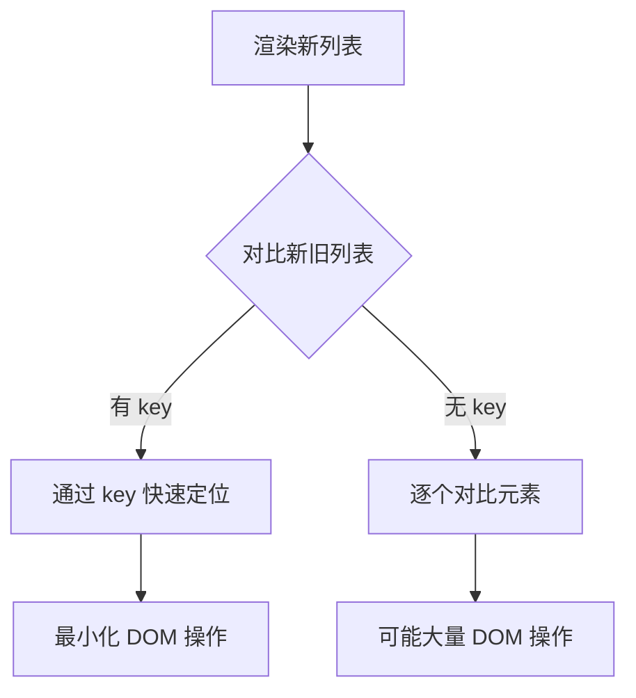

# [0155. key 属性的重要性与最佳实践](https://github.com/tnotesjs/TNotes.react/tree/main/notes/0155.%20key%20%E5%B1%9E%E6%80%A7%E7%9A%84%E9%87%8D%E8%A6%81%E6%80%A7%E4%B8%8E%E6%9C%80%E4%BD%B3%E5%AE%9E%E8%B7%B5)

<!-- region:toc -->

- [1. 🎯 本节内容](#1--本节内容)
- [2. 🫧 评价](#2--评价)
- [3. 🤔 为什么需要 key 属性？](#3--为什么需要-key-属性)
- [4. 🤔 如何正确选择 key 值？](#4--如何正确选择-key-值)
  - [4.1. 最佳选择：数据库 ID](#41-最佳选择数据库-id)
  - [4.2. 使用唯一字符串](#42-使用唯一字符串)
  - [4.3. 组合多个字段](#43-组合多个字段)
  - [4.4. 生成临时 ID](#44-生成临时-id)
  - [4.5. 特殊场景：嵌套列表](#45-特殊场景嵌套列表)
- [5. 🤔 使用索引作为 key 有什么问题？](#5--使用索引作为-key-有什么问题)
  - [5.1. 场景 1：列表可以重新排序](#51-场景-1列表可以重新排序)
  - [5.2. 场景 2：可以添加或删除项](#52-场景-2可以添加或删除项)
  - [5.3. 场景 3：列表项有内部状态](#53-场景-3列表项有内部状态)
  - [5.4. 什么时候可以使用索引？](#54-什么时候可以使用索引)
- [6. 🤔 key 的常见错误和解决方案？](#6--key-的常见错误和解决方案)
  - [6.1. 错误 1：使用不稳定的值](#61-错误-1使用不稳定的值)
  - [6.2. 错误 2：key 值重复](#62-错误-2key-值重复)
  - [6.3. 错误 3：在错误的位置添加 key](#63-错误-3在错误的位置添加-key)
  - [6.4. 错误 4：试图在 props 中访问 key](#64-错误-4试图在-props-中访问-key)
- [7. 🔗 引用](#7--引用)

<!-- endregion:toc -->

## 1. 🎯 本节内容

- key 属性的作用与原理
- 正确选择 key 值的方法
- 索引作为 key 的问题
- key 的常见错误
- 实际应用场景

## 2. 🫧 评价

本笔记详细讲解了 React 中 key 属性的重要性和使用技巧，帮助避免常见的性能和渲染问题。

- key 是 React 识别列表元素变化的唯一标识
- 正确的 key 能显著提升列表渲染性能
- 索引作为 key 在很多场景下会导致 bug
- 理解 key 的工作原理有助于优化组件性能

## 3. 🤔 为什么需要 key 属性？

key 的作用原理：



没有 key 的问题：

```jsx
// ❌ 没有 key
function TodoList({ todos }) {
  return (
    <ul>
      {todos.map((todo) => (
        <li>{todo.text}</li> // ⚠️ 警告：列表项没有 key
      ))}
    </ul>
  )
}

// React 无法准确识别哪些元素发生了变化
// 可能导致：
// 1. 性能问题：不必要的 DOM 更新
// 2. 状态混乱：组件状态关联错误
// 3. 动画问题：过渡效果不正确
```

key 的工作原理对比：

::: code-group

```jsx [无 key]
// 初始列表
<ul>
  <li>苹果</li>
  <li>香蕉</li>
  <li>橙子</li>
</ul>

// 在开头插入新项
<ul>
  <li>葡萄</li>
  <li>苹果</li>
  <li>香蕉</li>
  <li>橙子</li>
</ul>

// ❌ React 会认为：
// - 第 1 项从"苹果"变成"葡萄" → 更新
// - 第 2 项从"香蕉"变成"苹果" → 更新
// - 第 3 项从"橙子"变成"香蕉" → 更新
// - 第 4 项是新的"橙子" → 插入
// 结果：4 次 DOM 操作
```

```jsx [有 key]
// 初始列表
<ul>
  <li key="apple">苹果</li>
  <li key="banana">香蕉</li>
  <li key="orange">橙子</li>
</ul>

// 在开头插入新项
<ul>
  <li key="grape">葡萄</li>
  <li key="apple">苹果</li>
  <li key="banana">香蕉</li>
  <li key="orange">橙子</li>
</ul>

// ✅ React 会认为：
// - "葡萄"是新的 → 插入 1 次
// - 其他项的 key 未变 → 位置移动
// 结果：1 次 DOM 插入
```

:::

key 影响的场景：

| 场景        | 无 key 的影响    | 有正确 key 的效果 |
| ----------- | ---------------- | ----------------- |
| 列表重排序  | 全部重新渲染     | 只改变位置        |
| 插入/删除项 | 可能更新多个元素 | 精确操作单个元素  |
| 组件状态    | 状态可能关联错误 | 状态正确保持      |
| 表单输入    | 输入值可能错位   | 输入值跟随元素    |
| 动画效果    | 动画可能混乱     | 动画流畅正确      |

实际问题演示：

```jsx
// ❌ 使用索引作为 key 导致的问题
function TodoList() {
  const [todos, setTodos] = useState([
    { id: 1, text: '学习 React', done: false },
    { id: 2, text: '写代码', done: false },
  ])

  return (
    <ul>
      {todos.map((todo, index) => (
        <li key={index}>
          {' '}
          {/* ⚠️ 使用索引 */}
          <input
            type="checkbox"
            checked={todo.done}
            onChange={() => {
              const newTodos = [...todos]
              newTodos[index].done = !newTodos[index].done
              setTodos(newTodos)
            }}
          />
          {todo.text}
          <button
            onClick={() => {
              setTodos(todos.filter((_, i) => i !== index))
            }}
          >
            删除
          </button>
        </li>
      ))}
    </ul>
  )
}

// 问题：当删除第一项时
// 原来的 index=0 被删除
// 原来的 index=1 变成新的 index=0
// React 认为 index=0 的元素没变（key 相同）
// 导致第二项的 checkbox 状态可能错位
```

## 4. 🤔 如何正确选择 key 值？

选择 key 的原则：

| 原则     | 说明                       | 示例          |
| -------- | -------------------------- | ------------- |
| 唯一性   | 在列表中必须唯一           | 使用数据库 ID |
| 稳定性   | 重新渲染时保持不变         | 不使用随机数  |
| 可预测性 | 与数据关联，不依赖渲染次序 | 不使用索引    |

### 4.1. 最佳选择：数据库 ID

```jsx
// ✅ 使用数据的唯一标识
function UserList({ users }) {
  return (
    <ul>
      {users.map((user) => (
        <li key={user.id}>
          {' '}
          {/* ✅ 使用数据库 ID */}
          {user.name}
        </li>
      ))}
    </ul>
  )
}

// 使用
;<UserList
  users={[
    { id: 1, name: '张三' },
    { id: 2, name: '李四' },
    { id: 3, name: '王五' },
  ]}
/>
```

### 4.2. 使用唯一字符串

```jsx
// ✅ 使用具有唯一性的字符串
function CategoryList({ categories }) {
  return (
    <ul>
      {categories.map((category) => (
        <li key={category.slug}>
          {' '}
          {/* ✅ 使用 slug */}
          {category.name}
        </li>
      ))}
    </ul>
  )
}

// 使用
;<CategoryList
  categories={[
    { slug: 'electronics', name: '电子产品' },
    { slug: 'books', name: '图书' },
    { slug: 'clothing', name: '服装' },
  ]}
/>
```

### 4.3. 组合多个字段

```jsx
// ✅ 当单个字段不唯一时，组合多个字段
function OrderItemsList({ items }) {
  return (
    <ul>
      {items.map((item) => (
        <li key={`${item.orderId}-${item.productId}`}>
          {' '}
          {/* ✅ 组合 key */}
          {item.productName} × {item.quantity}
        </li>
      ))}
    </ul>
  )
}
```

### 4.4. 生成临时 ID

```jsx
// ✅ 为没有 ID 的数据生成稳定 ID
import { nanoid } from 'nanoid'

function addTodo(text) {
  const newTodo = {
    id: nanoid(), // ✅ 生成唯一 ID
    text,
    done: false,
  }
  setTodos([...todos, newTodo])
}

// 或使用 crypto.randomUUID()（现代浏览器）
function addTodo(text) {
  const newTodo = {
    id: crypto.randomUUID(), // ✅ 生成唯一 ID
    text,
    done: false,
  }
  setTodos([...todos, newTodo])
}
```

### 4.5. 特殊场景：嵌套列表

```jsx
// ✅ 嵌套列表的 key 组合
function CategoryTree({ categories }) {
  return (
    <ul>
      {categories.map((category) => (
        <li key={category.id}>
          {category.name}
          {category.subcategories && (
            <ul>
              {category.subcategories.map((sub) => (
                <li key={`${category.id}-${sub.id}`}>
                  {' '}
                  {/* ✅ 组合父子 ID */}
                  {sub.name}
                </li>
              ))}
            </ul>
          )}
        </li>
      ))}
    </ul>
  )
}
```

## 5. 🤔 使用索引作为 key 有什么问题？

索引作为 key 的问题场景：

### 5.1. 场景 1：列表可以重新排序

```jsx
// ❌ 排序时出现问题
function SortableList() {
  const [items, setItems] = useState([
    { id: 1, name: 'A', value: 100 },
    { id: 2, name: 'B', value: 200 },
    { id: 3, name: 'C', value: 300 },
  ])

  return (
    <div>
      <button
        onClick={() => {
          setItems([...items].sort((a, b) => a.value - b.value))
        }}
      >
        按值排序
      </button>
      <ul>
        {items.map((item, index) => (
          <li key={index}>
            {' '}
            {/* ❌ 使用索引 */}
            <ItemComponent item={item} />
          </li>
        ))}
      </ul>
    </div>
  )
}

// 问题：排序后，index 没变，但数据变了
// React 认为相同 index 的元素没变化
// 可能不会正确更新组件状态
```

```jsx
// ✅ 使用稳定的 ID
function SortableList() {
  const [items, setItems] = useState([
    { id: 1, name: 'A', value: 100 },
    { id: 2, name: 'B', value: 200 },
    { id: 3, name: 'C', value: 300 },
  ])

  return (
    <ul>
      {items.map((item) => (
        <li key={item.id}>
          {' '}
          {/* ✅ 使用 ID */}
          <ItemComponent item={item} />
        </li>
      ))}
    </ul>
  )
}
```

### 5.2. 场景 2：可以添加或删除项

```jsx
// ❌ 删除项时出现问题
function TodoList() {
  const [todos, setTodos] = useState([
    { id: 1, text: '任务 1' },
    { id: 2, text: '任务 2' },
    { id: 3, text: '任务 3' },
  ])

  return (
    <ul>
      {todos.map((todo, index) => (
        <li key={index}>
          {' '}
          {/* ❌ 使用索引 */}
          <TodoItem
            todo={todo}
            onDelete={() => {
              setTodos(todos.filter((t) => t.id !== todo.id))
            }}
          />
        </li>
      ))}
    </ul>
  )
}

// 问题：删除第一项后
// - 原来 index=1 的项变成 index=0
// - React 认为 index=0 的元素更新了（不是删除）
// - 可能导致组件内部状态错位
```

### 5.3. 场景 3：列表项有内部状态

```jsx
// ❌ 带状态的组件使用索引 key
function Form() {
  const [fields, setFields] = useState([
    { id: 1, name: 'field1' },
    { id: 2, name: 'field2' },
  ])

  return (
    <div>
      {fields.map((field, index) => (
        <FormField
          key={index} // ❌ 使用索引
          initialValue=""
        />
      ))}
    </div>
  )
}

function FormField({ initialValue }) {
  const [value, setValue] = useState(initialValue)

  return <input value={value} onChange={(e) => setValue(e.target.value)} />
}

// 问题：删除第一个字段后
// - 第二个字段变成 index=0
// - React 认为这是更新，不是新增
// - 输入框的值会保留，但关联到错误的字段
```

### 5.4. 什么时候可以使用索引？

```jsx
// ✅ 可以使用索引的情况
// 1. 列表是静态的，不会改变
const STATIC_ITEMS = ['首页', '关于', '联系我们']

function Navigation() {
  return (
    <nav>
      {STATIC_ITEMS.map((item, index) => (
        <a key={index} href={`/${item}`}>
          {' '}
          {/* ✅ 静态列表 */}
          {item}
        </a>
      ))}
    </nav>
  )
}

// 2. 列表只用于展示，不会重新排序或修改
function DisplayList({ items }) {
  return (
    <ul>
      {items.map((item, index) => (
        <li key={index}>
          {' '}
          {/* ✅ 纯展示 */}
          {item}
        </li>
      ))}
    </ul>
  )
}

// 3. 列表项没有内部状态或 ID
function Breadcrumb({ path }) {
  return (
    <nav>
      {path.split('/').map((segment, index) => (
        <span key={index}>
          {' '}
          {/* ✅ 简单文本 */}
          {index > 0 && ' / '}
          {segment}
        </span>
      ))}
    </nav>
  )
}
```

## 6. 🤔 key 的常见错误和解决方案？

### 6.1. 错误 1：使用不稳定的值

```jsx
// ❌ 使用随机数
function List({ items }) {
  return (
    <ul>
      {items.map((item) => (
        <li key={Math.random()}>
          {' '}
          {/* ❌ 每次渲染都变 */}
          {item.name}
        </li>
      ))}
    </ul>
  )
}

// ❌ 使用时间戳
function List({ items }) {
  return (
    <ul>
      {items.map((item) => (
        <li key={Date.now()}>
          {' '}
          {/* ❌ 每次渲染都变 */}
          {item.name}
        </li>
      ))}
    </ul>
  )
}

// ✅ 使用稳定的标识
function List({ items }) {
  return (
    <ul>
      {items.map((item) => (
        <li key={item.id}>
          {' '}
          {/* ✅ 稳定的 ID */}
          {item.name}
        </li>
      ))}
    </ul>
  )
}
```

### 6.2. 错误 2：key 值重复

```jsx
// ❌ 多个元素使用相同的 key
function List({ items }) {
  return (
    <ul>
      {items.map((item) => (
        <li key="item">
          {' '}
          {/* ❌ 所有项都是 "item" */}
          {item.name}
        </li>
      ))}
    </ul>
  )
}

// ❌ 不同类型项使用相同的 key
function MixedList({ users, products }) {
  return (
    <ul>
      {users.map((user) => (
        <li key={user.id}>User: {user.name}</li>
      ))}
      {products.map((product) => (
        <li key={product.id}>
          {' '}
          {/* ⚠️ 可能与 user.id 重复 */}
          Product: {product.name}
        </li>
      ))}
    </ul>
  )
}

// ✅ 添加前缀区分不同类型
function MixedList({ users, products }) {
  return (
    <ul>
      {users.map((user) => (
        <li key={`user-${user.id}`}>User: {user.name}</li>
      ))}
      {products.map((product) => (
        <li key={`product-${product.id}`}>Product: {product.name}</li>
      ))}
    </ul>
  )
}
```

### 6.3. 错误 3：在错误的位置添加 key

```jsx
// ❌ key 放在了错误的组件上
function List({ items }) {
  return (
    <ul>
      {items.map((item) => (
        <div>
          {' '}
          {/* ❌ 外层 div 需要 key */}
          <li key={item.id}>{item.name}</li>
        </div>
      ))}
    </ul>
  )
}

// ✅ key 应该在最外层元素
function List({ items }) {
  return (
    <ul>
      {items.map((item) => (
        <div key={item.id}>
          {' '}
          {/* ✅ key 在最外层 */}
          <li>{item.name}</li>
        </div>
      ))}
    </ul>
  )
}

// ✅ 使用 Fragment 时的 key
function List({ items }) {
  return (
    <ul>
      {items.map((item) => (
        <React.Fragment key={item.id}>
          {' '}
          {/* ✅ Fragment 也可以有 key */}
          <li>{item.name}</li>
          <li>{item.description}</li>
        </React.Fragment>
      ))}
    </ul>
  )
}
```

### 6.4. 错误 4：试图在 props 中访问 key

::: code-group

```jsx [❌ 错误示例]
// ❌ key 不能作为 prop 传递
function ListItem(props) {
  // ❌ props.key 是 undefined
  console.log(props.key) // undefined

  return <li>{props.children}</li>
}

function List({ items }) {
  return (
    <ul>
      {items.map((item) => (
        <ListItem key={item.id}>{item.name}</ListItem>
      ))}
    </ul>
  )
}
```

```jsx [✅ 正确示例]
// ✅ 需要的话，额外传递一个 prop
function ListItem({ itemId, children }) {
  // ✅ 可以访问 itemId
  console.log(itemId)

  return <li data-id={itemId}>{children}</li>
}

function List({ items }) {
  return (
    <ul>
      {items.map((item) => (
        // ✅ key 用于 React 内部，itemId 用于组件逻辑
        <ListItem key={item.id} itemId={item.id}>
          {item.name}
        </ListItem>
      ))}
    </ul>
  )
}
```

:::

**说明：**

- `key` 是 React 的特殊保留属性，不会传递给组件
- 如果组件内部需要使用这个值，必须通过其他 prop 名称传递
- 常用的替代名称：`id`、`itemId`、`uniqueKey` 等

## 7. 🔗 引用

- [React 官方文档 - 列表与 Key][1]
- [React 官方文档 - 协调算法][2]
- [为什么索引作为 key 是一个反模式][3]
- [深入理解 React 的 key 属性][4]

[1]: https://react.dev/learn/rendering-lists#keeping-list-items-in-order-with-key
[2]: https://react.dev/learn/preserving-and-resetting-state
[3]: https://robinpokorny.com/blog/index-as-a-key-is-an-anti-pattern/
[4]: https://kentcdodds.com/blog/understanding-reacts-key-prop
