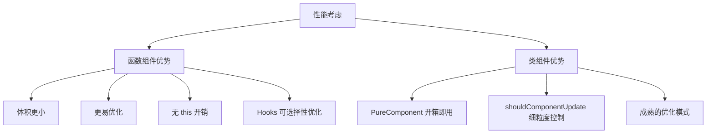
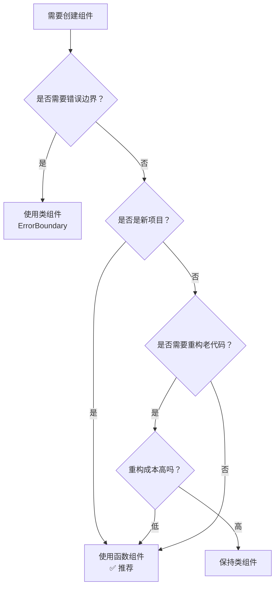
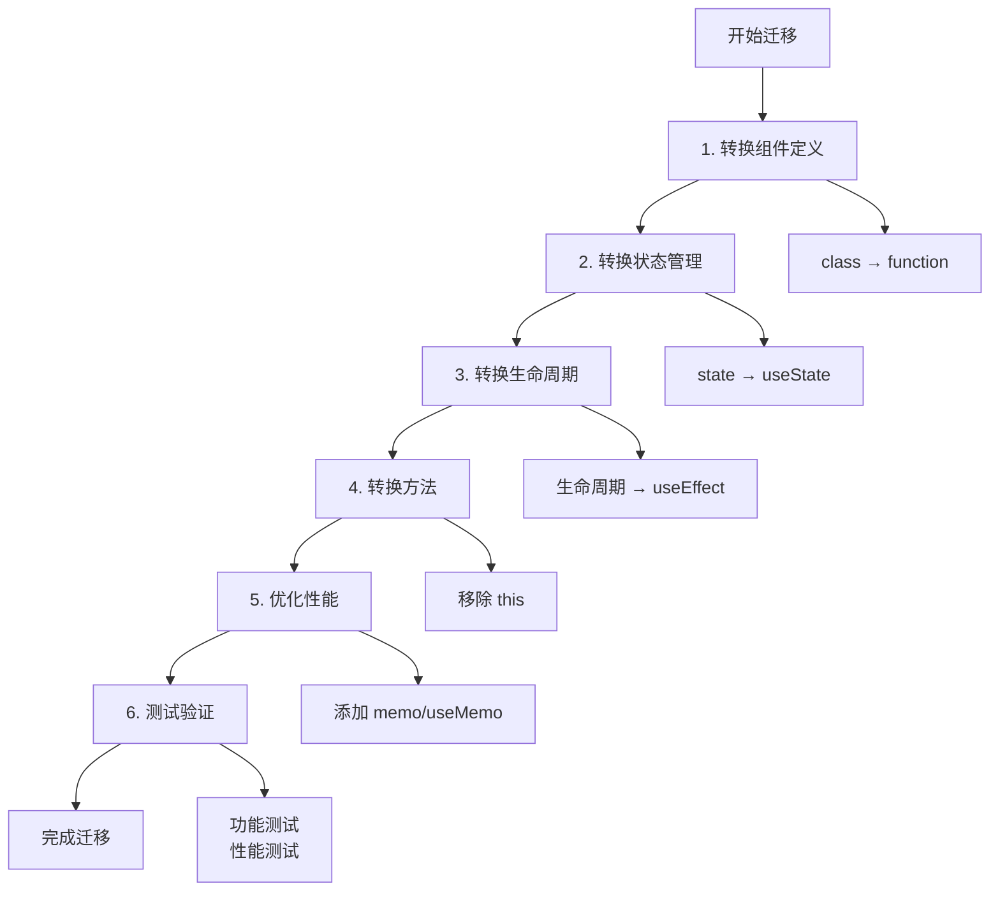

# [0156. 函数组件 vs 类组件对比](https://github.com/tnotesjs/TNotes.react/tree/main/notes/0156.%20%E5%87%BD%E6%95%B0%E7%BB%84%E4%BB%B6%20vs%20%E7%B1%BB%E7%BB%84%E4%BB%B6%E5%AF%B9%E6%AF%94)

<!-- region:toc -->

- [1. 🎯 本节内容](#1--本节内容)
- [2. 🫧 评价](#2--评价)
- [3. 🆚 基本语法对比](#3--基本语法对比)
  - [3.1. 组件定义方式](#31-组件定义方式)
  - [3.2. 接收 Props 的方式](#32-接收-props-的方式)
  - [3.3. 语法对比表](#33-语法对比表)
- [4. 🆚 状态管理对比](#4--状态管理对比)
  - [4.1. 状态定义与更新](#41-状态定义与更新)
  - [4.2. 复杂状态管理](#42-复杂状态管理)
  - [4.3. 状态管理对比表](#43-状态管理对比表)
- [5. 🆚 生命周期对比](#5--生命周期对比)
  - [5.1. 挂载阶段](#51-挂载阶段)
  - [5.2. 更新阶段](#52-更新阶段)
  - [5.3. 卸载阶段](#53-卸载阶段)
  - [5.4. 生命周期对比表](#54-生命周期对比表)
  - [5.5. 完整生命周期对比](#55-完整生命周期对比)
- [6. 🆚 性能对比](#6--性能对比)
  - [6.1. 避免重复渲染](#61-避免重复渲染)
  - [6.2. 性能优化对比表](#62-性能优化对比表)
  - [6.3. 性能特点总结](#63-性能特点总结)
- [7. 🆚 代码复用对比](#7--代码复用对比)
  - [7.1. 逻辑复用方式](#71-逻辑复用方式)
  - [7.2. 代码复用对比表](#72-代码复用对比表)
- [8. � 应该选择哪种组件？](#8--应该选择哪种组件)
  - [8.1. 选择函数组件的场景](#81-选择函数组件的场景)
  - [8.2. 必须使用类组件的场景](#82-必须使用类组件的场景)
  - [8.3. 可以使用类组件的场景](#83-可以使用类组件的场景)
  - [8.4. 决策流程图](#84-决策流程图)
  - [8.5. 选择建议总结](#85-选择建议总结)
- [9. 🤔 如何从类组件迁移到函数组件？](#9--如何从类组件迁移到函数组件)
  - [9.1. 基本转换步骤](#91-基本转换步骤)
  - [9.2. 迁移对照表](#92-迁移对照表)
  - [9.3. 迁移实战示例](#93-迁移实战示例)
  - [9.4. 迁移注意事项](#94-迁移注意事项)
  - [9.5. 迁移步骤建议](#95-迁移步骤建议)
- [10. 🔗 引用](#10--引用)

<!-- endregion:toc -->

## 1. 🎯 本节内容

- 函数组件与类组件的语法差异
- 状态管理方式对比
- 生命周期处理对比
- 性能特点对比
- 代码复用方式对比
- 组件选型建议
- 迁移策略

## 2. 🫧 评价

本笔记全面对比了 React 函数组件和类组件的各方面差异，帮助开发者理解两种组件形式的特点。

- 新项目强烈推荐使用函数组件配合 Hooks，代码更简洁且性能更好
- 类组件仍在维护中的老项目中使用，React 团队承诺长期支持
- 函数组件配合 Hooks 能实现类组件的所有功能，且代码更易测试和维护
- 理解两者差异有助于阅读和维护不同时期的 React 代码

## 3. 🆚 基本语法对比

### 3.1. 组件定义方式

::: code-group

```jsx [函数组件]
// 函数声明
function Welcome(props) {
  return <h1>Hello, {props.name}</h1>
}

// 箭头函数
const Welcome = (props) => {
  return <h1>Hello, {props.name}</h1>
}

// 简写形式
const Welcome = ({ name }) => <h1>Hello, {name}</h1>
```

```jsx [类组件]
import React, { Component } from 'react'

class Welcome extends Component {
  render() {
    return <h1>Hello, {this.props.name}</h1>
  }
}

// 或继承 PureComponent
class Welcome extends React.PureComponent {
  render() {
    return <h1>Hello, {this.props.name}</h1>
  }
}
```

:::

### 3.2. 接收 Props 的方式

::: code-group

```jsx [函数组件]
// 通过函数参数接收
function UserCard({ name, age, avatar }) {
  return (
    <div>
      
      <h2>{name}</h2>
      <p>{age} 岁</p>
    </div>
  )
}

// 访问所有 props
function UserCard(props) {
  return (
    <div>
      <h2>{props.name}</h2>
      <p>{props.age} 岁</p>
    </div>
  )
}
```

```jsx [类组件]
// 通过 this.props 访问
class UserCard extends Component {
  render() {
    const { name, age, avatar } = this.props

    return (
      <div>
        
        <h2>{name}</h2>
        <p>{age} 岁</p>
      </div>
    )
  }
}
```

:::

### 3.3. 语法对比表

| 特性            | 函数组件           | 类组件                              |
| --------------- | ------------------ | ----------------------------------- |
| 定义方式        | 函数声明或箭头函数 | 继承 `Component` 或 `PureComponent` |
| Props 访问      | 函数参数 `props`   | `this.props`                        |
| 代码量          | 更少               | 更多                                |
| `this` 绑定     | 无需处理           | 需要绑定或使用箭头函数              |
| 学习难度        | 更低               | 需要理解 `this` 和类的概念          |
| TypeScript 支持 | 更简单             | 需要声明类成员类型                  |

## 4. 🆚 状态管理对比

### 4.1. 状态定义与更新

::: code-group

```jsx [函数组件（Hooks）]
import { useState } from 'react'

function Counter() {
  // 使用 useState Hook
  const [count, setCount] = useState(0)
  const [name, setName] = useState('张三')

  const increment = () => {
    setCount(count + 1)
  }

  const handleNameChange = (e) => {
    setName(e.target.value)
  }

  return (
    <div>
      <p>计数：{count}</p>
      <button onClick={increment}>+1</button>
      <input value={name} onChange={handleNameChange} />
    </div>
  )
}
```

```jsx [类组件]
import React, { Component } from 'react'

class Counter extends Component {
  // 构造函数中初始化状态
  constructor(props) {
    super(props)
    this.state = {
      count: 0,
      name: '张三',
    }

    // 绑定方法
    this.increment = this.increment.bind(this)
    this.handleNameChange = this.handleNameChange.bind(this)
  }

  increment() {
    this.setState({ count: this.state.count + 1 })
  }

  handleNameChange(e) {
    this.setState({ name: e.target.value })
  }

  render() {
    return (
      <div>
        <p>计数：{this.state.count}</p>
        <button onClick={this.increment}>+1</button>
        <input value={this.state.name} onChange={this.handleNameChange} />
      </div>
    )
  }
}
```

:::

### 4.2. 复杂状态管理

::: code-group

```jsx [函数组件（useReducer）]
import { useReducer } from 'react'

const initialState = {
  count: 0,
  step: 1,
}

function reducer(state, action) {
  switch (action.type) {
    case 'increment':
      return { ...state, count: state.count + state.step }
    case 'decrement':
      return { ...state, count: state.count - state.step }
    case 'setStep':
      return { ...state, step: action.payload }
    case 'reset':
      return initialState
    default:
      return state
  }
}

function Counter() {
  const [state, dispatch] = useReducer(reducer, initialState)

  return (
    <div>
      <p>计数：{state.count}</p>
      <p>步长：{state.step}</p>
      <button onClick={() => dispatch({ type: 'increment' })}>+</button>
      <button onClick={() => dispatch({ type: 'decrement' })}>-</button>
      <button onClick={() => dispatch({ type: 'reset' })}>重置</button>
      <input
        type="number"
        value={state.step}
        onChange={(e) =>
          dispatch({
            type: 'setStep',
            payload: Number(e.target.value),
          })
        }
      />
    </div>
  )
}
```

```jsx [类组件]
import React, { Component } from 'react'

class Counter extends Component {
  constructor(props) {
    super(props)
    this.state = {
      count: 0,
      step: 1,
    }
  }

  increment = () => {
    this.setState((prevState) => ({
      count: prevState.count + prevState.step,
    }))
  }

  decrement = () => {
    this.setState((prevState) => ({
      count: prevState.count - prevState.step,
    }))
  }

  reset = () => {
    this.setState({
      count: 0,
      step: 1,
    })
  }

  handleStepChange = (e) => {
    this.setState({ step: Number(e.target.value) })
  }

  render() {
    return (
      <div>
        <p>计数：{this.state.count}</p>
        <p>步长：{this.state.step}</p>
        <button onClick={this.increment}>+</button>
        <button onClick={this.decrement}>-</button>
        <button onClick={this.reset}>重置</button>
        <input
          type="number"
          value={this.state.step}
          onChange={this.handleStepChange}
        />
      </div>
    )
  }
}
```

:::

### 4.3. 状态管理对比表

| 特性     | 函数组件                   | 类组件                 |
| -------- | -------------------------- | ---------------------- |
| 状态定义 | `useState` 或 `useReducer` | `this.state`           |
| 状态更新 | `setState` 函数            | `this.setState()` 方法 |
| 多个状态 | 每个状态独立的 Hook        | 统一在 `state` 对象中  |
| 状态拆分 | 更灵活，可按逻辑拆分       | 需要手动管理对象结构   |
| 更新语法 | 直接设置新值               | 需要对象合并           |
| 方法绑定 | 无需绑定                   | 需要 `bind` 或箭头函数 |

## 5. 🆚 生命周期对比

### 5.1. 挂载阶段

::: code-group

```jsx [函数组件]
import { useState, useEffect } from 'react'

function UserProfile({ userId }) {
  const [user, setUser] = useState(null)

  // 相当于 componentDidMount
  useEffect(() => {
    console.log('组件挂载完成')

    // 加载用户数据
    fetchUser(userId).then((data) => {
      setUser(data)
    })
  }, []) // ✅ 空依赖数组，只在挂载时执行

  return <div>{user?.name}</div>
}
```

```jsx [类组件]
import React, { Component } from 'react'

class UserProfile extends Component {
  constructor(props) {
    super(props)
    this.state = {
      user: null,
    }
  }

  componentDidMount() {
    console.log('组件挂载完成')

    // 加载用户数据
    fetchUser(this.props.userId).then((data) => {
      this.setState({ user: data })
    })
  }

  render() {
    return <div>{this.state.user?.name}</div>
  }
}
```

:::

### 5.2. 更新阶段

::: code-group

```jsx [函数组件]
import { useState, useEffect } from 'react'

function UserProfile({ userId }) {
  const [user, setUser] = useState(null)

  // 相当于 componentDidUpdate
  useEffect(() => {
    console.log('userId 变化了')

    fetchUser(userId).then((data) => {
      setUser(data)
    })
  }, [userId]) // ✅ userId 变化时执行

  // 监听多个依赖
  useEffect(() => {
    console.log('user 或 userId 变化了')
  }, [user, userId])

  return <div>{user?.name}</div>
}
```

```jsx [类组件]
import React, { Component } from 'react'

class UserProfile extends Component {
  constructor(props) {
    super(props)
    this.state = {
      user: null,
    }
  }

  componentDidUpdate(prevProps, prevState) {
    // 需要手动比较 props 或 state
    if (prevProps.userId !== this.props.userId) {
      console.log('userId 变化了')

      fetchUser(this.props.userId).then((data) => {
        this.setState({ user: data })
      })
    }

    if (
      prevState.user !== this.state.user ||
      prevProps.userId !== this.props.userId
    ) {
      console.log('user 或 userId 变化了')
    }
  }

  render() {
    return <div>{this.state.user?.name}</div>
  }
}
```

:::

### 5.3. 卸载阶段

::: code-group

```jsx [函数组件]
import { useEffect } from 'react'

function Timer() {
  useEffect(() => {
    const timer = setInterval(() => {
      console.log('Tick')
    }, 1000)

    // ✅ 清理函数，相当于 componentWillUnmount
    return () => {
      console.log('清理定时器')
      clearInterval(timer)
    }
  }, [])

  return <div>定时器运行中...</div>
}
```

```jsx [类组件]
import React, { Component } from 'react'

class Timer extends Component {
  componentDidMount() {
    this.timer = setInterval(() => {
      console.log('Tick')
    }, 1000)
  }

  componentWillUnmount() {
    console.log('清理定时器')
    clearInterval(this.timer)
  }

  render() {
    return <div>定时器运行中...</div>
  }
}
```

:::

### 5.4. 生命周期对比表

| 类组件生命周期             | 函数组件 Hook 等价写法        | 说明           |
| -------------------------- | ----------------------------- | -------------- |
| `constructor`              | `useState` 初始化             | 初始化状态     |
| `componentDidMount`        | `useEffect(() => {}, [])`     | 挂载后执行     |
| `componentDidUpdate`       | `useEffect(() => {}, [deps])` | 依赖变化时执行 |
| `componentWillUnmount`     | `useEffect` 返回清理函数      | 卸载前执行     |
| `shouldComponentUpdate`    | `React.memo` 或 `useMemo`     | 性能优化       |
| `getDerivedStateFromProps` | 在 `render` 中直接计算        | 派生状态       |
| `componentDidCatch`        | 暂无 Hook，需用类组件         | 错误边界       |

### 5.5. 完整生命周期对比

```jsx
// 函数组件：所有生命周期逻辑都在 useEffect 中
function Component({ prop1, prop2 }) {
  const [state1, setState1] = useState(initialValue)

  // 挂载 + prop1 更新
  useEffect(() => {
    // 相当于 componentDidMount + componentDidUpdate（仅 prop1 变化）
    console.log('prop1 变化或首次挂载')

    return () => {
      // 相当于 componentWillUnmount + 下次更新前的清理
      console.log('清理上一次的副作用')
    }
  }, [prop1])

  // 仅挂载和卸载
  useEffect(() => {
    console.log('挂载')
    return () => console.log('卸载')
  }, [])

  return <div>{state1}</div>
}
```

```jsx
// 类组件：分散在多个生命周期方法中
class Component extends React.Component {
  constructor(props) {
    super(props)
    this.state = { state1: initialValue }
  }

  componentDidMount() {
    console.log('挂载')
    console.log('prop1 变化或首次挂载')
  }

  componentDidUpdate(prevProps) {
    if (prevProps.prop1 !== this.props.prop1) {
      console.log('清理上一次的副作用')
      console.log('prop1 变化或首次挂载')
    }
  }

  componentWillUnmount() {
    console.log('卸载')
    console.log('清理上一次的副作用')
  }

  render() {
    return <div>{this.state.state1}</div>
  }
}
```

## 6. 🆚 性能对比

### 6.1. 避免重复渲染

::: code-group

```jsx [函数组件]
import { memo, useMemo, useCallback } from 'react'

// 使用 React.memo 避免不必要的渲染
const UserCard = memo(function UserCard({ user, onUpdate }) {
  console.log('UserCard 渲染')

  return (
    <div>
      <h2>{user.name}</h2>
      <button onClick={() => onUpdate(user.id)}>更新</button>
    </div>
  )
})

function UserList({ users }) {
  const [count, setCount] = useState(0)

  // 使用 useCallback 缓存回调函数
  const handleUpdate = useCallback((userId) => {
    console.log('更新用户', userId)
  }, [])

  // 使用 useMemo 缓存计算结果
  const sortedUsers = useMemo(() => {
    console.log('重新排序')
    return [...users].sort((a, b) => a.name.localeCompare(b.name))
  }, [users])

  return (
    <div>
      <button onClick={() => setCount(count + 1)}>计数：{count}</button>
      {sortedUsers.map((user) => (
        <UserCard key={user.id} user={user} onUpdate={handleUpdate} />
      ))}
    </div>
  )
}
```

```jsx [类组件]
import React, { PureComponent, Component } from 'react'

// 使用 PureComponent 自动进行浅比较
class UserCard extends PureComponent {
  render() {
    console.log('UserCard 渲染')
    const { user, onUpdate } = this.props

    return (
      <div>
        <h2>{user.name}</h2>
        <button onClick={() => onUpdate(user.id)}>更新</button>
      </div>
    )
  }
}

class UserList extends Component {
  constructor(props) {
    super(props)
    this.state = { count: 0 }

    // 在构造函数中绑定，避免每次渲染创建新函数
    this.handleUpdate = this.handleUpdate.bind(this)
  }

  handleUpdate(userId) {
    console.log('更新用户', userId)
  }

  // 缓存排序结果
  getSortedUsers() {
    const { users } = this.props
    if (this.cachedUsers === users) {
      return this.sortedUsers
    }

    console.log('重新排序')
    this.cachedUsers = users
    this.sortedUsers = [...users].sort((a, b) => a.name.localeCompare(b.name))
    return this.sortedUsers
  }

  render() {
    const sortedUsers = this.getSortedUsers()

    return (
      <div>
        <button
          onClick={() =>
            this.setState({
              count: this.state.count + 1,
            })
          }
        >
          计数：{this.state.count}
        </button>
        {sortedUsers.map((user) => (
          <UserCard key={user.id} user={user} onUpdate={this.handleUpdate} />
        ))}
      </div>
    )
  }
}
```

:::

### 6.2. 性能优化对比表

| 优化方式     | 函数组件         | 类组件                                     |
| ------------ | ---------------- | ------------------------------------------ |
| 避免重渲染   | `React.memo`     | `PureComponent` 或 `shouldComponentUpdate` |
| 缓存计算结果 | `useMemo`        | 手动缓存或 memoization 库                  |
| 缓存回调函数 | `useCallback`    | 在构造函数中绑定或类属性                   |
| 代码体积     | 更小             | 更大                                       |
| 包大小       | Hooks 代码更简洁 | 类和方法占用更多空间                       |
| 编译优化     | 更容易被工具优化 | 优化空间有限                               |

### 6.3. 性能特点总结



## 7. 🆚 代码复用对比

### 7.1. 逻辑复用方式

::: code-group

```jsx [函数组件（自定义 Hooks）]
// ✅ 自定义 Hook：简洁直观
function useWindowSize() {
  const [size, setSize] = useState({
    width: window.innerWidth,
    height: window.innerHeight,
  })

  useEffect(() => {
    const handleResize = () => {
      setSize({
        width: window.innerWidth,
        height: window.innerHeight,
      })
    }

    window.addEventListener('resize', handleResize)
    return () => window.removeEventListener('resize', handleResize)
  }, [])

  return size
}

// 使用自定义 Hook
function MyComponent() {
  const { width, height } = useWindowSize()

  return (
    <div>
      窗口大小：{width} x {height}
    </div>
  )
}

// 多个组件都可以轻松复用
function AnotherComponent() {
  const { width } = useWindowSize()

  return <div>宽度：{width}</div>
}
```

```jsx [类组件（HOC）]
// ⚠️ 高阶组件：复杂且有缺陷
function withWindowSize(WrappedComponent) {
  return class extends React.Component {
    constructor(props) {
      super(props)
      this.state = {
        width: window.innerWidth,
        height: window.innerHeight
      }
    }

    componentDidMount() {
      window.addEventListener('resize', this.handleResize)
    }

    componentWillUnmount() {
      window.removeEventListener('resize', this.handleResize)
    }

    handleResize = () => {
      this.setState({
        width: window.innerWidth,
        height: window.innerHeight
      })
    }

    render() {
      return (
        <WrappedComponent
          {...this.props}
          windowSize={this.state}
        />
      )
    }
  }
}

// 使用 HOC
class MyComponent extends React.Component {
  render() {
    const { width, height } = this.props.windowSize
    return <div>窗口大小：{width} x {height}</div>
  }
}

export default withWindowSize(MyComponent)

// ⚠️ 多个 HOC 嵌套会导致 "嵌套地狱"
export default withRouter(
  withTheme(
    withAuth(
      withWindowSize(MyComponent)
    )
  )
)
```

```jsx [类组件（Render Props）]
// ⚠️ Render Props：嵌套复杂
class WindowSize extends React.Component {
  constructor(props) {
    super(props)
    this.state = {
      width: window.innerWidth,
      height: window.innerHeight,
    }
  }

  componentDidMount() {
    window.addEventListener('resize', this.handleResize)
  }

  componentWillUnmount() {
    window.removeEventListener('resize', this.handleResize)
  }

  handleResize = () => {
    this.setState({
      width: window.innerWidth,
      height: window.innerHeight,
    })
  }

  render() {
    return this.props.children(this.state)
  }
}

// 使用 Render Props
class MyComponent extends React.Component {
  render() {
    return (
      <WindowSize>
        {({ width, height }) => (
          <div>
            窗口大小：{width} x {height}
          </div>
        )}
      </WindowSize>
    )
  }
}

// ⚠️ 多个 Render Props 导致嵌套地狱
;<WindowSize>
  {(size) => (
    <Theme>{(theme) => <Auth>{(user) => <div>...</div>}</Auth>}</Theme>
  )}
</WindowSize>
```

:::

### 7.2. 代码复用对比表

| 特性 | 函数组件（Hooks） | 类组件（HOC） | 类组件（Render Props） |
| --- | --- | --- | --- |
| 复用方式 | 自定义 Hooks | 高阶组件 | Render Props |
| 代码复杂度 | 低 | 中 | 中 |
| 嵌套问题 | 无 | 严重（包装地狱） | 严重（回调地狱） |
| Props 来源 | 清晰 | 不清晰（被 HOC 注入） | 清晰 |
| 类型推导 | 容易 | 困难 | 中等 |
| 调试体验 | 好 | 差 | 中等 |
| 学习成本 | 低 | 高 | 中 |

## 8. � 应该选择哪种组件？

### 8.1. 选择函数组件的场景

```jsx
// ✅ 新项目 - 首选函数组件
function App() {
  const [theme, setTheme] = useState('light')

  return (
    <ThemeContext.Provider value={theme}>
      <Header />
      <Main />
      <Footer />
    </ThemeContext.Provider>
  )
}

// ✅ 简单展示组件
function ProductCard({ product }) {
  return (
    <div className="product-card">
      
      <h3>{product.name}</h3>
      <p>{product.price} 元</p>
    </div>
  )
}

// ✅ 需要复杂状态逻辑
function ShoppingCart() {
  const [items, dispatch] = useReducer(cartReducer, [])
  const total = useMemo(
    () => items.reduce((sum, item) => sum + item.price * item.quantity, 0),
    [items]
  )

  return <div>总计：{total}</div>
}

// ✅ 需要复用逻辑
function UserProfile() {
  const user = useAuth() // 自定义 Hook
  const { data } = useFetch(`/api/users/${user.id}`) // 自定义 Hook

  return <div>{data?.name}</div>
}
```

### 8.2. 必须使用类组件的场景

```jsx
// ✅ 错误边界 - 目前只能用类组件
class ErrorBoundary extends React.Component {
  constructor(props) {
    super(props)
    this.state = { hasError: false, error: null }
  }

  static getDerivedStateFromError(error) {
    return { hasError: true, error }
  }

  componentDidCatch(error, errorInfo) {
    console.error('捕获到错误：', error, errorInfo)
  }

  render() {
    if (this.state.hasError) {
      return <h1>出错了：{this.state.error?.message}</h1>
    }

    return this.props.children
  }
}

// 使用
;<ErrorBoundary>
  <App />
</ErrorBoundary>
```

### 8.3. 可以使用类组件的场景

```jsx
// ⚠️ 维护老代码 - 可以保持类组件
class LegacyComponent extends React.Component {
  // 如果改动成本高，可以保持不变
  // React 团队承诺长期支持类组件
  render() {
    return <div>老代码</div>
  }
}

// ⚠️ 团队不熟悉 Hooks - 可以先用类组件
class TeamComponent extends React.Component {
  // 团队熟悉类组件，可以继续使用
  // 但建议逐步学习和迁移到 Hooks
  render() {
    return <div>团队项目</div>
  }
}
```

### 8.4. 决策流程图



### 8.5. 选择建议总结

| 场景 | 推荐方案 | 原因 |
| --- | --- | --- |
| 新项目 | 函数组件 | 代码更简洁，性能更好，生态更活跃 |
| 错误边界 | 类组件 | 目前唯一方案 |
| 简单展示组件 | 函数组件 | 代码更少，更易读 |
| 复杂业务逻辑 | 函数组件 | Hooks 更适合逻辑复用和组织 |
| 老项目维护 | 保持原有方式 | 避免不必要的重构 |
| 团队不熟悉 Hooks | 逐步迁移 | 新组件用函数，老组件保持 |
| 性能敏感场景 | 函数组件 | 配合 Hooks 优化更灵活 |
| 需要生命周期细粒度控制 | 两者皆可 | 函数组件用 `useEffect`，类组件用生命周期 |

## 9. 🤔 如何从类组件迁移到函数组件？

### 9.1. 基本转换步骤

::: code-group

```jsx [类组件（迁移前）]
import React, { Component } from 'react'

class UserProfile extends Component {
  constructor(props) {
    super(props)
    this.state = {
      user: null,
      loading: true,
      error: null,
    }
  }

  componentDidMount() {
    this.fetchUser()
  }

  componentDidUpdate(prevProps) {
    if (prevProps.userId !== this.props.userId) {
      this.fetchUser()
    }
  }

  componentWillUnmount() {
    this.abortController?.abort()
  }

  fetchUser = async () => {
    this.setState({ loading: true })
    this.abortController = new AbortController()

    try {
      const response = await fetch(`/api/users/${this.props.userId}`, {
        signal: this.abortController.signal,
      })
      const user = await response.json()
      this.setState({ user, loading: false })
    } catch (error) {
      if (error.name !== 'AbortError') {
        this.setState({ error, loading: false })
      }
    }
  }

  render() {
    const { user, loading, error } = this.state

    if (loading) return <div>加载中...</div>
    if (error) return <div>错误：{error.message}</div>
    if (!user) return null

    return (
      <div>
        <h1>{user.name}</h1>
        <p>{user.email}</p>
      </div>
    )
  }
}
```

```jsx [函数组件（迁移后）]
import { useState, useEffect } from 'react'

function UserProfile({ userId }) {
  const [user, setUser] = useState(null)
  const [loading, setLoading] = useState(true)
  const [error, setError] = useState(null)

  useEffect(() => {
    const abortController = new AbortController()

    const fetchUser = async () => {
      setLoading(true)

      try {
        const response = await fetch(`/api/users/${userId}`, {
          signal: abortController.signal,
        })
        const userData = await response.json()
        setUser(userData)
        setLoading(false)
      } catch (err) {
        if (err.name !== 'AbortError') {
          setError(err)
          setLoading(false)
        }
      }
    }

    fetchUser()

    // 清理函数
    return () => {
      abortController.abort()
    }
  }, [userId]) // userId 变化时重新请求

  if (loading) return <div>加载中...</div>
  if (error) return <div>错误：{error.message}</div>
  if (!user) return null

  return (
    <div>
      <h1>{user.name}</h1>
      <p>{user.email}</p>
    </div>
  )
}
```

:::

### 9.2. 迁移对照表

| 类组件写法               | 函数组件写法                           |
| ------------------------ | -------------------------------------- |
| `constructor(props)`     | 函数参数 `props`                       |
| `this.state = { ... }`   | `const [state, setState] = useState()` |
| `this.setState({ ... })` | `setState(newValue)`                   |
| `componentDidMount()`    | `useEffect(() => { ... }, [])`         |
| `componentDidUpdate()`   | `useEffect(() => { ... }, [deps])`     |
| `componentWillUnmount()` | `useEffect(() => { return () => {} })` |
| `this.method = () => {}` | `const method = () => {}`              |
| `this.props.xxx`         | `props.xxx` 或解构 `{ xxx }`           |
| `this.state.xxx`         | `state` 变量                           |

### 9.3. 迁移实战示例

::: code-group

```jsx [原始类组件]
class TodoList extends Component {
  constructor(props) {
    super(props)
    this.state = {
      todos: [],
      inputValue: '',
      filter: 'all',
    }
  }

  componentDidMount() {
    this.loadTodos()
  }

  loadTodos = async () => {
    const todos = await fetchTodos()
    this.setState({ todos })
  }

  handleInputChange = (e) => {
    this.setState({ inputValue: e.target.value })
  }

  handleAddTodo = () => {
    const { inputValue, todos } = this.state
    if (!inputValue.trim()) return

    const newTodo = {
      id: Date.now(),
      text: inputValue,
      completed: false,
    }

    this.setState({
      todos: [...todos, newTodo],
      inputValue: '',
    })
  }

  handleToggleTodo = (id) => {
    this.setState((prevState) => ({
      todos: prevState.todos.map((todo) =>
        todo.id === id ? { ...todo, completed: !todo.completed } : todo
      ),
    }))
  }

  handleDeleteTodo = (id) => {
    this.setState((prevState) => ({
      todos: prevState.todos.filter((todo) => todo.id !== id),
    }))
  }

  getFilteredTodos = () => {
    const { todos, filter } = this.state

    switch (filter) {
      case 'active':
        return todos.filter((todo) => !todo.completed)
      case 'completed':
        return todos.filter((todo) => todo.completed)
      default:
        return todos
    }
  }

  render() {
    const { inputValue, filter } = this.state
    const filteredTodos = this.getFilteredTodos()

    return (
      <div>
        <input value={inputValue} onChange={this.handleInputChange} />
        <button onClick={this.handleAddTodo}>添加</button>

        <select
          value={filter}
          onChange={(e) => this.setState({ filter: e.target.value })}
        >
          <option value="all">全部</option>
          <option value="active">进行中</option>
          <option value="completed">已完成</option>
        </select>

        <ul>
          {filteredTodos.map((todo) => (
            <li key={todo.id}>
              <input
                type="checkbox"
                checked={todo.completed}
                onChange={() => this.handleToggleTodo(todo.id)}
              />
              <span>{todo.text}</span>
              <button onClick={() => this.handleDeleteTodo(todo.id)}>
                删除
              </button>
            </li>
          ))}
        </ul>
      </div>
    )
  }
}
```

```jsx [迁移后的函数组件]
function TodoList() {
  const [todos, setTodos] = useState([])
  const [inputValue, setInputValue] = useState('')
  const [filter, setFilter] = useState('all')

  // 加载数据
  useEffect(() => {
    const loadTodos = async () => {
      const data = await fetchTodos()
      setTodos(data)
    }
    loadTodos()
  }, [])

  // 添加待办
  const handleAddTodo = () => {
    if (!inputValue.trim()) return

    const newTodo = {
      id: Date.now(),
      text: inputValue,
      completed: false,
    }

    setTodos([...todos, newTodo])
    setInputValue('')
  }

  // 切换完成状态
  const handleToggleTodo = (id) => {
    setTodos(
      todos.map((todo) =>
        todo.id === id ? { ...todo, completed: !todo.completed } : todo
      )
    )
  }

  // 删除待办
  const handleDeleteTodo = (id) => {
    setTodos(todos.filter((todo) => todo.id !== id))
  }

  // 过滤待办（使用 useMemo 优化）
  const filteredTodos = useMemo(() => {
    switch (filter) {
      case 'active':
        return todos.filter((todo) => !todo.completed)
      case 'completed':
        return todos.filter((todo) => todo.completed)
      default:
        return todos
    }
  }, [todos, filter])

  return (
    <div>
      <input
        value={inputValue}
        onChange={(e) => setInputValue(e.target.value)}
      />
      <button onClick={handleAddTodo}>添加</button>

      <select value={filter} onChange={(e) => setFilter(e.target.value)}>
        <option value="all">全部</option>
        <option value="active">进行中</option>
        <option value="completed">已完成</option>
      </select>

      <ul>
        {filteredTodos.map((todo) => (
          <li key={todo.id}>
            <input
              type="checkbox"
              checked={todo.completed}
              onChange={() => handleToggleTodo(todo.id)}
            />
            <span>{todo.text}</span>
            <button onClick={() => handleDeleteTodo(todo.id)}>删除</button>
          </li>
        ))}
      </ul>
    </div>
  )
}
```

:::

### 9.4. 迁移注意事项

**状态管理：**

```jsx
// ❌ 类组件的状态合并
this.setState({ count: 1 }) // 只更新 count，保留其他状态

// ✅ 函数组件需要手动合并
setState((prevState) => ({ ...prevState, count: 1 }))
// 或者拆分成多个 state
const [count, setCount] = useState(0)
const [name, setName] = useState('')
```

**方法绑定：**

```jsx
// ❌ 类组件需要绑定 this
constructor(props) {
  this.handleClick = this.handleClick.bind(this)
}

// ✅ 函数组件无需绑定
const handleClick = () => {
  console.log('点击')
}
```

**生命周期依赖：**

```jsx
// ⚠️ 类组件：需要手动比较
componentDidUpdate(prevProps) {
  if (prevProps.id !== this.props.id) {
    this.fetchData()
  }
}

// ✅ 函数组件：自动追踪依赖
useEffect(() => {
  fetchData()
}, [id]) // id 变化时自动执行
```

### 9.5. 迁移步骤建议



## 10. 🔗 引用

- [React 官方文档 - Hooks][1]
- [React 官方文档 - 组件与 Props][2]
- [React 官方博客 - Hooks 介绍][3]
- [从类组件迁移到 Hooks][4]
- [React Hooks vs Classes][5]

[1]: https://react.dev/reference/react/hooks
[2]: https://react.dev/learn/passing-props-to-a-component
[3]: https://legacy.reactjs.org/docs/hooks-intro.html
[4]: https://react.dev/learn/you-might-not-need-an-effect
[5]: https://www.robinwieruch.de/react-hooks-migration/
