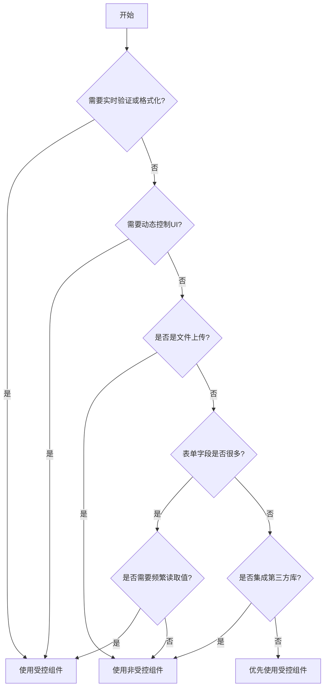

# [0158. 受控组件 vs 非受控组件](https://github.com/tnotesjs/TNotes.react/tree/main/notes/0158.%20%E5%8F%97%E6%8E%A7%E7%BB%84%E4%BB%B6%20vs%20%E9%9D%9E%E5%8F%97%E6%8E%A7%E7%BB%84%E4%BB%B6)

<!-- region:toc -->

- [1. 🎯 本节内容](#1--本节内容)
- [2. 🫧 评价](#2--评价)
- [3. 🆚 基本概念对比](#3--基本概念对比)
  - [3.1. 核心区别](#31-核心区别)
  - [3.2. 受控组件定义](#32-受控组件定义)
  - [3.3. 非受控组件定义](#33-非受控组件定义)
- [4. 🆚 实现方式对比](#4--实现方式对比)
  - [4.1. 文本输入](#41-文本输入)
  - [4.2. 复选框](#42-复选框)
  - [4.3. 下拉选择](#43-下拉选择)
  - [4.4. 文件上传](#44-文件上传)
  - [4.5. 表单提交](#45-表单提交)
- [5. 🆚 使用场景对比](#5--使用场景对比)
  - [5.1. 场景选择表](#51-场景选择表)
  - [5.2. 实时验证场景](#52-实时验证场景)
  - [5.3. 输入格式化场景](#53-输入格式化场景)
  - [5.4. 简单表单场景](#54-简单表单场景)
  - [5.5. 第三方库集成场景](#55-第三方库集成场景)
  - [5.6. 条件性禁用场景](#56-条件性禁用场景)
- [6. 🆚 性能对比](#6--性能对比)
  - [6.1. 渲染性能对比](#61-渲染性能对比)
  - [6.2. 受控组件性能问题](#62-受控组件性能问题)
  - [6.3. 使用 useCallback 优化](#63-使用-usecallback-优化)
- [7. 🤔 如何选择受控还是非受控？](#7--如何选择受控还是非受控)
  - [7.1. 决策流程图](#71-决策流程图)
  - [7.2. 选择建议](#72-选择建议)
  - [7.3. 混合使用策略](#73-混合使用策略)
- [8. 🤔 受控组件的常见问题如何解决？](#8--受控组件的常见问题如何解决)
  - [8.1. 问题 1：输入中文时的重复字符](#81-问题-1输入中文时的重复字符)
  - [8.2. 问题 2：光标位置异常](#82-问题-2光标位置异常)
  - [8.3. 问题 3：频繁渲染导致性能问题](#83-问题-3频繁渲染导致性能问题)
  - [8.4. 问题 4：Warning - value 从 undefined 变为 controlled](#84-问题-4warning---value-从-undefined-变为-controlled)
- [9. 🤔 如何在受控和非受控之间转换？](#9--如何在受控和非受控之间转换)
  - [9.1. 从非受控转为受控](#91-从非受控转为受控)
  - [9.2. 从非受控读取值并转为受控](#92-从非受控读取值并转为受控)
  - [9.3. 使用 key 强制重置组件](#93-使用-key-强制重置组件)
  - [9.4. 封装混合模式组件](#94-封装混合模式组件)
- [10. 🔗 引用](#10--引用)

<!-- endregion:toc -->

## 1. 🎯 本节内容

- 受控组件和非受控组件的定义
- 实现方式的差异
- 使用场景的选择
- 性能影响的分析
- 常见问题的解决方案
- 组件模式的转换方法

## 2. 🫧 评价

受控组件和非受控组件是 React 表单处理中的两种核心模式，理解它们的区别对于构建表单至关重要。

- 受控组件提供更强的控制力，适合需要实时验证、格式化的场景
- 非受控组件更简单直接，适合简单表单或需要与第三方库集成的场景
- 在实际项目中，通常优先选择受控组件，因为它更符合 React 的数据流理念
- 理解两者的性能差异，避免在受控组件中引入不必要的渲染

## 3. 🆚 基本概念对比

### 3.1. 核心区别

| 特性       | 受控组件            | 非受控组件           |
| ---------- | ------------------- | -------------------- |
| 数据源     | React state 控制    | DOM 自身控制         |
| 数据获取   | 通过 state 读取     | 通过 ref 读取        |
| 更新方式   | onChange + setState | 用户输入直接更新 DOM |
| React 理念 | 符合单向数据流      | 不符合单向数据流     |
| 代码复杂度 | 相对复杂            | 相对简单             |

### 3.2. 受控组件定义

受控组件是指其值由 React state 控制的表单元素。

```jsx
function ControlledInput() {
  const [value, setValue] = useState('')

  return (
    <input
      value={value} // ✅ 值由 state 控制
      onChange={(e) => setValue(e.target.value)} // ✅ 通过事件更新 state
    />
  )
}
```

**特点**：

- 表单数据存储在 React state 中
- 每次输入都会触发状态更新
- 组件完全控制表单元素的值
- 符合 React 的数据流模型

### 3.3. 非受控组件定义

非受控组件是指其值由 DOM 自身管理的表单元素。

```jsx
function UncontrolledInput() {
  const inputRef = useRef(null)

  const handleSubmit = () => {
    // ✅ 通过 ref 获取 DOM 值
    console.log(inputRef.current.value)
  }

  return (
    <>
      <input
        ref={inputRef} // ✅ 使用 ref 引用 DOM
        defaultValue="" // ✅ 使用 defaultValue 而不是 value
      />
      <button onClick={handleSubmit}>提交</button>
    </>
  )
}
```

**特点**：

- 表单数据存储在 DOM 中
- React 不控制输入过程
- 需要时通过 ref 访问 DOM
- 更接近传统 HTML 表单

## 4. 🆚 实现方式对比

### 4.1. 文本输入

::: code-group

```jsx [受控组件]
function ControlledTextInput() {
  const [text, setText] = useState('')

  return (
    <div>
      <input
        type="text"
        value={text} // ✅ 受控
        onChange={(e) => setText(e.target.value)}
      />
      <p>当前值：{text}</p>
    </div>
  )
}
```

```jsx [非受控组件]
function UncontrolledTextInput() {
  const inputRef = useRef(null)

  const showValue = () => {
    alert(inputRef.current.value) // ✅ 通过 ref 读取
  }

  return (
    <div>
      <input
        type="text"
        ref={inputRef}
        defaultValue="" // ✅ defaultValue
      />
      <button onClick={showValue}>显示值</button>
    </div>
  )
}
```

:::

### 4.2. 复选框

::: code-group

```jsx [受控组件]
function ControlledCheckbox() {
  const [checked, setChecked] = useState(false)

  return (
    <label>
      <input
        type="checkbox"
        checked={checked} // ✅ 受控
        onChange={(e) => setChecked(e.target.checked)}
      />
      {checked ? '已选中' : '未选中'}
    </label>
  )
}
```

```jsx [非受控组件]
function UncontrolledCheckbox() {
  const checkboxRef = useRef(null)

  const handleSubmit = () => {
    console.log(checkboxRef.current.checked) // ✅ 通过 ref 读取
  }

  return (
    <>
      <label>
        <input
          type="checkbox"
          ref={checkboxRef}
          defaultChecked={false} // ✅ defaultChecked
        />
        选项
      </label>
      <button onClick={handleSubmit}>提交</button>
    </>
  )
}
```

:::

### 4.3. 下拉选择

::: code-group

```jsx [受控组件]
function ControlledSelect() {
  const [selected, setSelected] = useState('apple')

  return (
    <select
      value={selected} // ✅ 受控
      onChange={(e) => setSelected(e.target.value)}
    >
      <option value="apple">苹果</option>
      <option value="banana">香蕉</option>
      <option value="orange">橙子</option>
    </select>
  )
}
```

```jsx [非受控组件]
function UncontrolledSelect() {
  const selectRef = useRef(null)

  const handleSubmit = () => {
    console.log(selectRef.current.value) // ✅ 通过 ref 读取
  }

  return (
    <>
      <select ref={selectRef} defaultValue="apple">
        <option value="apple">苹果</option>
        <option value="banana">香蕉</option>
        <option value="orange">橙子</option>
      </select>
      <button onClick={handleSubmit}>提交</button>
    </>
  )
}
```

:::

### 4.4. 文件上传

::: code-group

```jsx [受控组件（限制）]
// ❌ 文件输入不能完全受控
function ControlledFileInput() {
  const [file, setFile] = useState(null)

  // ⚠️ value 属性在 file input 上是只读的
  // 只能读取文件，不能设置文件
  return (
    <input
      type="file"
      onChange={(e) => setFile(e.target.files[0])}
      // value={file} // ❌ 不能设置 value
    />
  )
}
```

```jsx [非受控组件（推荐）]
// ✅ 文件上传适合用非受控
function UncontrolledFileInput() {
  const fileRef = useRef(null)

  const handleSubmit = () => {
    const file = fileRef.current.files[0]
    if (file) {
      console.log('选择的文件：', file.name)
    }
  }

  return (
    <>
      <input type="file" ref={fileRef} />
      <button onClick={handleSubmit}>上传</button>
    </>
  )
}
```

:::

### 4.5. 表单提交

::: code-group

```jsx [受控组件]
function ControlledForm() {
  const [formData, setFormData] = useState({
    username: '',
    email: '',
    password: '',
  })

  const handleChange = (e) => {
    const { name, value } = e.target
    setFormData((prev) => ({
      ...prev,
      [name]: value,
    }))
  }

  const handleSubmit = (e) => {
    e.preventDefault()
    console.log(formData) // ✅ 直接从 state 获取
  }

  return (
    <form onSubmit={handleSubmit}>
      <input
        name="username"
        value={formData.username}
        onChange={handleChange}
      />
      <input name="email" value={formData.email} onChange={handleChange} />
      <input
        name="password"
        type="password"
        value={formData.password}
        onChange={handleChange}
      />
      <button type="submit">提交</button>
    </form>
  )
}
```

```jsx [非受控组件]
function UncontrolledForm() {
  const formRef = useRef(null)

  const handleSubmit = (e) => {
    e.preventDefault()
    const formData = new FormData(formRef.current)

    // ✅ 提交时从 DOM 获取
    console.log({
      username: formData.get('username'),
      email: formData.get('email'),
      password: formData.get('password'),
    })
  }

  return (
    <form ref={formRef} onSubmit={handleSubmit}>
      <input name="username" defaultValue="" />
      <input name="email" defaultValue="" />
      <input name="password" type="password" defaultValue="" />
      <button type="submit">提交</button>
    </form>
  )
}
```

:::

## 5. 🆚 使用场景对比

### 5.1. 场景选择表

| 场景         | 推荐方案   | 原因                     |
| ------------ | ---------- | ------------------------ |
| 实时验证     | 受控组件   | 需要在每次输入时进行验证 |
| 输入格式化   | 受控组件   | 需要控制输入的格式       |
| 禁用按钮     | 受控组件   | 需要根据输入状态控制 UI  |
| 简单表单     | 非受控组件 | 减少不必要的状态管理     |
| 文件上传     | 非受控组件 | file input 无法受控      |
| 第三方库集成 | 非受控组件 | 避免冲突                 |
| 动态表单     | 受控组件   | 需要程序化控制表单       |
| 一次性提交   | 非受控组件 | 提交时才需要数据         |

### 5.2. 实时验证场景

```jsx
// ✅ 受控组件适合实时验证
function EmailValidation() {
  const [email, setEmail] = useState('')
  const [error, setError] = useState('')

  const handleChange = (e) => {
    const value = e.target.value
    setEmail(value)

    // ✅ 实时验证
    if (value && !value.includes('@')) {
      setError('邮箱格式不正确')
    } else {
      setError('')
    }
  }

  return (
    <div>
      <input type="email" value={email} onChange={handleChange} />
      {error && <span style={{ color: 'red' }}>{error}</span>}
    </div>
  )
}
```

### 5.3. 输入格式化场景

```jsx
// ✅ 受控组件适合格式化输入
function PhoneInput() {
  const [phone, setPhone] = useState('')

  const handleChange = (e) => {
    let value = e.target.value.replace(/\D/g, '') // 只保留数字

    // ✅ 格式化为 xxx-xxxx-xxxx
    if (value.length > 3 && value.length <= 7) {
      value = `${value.slice(0, 3)}-${value.slice(3)}`
    } else if (value.length > 7) {
      value = `${value.slice(0, 3)}-${value.slice(3, 7)}-${value.slice(7, 11)}`
    }

    setPhone(value)
  }

  return (
    <input
      type="tel"
      value={phone}
      onChange={handleChange}
      placeholder="123-4567-8901"
    />
  )
}
```

### 5.4. 简单表单场景

```jsx
// ✅ 非受控组件适合简单表单
function SimpleLoginForm() {
  const usernameRef = useRef(null)
  const passwordRef = useRef(null)

  const handleSubmit = (e) => {
    e.preventDefault()

    // ✅ 提交时才获取值，无需维护状态
    const username = usernameRef.current.value
    const password = passwordRef.current.value

    if (username && password) {
      login(username, password)
    }
  }

  return (
    <form onSubmit={handleSubmit}>
      <input ref={usernameRef} placeholder="用户名" />
      <input ref={passwordRef} type="password" placeholder="密码" />
      <button type="submit">登录</button>
    </form>
  )
}
```

### 5.5. 第三方库集成场景

```jsx
// ✅ 非受控组件适合第三方库
function DatePickerIntegration() {
  const dateInputRef = useRef(null)

  useEffect(() => {
    // ⚠️ 第三方日期选择器可能会操作 DOM
    // 使用非受控避免冲突
    const picker = new ThirdPartyDatePicker(dateInputRef.current)

    return () => picker.destroy()
  }, [])

  return <input ref={dateInputRef} />
}
```

### 5.6. 条件性禁用场景

```jsx
// ✅ 受控组件适合动态 UI 控制
function FormWithValidation() {
  const [username, setUsername] = useState('')
  const [email, setEmail] = useState('')
  const [password, setPassword] = useState('')

  // ✅ 根据表单状态控制按钮
  const isValid =
    username.length >= 3 && email.includes('@') && password.length >= 8

  return (
    <form>
      <input
        value={username}
        onChange={(e) => setUsername(e.target.value)}
        placeholder="用户名（至少3个字符）"
      />
      <input
        type="email"
        value={email}
        onChange={(e) => setEmail(e.target.value)}
        placeholder="邮箱"
      />
      <input
        type="password"
        value={password}
        onChange={(e) => setPassword(e.target.value)}
        placeholder="密码（至少8个字符）"
      />
      <button type="submit" disabled={!isValid}>
        提交
      </button>
    </form>
  )
}
```

## 6. 🆚 性能对比

### 6.1. 渲染性能对比

| 方面       | 受控组件       | 非受控组件   |
| ---------- | -------------- | ------------ |
| 每次输入   | 触发重渲染     | 不触发重渲染 |
| 状态更新   | 频繁           | 无           |
| 内存占用   | 存储在 state   | 存储在 DOM   |
| 大量表单项 | 可能有性能问题 | 性能更好     |

### 6.2. 受控组件性能问题

::: code-group

```jsx [❌ 性能问题]
function SlowControlledForm() {
  const [formData, setFormData] = useState({
    field1: '',
    field2: '',
    // ... 100 个字段
    field100: '',
  })

  const handleChange = (e) => {
    const { name, value } = e.target
    // ❌ 每次输入都更新整个表单状态，导致所有字段重渲染
    setFormData((prev) => ({
      ...prev,
      [name]: value,
    }))
  }

  return (
    <form>
      {/* ❌ 100 个输入框，每次输入都重渲染 */}
      {Object.keys(formData).map((key) => (
        <input
          key={key}
          name={key}
          value={formData[key]}
          onChange={handleChange}
        />
      ))}
    </form>
  )
}
```

```jsx [✅ 优化方案1：拆分状态]
function OptimizedFormWithSplit() {
  // ✅ 将表单拆分为多个小组件，独立管理状态
  return (
    <form>
      <FormSection1 />
      <FormSection2 />
      <FormSection3 />
    </form>
  )
}

function FormSection1() {
  const [data, setData] = useState({ field1: '', field2: '' })

  // ✅ 只有这个 section 的输入会触发重渲染
  return (
    <>
      <input
        name="field1"
        value={data.field1}
        onChange={(e) =>
          setData((prev) => ({ ...prev, field1: e.target.value }))
        }
      />
      <input
        name="field2"
        value={data.field2}
        onChange={(e) =>
          setData((prev) => ({ ...prev, field2: e.target.value }))
        }
      />
    </>
  )
}
```

```jsx [✅ 优化方案2：使用非受控]
function OptimizedFormWithUncontrolled() {
  const formRef = useRef(null)

  const handleSubmit = (e) => {
    e.preventDefault()
    const formData = new FormData(formRef.current)

    // ✅ 只在提交时读取，无性能问题
    const data = Object.fromEntries(formData)
    console.log(data)
  }

  return (
    <form ref={formRef} onSubmit={handleSubmit}>
      {/* ✅ 100 个字段，输入时不触发渲染 */}
      {Array.from({ length: 100 }, (_, i) => (
        <input key={i} name={`field${i + 1}`} defaultValue="" />
      ))}
      <button type="submit">提交</button>
    </form>
  )
}
```

:::

### 6.3. 使用 useCallback 优化

```jsx
// ✅ 使用 useCallback 避免子组件不必要的重渲染
function OptimizedControlledForm() {
  const [formData, setFormData] = useState({
    username: '',
    email: '',
  })

  // ✅ 缓存 change 处理函数
  const handleChange = useCallback((e) => {
    const { name, value } = e.target
    setFormData((prev) => ({
      ...prev,
      [name]: value,
    }))
  }, [])

  return (
    <form>
      <MemoizedInput
        name="username"
        value={formData.username}
        onChange={handleChange}
      />
      <MemoizedInput
        name="email"
        value={formData.email}
        onChange={handleChange}
      />
    </form>
  )
}

// ✅ 使用 memo 避免不必要的重渲染
const MemoizedInput = React.memo(({ name, value, onChange }) => {
  console.log(`${name} rendered`)
  return <input name={name} value={value} onChange={onChange} />
})
```

## 7. 🤔 如何选择受控还是非受控？

### 7.1. 决策流程图



### 7.2. 选择建议

**优先使用受控组件的场景**：

```jsx
// ✅ 需要实时验证
function RealTimeValidation() {
  const [value, setValue] = useState('')
  const error = validate(value) // 实时验证

  return (
    <>
      <input value={value} onChange={(e) => setValue(e.target.value)} />
      {error && <span>{error}</span>}
    </>
  )
}

// ✅ 需要格式化输入
function FormattedInput() {
  const [value, setValue] = useState('')

  const handleChange = (e) => {
    const formatted = format(e.target.value) // 格式化
    setValue(formatted)
  }

  return <input value={value} onChange={handleChange} />
}

// ✅ 需要根据输入控制其他UI
function ConditionalUI() {
  const [value, setValue] = useState('')

  return (
    <>
      <input value={value} onChange={(e) => setValue(e.target.value)} />
      <button disabled={value.length < 5}>提交</button>
    </>
  )
}
```

**优先使用非受控组件的场景**：

```jsx
// ✅ 简单的一次性提交
function SimpleSubmit() {
  const inputRef = useRef(null)

  const handleSubmit = () => {
    const value = inputRef.current.value
    api.submit(value)
  }

  return (
    <>
      <input ref={inputRef} />
      <button onClick={handleSubmit}>提交</button>
    </>
  )
}

// ✅ 文件上传
function FileUpload() {
  const fileRef = useRef(null)

  const handleUpload = () => {
    const file = fileRef.current.files[0]
    api.upload(file)
  }

  return (
    <>
      <input type="file" ref={fileRef} />
      <button onClick={handleUpload}>上传</button>
    </>
  )
}

// ✅ 大量表单字段且不需要实时交互
function LargeForm() {
  const formRef = useRef(null)

  const handleSubmit = (e) => {
    e.preventDefault()
    const data = new FormData(formRef.current)
    api.submit(Object.fromEntries(data))
  }

  return (
    <form ref={formRef} onSubmit={handleSubmit}>
      {/* 100+ 个字段 */}
      <input name="field1" />
      <input name="field2" />
      {/* ... */}
    </form>
  )
}
```

### 7.3. 混合使用策略

```jsx
// ✅ 在同一表单中混合使用
function MixedForm() {
  // ✅ 需要实时验证的字段用受控
  const [email, setEmail] = useState('')
  const [emailError, setEmailError] = useState('')

  // ✅ 简单字段用非受控
  const usernameRef = useRef(null)
  const passwordRef = useRef(null)

  const handleEmailChange = (e) => {
    const value = e.target.value
    setEmail(value)

    // 实时验证邮箱
    if (value && !value.includes('@')) {
      setEmailError('邮箱格式不正确')
    } else {
      setEmailError('')
    }
  }

  const handleSubmit = (e) => {
    e.preventDefault()

    const data = {
      username: usernameRef.current.value,
      email: email, // 从 state 获取
      password: passwordRef.current.value,
    }

    console.log(data)
  }

  return (
    <form onSubmit={handleSubmit}>
      <input ref={usernameRef} placeholder="用户名" />

      {/* 受控组件：需要实时验证 */}
      <input
        type="email"
        value={email}
        onChange={handleEmailChange}
        placeholder="邮箱"
      />
      {emailError && <span style={{ color: 'red' }}>{emailError}</span>}

      <input ref={passwordRef} type="password" placeholder="密码" />

      <button type="submit">注册</button>
    </form>
  )
}
```

## 8. 🤔 受控组件的常见问题如何解决？

### 8.1. 问题 1：输入中文时的重复字符

::: code-group

```jsx [❌ 问题代码]
function ChineseInputProblem() {
  const [value, setValue] = useState('')

  return (
    <input
      value={value}
      // ❌ 中文输入法未确定时，可能出现重复字符
      onChange={(e) => setValue(e.target.value)}
    />
  )
}
```

```jsx [✅ 使用 Composition Event]
function ChineseInputSolution() {
  const [value, setValue] = useState('')
  const [isComposing, setIsComposing] = useState(false)

  const handleCompositionStart = () => {
    setIsComposing(true)
  }

  const handleCompositionEnd = (e) => {
    setIsComposing(false)
    // ✅ 输入法确定后才更新
    setValue(e.target.value)
  }

  const handleChange = (e) => {
    // ✅ 输入法未确定时不更新
    if (!isComposing) {
      setValue(e.target.value)
    }
  }

  return (
    <input
      value={value}
      onChange={handleChange}
      onCompositionStart={handleCompositionStart}
      onCompositionEnd={handleCompositionEnd}
    />
  )
}
```

:::

### 8.2. 问题 2：光标位置异常

::: code-group

```jsx [❌ 问题代码]
function CursorPositionProblem() {
  const [value, setValue] = useState('')

  const handleChange = (e) => {
    // ❌ 格式化后光标会跳到末尾
    const formatted = e.target.value.toUpperCase()
    setValue(formatted)
  }

  return <input value={value} onChange={handleChange} />
}
```

```jsx [✅ 保存并恢复光标位置]
function CursorPositionSolution() {
  const [value, setValue] = useState('')
  const inputRef = useRef(null)

  const handleChange = (e) => {
    const input = e.target
    const start = input.selectionStart
    const end = input.selectionEnd

    // 格式化
    const formatted = input.value.toUpperCase()
    setValue(formatted)

    // ✅ 恢复光标位置
    requestAnimationFrame(() => {
      if (inputRef.current) {
        inputRef.current.setSelectionRange(start, end)
      }
    })
  }

  return <input ref={inputRef} value={value} onChange={handleChange} />
}
```

:::

### 8.3. 问题 3：频繁渲染导致性能问题

::: code-group

```jsx [❌ 问题代码]
function PerformanceProblem() {
  const [searchText, setSearchText] = useState('')

  // ❌ 每次输入都触发搜索，性能差
  const results = expensiveSearch(searchText)

  return (
    <>
      <input
        value={searchText}
        onChange={(e) => setSearchText(e.target.value)}
      />
      <SearchResults results={results} />
    </>
  )
}
```

```jsx [✅ 使用防抖优化]
import { useState, useEffect } from 'react'
import { debounce } from 'lodash'

function PerformanceSolution() {
  const [searchText, setSearchText] = useState('')
  const [debouncedText, setDebouncedText] = useState('')

  // ✅ 使用防抖，减少搜索频率
  useEffect(() => {
    const handler = setTimeout(() => {
      setDebouncedText(searchText)
    }, 300)

    return () => clearTimeout(handler)
  }, [searchText])

  // ✅ 只在防抖后的值改变时搜索
  const results = expensiveSearch(debouncedText)

  return (
    <>
      <input
        value={searchText}
        onChange={(e) => setSearchText(e.target.value)}
      />
      <SearchResults results={results} />
    </>
  )
}
```

```jsx [✅ 使用自定义 Hook]
function useDebounce(value, delay) {
  const [debouncedValue, setDebouncedValue] = useState(value)

  useEffect(() => {
    const handler = setTimeout(() => {
      setDebouncedValue(value)
    }, delay)

    return () => clearTimeout(handler)
  }, [value, delay])

  return debouncedValue
}

function PerformanceSolutionWithHook() {
  const [searchText, setSearchText] = useState('')
  const debouncedText = useDebounce(searchText, 300)

  const results = expensiveSearch(debouncedText)

  return (
    <>
      <input
        value={searchText}
        onChange={(e) => setSearchText(e.target.value)}
      />
      <SearchResults results={results} />
    </>
  )
}
```

:::

### 8.4. 问题 4：Warning - value 从 undefined 变为 controlled

::: code-group

```jsx [❌ 问题代码]
function UndefinedValueProblem({ initialValue }) {
  // ❌ initialValue 可能是 undefined
  const [value, setValue] = useState(initialValue)

  return (
    <input
      value={value} // ⚠️ Warning: A component is changing an uncontrolled input to be controlled
      onChange={(e) => setValue(e.target.value)}
    />
  )
}
```

```jsx [✅ 确保初始值不为 undefined]
function UndefinedValueSolution({ initialValue }) {
  // ✅ 使用空字符串作为默认值
  const [value, setValue] = useState(initialValue ?? '')

  return <input value={value} onChange={(e) => setValue(e.target.value)} />
}

// ✅ 或者使用 defaultValue + 非受控
function UndefinedValueSolution2({ initialValue }) {
  return <input defaultValue={initialValue ?? ''} />
}
```

:::

## 9. 🤔 如何在受控和非受控之间转换？

### 9.1. 从非受控转为受控

::: code-group

```jsx [❌ 错误转换]
function WrongConversion() {
  const [isControlled, setIsControlled] = useState(false)
  const [value, setValue] = useState('')

  return (
    <>
      <button onClick={() => setIsControlled(!isControlled)}>切换模式</button>

      {/* ❌ 不能在运行时切换受控/非受控状态 */}
      {isControlled ? (
        <input value={value} onChange={(e) => setValue(e.target.value)} />
      ) : (
        <input defaultValue="" />
      )}
    </>
  )
}
```

```jsx [✅ 正确方法：始终使用受控]
function CorrectConversion() {
  const [value, setValue] = useState('')
  const [isValidating, setIsValidating] = useState(false)

  const handleChange = (e) => {
    setValue(e.target.value)

    // ✅ 通过状态控制是否验证，而不是切换受控/非受控
    if (isValidating) {
      validate(e.target.value)
    }
  }

  return (
    <>
      <button onClick={() => setIsValidating(!isValidating)}>
        {isValidating ? '关闭验证' : '开启验证'}
      </button>

      <input value={value} onChange={handleChange} />
    </>
  )
}
```

:::

### 9.2. 从非受控读取值并转为受控

```jsx
function UncontrolledToControlled() {
  const [isEditing, setIsEditing] = useState(false)
  const [value, setValue] = useState('')
  const inputRef = useRef(null)

  const handleEdit = () => {
    // ✅ 从非受控 DOM 读取值
    const currentValue = inputRef.current.value
    setValue(currentValue)
    setIsEditing(true)
  }

  const handleSave = () => {
    console.log('保存：', value)
    setIsEditing(false)
  }

  if (isEditing) {
    // ✅ 编辑时使用受控组件
    return (
      <>
        <input value={value} onChange={(e) => setValue(e.target.value)} />
        <button onClick={handleSave}>保存</button>
      </>
    )
  }

  // ✅ 非编辑时使用非受控组件
  return (
    <>
      <input ref={inputRef} defaultValue={value} />
      <button onClick={handleEdit}>编辑</button>
    </>
  )
}
```

### 9.3. 使用 key 强制重置组件

```jsx
function ResetWithKey() {
  const [mode, setMode] = useState('uncontrolled')
  const [resetKey, setResetKey] = useState(0)

  const handleReset = () => {
    // ✅ 改变 key 强制重新挂载组件
    setResetKey((prev) => prev + 1)
  }

  return (
    <>
      <select value={mode} onChange={(e) => setMode(e.target.value)}>
        <option value="uncontrolled">非受控</option>
        <option value="controlled">受控</option>
      </select>

      <button onClick={handleReset}>重置</button>

      {/* ✅ 使用 key 强制重新挂载，避免状态冲突 */}
      {mode === 'controlled' ? (
        <ControlledInput key={`controlled-${resetKey}`} />
      ) : (
        <UncontrolledInput key={`uncontrolled-${resetKey}`} />
      )}
    </>
  )
}

function ControlledInput() {
  const [value, setValue] = useState('')
  return <input value={value} onChange={(e) => setValue(e.target.value)} />
}

function UncontrolledInput() {
  return <input defaultValue="" />
}
```

### 9.4. 封装混合模式组件

```jsx
// ✅ 封装一个同时支持受控和非受控的组件
function FlexibleInput({ value, defaultValue, onChange, ...props }) {
  const [internalValue, setInternalValue] = useState(defaultValue ?? '')

  // ✅ 判断是否为受控组件
  const isControlled = value !== undefined

  // ✅ 使用受控值或内部值
  const currentValue = isControlled ? value : internalValue

  const handleChange = (e) => {
    const newValue = e.target.value

    // ✅ 非受控时更新内部状态
    if (!isControlled) {
      setInternalValue(newValue)
    }

    // ✅ 调用外部 onChange
    onChange?.(e)
  }

  return <input {...props} value={currentValue} onChange={handleChange} />
}

// 使用示例
function Example() {
  const [controlled, setControlled] = useState('')

  return (
    <>
      {/* 受控模式 */}
      <FlexibleInput
        value={controlled}
        onChange={(e) => setControlled(e.target.value)}
      />

      {/* 非受控模式 */}
      <FlexibleInput
        defaultValue="初始值"
        onChange={(e) => console.log(e.target.value)}
      />
    </>
  )
}
```

## 10. 🔗 引用

- [React 官方文档 - 受控组件][1]
- [React 官方文档 - 非受控组件][2]
- [React 官方文档 - 表单][3]
- [MDN - HTMLFormElement][4]

[1]: https://react.dev/learn/sharing-state-between-components#controlled-and-uncontrolled-components
[2]: https://react.dev/reference/react-dom/components/input#controlling-an-input-with-a-state-variable
[3]: https://react.dev/learn/reacting-to-input-with-state
[4]: https://developer.mozilla.org/en-US/docs/Web/API/HTMLFormElement
