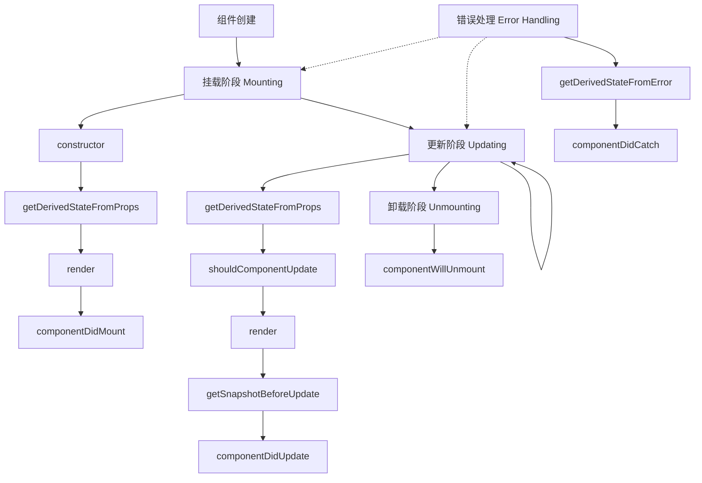

# [0171. 类组件生命周期完整图谱](https://github.com/tnotesjs/TNotes.react/tree/main/notes/0171.%20%E7%B1%BB%E7%BB%84%E4%BB%B6%E7%94%9F%E5%91%BD%E5%91%A8%E6%9C%9F%E5%AE%8C%E6%95%B4%E5%9B%BE%E8%B0%B1)

<!-- region:toc -->

- [1. 🎯 本节内容](#1--本节内容)
- [2. 🫧 评价](#2--评价)
- [3. 🤔 类组件生命周期有哪些阶段？](#3--类组件生命周期有哪些阶段)
  - [3.1. 完整生命周期图谱](#31-完整生命周期图谱)
  - [3.2. 四个主要阶段](#32-四个主要阶段)
  - [3.3. 阶段特征对比](#33-阶段特征对比)
- [4. 🤔 挂载阶段的完整流程是什么？](#4--挂载阶段的完整流程是什么)
  - [4.1. 执行顺序详解](#41-执行顺序详解)
  - [4.2. 挂载阶段注意事项](#42-挂载阶段注意事项)
- [5. 🤔 更新阶段的完整流程是什么？](#5--更新阶段的完整流程是什么)
  - [5.1. 更新触发条件](#51-更新触发条件)
  - [5.2. 完整更新流程](#52-完整更新流程)
  - [5.3. 性能优化实践](#53-性能优化实践)
- [6. 🤔 卸载阶段包含哪些操作？](#6--卸载阶段包含哪些操作)
  - [6.1. componentWillUnmount 用法](#61-componentwillunmount-用法)
  - [6.2. 常见内存泄漏场景](#62-常见内存泄漏场景)
- [7. 🤔 错误处理阶段如何工作？](#7--错误处理阶段如何工作)
  - [7.1. 错误边界实现](#71-错误边界实现)
  - [7.2. 错误边界使用](#72-错误边界使用)
  - [7.3. 错误边界的局限性](#73-错误边界的局限性)
- [8. � 如何在实际项目中应用生命周期？](#8--如何在实际项目中应用生命周期)
  - [8.1. 数据获取场景](#81-数据获取场景)
  - [8.2. DOM 操作场景](#82-dom-操作场景)
  - [8.3. 性能优化场景](#83-性能优化场景)
- [9. 🆚 不同 React 版本的生命周期对比](#9--不同-react-版本的生命周期对比)
  - [9.1. 生命周期方法对比表](#91-生命周期方法对比表)
  - [9.2. 迁移指南](#92-迁移指南)
  - [9.3. 函数组件对比](#93-函数组件对比)
- [10. 🔗 引用](#10--引用)

<!-- endregion:toc -->

## 1. 🎯 本节内容

- 生命周期的四个主要阶段
- 挂载阶段的方法执行顺序
- 更新阶段的触发条件与流程
- 卸载阶段的清理操作
- 错误边界的捕获机制
- 生命周期的实际应用场景
- 不同版本的生命周期变化

## 2. 🫧 评价

这篇笔记系统梳理了 React 类组件生命周期的完整图谱，通过清晰的流程图和代码示例展示每个阶段的执行顺序。

- 虽然函数组件和 Hooks 已成为主流，但理解类组件生命周期仍是 React 开发的基础
- 许多遗留项目仍在使用类组件，掌握生命周期图谱有助于维护和重构
- 生命周期的概念帮助理解 React 的更新机制和性能优化原理
- 错误边界目前只能在类组件中实现，必须掌握相关生命周期方法

## 3. 🤔 类组件生命周期有哪些阶段？

React 类组件的生命周期分为四个主要阶段，每个阶段包含不同的生命周期方法。

### 3.1. 完整生命周期图谱



### 3.2. 四个主要阶段

```typescript
class LifecycleDemo extends React.Component {
  // 1. 挂载阶段（Mounting）
  constructor(props) {
    super(props)
    console.log('1. constructor - 初始化 state 和绑定方法')
  }

  static getDerivedStateFromProps(props, state) {
    console.log('2. getDerivedStateFromProps - 根据 props 派生 state')
    return null
  }

  componentDidMount() {
    console.log('4. componentDidMount - 组件已挂载，可以进行副作用操作')
  }

  // 2. 更新阶段（Updating）
  shouldComponentUpdate(nextProps, nextState) {
    console.log('5. shouldComponentUpdate - 决定是否继续更新')
    return true
  }

  getSnapshotBeforeUpdate(prevProps, prevState) {
    console.log('7. getSnapshotBeforeUpdate - 更新前获取 DOM 快照')
    return null
  }

  componentDidUpdate(prevProps, prevState, snapshot) {
    console.log('8. componentDidUpdate - 组件已更新')
  }

  // 3. 卸载阶段（Unmounting）
  componentWillUnmount() {
    console.log('9. componentWillUnmount - 组件即将卸载，清理资源')
  }

  // 4. 错误处理阶段（Error Handling）
  static getDerivedStateFromError(error) {
    console.log('10. getDerivedStateFromError - 捕获错误并更新 state')
    return { hasError: true }
  }

  componentDidCatch(error, errorInfo) {
    console.log('11. componentDidCatch - 记录错误日志')
  }

  render() {
    console.log('3/6. render - 渲染组件')
    return <div>生命周期演示</div>
  }
}
```

### 3.3. 阶段特征对比

| 阶段 | 触发时机                | 可用方法数量 | 主要用途           |
| ---- | ----------------------- | ------------ | ------------------ |
| 挂载 | 组件首次渲染            | 4 个         | 初始化、数据获取   |
| 更新 | props/state/forceUpdate | 5 个         | 响应变化、优化性能 |
| 卸载 | 组件移除                | 1 个         | 清理资源           |
| 错误 | 子组件抛出错误          | 2 个         | 错误捕获与处理     |

## 4. 🤔 挂载阶段的完整流程是什么？

挂载阶段是组件从创建到插入 DOM 的过程，执行顺序固定。

### 4.1. 执行顺序详解

```typescript
interface User {
  id: number
  name: string
}

interface Props {
  userId: number
}

interface State {
  user: User | null
  loading: boolean
}

class UserProfile extends React.Component<Props, State> {
  // 第 1 步：constructor
  constructor(props: Props) {
    super(props)

    // ✅ 初始化 state
    this.state = {
      user: null,
      loading: false,
    }

    // ✅ 绑定方法
    this.handleClick = this.handleClick.bind(this)

    console.log('1. constructor - 组件实例创建')
  }

  // 第 2 步：getDerivedStateFromProps
  static getDerivedStateFromProps(props: Props, state: State) {
    console.log('2. getDerivedStateFromProps - props:', props)

    // ✅ 根据 props 派生 state（少用）
    if (props.userId !== state.user?.id) {
      return {
        loading: true,
      }
    }

    return null
  }

  // 第 3 步：render
  render() {
    console.log('3. render - 渲染虚拟 DOM')

    const { user, loading } = this.state

    if (loading) {
      return <div>加载中...</div>
    }

    return (
      <div>
        <h1>{user?.name}</h1>
        <button onClick={this.handleClick}>点击</button>
      </div>
    )
  }

  // 第 4 步：componentDidMount
  componentDidMount() {
    console.log('4. componentDidMount - 组件已挂载到 DOM')

    // ✅ 发起网络请求
    this.fetchUser()

    // ✅ 添加事件监听
    window.addEventListener('resize', this.handleResize)

    // ✅ 操作 DOM
    this.inputRef?.focus()
  }

  private async fetchUser() {
    this.setState({ loading: true })

    const response = await fetch(`/api/users/${this.props.userId}`)
    const user = await response.json()

    this.setState({
      user,
      loading: false,
    })
  }

  private handleClick() {
    console.log('按钮点击')
  }

  private handleResize = () => {
    console.log('窗口大小改变')
  }

  private inputRef: HTMLInputElement | null = null

  componentWillUnmount() {
    // ✅ 清理事件监听
    window.removeEventListener('resize', this.handleResize)
  }
}
```

### 4.2. 挂载阶段注意事项

::: code-group

```typescript [❌ 错误示例]
class BadExample extends React.Component {
  constructor(props) {
    super(props)

    // ❌ 不要在 constructor 中调用 setState
    this.setState({ count: 0 })

    // ❌ 不要在 constructor 中执行副作用
    fetch('/api/data').then((data) => {
      this.setState({ data })
    })
  }

  static getDerivedStateFromProps(props, state) {
    // ❌ 不要在这里执行副作用
    fetch('/api/data')

    // ❌ 不要直接修改 state
    state.count = props.count

    return null
  }

  render() {
    // ❌ 不要在 render 中执行副作用
    fetch('/api/data')
    this.setState({ count: 1 })

    return <div>{this.state.count}</div>
  }
}
```

```typescript [✅ 正确示例]
class GoodExample extends React.Component {
  constructor(props) {
    super(props)

    // ✅ 只初始化 state
    this.state = {
      count: 0,
      data: null,
    }
  }

  static getDerivedStateFromProps(props, state) {
    // ✅ 只返回新的 state 对象
    if (props.count !== state.count) {
      return {
        count: props.count,
      }
    }

    return null
  }

  render() {
    // ✅ 只渲染 UI
    return <div>{this.state.count}</div>
  }

  componentDidMount() {
    // ✅ 在这里执行副作用
    fetch('/api/data')
      .then((response) => response.json())
      .then((data) => {
        this.setState({ data })
      })
  }
}
```

:::

## 5. 🤔 更新阶段的完整流程是什么？

更新阶段在 props、state 变化或调用 `forceUpdate` 时触发。

### 5.1. 更新触发条件

```typescript
interface Props {
  count: number
}

interface State {
  value: string
}

class UpdateDemo extends React.Component<Props, State> {
  state = {
    value: '',
  }

  // 触发方式 1：props 变化
  static getDerivedStateFromProps(nextProps: Props, prevState: State) {
    console.log('Props 更新触发')
    return null
  }

  // 触发方式 2：setState
  handleChange = (e: React.ChangeEvent<HTMLInputElement>) => {
    // 调用 setState 触发更新
    this.setState({ value: e.target.value })
  }

  // 触发方式 3：forceUpdate
  handleForceUpdate = () => {
    // 强制更新（跳过 shouldComponentUpdate）
    this.forceUpdate()
  }

  render() {
    return (
      <div>
        <input value={this.state.value} onChange={this.handleChange} />
        <button onClick={this.handleForceUpdate}>强制更新</button>
        <p>Props: {this.props.count}</p>
      </div>
    )
  }
}
```

### 5.2. 完整更新流程

```typescript
class UpdateFlow extends React.Component<Props, State> {
  // 步骤 1：getDerivedStateFromProps
  static getDerivedStateFromProps(nextProps: Props, prevState: State) {
    console.log('1. getDerivedStateFromProps')
    console.log('nextProps:', nextProps)
    console.log('prevState:', prevState)

    // 根据新 props 派生新 state
    if (nextProps.userId !== prevState.userId) {
      return {
        userId: nextProps.userId,
        loading: true,
      }
    }

    return null
  }

  // 步骤 2：shouldComponentUpdate
  shouldComponentUpdate(nextProps: Props, nextState: State) {
    console.log('2. shouldComponentUpdate')
    console.log('nextProps:', nextProps)
    console.log('nextState:', nextState)
    console.log('currentProps:', this.props)
    console.log('currentState:', this.state)

    // ✅ 性能优化：避免不必要的渲染
    if (
      this.props.count === nextProps.count &&
      this.state.value === nextState.value
    ) {
      return false // 阻止更新
    }

    return true // 允许更新
  }

  // 步骤 3：render
  render() {
    console.log('3. render')
    return <div>{this.props.count}</div>
  }

  // 步骤 4：getSnapshotBeforeUpdate
  getSnapshotBeforeUpdate(prevProps: Props, prevState: State) {
    console.log('4. getSnapshotBeforeUpdate')

    // ✅ 在 DOM 更新前获取信息
    const list = document.getElementById('message-list')
    if (list) {
      return {
        scrollHeight: list.scrollHeight,
        scrollTop: list.scrollTop,
      }
    }

    return null
  }

  // 步骤 5：componentDidUpdate
  componentDidUpdate(
    prevProps: Props,
    prevState: State,
    snapshot: { scrollHeight: number; scrollTop: number } | null
  ) {
    console.log('5. componentDidUpdate')
    console.log('prevProps:', prevProps)
    console.log('prevState:', prevState)
    console.log('snapshot:', snapshot)

    // ✅ 根据 snapshot 调整滚动位置
    if (snapshot) {
      const list = document.getElementById('message-list')
      if (list) {
        list.scrollTop =
          snapshot.scrollTop + (list.scrollHeight - snapshot.scrollHeight)
      }
    }

    // ✅ 根据 props 变化执行副作用
    if (this.props.userId !== prevProps.userId) {
      this.fetchUserData(this.props.userId)
    }
  }

  private fetchUserData(userId: number) {
    // 获取用户数据
  }
}
```

### 5.3. 性能优化实践

```typescript
// 使用 PureComponent 自动进行浅比较
class OptimizedComponent extends React.PureComponent<Props, State> {
  // 不需要手动实现 shouldComponentUpdate
  // PureComponent 会自动进行浅比较

  render() {
    return <div>{this.props.data}</div>
  }
}

// 手动实现精确的比较逻辑
class CustomOptimized extends React.Component<Props, State> {
  shouldComponentUpdate(nextProps: Props, nextState: State) {
    // ✅ 只比较需要的字段
    return (
      this.props.user.id !== nextProps.user.id ||
      this.state.isOpen !== nextState.isOpen
    )
  }

  render() {
    return <div>{this.props.user.name}</div>
  }
}
```

## 6. 🤔 卸载阶段包含哪些操作？

卸载阶段只有一个生命周期方法，用于清理资源。

### 6.1. componentWillUnmount 用法

```typescript
class CleanupDemo extends React.Component {
  private timerId?: number
  private subscription?: { unsubscribe: () => void }

  componentDidMount() {
    // 1. 启动定时器
    this.timerId = window.setInterval(() => {
      console.log('定时任务执行')
    }, 1000)

    // 2. 添加事件监听
    window.addEventListener('resize', this.handleResize)
    document.addEventListener('keydown', this.handleKeyDown)

    // 3. 订阅数据流
    this.subscription = dataStore.subscribe(this.handleDataChange)

    // 4. 创建 WebSocket 连接
    this.ws = new WebSocket('ws://localhost:8080')
    this.ws.onmessage = this.handleMessage
  }

  componentWillUnmount() {
    console.log('组件即将卸载，清理资源')

    // ✅ 1. 清除定时器
    if (this.timerId) {
      clearInterval(this.timerId)
    }

    // ✅ 2. 移除事件监听
    window.removeEventListener('resize', this.handleResize)
    document.removeEventListener('keydown', this.handleKeyDown)

    // ✅ 3. 取消订阅
    if (this.subscription) {
      this.subscription.unsubscribe()
    }

    // ✅ 4. 关闭 WebSocket
    if (this.ws) {
      this.ws.close()
    }

    // ✅ 5. 取消未完成的请求
    if (this.abortController) {
      this.abortController.abort()
    }
  }

  private handleResize = () => {
    // 处理窗口大小变化
  }

  private handleKeyDown = (e: KeyboardEvent) => {
    // 处理键盘事件
  }

  private handleDataChange = (data: any) => {
    // 处理数据变化
  }

  private handleMessage = (event: MessageEvent) => {
    // 处理 WebSocket 消息
  }

  private ws?: WebSocket
  private abortController?: AbortController

  render() {
    return <div>清理演示</div>
  }
}
```

### 6.2. 常见内存泄漏场景

::: code-group

```typescript [❌ 内存泄漏]
class MemoryLeak extends React.Component {
  componentDidMount() {
    // ❌ 没有清理定时器
    setInterval(() => {
      this.setState({ time: new Date() })
    }, 1000)

    // ❌ 没有移除事件监听
    window.addEventListener('scroll', this.handleScroll)

    // ❌ 没有取消异步请求
    fetch('/api/data').then((data) => {
      this.setState({ data }) // 组件已卸载时仍然执行
    })
  }

  private handleScroll = () => {
    // 处理滚动
  }

  render() {
    return <div />
  }
}
```

```typescript [✅ 正确清理]
class NoMemoryLeak extends React.Component {
  private timerId?: number
  private abortController = new AbortController()

  componentDidMount() {
    // ✅ 保存定时器 ID
    this.timerId = window.setInterval(() => {
      this.setState({ time: new Date() })
    }, 1000)

    // ✅ 保存事件处理函数引用
    window.addEventListener('scroll', this.handleScroll)

    // ✅ 使用 AbortController 取消请求
    fetch('/api/data', { signal: this.abortController.signal })
      .then((response) => response.json())
      .then((data) => {
        this.setState({ data })
      })
      .catch((error) => {
        if (error.name !== 'AbortError') {
          console.error(error)
        }
      })
  }

  componentWillUnmount() {
    // ✅ 清理定时器
    if (this.timerId) {
      clearInterval(this.timerId)
    }

    // ✅ 移除事件监听
    window.removeEventListener('scroll', this.handleScroll)

    // ✅ 取消请求
    this.abortController.abort()
  }

  private handleScroll = () => {
    // 处理滚动
  }

  render() {
    return <div />
  }
}
```

:::

## 7. 🤔 错误处理阶段如何工作？

错误边界可以捕获子组件树中的 JavaScript 错误。

### 7.1. 错误边界实现

```typescript
interface ErrorBoundaryProps {
  children: React.ReactNode
  fallback?: React.ReactNode
}

interface ErrorBoundaryState {
  hasError: boolean
  error: Error | null
  errorInfo: React.ErrorInfo | null
}

class ErrorBoundary extends React.Component<
  ErrorBoundaryProps,
  ErrorBoundaryState
> {
  state: ErrorBoundaryState = {
    hasError: false,
    error: null,
    errorInfo: null,
  }

  // 静态方法：更新 state 以显示降级 UI
  static getDerivedStateFromError(error: Error): Partial<ErrorBoundaryState> {
    console.log('getDerivedStateFromError:', error)

    // ✅ 返回新的 state
    return {
      hasError: true,
      error,
    }
  }

  // 实例方法：记录错误信息
  componentDidCatch(error: Error, errorInfo: React.ErrorInfo) {
    console.log('componentDidCatch')
    console.log('error:', error)
    console.log('errorInfo:', errorInfo)
    console.log('componentStack:', errorInfo.componentStack)

    // ✅ 更新 state 保存错误详情
    this.setState({
      errorInfo,
    })

    // ✅ 上报错误到监控服务
    this.logErrorToService(error, errorInfo)
  }

  private logErrorToService(error: Error, errorInfo: React.ErrorInfo) {
    // 发送到 Sentry、LogRocket 等服务
    console.error('Error reported:', {
      message: error.message,
      stack: error.stack,
      componentStack: errorInfo.componentStack,
    })
  }

  private handleReset = () => {
    this.setState({
      hasError: false,
      error: null,
      errorInfo: null,
    })
  }

  render() {
    if (this.state.hasError) {
      // ✅ 显示降级 UI
      if (this.props.fallback) {
        return this.props.fallback
      }

      return (
        <div style={{ padding: '20px' }}>
          <h2>出错了</h2>
          <details>
            <summary>错误详情</summary>
            <p>{this.state.error?.message}</p>
            <pre>{this.state.error?.stack}</pre>
            <pre>{this.state.errorInfo?.componentStack}</pre>
          </details>
          <button onClick={this.handleReset}>重试</button>
        </div>
      )
    }

    return this.props.children
  }
}
```

### 7.2. 错误边界使用

```typescript
// 使用错误边界包裹可能出错的组件
function App() {
  return (
    <ErrorBoundary fallback={<div>加载失败</div>}>
      <Header />
      <ErrorBoundary>
        <Sidebar />
      </ErrorBoundary>
      <ErrorBoundary>
        <Content />
      </ErrorBoundary>
    </ErrorBoundary>
  )
}

// 故意抛出错误的组件
class BuggyComponent extends React.Component {
  state = {
    counter: 0,
  }

  handleClick = () => {
    this.setState(({ counter }) => ({
      counter: counter + 1,
    }))
  }

  render() {
    if (this.state.counter === 5) {
      // ✅ 抛出错误会被错误边界捕获
      throw new Error('崩溃了！')
    }

    return (
      <div>
        <p>Counter: {this.state.counter}</p>
        <button onClick={this.handleClick}>增加</button>
      </div>
    )
  }
}
```

### 7.3. 错误边界的局限性

```typescript
// ❌ 错误边界无法捕获以下错误：

// 1. 事件处理器中的错误
class EventError extends React.Component {
  handleClick = () => {
    // ❌ 这里的错误不会被捕获
    throw new Error('事件处理器错误')
  }

  render() {
    return <button onClick={this.handleClick}>点击</button>
  }
}

// 2. 异步代码中的错误
class AsyncError extends React.Component {
  componentDidMount() {
    setTimeout(() => {
      // ❌ 异步错误不会被捕获
      throw new Error('异步错误')
    }, 1000)
  }

  render() {
    return <div>异步错误演示</div>
  }
}

// 3. 服务端渲染
// ❌ SSR 中的错误不会被捕获

// 4. 错误边界自身的错误
// ❌ 错误边界内部抛出的错误不会被自己捕获
```

## 8. � 如何在实际项目中应用生命周期？

根据不同场景选择合适的生命周期方法。

### 8.1. 数据获取场景

```typescript
interface Article {
  id: number
  title: string
  content: string
}

interface Props {
  articleId: number
}

interface State {
  article: Article | null
  loading: boolean
  error: Error | null
}

class ArticleDetail extends React.Component<Props, State> {
  state: State = {
    article: null,
    loading: false,
    error: null,
  }

  componentDidMount() {
    // ✅ 初始加载
    this.fetchArticle(this.props.articleId)
  }

  componentDidUpdate(prevProps: Props) {
    // ✅ ID 变化时重新加载
    if (this.props.articleId !== prevProps.articleId) {
      this.fetchArticle(this.props.articleId)
    }
  }

  private async fetchArticle(id: number) {
    this.setState({ loading: true, error: null })

    try {
      const response = await fetch(`/api/articles/${id}`)
      const article = await response.json()
      this.setState({ article, loading: false })
    } catch (error) {
      this.setState({ error: error as Error, loading: false })
    }
  }

  render() {
    const { article, loading, error } = this.state

    if (loading) return <div>加载中...</div>
    if (error) return <div>错误: {error.message}</div>
    if (!article) return null

    return (
      <article>
        <h1>{article.title}</h1>
        <div>{article.content}</div>
      </article>
    )
  }
}
```

### 8.2. DOM 操作场景

```typescript
class AutoFocusInput extends React.Component {
  private inputRef = React.createRef<HTMLInputElement>()

  componentDidMount() {
    // ✅ 组件挂载后自动聚焦
    this.inputRef.current?.focus()
  }

  render() {
    return <input ref={this.inputRef} type="text" />
  }
}

// 滚动位置保持
class ChatList extends React.Component {
  private listRef = React.createRef<HTMLDivElement>()
  private shouldScrollToBottom = true

  getSnapshotBeforeUpdate(prevProps: Props) {
    const list = this.listRef.current
    if (!list) return null

    // ✅ 判断用户是否在底部
    const isAtBottom = list.scrollHeight - list.scrollTop === list.clientHeight

    return isAtBottom
  }

  componentDidUpdate(
    prevProps: Props,
    prevState: State,
    snapshot: boolean | null
  ) {
    if (snapshot) {
      // ✅ 保持在底部
      const list = this.listRef.current
      if (list) {
        list.scrollTop = list.scrollHeight
      }
    }
  }

  render() {
    return (
      <div ref={this.listRef} style={{ height: '400px', overflow: 'auto' }}>
        {this.props.messages.map((msg) => (
          <div key={msg.id}>{msg.text}</div>
        ))}
      </div>
    )
  }
}
```

### 8.3. 性能优化场景

```typescript
class ExpensiveList extends React.Component<Props, State> {
  shouldComponentUpdate(nextProps: Props, nextState: State) {
    // ✅ 仅在必要时更新
    return (
      nextProps.items.length !== this.props.items.length ||
      nextState.selectedId !== this.state.selectedId
    )
  }

  render() {
    return (
      <ul>
        {this.props.items.map((item) => (
          <ExpensiveListItem key={item.id} item={item} />
        ))}
      </ul>
    )
  }
}

// 或使用 PureComponent
class OptimizedList extends React.PureComponent<Props, State> {
  // 自动进行浅比较

  render() {
    return (
      <ul>
        {this.props.items.map((item) => (
          <li key={item.id}>{item.name}</li>
        ))}
      </ul>
    )
  }
}
```

## 9. 🆚 不同 React 版本的生命周期对比

React 版本升级带来了生命周期方法的变化。

### 9.1. 生命周期方法对比表

| 生命周期方法 | React 16.3- | React 16.3+ | React 17+ | React 18+ | 状态 |
| --- | --- | --- | --- | --- | --- |
| constructor | ✅ | ✅ | ✅ | ✅ | 保留 |
| componentWillMount | ✅ | ⚠️ | ❌ | ❌ | 已废弃 |
| getDerivedStateFromProps | ❌ | ✅ | ✅ | ✅ | 新增 |
| render | ✅ | ✅ | ✅ | ✅ | 保留 |
| componentDidMount | ✅ | ✅ | ✅ | ✅ | 保留 |
| componentWillReceiveProps | ✅ | ⚠️ | ❌ | ❌ | 已废弃 |
| shouldComponentUpdate | ✅ | ✅ | ✅ | ✅ | 保留 |
| componentWillUpdate | ✅ | ⚠️ | ❌ | ❌ | 已废弃 |
| getSnapshotBeforeUpdate | ❌ | ✅ | ✅ | ✅ | 新增 |
| componentDidUpdate | ✅ | ✅ | ✅ | ✅ | 保留 |
| componentWillUnmount | ✅ | ✅ | ✅ | ✅ | 保留 |
| getDerivedStateFromError | ❌ | ✅ | ✅ | ✅ | 新增 |
| componentDidCatch | ❌ | ✅ | ✅ | ✅ | 新增 |

### 9.2. 迁移指南

::: code-group

```typescript [旧版（16.3 之前）]
class OldComponent extends React.Component {
  // ❌ 已废弃
  componentWillMount() {
    this.setState({ data: this.props.initialData })
  }

  // ❌ 已废弃
  componentWillReceiveProps(nextProps) {
    if (nextProps.id !== this.props.id) {
      this.setState({ loading: true })
      this.fetchData(nextProps.id)
    }
  }

  // ❌ 已废弃
  componentWillUpdate(nextProps, nextState) {
    if (nextState.value !== this.state.value) {
      this.prepareData(nextState.value)
    }
  }

  render() {
    return <div>{this.state.data}</div>
  }
}
```

```typescript [新版（16.3+）]
class NewComponent extends React.Component {
  // ✅ 在 constructor 中初始化
  constructor(props) {
    super(props)
    this.state = {
      data: props.initialData,
    }
  }

  // ✅ 使用静态方法派生 state
  static getDerivedStateFromProps(nextProps, prevState) {
    if (nextProps.id !== prevState.prevId) {
      return {
        prevId: nextProps.id,
        loading: true,
      }
    }
    return null
  }

  // ✅ 在 componentDidUpdate 中执行副作用
  componentDidUpdate(prevProps, prevState) {
    if (this.props.id !== prevProps.id) {
      this.fetchData(this.props.id)
    }

    if (this.state.value !== prevState.value) {
      this.prepareData(this.state.value)
    }
  }

  render() {
    return <div>{this.state.data}</div>
  }
}
```

:::

### 9.3. 函数组件对比

| 类组件生命周期           | 函数组件 Hooks 等价     | 说明                  |
| ------------------------ | ----------------------- | --------------------- |
| constructor              | useState 初始化         | 初始化 state          |
| componentDidMount        | useEffect(() => {}, []) | 挂载后执行            |
| componentDidUpdate       | useEffect(() => {})     | 每次更新后执行        |
| componentWillUnmount     | useEffect 返回清理函数  | 卸载前执行            |
| shouldComponentUpdate    | React.memo              | 优化渲染              |
| getDerivedStateFromProps | 计算派生值或 useEffect  | 根据 props 更新 state |
| getSnapshotBeforeUpdate  | useLayoutEffect         | DOM 更新前获取信息    |
| componentDidCatch        | 无直接等价              | 只能用类组件          |

## 10. 🔗 引用

- [React Lifecycle Methods Diagram][1]
- [React Component API Reference][2]
- [React v16.3.0 生命周期更新][3]
- [错误边界（Error Boundaries)][4]

[1]: https://projects.wojtekmaj.pl/react-lifecycle-methods-diagram/
[2]: https://react.dev/reference/react/Component
[3]: https://legacy.reactjs.org/blog/2018/03/29/react-v-16-3.html
[4]: https://react.dev/reference/react/Component#catching-rendering-errors-with-an-error-boundary
