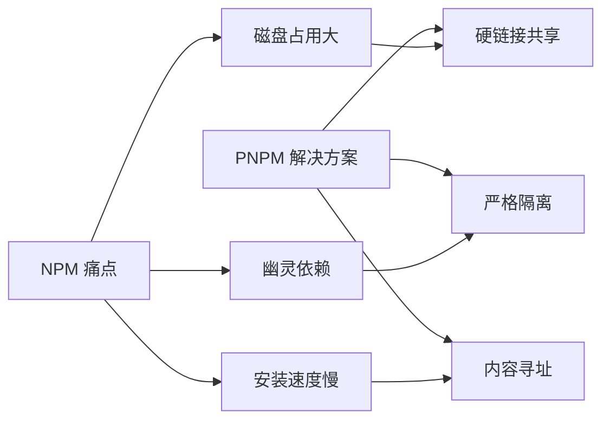

# [0365. PNPM 包管理器](https://github.com/tnotesjs/TNotes.react/tree/main/notes/0365.%20PNPM%20%E5%8C%85%E7%AE%A1%E7%90%86%E5%99%A8)

<!-- region:toc -->

- [1. 🎯 本节内容](#1--本节内容)
- [2. 🫧 评价](#2--评价)
- [3. 🤔 PNPM 是什么？](#3--pnpm-是什么)
  - [3.1. 核心特性](#31-核心特性)
  - [3.2. 与 NPM 和 Yarn 的对比](#32-与-npm-和-yarn-的对比)
  - [3.3. 适用场景](#33-适用场景)
- [4. 🤔 PNPM 的存储机制是什么？](#4--pnpm-的存储机制是什么)
  - [4.1. 内容寻址存储](#41-内容寻址存储)
  - [4.2. 硬链接与符号链接](#42-硬链接与符号链接)
  - [4.3. 磁盘空间节省效果](#43-磁盘空间节省效果)
  - [4.4. 存储结构说明](#44-存储结构说明)
- [5. 🤔 如何安装和配置 PNPM？](#5--如何安装和配置-pnpm)
  - [5.1. 安装 PNPM](#51-安装-pnpm)
  - [5.2. 初始化项目](#52-初始化项目)
  - [5.3. 全局配置](#53-全局配置)
  - [5.4. 项目级配置](#54-项目级配置)
  - [5.5. 实际应用场景](#55-实际应用场景)
- [6. 🤔 PNPM 常用命令有哪些？](#6--pnpm-常用命令有哪些)
  - [6.1. 依赖安装](#61-依赖安装)
  - [6.2. 依赖移除与更新](#62-依赖移除与更新)
  - [6.3. 脚本执行](#63-脚本执行)
  - [6.4. 依赖信息查询](#64-依赖信息查询)
  - [6.5. 存储管理](#65-存储管理)
  - [6.6. 工作区命令（Monorepo）](#66-工作区命令monorepo)
  - [6.7. 其他实用命令](#67-其他实用命令)
  - [6.8. 实际应用场景](#68-实际应用场景)
- [7. 🤔 如何从其他包管理器迁移到 PNPM？](#7--如何从其他包管理器迁移到-pnpm)
  - [7.1. 从 NPM 迁移](#71-从-npm-迁移)
  - [7.2. 从 Yarn 迁移](#72-从-yarn-迁移)
  - [7.3. 迁移检查清单](#73-迁移检查清单)
  - [7.4. 常见问题处理](#74-常见问题处理)
  - [7.5. 团队协作注意事项](#75-团队协作注意事项)
- [9. 🤔 PNPM Workspaces 如何使用？](#9--pnpm-workspaces-如何使用)
  - [9.1. 配置 Workspaces](#91-配置-workspaces)
  - [9.2. 工作区命令](#92-工作区命令)
  - [9.3. 过滤执行](#93-过滤执行)
  - [9.4. 实际应用场景](#94-实际应用场景)
  - [9.5. 性能优化技巧](#95-性能优化技巧)
- [10. 🔗 引用](#10--引用)

<!-- endregion:toc -->

## 1. 🎯 本节内容

- PNPM 的核心特性与设计理念
- 内容寻址存储机制详解
- 硬链接与符号链接的工作原理
- PNPM 的安装、配置与常用命令
- 从 NPM 或 Yarn 迁移到 PNPM 的完整流程
- PNPM Workspaces 在 Monorepo 项目中的应用
- 严格依赖隔离与幽灵依赖的解决方案
- PNPM 性能优化技巧

## 2. 🫧 评价

PNPM 是新一代包管理工具，通过独特的存储机制彻底改变了依赖管理方式，在性能和磁盘空间利用率上都优于 NPM 和 Yarn。

- PNPM 使用硬链接和符号链接，全局只保存一份依赖文件，多个项目共享同一份内容，显著节省磁盘空间
- 严格的依赖隔离机制杜绝了幽灵依赖问题，只能访问声明在 `package.json` 中的依赖
- 在 Monorepo 项目中表现优秀，Workspaces 功能强大，支持过滤执行和并行构建
- 建议在新项目中优先考虑 PNPM，特别是有磁盘空间限制或 Monorepo 需求的场景
- 迁移到 PNPM 需要注意某些工具的兼容性，团队成员需要学习新的命令和配置方式

## 3. 🤔 PNPM 是什么？

PNPM（Performant NPM）是一个快速、节省磁盘空间的包管理工具，于 2017 年发布。它通过创新的存储机制解决了 NPM 和 Yarn 的诸多痛点。

### 3.1. 核心特性

- 内容寻址存储：全局只保存一份文件，通过硬链接共享
- 严格的依赖隔离：只能访问声明的依赖，杜绝幽灵依赖
- 磁盘空间节省：多个项目共享同一份依赖文件
- 安装速度快：结合缓存和硬链接，速度优于 NPM 和 Yarn
- 天生支持 Monorepo：Workspace 功能强大



### 3.2. 与 NPM 和 Yarn 的对比

| 特性       | NPM  | Yarn | PNPM |
| ---------- | ---- | ---- | ---- |
| 安装速度   | 慢   | 快   | 最快 |
| 磁盘占用   | 大   | 中等 | 最小 |
| 依赖隔离   | 弱   | 弱   | 强   |
| 幽灵依赖   | 存在 | 存在 | 杜绝 |
| Monorepo   | 基础 | 良好 | 优秀 |
| 学习成本   | 无   | 低   | 中等 |
| 生态成熟度 | 最高 | 高   | 中等 |

### 3.3. 适用场景

选择 PNPM 当你需要：

- 节省磁盘空间（多项目开发）
- 严格的依赖管理（避免幽灵依赖）
- Monorepo 架构项目
- 追求最快的安装速度
- 新项目且团队愿意学习

⚠️ 不适合的场景：

- 团队成员不熟悉 PNPM 且无法投入学习时间
- 依赖的第三方工具不支持符号链接
- 需要与旧项目保持一致的包管理工具

## 4. 🤔 PNPM 的存储机制是什么？

PNPM 最大的创新在于其独特的存储机制，通过内容寻址存储（Content-Addressable Storage）和硬链接技术实现了磁盘空间的高效利用。

### 4.1. 内容寻址存储

PNPM 使用内容的哈希值作为文件的存储地址，相同内容的文件只存储一份。

```bash
# 传统方式（NPM/Yarn）
项目A/node_modules/lodash/  # 占用 1.5MB
项目B/node_modules/lodash/  # 又占用 1.5MB
项目C/node_modules/lodash/  # 再占用 1.5MB
# 总计：4.5MB

# PNPM 方式
~/.pnpm-store/v3/files/ab/cd1234.../lodash@4.17.21  # 唯一副本 1.5MB
项目A/node_modules/.pnpm/lodash@4.17.21/  # 硬链接
项目B/node_modules/.pnpm/lodash@4.17.21/  # 硬链接
项目C/node_modules/.pnpm/lodash@4.17.21/  # 硬链接
# 总计：1.5MB（节省 67%）
```

### 4.2. 硬链接与符号链接

PNPM 结合使用硬链接（Hard Link）和符号链接（Symbolic Link）来组织依赖结构。

```bash
# 硬链接（Hard Link）
# - 指向磁盘上的实际文件
# - 多个硬链接共享同一份数据
# - 删除一个硬链接不影响其他链接

# 符号链接（Symbolic Link）
# - 类似快捷方式，指向另一个路径
# - 用于构建 node_modules 结构
# - 提供扁平化的访问方式
```

::: code-group

```bash [硬链接示例]
# ✅ 全局存储中的实际文件
~/.pnpm-store/v3/files/00/1a2b3c4d.../package.json

# ✅ 项目中的硬链接
项目/node_modules/.pnpm/react@18.2.0/node_modules/react/package.json
# ↑ 这是硬链接，指向全局存储的同一份文件

# 验证硬链接（inode 相同）
ls -i ~/.pnpm-store/v3/files/00/1a2b3c4d.../package.json
# 12345678 package.json

ls -i 项目/node_modules/.pnpm/react@18.2.0/node_modules/react/package.json
# 12345678 package.json  # inode 相同，证明是同一份文件
```

```bash [符号链接示例]
# ✅ 项目根目录的符号链接
项目/node_modules/react -> .pnpm/react@18.2.0/node_modules/react

# 这样代码中可以直接使用
import React from 'react'  # 实际解析为 .pnpm/react@18.2.0/node_modules/react
```

:::

### 4.3. 磁盘空间节省效果

以一个中型 React 项目为例（约 1000 个依赖包）：

| 包管理器 | 单项目占用 | 10 个项目占用 | 节省比例 |
| -------- | ---------- | ------------- | -------- |
| NPM      | 450MB      | 4.5GB         | 0%       |
| Yarn     | 420MB      | 4.2GB         | 6.7%     |
| PNPM     | 180MB      | 1.8GB         | 60%      |

⚠️ 实际节省效果取决于项目间的依赖重叠度。依赖重叠越多，节省越明显。

### 4.4. 存储结构说明

```bash
# PNPM 全局存储位置
~/.pnpm-store/
└── v3/
    └── files/
        ├── 00/
        │   └── 1a2b3c4d...  # 基于内容哈希的文件
        ├── 01/
        └── ff/

# 项目中的 node_modules 结构
node_modules/
├── .pnpm/  # 实际包内容（硬链接到全局存储）
│   ├── react@18.2.0/
│   │   └── node_modules/
│   │       └── react/  # 硬链接
│   ├── lodash@4.17.21/
│   │   └── node_modules/
│   │       └── lodash/  # 硬链接
│   └── .modules.yaml  # 元数据
│
├── react -> .pnpm/react@18.2.0/node_modules/react  # 符号链接
└── lodash -> .pnpm/lodash@4.17.21/node_modules/lodash  # 符号链接
```

```javascript
// ❌ NPM/Yarn 允许的幽灵依赖
// package.json 只声明了 react
{
  "dependencies": {
    "react": "^18.2.0"
  }
}

// 但代码中可以直接使用 react 的依赖
import PropTypes from 'prop-types'  // 未声明但能用
// 这会导致：
// 1. 依赖不明确，维护困难
// 2. 升级 react 可能导致 PropTypes 版本变化
// 3. 其他开发者不知道项目使用了 PropTypes

// ✅ PNPM 严格模式：杜绝幽灵依赖
// 上述代码会报错
Error: Cannot find module 'prop-types'

// 必须显式声明
{
  "dependencies": {
    "react": "^18.2.0",
    "prop-types": "^15.8.1"  // 必须手动添加
  }
}

// 现在代码才能正常运行
import PropTypes from 'prop-types'  // ✅ 明确声明的依赖
```

## 5. 🤔 如何安装和配置 PNPM？

### 5.1. 安装 PNPM

PNPM 提供多种安装方式，推荐使用官方脚本或 Corepack。

::: code-group

```bash [官方脚本（推荐）]
# macOS 或 Linux
curl -fsSL https://get.pnpm.io/install.sh | sh -

# Windows（PowerShell）
iwr https://get.pnpm.io/install.ps1 -useb | iex

# 验证安装
pnpm --version
# 输出：8.x.x
```

```bash [Corepack（Node.js 16.13+）]
# 启用 Corepack
corepack enable

# 准备 PNPM
corepack prepare pnpm@latest --activate

# 验证安装
pnpm --version
# 输出：8.x.x

# ✅ 优势：自动管理 PNPM 版本，团队协作时版本一致
```

```bash [NPM 全局安装]
# 通过 NPM 安装
npm install -g pnpm

# 验证安装
pnpm --version

# ⚠️ 缺点：需要先有 NPM，且全局安装可能有权限问题
```

```bash [Homebrew（macOS）]
# 通过 Homebrew 安装
brew install pnpm

# 验证安装
pnpm --version

# ✅ 优势：与系统包管理器集成，方便升级
```

:::

### 5.2. 初始化项目

```bash
# 创建新项目
mkdir my-project
cd my-project
pnpm init

# 生成的 package.json
{
  "name": "my-project",
  "version": "1.0.0",
  "description": "",
  "main": "index.js",
  "scripts": {
    "test": "echo \"Error: no test specified\" && exit 1"
  },
  "keywords": [],
  "author": "",
  "license": "ISC"
}

# 安装依赖
pnpm add react react-dom

# 目录结构
my-project/
├── node_modules/
│   ├── .pnpm/
│   ├── react -> .pnpm/react@18.2.0/node_modules/react
│   └── react-dom -> .pnpm/react-dom@18.2.0/node_modules/react-dom
├── package.json
└── pnpm-lock.yaml
```

### 5.3. 全局配置

```bash
# 查看当前配置
pnpm config list

# 设置淘宝镜像
pnpm config set registry https://registry.npmmirror.com

# 设置全局存储目录
pnpm config set store-dir /path/to/pnpm-store

# 设置全局 bin 目录
pnpm config set global-bin-dir /path/to/bin

# 启用严格模式（推荐）
pnpm config set strict-peer-dependencies true

# 删除配置
pnpm config delete registry

# 查看存储位置
pnpm store path
# 输出：/Users/username/.pnpm-store
```

### 5.4. 项目级配置

```ini
# .npmrc（项目根目录）
# 推荐配置
registry=https://registry.npmmirror.com
shamefully-hoist=false
strict-peer-dependencies=true
auto-install-peers=true

# 可选配置
# node-linker=hoisted  # 使用传统扁平化结构（兼容旧工具）
# shared-workspace-lockfile=true  # Monorepo 使用单一锁文件
# save-workspace-protocol=true  # workspace 依赖使用 workspace: 协议
```

```yaml
# pnpm-workspace.yaml（Monorepo 配置）
packages:
  - 'packages/*'
  - 'apps/*'
  - '!**/test/**'
```

### 5.5. 实际应用场景

::: code-group

```bash [个人开发环境]
# 配置全局镜像（加速国内访问）
pnpm config set registry https://registry.npmmirror.com

# 自定义存储位置（SSD 优化）
pnpm config set store-dir /Volumes/SSD/.pnpm-store

# 查看存储状态
pnpm store status
```

```bash [团队协作环境]
# package.json
{
  "packageManager": "pnpm@8.10.0",  # 锁定 PNPM 版本
  "engines": {
    "node": ">=16.0.0",
    "pnpm": ">=8.0.0"
  }
}

# .npmrc
engine-strict=true  # 强制检查 engines 字段
auto-install-peers=true  # 自动安装 peer dependencies
strict-peer-dependencies=false  # 避免 peer 依赖冲突阻塞安装
```

```bash [CI/CD 环境]
# .github/workflows/ci.yml
- name: Install PNPM
  uses: pnpm/action-setup@v2
  with:
    version: 8

- name: Install dependencies
  run: pnpm install --frozen-lockfile

# --frozen-lockfile：确保使用精确的锁文件版本
# 等同于 NPM 的 npm ci
```

:::

## 6. 🤔 PNPM 常用命令有哪些？

### 6.1. 依赖安装

```bash
# 安装所有依赖
pnpm install
# 或简写
pnpm i

# 添加依赖
pnpm add react react-dom
pnpm add -D typescript  # 开发依赖
pnpm add -O lodash  # 可选依赖
pnpm add -P express  # 生产依赖（默认）

# 添加全局依赖
pnpm add -g create-react-app

# 指定版本
pnpm add react@18.2.0
pnpm add react@^18.0.0  # 兼容版本
pnpm add react@latest  # 最新版本
pnpm add react@next  # 测试版本

# 从特定源安装
pnpm add lodash --registry=https://registry.npmmirror.com
```

### 6.2. 依赖移除与更新

```bash
# 移除依赖
pnpm remove lodash
# 或简写
pnpm rm lodash

# 移除全局依赖
pnpm remove -g create-react-app

# 更新依赖
pnpm update react  # 更新到允许的最新版本
pnpm update react@latest  # 更新到最新版本
pnpm update  # 更新所有依赖

# 交互式更新
pnpm update -i
pnpm update -i --latest  # 包括跨大版本更新

# 递归更新（Monorepo）
pnpm update -r
```

### 6.3. 脚本执行

```bash
# 运行 package.json 中的脚本
pnpm run dev
# 或简写（内置命令可省略 run）
pnpm dev

# 列出所有可用脚本
pnpm run

# 执行 node_modules/.bin 中的命令
pnpm exec webpack
pnpm exec tsc

# 类似 npx（无需安装即可执行）
pnpm dlx create-react-app my-app
pnpm dlx prettier --write .
```

### 6.4. 依赖信息查询

```bash
# 查看依赖树
pnpm list
pnpm list --depth=0  # 只显示顶层依赖
pnpm list --depth=1  # 显示一级子依赖
pnpm list --prod  # 只显示生产依赖

# 查看特定包信息
pnpm view react
pnpm view react@18.2.0
pnpm view react versions  # 查看所有版本

# 检查过期依赖
pnpm outdated

# 为什么安装了某个包
pnpm why lodash
pnpm why lodash --json  # JSON 格式输出

# 查看许可证信息
pnpm licenses list
```

### 6.5. 存储管理

PNPM 特有的存储管理命令，优化磁盘空间使用。

```bash
# 查看存储位置
pnpm store path
# 输出：/Users/username/.pnpm-store

# 查看存储状态
pnpm store status
# 输出：
# Content-addressable store in /Users/username/.pnpm-store
# 1,234 packages
# 5.4 GB

# 清理未使用的包
pnpm store prune

# 添加包到存储（预缓存）
pnpm store add react react-dom
pnpm store add lodash@4.17.21

# ✅ 团队协作场景：预缓存常用包
pnpm store add react react-dom axios lodash
# 团队成员首次安装项目时可从本地存储获取
```

### 6.6. 工作区命令（Monorepo）

```bash
# 在所有工作区执行命令
pnpm -r run test  # -r 代表 --recursive

# 在特定工作区执行命令
pnpm --filter my-package add lodash
pnpm --filter @myorg/utils run build

# 使用过滤器执行
pnpm --filter "./packages/*" run build  # 所有 packages 下的包
pnpm --filter "!@myorg/admin" run test  # 排除特定包
pnpm --filter "[origin/main]" run build  # 只构建改动的包

# 并行执行
pnpm --parallel -r run dev  # 所有包并行运行 dev

# 列出所有工作区
pnpm ls -r --depth -1
pnpm recursive list
```

### 6.7. 其他实用命令

```bash
# 检查项目问题
pnpm audit

# 修复安全漏洞
pnpm audit --fix

# 发布包
pnpm publish
pnpm publish --access public  # 发布公开包

# 链接本地包
pnpm link ../my-package

# 导入 package-lock.json 或 yarn.lock
pnpm import

# 重建原生模块
pnpm rebuild
pnpm rebuild node-sass  # 重建特定包

# 打包项目为 tarball
pnpm pack
```

### 6.8. 实际应用场景

::: code-group

```bash [常规项目]
# 克隆项目后的首次安装
git clone https://github.com/user/project.git
cd project
pnpm install

# 添加新依赖
pnpm add axios

# 运行开发服务器
pnpm dev

# CI 环境安装（跳过可选依赖）
pnpm install --prod --frozen-lockfile
```

```bash [Monorepo项目]
# pnpm-workspace.yaml
packages:
  - 'packages/*'
  - 'apps/*'

# 为特定包添加依赖
pnpm --filter @myorg/utils add lodash

# 在所有包中运行构建
pnpm -r run build

# 只构建被改动的包及其依赖者
pnpm --filter=[origin/main] run build

# 并行运行所有开发服务器
pnpm --parallel -r run dev
```

```bash [性能优化]
# 使用存储服务器加速团队安装
pnpm server start

# 在另一台机器上使用
pnpm config set store-server http://localhost:5813

# 预缓存常用包
pnpm store add react react-dom lodash axios typescript

# 定期清理未使用的包
pnpm store prune
```

:::

## 7. 🤔 如何从其他包管理器迁移到 PNPM？

### 7.1. 从 NPM 迁移

```bash
# 步骤 1：安装 PNPM
npm install -g pnpm

# 步骤 2：删除 NPM 相关文件
rm -rf node_modules package-lock.json

# 步骤 3：导入 package-lock.json（可选）
# 如果保留了 package-lock.json，可以先导入
pnpm import

# 步骤 4：使用 PNPM 安装依赖
pnpm install

# 步骤 5：验证项目运行
pnpm run dev
pnpm run build
pnpm run test

# 步骤 6：提交 pnpm-lock.yaml
git add pnpm-lock.yaml .npmrc
git rm package-lock.json
git commit -m "chore: migrate from npm to pnpm"
```

### 7.2. 从 Yarn 迁移

```bash
# 步骤 1：安装 PNPM
npm install -g pnpm

# 步骤 2：删除 Yarn 相关文件
rm -rf node_modules yarn.lock
rm -rf .yarn/ .yarnrc.yml  # Yarn Berry 文件

# 步骤 3：使用 PNPM 安装依赖
pnpm install

# 步骤 4：验证项目运行
pnpm run dev
pnpm run build
pnpm run test

# 步骤 5：提交 pnpm-lock.yaml
git add pnpm-lock.yaml .npmrc
git rm yarn.lock .yarnrc.yml
git commit -m "chore: migrate from yarn to pnpm"
```

### 7.3. 迁移检查清单

```markdown
# 迁移前检查

- [ ] 备份当前的 package.json 和锁文件
- [ ] 记录当前项目的 Node.js 版本
- [ ] 记录所有全局安装的工具
- [ ] 确认 CI/CD 配置需要更新
- [ ] 检查是否有依赖原生模块（需重新编译）
- [ ] 确认团队成员都了解 PNPM 使用方式

# 迁移后验证

- [ ] 所有依赖正确安装
- [ ] 项目能正常启动和构建
- [ ] 所有脚本命令正常运行
- [ ] 单元测试通过
- [ ] 集成测试通过
- [ ] 生产环境构建成功
- [ ] CI/CD 流程正常
- [ ] 依赖大小符合预期
```

### 7.4. 常见问题处理

::: code-group

```bash [问题1：找不到模块]
# ❌ 某些包在 PNPM 下找不到
Error: Cannot find module 'xxx'

# ✅ 解决方案 1：添加到 dependencies
pnpm add xxx

# ✅ 解决方案 2：使用 hoisting（不推荐）
# .npmrc
shamefully-hoist=true

# ✅ 解决方案 3：使用传统扁平化结构（兼容旧工具）
# .npmrc
node-linker=hoisted
```

```bash [问题2：预构建脚本失败]
# ❌ 预构建脚本失败
Error: lifecycle script `prepare` failed

# ✅ 解决方案 1：禁用脚本
pnpm install --ignore-scripts

# 然后手动运行需要的脚本
pnpm rebuild

# ✅ 解决方案 2：只禁用特定包的脚本
# .npmrc
ignored-scripts=package-name
```

```bash [问题3：peer dependencies冲突]
# ⚠️ peer dependencies 冲突
WARN  Issues with peer dependencies found

# ✅ 解决方案 1：自动安装 peer dependencies（推荐）
# .npmrc
auto-install-peers=true

# ✅ 解决方案 2：忽略 peer 依赖警告
# .npmrc
strict-peer-dependencies=false

# ✅ 解决方案 3：手动安装
pnpm add peer-dependency-name
```

```bash [问题4：符号链接不支持]
# ❌ 某些工具不支持符号链接
Error: ENOENT: no such file or directory

# ✅ 解决方案：使用传统 node_modules 结构
# .npmrc
node-linker=hoisted

# 或针对特定包
# .npmrc
public-hoist-pattern[]=*eslint*
public-hoist-pattern[]=*prettier*
```

:::

### 7.5. 团队协作注意事项

```bash
# ✅ 团队迁移最佳实践

# 1. 在 README 中添加说明
cat > README.md << 'EOF'
## 8. 包管理器

本项目使用 PNPM 作为包管理工具。

### 8.1. 安装 PNPM

\`\`\`bash
# 通过 NPM 安装
npm install -g pnpm

# 或使用官方脚本
curl -fsSL https://get.pnpm.io/install.sh | sh -
\`\`\`

### 8.2. 常用命令

\`\`\`bash
# 安装依赖
pnpm install

# 运行项目
pnpm run dev

# 添加依赖
pnpm add package-name
\`\`\`
EOF

# 2. 添加 .npmrc 配置
cat > .npmrc << 'EOF'
engine-strict=true
auto-install-peers=true
strict-peer-dependencies=false
EOF

# 3. 在 package.json 中指定包管理器
npm pkg set packageManager="pnpm@8.10.0"
npm pkg set engines.node=">=16.0.0"
npm pkg set engines.pnpm=">=8.0.0"

# 4. 更新 CI 配置
# .github/workflows/ci.yml
cat > .github/workflows/ci.yml << 'EOF'
name: CI

on: [push, pull_request]

jobs:
  test:
    runs-on: ubuntu-latest
    steps:
      - uses: actions/checkout@v3

      - name: Install PNPM
        uses: pnpm/action-setup@v2
        with:
          version: 8

      - name: Setup Node.js
        uses: actions/setup-node@v3
        with:
          node-version: 18
          cache: 'pnpm'

      - name: Install dependencies
        run: pnpm install --frozen-lockfile

      - name: Run tests
        run: pnpm test
EOF
```

## 9. 🤔 PNPM Workspaces 如何使用？

PNPM Workspaces 是 PNPM 在 Monorepo 项目中的应用，提供了强大的依赖管理和任务执行能力。

### 9.1. 配置 Workspaces

```yaml
# pnpm-workspace.yaml（项目根目录）
packages:
  - 'packages/*'
  - 'apps/*'
  - 'tools/*'
  - '!**/test/**' # 排除测试目录
  - '!**/__tests__/**'
```

```json
// package.json（根目录）
{
  "name": "my-monorepo",
  "private": true,
  "scripts": {
    "build": "pnpm -r run build",
    "dev": "pnpm --parallel -r run dev",
    "test": "pnpm -r run test",
    "lint": "pnpm -r run lint"
  },
  "devDependencies": {
    "typescript": "^5.0.0"
  }
}
```

### 9.2. 工作区命令

```bash
# 在所有工作区执行命令
pnpm -r run build  # -r 代表 --recursive
pnpm -r run test

# 在特定工作区执行命令
pnpm --filter @myorg/utils add lodash
pnpm --filter my-app run dev

# 使用通配符过滤
pnpm --filter "./packages/*" run build  # 所有 packages 下的包
pnpm --filter "@myorg/*" run test  # 所有 @myorg scope 的包

# 排除特定包
pnpm --filter "!@myorg/admin" run test

# 只在改动的包中执行
pnpm --filter "[origin/main]" run build
pnpm --filter "[HEAD^1]" run test

# 包括依赖者
pnpm --filter @myorg/utils...  # utils 及其所有依赖者
pnpm --filter ...@myorg/app  # app 及其所有依赖项
```

### 9.3. 过滤执行

PNPM 提供了强大的过滤器语法，支持复杂的执行策略。

```bash
# 基础过滤
pnpm --filter @myorg/utils run build

# 并行执行
pnpm --parallel -r run dev

# 依赖拓扑排序（按依赖顺序执行）
pnpm -r run build  # 默认按拓扑排序

# 限制并发数
pnpm -r --workspace-concurrency=2 run build

# 组合过滤
pnpm --filter "./packages/*" --filter "!@myorg/legacy" run build

# 基于 Git 变更过滤
pnpm --filter "[origin/main]" run build  # 只构建改动的包
pnpm --filter "[HEAD^1]" run test  # 只测试最近一次提交改动的包

# 包括依赖者和依赖项
pnpm --filter @myorg/utils... run build  # utils 及其依赖者
pnpm --filter ...@myorg/app run build  # app 及其依赖项
pnpm --filter ...@myorg/utils... run build  # utils 的完整依赖图
```

### 9.4. 实际应用场景

::: code-group

```bash [基础Monorepo]
# 目录结构
my-monorepo/
├── pnpm-workspace.yaml
├── package.json
├── packages/
│   ├── utils/
│   │   └── package.json
│   └── ui/
│       └── package.json
└── apps/
    └── web/
        └── package.json

# pnpm-workspace.yaml
packages:
  - 'packages/*'
  - 'apps/*'

# 为 web 应用添加依赖
pnpm --filter web add @myorg/utils

# web/package.json 自动生成
{
  "dependencies": {
    "@myorg/utils": "workspace:*"
  }
}
```

```bash [复杂Monorepo]
# 目录结构
my-monorepo/
├── pnpm-workspace.yaml
├── packages/
│   ├── core/  # 核心库
│   ├── utils/  # 工具函数
│   ├── hooks/  # React Hooks
│   └── components/  # UI 组件
├── apps/
│   ├── admin/  # 后台管理
│   ├── web/  # 官网
│   └── mobile/  # 移动端
└── tools/
    └── scripts/  # 构建脚本

# 按顺序构建（自动拓扑排序）
pnpm -r run build
# 执行顺序：core → utils → hooks → components → apps

# 并行运行所有开发服务器
pnpm --parallel -r run dev

# 只构建改动的包及其依赖者
pnpm --filter "[origin/main]..." run build

# 只在 packages 中运行测试
pnpm --filter "./packages/*" run test
```

```bash [CI/CD场景]
# .github/workflows/ci.yml
name: Monorepo CI

on: [push, pull_request]

jobs:
  test:
    runs-on: ubuntu-latest
    steps:
      - uses: actions/checkout@v3
        with:
          fetch-depth: 0  # 获取完整历史，用于 Git 过滤

      - name: Install PNPM
        uses: pnpm/action-setup@v2
        with:
          version: 8

      - name: Install dependencies
        run: pnpm install --frozen-lockfile

      - name: Build changed packages
        run: pnpm --filter "[origin/main]..." run build

      - name: Test changed packages
        run: pnpm --filter "[origin/main]" run test
```

:::

### 9.5. 性能优化技巧

```bash
# 1. 使用并行执行
pnpm --parallel -r run dev  # 同时运行所有开发服务器
pnpm --parallel --filter "./packages/*" run build  # 并行构建所有 packages

# 2. 限制并发数（避免资源耗尽）
pnpm -r --workspace-concurrency=4 run build

# 3. 只构建改动的包
pnpm --filter "[origin/main]" run build

# 4. 使用 Turborepo 增强缓存
npm install turbo -D

# turbo.json
{
  "pipeline": {
    "build": {
      "dependsOn": ["^build"],
      "outputs": ["dist/**"]
    }
  }
}

# 运行
turbo run build  # 自动缓存，增量构建

# 5. 配置共享存储（团队协作）
pnpm server start  # 启动存储服务器
pnpm config set store-server http://localhost:5813

# 6. 预缓存常用依赖
pnpm store add react react-dom lodash axios
```

::: code-group

```json [package.json配置]
// 根目录 package.json
{
  "scripts": {
    // 基础命令
    "dev": "pnpm --parallel -r run dev",
    "build": "pnpm -r run build",
    "test": "pnpm -r run test",
    "lint": "pnpm -r run lint",

    // 高级命令
    "build:changed": "pnpm --filter '[origin/main]...' run build",
    "test:changed": "pnpm --filter '[origin/main]' run test",

    // 特定包
    "dev:web": "pnpm --filter web run dev",
    "build:packages": "pnpm --filter './packages/*' run build"
  }
}
```

```ini [.npmrc配置]
# Monorepo 推荐配置
shared-workspace-lockfile=true
link-workspace-packages=true
prefer-workspace-packages=true
save-workspace-protocol=rolling

# 性能优化
strict-peer-dependencies=false
auto-install-peers=true

# 发布配置
publish-branch=main
```

:::

## 10. 🔗 引用

- [PNPM 官方文档][1]
- [PNPM Workspaces 文档][2]
- [PNPM 性能基准测试][3]
- [从 NPM/Yarn 迁移到 PNPM][4]
- [PNPM 常见问题][5]
- [Corepack 文档][6]

[1]: https://pnpm.io
[2]: https://pnpm.io/workspaces
[3]: https://pnpm.io/benchmarks
[4]: https://pnpm.io/continuous-integration
[5]: https://pnpm.io/faq
[6]: https://nodejs.org/api/corepack.html
